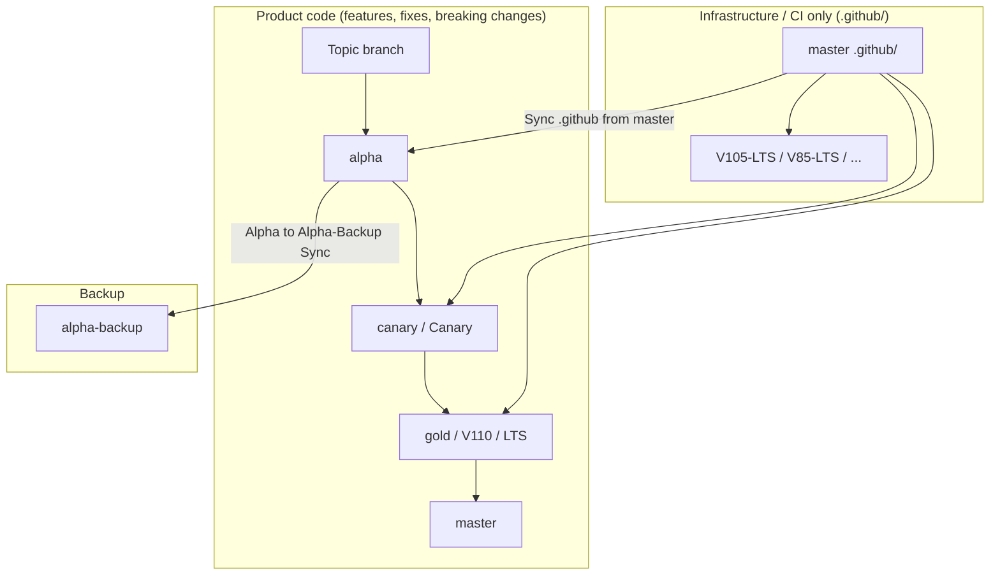

# Branch policy and workflow hardening

**Audience:** Maintainers and contributors who work with release branches, GitHub Actions, and pull requests in [Krypton-Suite/Standard-Toolkit](https://github.com/Krypton-Suite/Standard-Toolkit).

**Tracking:** [GitHub issue #3610](https://github.com/Krypton-Suite/Standard-Toolkit/issues/3610)

**Quick reference:** [BRANCH_POLICY](https://github.com/Krypton-Suite/Standard-Toolkit/tree/master/.github/BRANCH_POLICY.md) (short operational cheat sheet)

---

## Table of contents

1. [Background and goals](#background-and-goals)
2. [Branch model in this repository](#branch-model-in-this-repository)
3. [Architecture overview](#architecture-overview)
4. [Configuration (`branch-policy.json`)](#configuration-branch-policyjson)
5. [Validation rules (detailed)](#validation-rules-detailed)
6. [PR branch policy workflow](#pr-branch-policy-workflow)
7. [Sync `.github` from master workflow](#sync-github-from-master-workflow)
8. [Warn-then-fail rollout](#warn-then-fail-rollout)
9. [Day-to-day workflows for developers](#day-to-day-workflows-for-developers)
10. [Local testing and debugging](#local-testing-and-debugging)
11. [Operations and repository settings](#operations-and-repository-settings)
12. [Troubleshooting](#troubleshooting)
13. [Extending the system](#extending-the-system)
14. [Related automation](#related-automation)
15. [Security, limitations, and known gaps](#security-limitations-and-known-gaps)
16. [Roadmap and optional enhancements](#roadmap-and-optional-enhancements)

---

## Background and goals

The Standard Toolkit maintains **several long-lived Git branches** that represent different release channels (`master`, `alpha`, `canary`, LTS lines, version milestones, and backups). Product code on those branches **intentionally diverges**. **CI and workflow definitions** should still propagate from `master` in a controlled way—by **copying the `.github/` tree**, not by requiring every release line to contain `master` in Git history.

Before this feature, teams could:

- Open a pull request from `master` into `alpha` (or another line) and accidentally merge **the entire product tree**, not just workflow fixes.
- Merge a release line into `master` when intending only to ship a hotfix through the wrong direction.

This feature adds:

| Capability | Implementation |
|------------|----------------|
| Enforce valid PR **base/head** pairings | `pr-branch-policy` workflow + `Invoke-BranchPolicyCheck.ps1` |
| Restrict `master` → downstream to **`.github/` only** | Same validator + dedicated sync workflow |
| Automate workflow propagation (file content) | `sync-github-from-master` workflow (`git checkout origin/master -- .github`) |
| **Warn-then-fail** rollout | Repository variable `BRANCH_POLICY_ENFORCE` |

**Explicitly not enforced:** that downstream branches are Git ancestors of `master`. That check was removed as brittle and unnecessary for file-based workflow sync.

---

## Branch model in this repository

Exact promotion of product code is a **maintainer process**; the policy encodes **Git and CI constraints**, not the full release calendar.

### Typical roles

| Branch | Typical role | Listed in policy as |
|--------|--------------|---------------------|
| `master` | Stable / default branch; workflow source of truth for CI | — (upstream) |
| `alpha` | Nightly / active development packages | Downstream + sync target |
| `canary` | Pre-stable channel (`build.yml`, `release.yml`) | Downstream + sync target |
| `Canary` | Separate workflow entry (`canary.yml` only) | Downstream only |
| `gold` | Release line (mirrored, built) | Downstream + sync target |
| `prerelease` | Staging before `alpha` (see `repo-mirror.yml` comments) | Downstream + sync target |
| `V110`, `V105-LTS`, `V85-LTS` | Version / LTS lines | Downstream + sync where configured |
| `alpha-backup` | Backup of `alpha` (automated) | Downstream; special head rule |

### Product flow vs infrastructure flow



**Important:** The diagram is **logical**, not a strict “every commit must follow this arrow” pipeline. The policy **blocks** some arrows in CI (e.g. `alpha` → `master` as a PR). Feature work may land on `alpha` or an LTS branch directly via topic branches.

### Workflow alignment vs Git history

| Mechanism | What it checks |
|-----------|----------------|
| **Sync .github from master** | Whether files under `.github/` on a release line match `master` (path checkout) |
| **PR policy `master-github-downstream`** | Manual PRs with `head=master` may only change paths under `.github/` |
| **Git ancestry** | **Not** enforced — release lines may fork from `master` at different points |

---

## Architecture overview

```text
.github/
├── branch-policy.json              # Machine-readable branch lists (partially used today)
├── BRANCH_POLICY.md                # Short maintainer cheat sheet
├── scripts/
│   └── Invoke-BranchPolicyCheck.ps1   # Rule engine (PowerShell)
└── workflows/
    ├── pr-branch-policy.yml        # Runs on pull_request
    └── sync-github-from-master.yml # Opens .github-only sync PRs

Documents/Developers/Contributing/
└── BranchPolicyandWorkflowHardening.md   # This document
```

### Execution paths

| Event | Workflow | Runner | Outcome |
|-------|----------|--------|---------|
| PR opened / updated (same repo) | `PR branch policy` | `ubuntu-latest` | Warnings or failure |
| Push to `master` under `.github/**` | `Sync .github from master` | `ubuntu-latest` | Force-push sync branch + open PR per target |
| Monday 03:30 UTC | `Sync .github from master` (schedule) | Same | Reconcile drift |
| Manual dispatch | Either workflow | Same | On-demand |

Scheduled workflows use the workflow file **as it exists on the repository default branch** (`master`). Merge policy changes to `master` first so cron behaviour is predictable (same pattern as `repo-mirror.yml`).

---

## Configuration (`branch-policy.json`)

Path: [.github/branch-policy.json](https://github.com/Krypton-Suite/Standard-Toolkit/tree/master/.github/branch-policy.json)

The JSON file is the **single place to edit branch lists** consumed by workflows. The `rules` array documents intent; **enforcement logic today lives in** `Invoke-BranchPolicyCheck.ps1` (keep script and JSON in sync when adding rules).

### Top-level properties

| Property | Used by | Purpose |
|----------|---------|---------|
| `downstreamBranches` | Validator (`master-github-downstream`) | Bases that restrict `head == master` to `.github/` paths |
| `longLivedHeadBranches` | Validator (`no-long-lived-to-master`) | Heads forbidden when `base == master` |
| `syncGithubFromMasterTargets` | `sync-github-from-master.yml` | Branches that receive automated sync PRs |
| `rules` | Documentation / future engine | Human-readable rule definitions (ids match log tags) |

### Example: adding a new LTS branch `V120-LTS`

1. Add to `downstreamBranches` and `syncGithubFromMasterTargets` as appropriate.
2. If it is a long-lived line, add to `longLivedHeadBranches`.
3. Update `Invoke-BranchPolicyCheck.ps1` only if you add a **new rule type** (not required for list membership).
4. Update release workflows (`build.yml`, `release.yml`, mirrors) separately — policy does not register branches in MSBuild.
5. Document in changelog and this file.

### `rules` array (reference)

| `id` | Enforced when | Script behaviour |
|------|---------------|------------------|
| `master-github-downstream` | `head == master` and `base` ∈ `downstreamBranches` | All PR files must start with `.github/` |
| `alpha-to-alpha-backup` | `base == alpha-backup` | `head` must be `alpha` |
| `no-long-lived-to-master` | `base == master` | `head` must not be in `longLivedHeadBranches` |

---

## Validation rules (detailed)

### Rule: `master-github-downstream`

**Intent:** Workflow, Actions, issue templates, and Dependabot config live under `.github/`. When bringing CI fixes from `master` to a release line, only that directory should change.

| | |
|--|--|
| **Triggers** | `head.ref == master` and `base.ref` is in `downstreamBranches` |
| **Pass** | Every path in the PR file list starts with `.github/` (case-insensitive) |
| **Fail message** | Lists up to five paths outside `.github/` |

**Valid example**

- PR: `master` → `alpha`
- Files: `.github/workflows/build.yml`, `.github/branch-policy.json`

**Invalid example**

- PR: `master` → `alpha`
- Files: `.github/workflows/build.yml`, `Source/Krypton.Toolkit/Foo.cs`

**Remediation:** Use [Sync `.github` from master`](#sync-github-from-master-workflow) or remove non-`.github` commits from the PR.

**Edge cases**

- Empty file list: passes path check (no files to violate).
- Renames **from** outside `.github/` **to** inside still appear in `pulls.listFiles` — review carefully.
- Changes to `.github` at repo root only; `.gitattributes` in root is **not** allowed on this PR type.

---

### Rule: `alpha-to-alpha-backup`

**Intent:** `alpha-backup` is maintained only from `alpha` (see [Alpha to Alpha-Backup Sync](https://github.com/Krypton-Suite/Standard-Toolkit/tree/master/.github/workflows/alpha-backup-sync.yml)).

| | |
|--|--|
| **Triggers** | `base.ref == alpha-backup` |
| **Pass** | `head.ref == alpha` |
| **Typical valid PR** | `alpha` → `alpha-backup` (often automated) |

**Invalid example**

- `sync/github-from-master-alpha` → `alpha-backup` (wrong head)

---

### Rule: `no-long-lived-to-master`

**Intent:** Stable `master` must not receive direct PRs from other **release lines** (accidental “merge alpha into master”).

| | |
|--|--|
| **Triggers** | `base.ref == master` and `head.ref` ∈ `longLivedHeadBranches` |
| **Pass** | Topic branches (e.g. `feature/1234-fix`, `bugfix/3618-canary-lts`) |

**Invalid examples**

- `alpha` → `master`
- `V105-LTS` → `master`

**Valid examples**

- `feature/v110-theme` → `master`
- `dependabot/nuget/...` → `master` (head not in long-lived list)

**Note:** `main` is listed for forks or renames but is not the default branch here.

---

## PR branch policy workflow

File: [.github/workflows/pr-branch-policy.yml](https://github.com/Krypton-Suite/Standard-Toolkit/tree/master/.github/workflows/pr-branch-policy.yml)

### Triggers

```yaml
on:
  pull_request:
    types: [opened, synchronize, reopened]
```

Re-runs on every push to the PR branch (`synchronize`).

### Job gating

```yaml
if: github.event.pull_request.head.repo.full_name == github.repository
```

**Fork PRs are skipped entirely.** External contributors do not get policy feedback from this job; maintainers rely on review for forks.

### Steps

1. **Kill switch** — `BRANCH_POLICY_DISABLED=true` skips all steps.
2. **Checkout** — `fetch-depth: 0`, default ref = PR **merge commit** (`refs/pull/<n>/merge`).
3. **List changed files** — GitHub API `pulls.listFiles` with pagination (100 per page).
4. **Run script** — passes `base.ref`, `head.ref`, file paths, `vars.BRANCH_POLICY_ENFORCE`.

### Permissions

```yaml
permissions:
  contents: read
  pull-requests: read
```

No write access; safe for same-repo PRs without `pull_request_target`.

### GitHub Actions annotations

| Mode | Annotation | Job result |
|------|------------|------------|
| Warn | `::warning::[rule-id] message` | Success (exit 0) |
| Enforce | `::error::[rule-id] message` | Failure (exit 1) |
| Pass | `Branch policy check passed.` | Success |

Also emits `::notice::` when warnings occurred in warn-only mode.

---

## Sync `.github` from master workflow

File: [.github/workflows/sync-github-from-master.yml](https://github.com/Krypton-Suite/Standard-Toolkit/tree/master/.github/workflows/sync-github-from-master.yml)

### Triggers

| Trigger | Detail |
|---------|--------|
| `push` | Branch `master`, paths `.github/**` |
| `schedule` | `30 3 * * 1` (Monday 03:30 UTC) |
| `workflow_dispatch` | Manual full run |

### Algorithm (per target branch)

1. Confirm branch exists (`repos.getBranch`); skip with log if 404.
2. `syncBranch = sync/github-from-master-<sanitized-target>` (lowercase, non-alphanumeric → `-`).
3. `git checkout -B $syncBranch origin/$target`
4. `git checkout origin/master -- .github` (overwrites `.github` tree from `master` only).
5. If porcelain empty → **noop**.
6. Commit `chore(ci): sync .github from master into <target>`
7. **Force-push** `syncBranch` (branch is automation-only).
8. If open PR `head=syncBranch`, `base=target` exists → skip create.
9. Else create PR, label `chore:workflow-sync` if label exists.

### Permissions

```yaml
permissions:
  contents: write
  pull-requests: write
```

Uses `GITHUB_TOKEN`; requires Actions write and contents write (default for `GITHUB_TOKEN` in repo settings).

### Security

Hard-coded repository check: only `Krypton-Suite/Standard-Toolkit`.

### Interaction with PR policy

Sync PRs use **head** `sync/github-from-master-*`, not `master`, so:

- `master-github-downstream` does **not** apply to the head name `master`.
- Files changed are only under `.github/` by construction.
- No Git ancestry requirement on the base branch — only the resulting `.github/` tree is updated on the sync branch.

---

## Warn-then-fail rollout

### Phase 1 — Warn only (default after merge)

| Variable | Value |
|----------|-------|
| `BRANCH_POLICY_ENFORCE` | unset or `false` |
| `BRANCH_POLICY_DISABLED` | unset |

- CI shows yellow annotations.
- PRs can still merge if other checks pass.
- Fix invalid PR pairings and manual `master` → downstream PRs that include product paths.

### Phase 2 — Enforce

| Variable | Value |
|----------|-------|
| `BRANCH_POLICY_ENFORCE` | `true` |

**Also required:**

1. GitHub **Settings → Rules → Rulesets** (or branch protection): require status check **PR branch policy** / job name `policy`.
2. Communicate to contributors (link this doc).

### Kill switches (incidents)

| Variable | Effect |
|----------|--------|
| `BRANCH_POLICY_DISABLED=true` | Stop PR validation |
| `SYNC_GITHUB_FROM_MASTER_DISABLED=true` | Stop automated sync PRs |

Set under **Settings → Secrets and variables → Actions → Variables**.

---

## Day-to-day workflows for developers

### I fixed CI only on `master` and need it on `alpha`

1. Merge the fix to `master` (or push to `master`).
2. Wait for **Sync .github from master** (push under `.github/`) or run workflow manually.
3. Review and merge the generated PR into `alpha`.
4. Do **not** open `master` → `alpha` with `Source/` changes.

### I am shipping a feature to `alpha`

1. Branch from `alpha` (or rebase onto latest `alpha`).
2. Open PR: `your-branch` → `alpha`.
3. If only CI/workflows drifted, merge a **Sync .github from master** PR — no need to merge full `master` into `alpha` for policy.

### Product integration with `master` (optional, maintainer choice)

Policy does **not** require merging `master` into release lines. When you **choose** to integrate product changes from `master`, use a normal merge or a topic branch PR into the release line — not a raw `master` → `alpha` PR that mixes `Source/` with `.github/`.

### Automated sync PR keeps reopening

- Expected if `master` `.github/` keeps changing and target diverges.
- Merge or close stale sync PRs; only one open PR per target is created.

---

## Local testing and debugging

### Run the validator script

From any clone (no network required for the remaining rules):

```powershell
$repoRoot = 'Z:\Development\Krypton\Standard-Toolkit'  # adjust
$policy = Join-Path $repoRoot '.github\branch-policy.json'

# Warn mode (exit 0 with violations)
& (Join-Path $repoRoot '.github\scripts\Invoke-BranchPolicyCheck.ps1') `
  -BaseRef 'alpha' `
  -HeadRef 'master' `
  -ChangedFiles @('.github/workflows/foo.yml', 'Source/Bad.cs') `
  -PolicyPath $policy `
  -Enforce 'false' `
  -Repository 'Krypton-Suite/Standard-Toolkit'

# Enforce mode (exit 1 with violations)
# ... -Enforce 'true' ...
```

### Simulate path-only pass

```powershell
-ChangedFiles @('.github/workflows/build.yml')
```

### Test in Actions without merging

1. Push branch to fork or test repo with copied `.github` workflows.
2. Open PR and inspect **PR branch policy** job log.
3. Toggle `BRANCH_POLICY_ENFORCE` on a test org repo first.

---

## Operations and repository settings

### Recommended labels

| Label | Purpose |
|-------|---------|
| `chore:workflow-sync` | Automated `.github` sync PRs (optional; workflow logs warning if missing) |
| `chore:automatic-backup` | Used by alpha-backup automation (separate feature) |

### Repository variables checklist

| Variable | When to set |
|----------|-------------|
| `BRANCH_POLICY_ENFORCE` | After warn-only bake-in period |
| `BRANCH_POLICY_DISABLED` | Incident bypass |
| `SYNC_GITHUB_FROM_MASTER_DISABLED` | Disable sync automation |

### Required checks (after enforce)

Add to rulesets protecting `master`, `alpha`, `canary`, LTS branches as appropriate:

- **PR branch policy** (job `policy` in workflow `PR branch policy`)

Existing checks (`Build`, etc.) remain independent.

---

## Troubleshooting

### Policy job did not run

| Cause | Action |
|-------|--------|
| Fork PR | Expected; skipped |
| `BRANCH_POLICY_DISABLED=true` | Clear variable |
| Workflow not on default branch yet | Merge workflow to `master` |

### Sync workflow did not open PR

| Cause | Action |
|-------|--------|
| `.github` already identical | No-op in logs |
| Target branch missing | Add branch or remove from `syncGithubFromMasterTargets` |
| `SYNC_GITHUB_FROM_MASTER_DISABLED=true` | Clear variable |
| Open PR already exists | Merge or close existing |

### `canary` vs `Canary` confusion

| Branch | Workflows |
|--------|-----------|
| `canary` | `build.yml`, `release.yml`, sync target |
| `Canary` | `canary.yml` only |

Policy lists both as downstream. **Consolidating to one branch name** is recommended long-term but is a separate migration (update workflows, retarget PRs, delete obsolete branch).

### Product vs `.github` on release lines

Sync PRs align **only** `.github/` from `master`. They do not update `Source/` or other product paths. Integrating product code from `master` remains a separate maintainer decision and is **not** validated by branch policy.

---

## Extending the system

### New rule type (example: forbid `gold` → `alpha`)

1. Implement in `Invoke-BranchPolicyCheck.ps1` with a distinct `RuleId`.
2. Document in `branch-policy.json` `rules` array.
3. Add unit-style local tests (script invocations).
4. Update this document and `BRANCH_POLICY.md`.
5. Start in warn-only mode; enforce later.

### Driving rules purely from JSON (future)

Today lists are JSON-driven; branching logic is PowerShell. A future refactor could interpret `rules[]` generically to avoid script edits for list-only changes.

---

## Related automation

| Workflow | Relationship |
|----------|----------------|
| [alpha-backup-sync.yml](https://github.com/Krypton-Suite/Standard-Toolkit/tree/master/.github/workflows/alpha-backup-sync.yml) | `alpha` → `alpha-backup`; complements `alpha-to-alpha-backup` rule |
| [auto-label-pr-backup.yml](https://github.com/Krypton-Suite/Standard-Toolkit/tree/master/.github/workflows/auto-label-pr-backup.yml) | Labels PRs touching backup workflow |
| [repo-mirror.yml](https://github.com/Krypton-Suite/Standard-Toolkit/tree/master/.github/workflows/repo-mirror.yml) | Mirrors branches to external repo; branch list should stay aligned with policy |
| [repo-restore-from-mirror.yml](https://github.com/Krypton-Suite/Standard-Toolkit/tree/master/.github/workflows/repo-restore-from-mirror.yml) | Manual disaster recovery from mirror; see [Repository Restore from Mirror](Workflows/RepositoryRestoreFromMirrorWorkflow.md) |
| [build.yml](https://github.com/Krypton-Suite/Standard-Toolkit/tree/master/.github/workflows/build.yml) | Independent compile check; does not validate branch pairs |
| Release / nightly / canary workflows | Per-branch kill switches; unaffected by policy except via shared `.github` files |

When editing `.github/workflows` on `master`, expect **sync PRs** to downstream lines after merge.

---

## Security, limitations, and known gaps

### Security

| Topic | Detail |
|-------|--------|
| `pull_request` vs `pull_request_target` | Uses `pull_request` + read-only permissions; no untrusted code execution from fork write paths |
| Forks | No policy job; malicious forks not blocked by this feature |
| Sync workflow | Force-pushes bot branches; branch names are predictable (`sync/github-from-master-*`) |
| Token | `GITHUB_TOKEN` scoped to repository |

### Limitations

| Limitation | Detail |
|------------|--------|
| File list API | Max pagination handled; extremely large PRs rare |
| Empty PRs | Path rules pass when no files listed |
| `rules` in JSON | Not fully interpreted by engine yet |
| `alpha-backup` | In `downstreamBranches` but not in `syncGithubFromMasterTargets` (backup uses `alpha` content) |
| Branch renames | Must update JSON + script + all workflows manually |

## Roadmap and optional enhancements

| Item | Status | Notes |
|------|--------|-------|
| `gold` / `prerelease` in sync targets | **Done** | Listed in `syncGithubFromMasterTargets` in [branch-policy.json](https://github.com/Krypton-Suite/Standard-Toolkit/tree/master/.github/branch-policy.json); same set as `repo-mirror.yml` major lines (except `alpha-backup`). |
| Master ancestry on PR bases | **Removed** | Was brittle; workflow sync uses file content, not SHA ancestry. |
| Unify `canary` and `Canary` | **Planned** | Maintainer migration — [CanaryBranchUnification.md](CanaryBranchUnification.md). |
| Required check only on release branches | **Configure in GitHub** | See below; no workflow change required for the common setup. |

### Required check only on release branches (not topic PRs → `master`)

**Goal:** Feature PRs into `master` must pass **Build**, but **PR branch policy** should not block merges on `master` rulesets.

**Recommended approach (GitHub rulesets):**

1. On rulesets for **`alpha`**, **`canary`**, **`gold`**, **LTS**, etc.: add required status check **PR branch policy** (after `BRANCH_POLICY_ENFORCE=true`).
2. On the **`master`** ruleset: do **not** require **PR branch policy**; keep **Build** and other existing checks.

The workflow still runs on PRs targeting `master` (so `alpha` → `master` is reported in warn/enforce mode), but contributors merging `feature/xyz` → `master` are not blocked if policy is warn-only or if the check is not required on `master`.

**Optional stricter variant:** Set variable `BRANCH_POLICY_SKIP_WHEN_BASE_IS_MASTER=true` to skip the policy job entirely when the PR base is `master` (not implemented by default — you would lose automated blocking of release-line → `master` PRs unless enforced elsewhere).

---

## File index

| File | Role |
|------|------|
| [branch-policy.json](https://github.com/Krypton-Suite/Standard-Toolkit/tree/master/.github/branch-policy.json) | Branch lists and rule metadata |
| [BRANCH_POLICY.md](https://github.com/Krypton-Suite/Standard-Toolkit/tree/master/.github/BRANCH_POLICY.md) | Short operational reference |
| [Invoke-BranchPolicyCheck.ps1](https://github.com/Krypton-Suite/Standard-Toolkit/tree/master/.github/scripts/Invoke-BranchPolicyCheck.ps1) | Validation implementation |
| [pr-branch-policy.yml](https://github.com/Krypton-Suite/Standard-Toolkit/tree/master/.github/workflows/pr-branch-policy.yml) | PR CI entry point |
| [sync-github-from-master.yml](https://github.com/Krypton-Suite/Standard-Toolkit/tree/master/.github/workflows/sync-github-from-master.yml) | Automated `.github` propagation (path checkout) |
| [CanaryBranchUnification.md](CanaryBranchUnification.md) | `canary` / `Canary` migration checklist |