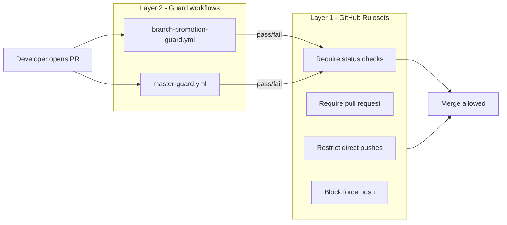

# Branch Promotion Policy

Developer documentation for the **branch promotion guard** system: automated enforcement of how code moves from pre-release branches to stable `master`.

This document is the **overview**. For workflow-specific detail, see:

- **[Master merge guard](Workflows/MasterMergeGuardWorkflow.md)** — `gold` / Dependabot → `master`
- **[Branch promotion guard](Workflows/BranchPromotionGuardWorkflow.md)** — `alpha` → `canary`, `canary` → `gold`

| Workflow file | Actions UI name | Status check |
|---------------|-----------------|--------------|
| [`master-guard.yml`](https://github.com/Krypton-Suite/Standard-Toolkit/tree/master/.github/workflows/master-guard.yml) | Master merge guard | `Master merge guard / Allowed source branch` |
| [`branch-promotion-guard.yml`](https://github.com/Krypton-Suite/Standard-Toolkit/tree/master/.github/workflows/branch-promotion-guard.yml) | Branch promotion guard | `Branch promotion guard / Allowed source branch` |

---

## Table of contents

1. [Overview](#overview)
2. [Promotion chain](#promotion-chain)
3. [Allowed pull request paths](#allowed-pull-request-paths)
4. [Two-layer enforcement model](#two-layer-enforcement-model)
5. [Repository rulesets (complete setup)](#repository-rulesets-complete-setup)
6. [End-to-end promotion procedure](#end-to-end-promotion-procedure)
7. [What remains unguarded](#what-remains-unguarded)
8. [FAQ](#faq)
9. [Related documentation](#related-documentation)

---

## Overview

The Krypton Standard Toolkit uses long-lived branches to represent release maturity:

| Branch | Role |
|--------|------|
| `alpha` | Bleeding-edge integration; feature PRs land here |
| `canary` | Pre-release testing |
| `gold` | Release candidate |
| `master` | Stable production; NuGet stable packages |

**Branch promotion guards** are GitHub Actions workflows that validate **pull request source branches** before merge. They do **not** replace code review or build CI — they enforce **which branches may feed which**.

**Repository rulesets** (configured in GitHub Settings) complement the workflows by blocking **direct pushes** and requiring the guard status checks to pass before merge.

---

## Promotion chain

```text
  feature/*, bugfix/*, etc.
           │
           ▼
        ┌───────┐     PR (alpha only)      ┌────────┐     PR (canary only)     ┌──────┐     PR (gold or dependabot/*)     ┌────────┐
        │ alpha │ ───────────────────────> │ canary │ ───────────────────────> │ gold │ ─────────────────────────────────> │ master │
        └───────┘                            └────────┘                          └──────┘                                      └────────┘
              │                                    │                                 │                                              │
              │                                    │                                 │                                              │
        No promotion guard                   Branch promotion guard            Branch promotion guard                      Master merge guard
```

---

## Allowed pull request paths

| Base (target) | Allowed head (source) | Enforced by |
|---------------|----------------------|-------------|
| `alpha` | Any in-repo branch (typical: `feature/*`) | *(not part of promotion guards)* |
| `canary` | `alpha` only | Branch promotion guard |
| `gold` | `canary` only | Branch promotion guard |
| `master` | `gold` or `dependabot/*` | Master merge guard |

**Fork PRs** into `canary`, `gold`, or `master` are **never** allowed by these guards.

**Dependabot** ([`dependabot.yml`](https://github.com/Krypton-Suite/Standard-Toolkit/tree/master/.github/dependabot.yml)) targets `master` and uses `dependabot/*` head branches; only the master merge guard exempts them.

---

## Two-layer enforcement model



| Layer | Responsibility |
|-------|----------------|
| **Rulesets** | Prevent direct git push; require PR + passing checks |
| **Guard workflows** | Validate PR head branch against promotion policy |

Neither layer alone is sufficient. Workflows cannot reject pushes before they land; rulesets cannot express “only merge from branch X” without a custom check.

---

## Repository rulesets (complete setup)

Configure **three rulesets** on `Krypton-Suite/Standard-Toolkit`:

### 1. Protect canary

| Setting | Value |
|---------|-------|
| Target | `canary` |
| Restrict updates | Yes |
| Require PR | Yes |
| Required check | `Branch promotion guard / Allowed source branch` |
| Block force pushes | Yes |
| Apply to administrators | Recommended |

### 2. Protect gold

Same as **Protect canary**, target branch **`gold`**.

### 3. Protect master

| Setting | Value |
|---------|-------|
| Target | `master` |
| Restrict updates | Yes |
| Require PR | Yes |
| Required check | `Master merge guard / Allowed source branch` |
| Block force pushes | Yes |
| Apply to administrators | Recommended |

Also keep existing CI checks (Build, CodeQL, etc.) as required where appropriate.

Detailed step-by-step instructions: [Master merge guard — rulesets](Workflows/MasterMergeGuardWorkflow.md#repository-ruleset-configuration), [Branch promotion guard — rulesets](Workflows/BranchPromotionGuardWorkflow.md#repository-ruleset-configuration).

---

## End-to-end promotion procedure

Typical release promotion from development to stable:

1. **Develop** — Merge PRs into `alpha` (feature branches).
2. **Alpha → Canary** — Open PR base `canary`, compare `alpha`. Merge when CI and promotion guard pass.
3. **Canary → Gold** — Open PR base `gold`, compare `canary`. Merge when ready for release candidate.
4. **Gold → Master** — Open PR base `master`, compare `gold`. Merge for stable release; triggers `release-master`.

Parallel path:

- **Dependabot** — Weekly `dependabot/*` → `master` PRs for GitHub Actions updates (master merge guard passes automatically).

---

## What remains unguarded

| Activity | Notes |
|----------|-------|
| PRs into `alpha` | Normal feature development |
| LTS branches (`V105-LTS`, `V85-LTS`) | Separate release/mirror policy |
| `alpha` → `alpha-backup` | [Alpha Backup Sync](AlphaBackupSync.md) |
| Direct pushes | Blocked only when rulesets are active |
| Code quality / security | Build, CodeQL, human review |

---

## FAQ

### Can I merge `alpha` directly into `master`?

No. You must promote through `canary` and `gold`, unless a maintainer uses a documented ruleset bypass for an emergency.

### Can I open a PR from a disallowed branch?

Yes — GitHub allows opening it. The guard check fails and the ruleset prevents merge.

### Do these workflows run on push?

No. They run on `pull_request` events only.

### Why two workflows instead of one?

Separation keeps triggers and required checks distinct per target branch (`canary`/`gold` vs `master`) and allows different exceptions (Dependabot on `master` only).

### What if the status check name differs in the ruleset UI?

GitHub may show `Workflow name / Job name`. Search for **Allowed source branch** under the correct workflow name when adding required checks.

---

## Related documentation

- [Master merge guard workflow](Workflows/MasterMergeGuardWorkflow.md)
- [Branch promotion guard workflow](Workflows/BranchPromotionGuardWorkflow.md)
- [Branch policy and workflow hardening](BranchPolicyandWorkflowHardening.md) — `.github/` sync from `master` (file content), warn-then-fail PR policy ([#3610](https://github.com/Krypton-Suite/Standard-Toolkit/issues/3610))
- [PR branch policy workflow](Workflows/PRBranchPolicyWorkflow.md)
- [Sync .github from master workflow](Workflows/SyncGitHubFromMasterWorkflow.md)
- [GitHub Workflow Index](GitHubWorkflowIndex.md)
- [Repository Mirror](Workflows/RepositoryMirror.md) — mirrors `alpha`, `canary`, `gold`, `master`
- [Repository backup and restore](Workflows/RepositoryBackupAndRestore.md) — manual mirror → source recovery ([#3591](https://github.com/Krypton-Suite/Standard-Toolkit/issues/3591)); workflow detail: [Repository Restore from Mirror](Workflows/RepositoryRestoreFromMirrorWorkflow.md)
- [Release Workflow](Workflows/ReleaseWorkflow.md) — publishes on push to release branches
