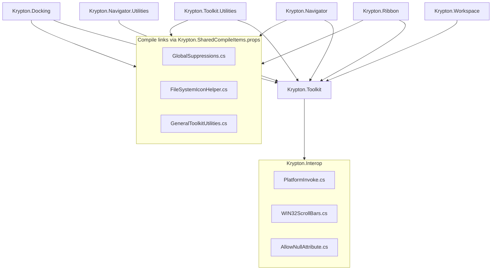

# Cross-Project Source Linking

## Overview

Several Krypton assemblies share C# source without duplicating files on disk. Historically this used MSBuild `<Compile Include="..\..." Link="...">` so the same file compiled into multiple assemblies. Issue [#3855](https://github.com/Krypton-Suite/Standard-Toolkit/issues/3855) centralizes shared interop in `Krypton.Interop` and documents the remaining compile-link patterns.

**Packages:** `Krypton.Interop` (`Source/Krypton Components/Krypton.Interop/`), shared MSBuild props (`Source/Krypton Components/Krypton.Shared/`).

## Why not a normal project reference?

| Need | Approach |
|------|----------|
| Internal Win32/P/Invoke (`PI`, `Libraries`) used across Ribbon, Navigator, Docking, Utilities | `Krypton.Interop` assembly + `[InternalsVisibleTo]` friend grants |
| Per-assembly analyzer suppressions (`GlobalSuppressions.cs`) | MSBuild compile **link** into each assembly (suppressors apply per assembly) |
| .NET Framework nullable polyfills (`AllowNullAttribute.cs`, etc.) | Compiled into `Krypton.Interop`; friend assemblies consume via `InternalsVisibleTo` |
| Helpers that ship in Utilities but live under `Krypton.Toolkit` on disk | MSBuild compile **link** into `Krypton.Toolkit.Utilities` |

Linking or a dedicated interop assembly avoids expanding the public API (`PI` stays internal) and keeps a single canonical file for large interop surfaces.

## Architecture



Build order (orchestration and solution): **Krypton.Interop** → **Krypton.Toolkit** → parallel Ribbon/Navigator → Workspace → Docking → Utilities satellites.

## Shared interop project (`Krypton.Interop`)

| File | Namespace | Visibility | Notes |
|------|-----------|------------|-------|
| `General/PlatformInvoke.cs` | `Krypton.Toolkit` | `internal` (`PI`, `Libraries`, …) | Windows P/Invoke surface (~6k lines). On **net8.0+** eligible APIs use source-generated `[LibraryImport]`; **.NET Framework** TFMs keep `[DllImport]` ([#3874](https://github.com/Krypton-Suite/Standard-Toolkit/issues/3874)). |
| `General/HResult.cs` | `Krypton.Toolkit` | `internal` (`partial PI`) | HRESULT constants extending `PI` |
| `General/Scroll Bars/WIN32ScrollBars.cs` | `Krypton.Toolkit` | `public` | Scroll-bar structs for Navigator.Utilities |
| `Utilities/AllowNullAttribute.cs` | `System.Diagnostics.CodeAnalysis` | `internal` on net472 | Nullable polyfill attributes |

`Krypton.Interop/Global/GlobalDeclarations.cs` declares `[InternalsVisibleTo]` for: `Krypton.Toolkit`, `Krypton.Ribbon`, `Krypton.Navigator`, `Krypton.Docking`, `Krypton.Workspace`, `Krypton.Toolkit.Utilities`, `Krypton.Navigator.Utilities`.

**Consumer wiring:** add a project reference only on `Krypton.Toolkit`:

```xml
<ProjectReference Include="..\Krypton.Interop\Krypton.Interop.csproj" />
```

Other modules reference `Krypton.Toolkit` and receive `Krypton.Interop` transitively for compilation and runtime.

**NuGet:** `Krypton.Interop.dll` is bundled in module packages and in `Krypton.Standard.Toolkit` (not published as a standalone package). `Krypton.Shared/Krypton.Interop.Package.targets` adds the DLL to packable module nuspecs.

### LibraryImport vs DllImport (`PlatformInvoke.cs`)

`PI` is a `partial` class. Prefer extending it with the dual-declaration pattern already used in the file:

- `#if NET8_0_OR_GREATER` → `[LibraryImport(...)]` + `partial` method (source-generated marshalling).
- `#else` → classic `[DllImport(...)]` for `net472` / `net48` / `net481`.

String-returning Win32 helpers that fill a caller buffer (for example `GetClassName`, `GetMenuString`, `LoadString`) expose `[Out] char[]` overloads on modern TFMs plus managed helpers (`GetClassNameString`, `GetMenuStringString`, string-returning `LoadString`) that truncate at the 4096-character cap instead of returning empty when the native API fills the buffer.

When adding new P/Invokes, keep Framework and modern TFM declarations in sync and reuse existing helper patterns rather than inventing a third marshalling style.

## MSBuild compile links (`Krypton.Shared`)

Import `Krypton.Shared/Krypton.SharedCompileItems.props` and set opt-in flags:

| Property | Linked files | Used by |
|----------|--------------|---------|
| `IncludeKryptonGlobalSuppressionsLink=true` | `Krypton.Toolkit/General/GlobalSuppressions.cs` | Ribbon, Navigator, Docking |
| `IncludeKryptonUtilitiesSourceLinks=true` | `FileSystemIconHelper.cs`, `GeneralToolkitUtilities.cs` | Toolkit.Utilities |

Example:

```xml
<Import Project="..\Krypton.Shared\Krypton.SharedCompileItems.props" />
<PropertyGroup>
  <IncludeKryptonGlobalSuppressionsLink>true</IncludeKryptonGlobalSuppressionsLink>
</PropertyGroup>
```

Canonical on-disk paths remain under `Krypton.Toolkit/` for Utilities helpers until those types are moved into the Utilities project folder.

## Adding new shared code

1. **Internal interop or polyfills used by multiple assemblies** → add to `Krypton.Interop`, extend `[InternalsVisibleTo]` if a new consumer assembly is introduced, ensure `Krypton.Standard.Toolkit` still packs the DLL (already handled by shared targets).
2. **Per-assembly analyzer suppressions** → extend `GlobalSuppressions.cs` and keep compile links (do not move to Interop).
3. **Public API** → put the type in the owning module assembly; do not link or hide in Interop.
4. **Utilities-only helper still under Toolkit folder** → add an entry to `Krypton.SharedCompileItems.props` with a new opt-in property; document in this file.

Always add a one-line header comment in the source file pointing here.

## Validation

```powershell
dotnet build ".\Source\Krypton Components\Krypton Toolkit Suite 2022 - VS2022.sln" -c Debug
```

Confirm `Bin\Debug\<tfm>\Krypton.Interop.dll` is produced and copied alongside other module outputs. After Pack, CI runs `Scripts/CI/Test-KryptonInteropInPackages.ps1` to assert `lib/*/Krypton.Interop.dll` is present in each packable module `.nupkg`. Run TestForm smoke scenarios that exercise P/Invoke-heavy paths (message boxes, file icons, scroll bars).

## Related files

- `Scripts/Build/Krypton.Orchestration.targets` — builds Interop before Toolkit
- `Source/Krypton Components/Directory.Build.targets` — imports `Krypton.Interop.Package.targets`
- `Source/Krypton Components/Krypton.Standard.Toolkit/Krypton.Standard.Toolkit.csproj` — explicit Interop DLL/XML/PDB pack entries
