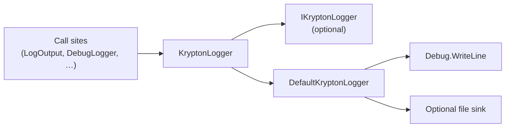

# Krypton Diagnostic Logging

## Overview

Issue [#3856](https://github.com/Krypton-Suite/Standard-Toolkit/issues/3856) replaces the legacy `CommonHelper.LogOutput` file-to-exe-directory design with a unified, thread-safe logging path owned by `KryptonLogger` in `Krypton.Toolkit`.

All toolkit diagnostic messages flow through:

- `KryptonLogger.Write(string)`
- `CommonHelper.LogOutput(string)` — preserved for binary compatibility; delegates to `KryptonLogger`
- `DebugLogger` (internal) — prefixes `[WM]` for theme-swap message tracing

## Architecture



### Key types

| Type | Visibility | Role |
|------|------------|------|
| `IKryptonLogger` | public | Application-provided sink (`Write(string)`) |
| `KryptonLogger` | public | Static gateway; `Current`, `SetLogger`, `Write` |
| `DefaultKryptonLogger` | internal | Built-in sink: `Debug` + opt-in file |
| `DebugLogger` | internal | WM/theme-swap tracing helper |

## Default behavior

1. **Always** writes to `System.Diagnostics.Debug` (visible in Visual Studio Output, DebugView, etc.).
2. **Never** writes beside the executable or under `AppContext.BaseDirectory` by default.
3. **Optionally** appends timestamped lines to a file when enabled (see below).
4. File appends are serialized with a lock so concurrent paint/dispose/designer paths do not corrupt the log.

## Optional file logging

File output is **opt-in**. Set one of:

| Variable | Effect |
|----------|--------|
| `KRYPTON_LOG_PATH` | Full path to the log file (directory created if needed) |
| `KRYPTON_LOG_WM` | Alias of `KRYPTON_LOG_PATH` (backward compatibility for WM tracing) |
| `KRYPTON_LOG` | When `1`, `true`, `yes`, or `on` (case-insensitive), writes to `%LOCALAPPDATA%\Krypton-Suite\Toolkit\Krypton.log` |

Example (PowerShell, current session):

```powershell
$env:KRYPTON_LOG = '1'
dotnet run --project ".\Source\Krypton Components\TestForm\TestForm.csproj" -c Debug
```

Example (explicit path):

```powershell
$env:KRYPTON_LOG_PATH = "$env:TEMP\krypton-test.log"
```

## Custom logger

Implement `IKryptonLogger` and register at startup:

```csharp
public sealed class MyLogger : IKryptonLogger
{
    public void Write(string message) => /* Serilog, ETW, etc. */;
}

// Before creating Krypton forms:
KryptonLogger.SetLogger(new MyLogger());
```

Pass `null` to `KryptonLogger.SetLogger(null)` to restore the built-in default.

## Call sites in the toolkit

| Location | Usage |
|----------|--------|
| `Clipping.cs` | Dispose failures restoring graphics clip |
| `KryptonCustomPaletteBase.cs` | Palette import version mismatch |
| `KryptonSplitterPanelDesigner.cs` | Designer overlay draw failure |
| `ThemeChangeCoordinator.cs`, `KryptonComboBox.cs` | Theme-swap WM tracing via `DebugLogger` |

## Validation

1. Run TestForm with no env vars — messages appear only in the debug output window.
2. Set `KRYPTON_LOG=1` — confirm `%LOCALAPPDATA%\Krypton-Suite\Toolkit\Krypton.log` is created and appended.
3. Set `KRYPTON_LOG_PATH` to a temp file — confirm writes go there.
4. Install or run from a UAC-protected folder — confirm no write attempts next to the `.exe`.
5. Register a custom `IKryptonLogger` — confirm all `LogOutput` traffic is received.

## Migration notes

- `CommonHelper.LogOutput` signature is unchanged; no consumer code changes required.
- Debug builds no longer auto-create `logs\KryptonWM.log` under the application directory. Use `KRYPTON_LOG=1` or `KRYPTON_LOG_PATH` instead.
- `KRYPTON_LOG_WM` continues to work as an explicit file path override.
