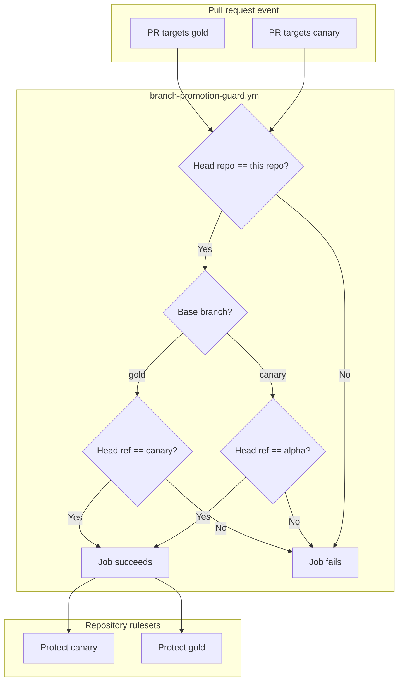

# Branch Promotion Guard Workflow

Developer documentation for the **Branch promotion guard** GitHub Actions workflow.

| Item | Value |
|------|-------|
| Workflow file | [`.github/workflows/branch-promotion-guard.yml`](https://github.com/Krypton-Suite/Standard-Toolkit/tree/master/.github/workflows/branch-promotion-guard.yml) |
| Workflow name (Actions UI) | **Branch promotion guard** |
| Job name (status check) | **Allowed source branch** |
| Full check name (typical) | `Branch promotion guard / Allowed source branch` |
| Runner | `ubuntu-latest` |
| Permissions | `contents: read` |
| Related workflow | [Master merge guard](MasterMergeGuardWorkflow.md) |

---

## Table of contents

1. [Purpose](#purpose)
2. [Role in the branch promotion model](#role-in-the-branch-promotion-model)
3. [What this workflow enforces](#what-this-workflow-enforces)
4. [What this workflow does not enforce](#what-this-workflow-does-not-enforce)
5. [Architecture overview](#architecture-overview)
6. [Triggers and events](#triggers-and-events)
7. [Validation logic (step by step)](#validation-logic-step-by-step)
8. [Repository ruleset configuration](#repository-ruleset-configuration)
9. [Typical developer workflows](#typical-developer-workflows)
10. [Interaction with release and CI workflows](#interaction-with-release-and-ci-workflows)
11. [Security model](#security-model)
12. [Decision matrix](#decision-matrix)
13. [Branch naming and repository conventions](#branch-naming-and-repository-conventions)
14. [Troubleshooting](#troubleshooting)
15. [Operational procedures](#operational-procedures)
16. [Maintaining and extending the workflow](#maintaining-and-extending-the-workflow)

---

## Purpose

The Branch promotion guard enforces the **pre-release promotion chain** for long-lived integration branches:

| Target branch (PR base) | Required source branch (PR head) |
|-------------------------|----------------------------------|
| `canary` | `alpha` |
| `gold` | `canary` |

Feature development merges into `alpha` without this guard. Only **promotion PRs** between these release lines are restricted, ensuring code reaches `canary` and `gold` through the intended sequence before [Master merge guard](MasterMergeGuardWorkflow.md) allows `gold` → `master`.

This aligns with the repository’s release tiers:

- **`alpha`** — bleeding-edge integration ([`release-alpha`](https://github.com/Krypton-Suite/Standard-Toolkit/tree/master/.github/workflows/release.yml), [Nightly workflow](NightlyWorkflow.md))
- **`canary`** — pre-release testing ([`release-canary`](https://github.com/Krypton-Suite/Standard-Toolkit/tree/master/.github/workflows/release.yml), [Canary workflow](CanaryWorkflow.md))
- **`gold`** — release candidate ([`build.yml`](https://github.com/Krypton-Suite/Standard-Toolkit/tree/master/.github/workflows/build.yml) push target; promoted to `master`)

---

## Role in the branch promotion model

Full path from development to stable:

```text
feature/*  ──PR──>  alpha  ──PR──>  canary  ──PR──>  gold  ──PR──>  master
                         │              │              │              │
                         │              │              │              └── Master merge guard
                         │              │              └── Branch promotion guard (canary -> gold)
                         │              └── Branch promotion guard (alpha -> canary)  ◄── this workflow
                         └── Standard feature PRs (no promotion guard)
```

| Transition | Guarded by | Allowed head |
|------------|------------|--------------|
| → `canary` | **This workflow** | `alpha` |
| → `gold` | **This workflow** | `canary` |
| → `master` | [Master merge guard](MasterMergeGuardWorkflow.md) | `gold`, `dependabot/*` |

---

## What this workflow enforces

For pull requests targeting **`canary`** or **`gold`**:

1. **Rejects fork PRs** — head repository must match `github.repository`.
2. **For base `canary`** — head ref must be exactly **`alpha`**.
3. **For base `gold`** — head ref must be exactly **`canary`**.

Validation uses `github.event.pull_request.base.ref` to select the rule set.

There is **no** Dependabot exemption on these branches (Dependabot targets `master` only).

---

## What this workflow does not enforce

| Scenario | Notes |
|----------|-------|
| PRs **into** `alpha` | Feature branches may merge freely; use normal review/CI |
| PRs **into** `master` | Handled by [Master merge guard](MasterMergeGuardWorkflow.md) |
| **Direct push** to `canary` or `gold` | Requires ruleset **Restrict updates** |
| **Skipping** a promotion stage (e.g. `alpha` → `gold`) | Guard fails; no shortcut path |
| **Hotfix** branches merging to `gold` or `master` | Not supported unless policy/workflow is extended |
| **LTS branches** (`V105-LTS`, `V85-LTS`) | Out of scope for this workflow |

---

## Architecture overview



---

## Triggers and events

Defined in [`branch-promotion-guard.yml`](https://github.com/Krypton-Suite/Standard-Toolkit/tree/master/.github/workflows/branch-promotion-guard.yml):

```yaml
on:
  pull_request:
    branches:
      - canary
      - gold
    types:
      - opened
      - synchronize
      - reopened
      - edited
```

| Event type | When it fires |
|------------|---------------|
| `opened` | New PR targeting `canary` or `gold` |
| `synchronize` | New commits on PR head branch |
| `reopened` | Previously closed PR reopened |
| `edited` | PR base or head branch changed |

The workflow does **not** run on push events or PRs targeting `alpha` or `master`.

---

## Validation logic (step by step)

The job **`allowed-source-branch`** runs on `ubuntu-latest`.

### Step 1 — Resolve PR metadata

| Variable | Source | Example |
|----------|--------|---------|
| `head_repo` | `github.event.pull_request.head.repo.full_name` | `Krypton-Suite/Standard-Toolkit` |
| `head_ref` | `github.event.pull_request.head.ref` | `alpha` or `canary` |
| `base_ref` | `github.event.pull_request.base.ref` | `canary` or `gold` |
| `this_repo` | `github.repository` | `Krypton-Suite/Standard-Toolkit` |

### Step 2 — Same-repository check

```bash
if [ "$head_repo" != "$this_repo" ]; then
  exit 1
fi
```

### Step 3 — Base-specific promotion rules

**When `base_ref` is `canary`:**

```bash
if [ "$head_ref" != "alpha" ]; then
  echo "::error::Pull requests to canary are only allowed from branch 'alpha' (got '$head_ref')."
  exit 1
fi
```

**When `base_ref` is `gold`:**

```bash
if [ "$head_ref" != "canary" ]; then
  echo "::error::Pull requests to gold are only allowed from branch 'canary' (got '$head_ref')."
  exit 1
fi
```

**Unexpected base** (should not occur given trigger filters):

```bash
echo "::error::Unexpected base branch '$base_ref'."
exit 1
```

All comparisons are **case-sensitive**.

---

## Repository ruleset configuration

Configure **two rulesets** (or one ruleset with multiple branch targets). Each must require this workflow’s status check and block direct pushes.

### Ruleset: Protect canary

| Setting | Value |
|---------|-------|
| Ruleset name | `Protect canary` |
| Enforcement status | **Active** |
| Target branches | **Include by name** → `canary` |
| Restrict updates | **Enabled** |
| Require a pull request before merging | **Enabled** |
| Require status checks to pass | **`Branch promotion guard / Allowed source branch`** |
| Block force pushes | **Enabled** |
| Apply to administrators | **Recommended: Enabled** |

### Ruleset: Protect gold

| Setting | Value |
|---------|-------|
| Ruleset name | `Protect gold` |
| Enforcement status | **Active** |
| Target branches | **Include by name** → `gold` |
| Rules | Same as **Protect canary** (identical required check name) |

### Suggested additional required checks

| Branch | Typical companion checks |
|--------|--------------------------|
| `canary` | Build, CodeQL, release-canary prerequisites |
| `gold` | Build, CodeQL |

### Bootstrapping

1. Merge `branch-promotion-guard.yml` onto branches that will receive rulesets.
2. Test **`alpha` → `canary`**: guard should **pass**.
3. Test **`canary` → `gold`**: guard should **pass**.
4. Test **`alpha` → `gold`**: guard should **fail** (skipping `canary`).
5. Enable rulesets once check names appear in the UI.

---

## Typical developer workflows

### Promote bleeding-edge work to canary

1. Merge feature PRs into **`alpha`** as usual.
2. When ready for pre-release testing, open PR: **base** `canary`, **compare** `alpha`.
3. Pass **Branch promotion guard** and CI.
4. Merge; [`release-canary`](https://github.com/Krypton-Suite/Standard-Toolkit/tree/master/.github/workflows/release.yml) may run on push to `canary`.

### Promote canary to gold (release candidate)

1. After validation on `canary`, open PR: **base** `gold`, **compare** `canary`.
2. Pass guard and CI.
3. Merge; `gold` is built on push per [`build.yml`](https://github.com/Krypton-Suite/Standard-Toolkit/tree/master/.github/workflows/build.yml).

### Promote gold to master

Follow [Master merge guard](MasterMergeGuardWorkflow.md) — **not** covered by this workflow.

### Invalid shortcuts (blocked)

| PR | Guard result |
|----|--------------|
| `alpha` → `gold` | **Fail** (must go through `canary`) |
| `feature/x` → `canary` | **Fail** |
| `feature/x` → `gold` | **Fail** |
| `alpha` → `master` | Fail on [Master merge guard](MasterMergeGuardWorkflow.md) |
| Fork → `canary` / `gold` | **Fail** |

---

## Interaction with release and CI workflows

| Workflow / branch | Behaviour |
|-------------------|-----------|
| [`build.yml`](https://github.com/Krypton-Suite/Standard-Toolkit/tree/master/.github/workflows/build.yml) | Push/PR on `alpha`, `canary`, `gold`; uses prerelease SDK logic on `alpha`/`canary` |
| [`release.yml`](https://github.com/Krypton-Suite/Standard-Toolkit/tree/master/.github/workflows/release.yml) | `release-alpha` on push to `alpha`; `release-canary` on push to `canary` |
| [`canary.yml`](https://github.com/Krypton-Suite/Standard-Toolkit/tree/master/.github/workflows/canary.yml) | Separate canary release pipeline; see [Branch naming](#branch-naming-and-repository-conventions) |
| [`nightly.yml`](https://github.com/Krypton-Suite/Standard-Toolkit/tree/master/.github/workflows/nightly.yml) | Scheduled builds from `alpha` |
| [`repo-mirror.yml`](https://github.com/Krypton-Suite/Standard-Toolkit/tree/master/.github/workflows/repo-mirror.yml) | Mirrors `alpha`, `canary`, `gold` |
| [Master merge guard](MasterMergeGuardWorkflow.md) | Downstream gate for `gold` → `master` |

Promotion guards ensure **only promoted snapshots** move between tiers; release workflows then publish packages for the resulting push.

---

## Security model

| Topic | Design choice |
|-------|---------------|
| Event type | `pull_request` (not `pull_request_target`) |
| Permissions | `contents: read` only |
| Fork PRs | Rejected — promotion must happen inside the canonical repo |
| Secrets | None |
| Bypass | Only via ruleset bypass list (operational), not via workflow logic |

Reviewers should treat promotion PRs as **full-line merges**: they often contain many commits aggregated from `alpha` or `canary`.

---

## Decision matrix

| Base branch | Head branch | Head repo | Result |
|-------------|-------------|-----------|--------|
| `canary` | `alpha` | Same repo | Pass |
| `canary` | `gold` | Same repo | Fail |
| `canary` | `feature/*` | Same repo | Fail |
| `gold` | `canary` | Same repo | Pass |
| `gold` | `alpha` | Same repo | Fail |
| `gold` | `feature/*` | Same repo | Fail |
| `canary` or `gold` | any | Fork | Fail |

---

## Branch naming and repository conventions

Remote branches (verified on `origin`):

| Branch | Exists as |
|--------|-----------|
| `alpha` | `refs/heads/alpha` |
| `canary` | `refs/heads/canary` (lowercase) |
| `gold` | `refs/heads/gold` |

**Case sensitivity:** GitHub branch refs are case-sensitive. This workflow expects lowercase **`canary`**.

**Known inconsistency:** [`.github/workflows/canary.yml`](https://github.com/Krypton-Suite/Standard-Toolkit/tree/master/.github/workflows/canary.yml) listens for push to **`Canary`** (capital C), while most workflows ([`build.yml`](https://github.com/Krypton-Suite/Standard-Toolkit/tree/master/.github/workflows/build.yml), [`release.yml`](https://github.com/Krypton-Suite/Standard-Toolkit/tree/master/.github/workflows/release.yml)) use **`canary`**. The remote branch is lowercase `canary`, so `canary.yml` may not trigger on push until that naming is aligned. The promotion guard uses **`canary`** to match the actual branch ref.

If you rename branches, update this workflow, rulesets, mirror lists, and all dependent workflows together.

---

## Troubleshooting

### Promotion PR fails but source looks correct

1. Open the failed job log and note **`head_ref`** and **`base_ref`**.
2. Confirm exact spelling and case (`alpha`, `canary`, `gold`).
3. Confirm PR is from **this repo**, not a fork.

### Check missing on PR

1. Ensure workflow file is on the repository default branch.
2. Confirm PR targets **`canary`** or **`gold`**.
3. Push a new commit or re-open the PR to re-trigger.

### Need to merge `alpha` directly into `gold` (emergency)

This workflow intentionally blocks that path. Options:

1. **Preferred:** Promote `alpha` → `canary` → `gold` in sequence.
2. **Exception:** Temporary ruleset bypass for a maintainer (audited).
3. **Policy change:** Extend workflow with documented hotfix rules (requires code + doc update).

### Merge allowed without promotion guard

Ruleset not configured or check not listed as required. Enable **Protect canary** / **Protect gold** rulesets.

### `canary.yml` does not run after merge to canary

Check push trigger branch name in `canary.yml` (`Canary` vs `canary`). Align with remote branch name.

---

## Operational procedures

### Full promotion dry run (recommended after policy changes)

1. Create or use test commits on `alpha`.
2. PR `alpha` → `canary` — expect guard **pass**.
3. PR `canary` → `gold` — expect guard **pass**.
4. PR `gold` → `master` — expect [Master merge guard](MasterMergeGuardWorkflow.md) **pass**.
5. PR `alpha` → `gold` — expect guard **fail**.

### Coordinating with Repository Mirror

After promotion merges, [`repo-mirror.yml`](RepositoryMirror.md) syncs updated `alpha`, `canary`, and `gold` refs to the mirror repository on push (if configured).

### Disabling promotion policy temporarily

Avoid deleting the workflow. Use ruleset deactivation or bypass with documented approval. Deactivating rulesets without removing the workflow still leaves informational failed checks on invalid PRs.

---

## Maintaining and extending the workflow

When editing [`branch-promotion-guard.yml`](https://github.com/Krypton-Suite/Standard-Toolkit/tree/master/.github/workflows/branch-promotion-guard.yml):

1. Update this document and [GitHub Workflow Index](../GitHubWorkflowIndex.md).
2. Update [Master merge guard](MasterMergeGuardWorkflow.md) if the overall chain changes.
3. Keep YAML header comments in sync with ruleset steps.
4. Consider impact on release jobs before adding exceptions (e.g. hotfix branches).

**Possible extensions (not implemented):**

| Extension | Considerations |
|-----------|----------------|
| Allow `alpha-backup` → `canary` | Only if backup sync policy requires it |
| Dependabot on `gold` | Add `dependabot/*` pattern like master guard |
| Hotfix branch prefix `hotfix/*` → `gold` | Document emergency process; narrow pattern |

**Related files:**

- [`.github/workflows/branch-promotion-guard.yml`](https://github.com/Krypton-Suite/Standard-Toolkit/tree/master/.github/workflows/branch-promotion-guard.yml)
- [`.github/workflows/master-guard.yml`](https://github.com/Krypton-Suite/Standard-Toolkit/tree/master/.github/workflows/master-guard.yml)
- [Master merge guard documentation](MasterMergeGuardWorkflow.md)
