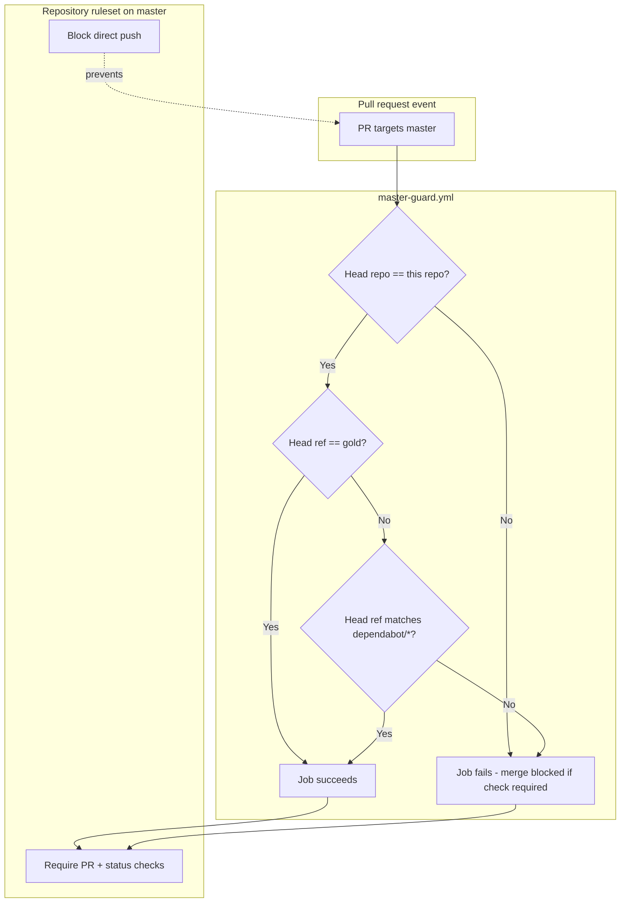

# Master Merge Guard Workflow

Developer documentation for the **Master merge guard** GitHub Actions workflow.

| Item | Value |
|------|-------|
| Workflow file | [`.github/workflows/master-guard.yml`](https://github.com/Krypton-Suite/Standard-Toolkit/tree/master/.github/workflows/master-guard.yml) |
| Workflow name (Actions UI) | **Master merge guard** |
| Job name (status check) | **Allowed source branch** |
| Full check name (typical) | `Master merge guard / Allowed source branch` |
| Runner | `ubuntu-latest` |
| Permissions | `contents: read` |
| Related workflow | [Branch promotion guard](BranchPromotionGuardWorkflow.md) |

---

## Table of contents

1. [Purpose](#purpose)
2. [Role in the branch promotion model](#role-in-the-branch-promotion-model)
3. [What this workflow enforces](#what-this-workflow-enforces)
4. [What this workflow does not enforce](#what-this-workflow-does-not-enforce)
5. [Architecture overview](#architecture-overview)
6. [Triggers and events](#triggers-and-events)
7. [Validation logic (step by step)](#validation-logic-step-by-step)
8. [Repository ruleset configuration](#repository-ruleset-configuration)
9. [Dependabot integration](#dependabot-integration)
10. [Typical developer workflows](#typical-developer-workflows)
11. [Interaction with other CI workflows](#interaction-with-other-ci-workflows)
12. [Security model](#security-model)
13. [Decision matrix](#decision-matrix)
14. [Troubleshooting](#troubleshooting)
15. [Operational procedures](#operational-procedures)
16. [Maintaining and extending the workflow](#maintaining-and-extending-the-workflow)

---

## Purpose

The Master merge guard ensures that **`master` receives changes only through controlled promotion paths**:

- Pull requests whose **head branch** is **`gold`** (release-candidate line promoted from `canary`).
- Pull requests opened by **Dependabot** against `master` (head branches matching `dependabot/*`).

The workflow exists to protect the **stable production line** from accidental merges of feature branches, pre-release branches (`alpha`, `canary`), or fork-based contributions directly into `master`.

`master` triggers stable releases via [`release.yml`](https://github.com/Krypton-Suite/Standard-Toolkit/tree/master/.github/workflows/release.yml) (`release-master` job) and is the target of Dependabot updates in [`.github/dependabot.yml`](https://github.com/Krypton-Suite/Standard-Toolkit/tree/master/.github/dependabot.yml). Guarding merge sources reduces the risk of publishing unintended builds to NuGet.org.

---

## Role in the branch promotion model

This repository uses a **sequential promotion chain** for code moving toward production:

```text
feature/*  ──PR──>  alpha  ──PR──>  canary  ──PR──>  gold  ──PR──>  master
                         │              │              │              │
                         │              │              │              └── Master merge guard (this doc)
                         │              │              └── Branch promotion guard (canary -> gold)
                         │              └── Branch promotion guard (alpha -> canary)
                         └── Feature PRs (not restricted by promotion guards)
```

| Stage | Branch | Guard workflow | Allowed PR sources into target |
|-------|--------|----------------|--------------------------------|
| Development integration | `alpha` | *(none from this family)* | Feature branches, etc. |
| Pre-release testing | `canary` | [Branch promotion guard](BranchPromotionGuardWorkflow.md) | `alpha` only |
| Release candidate | `gold` | [Branch promotion guard](BranchPromotionGuardWorkflow.md) | `canary` only |
| Stable production | `master` | **Master merge guard** (this workflow) | `gold`, `dependabot/*` |

See [Branch promotion guard](BranchPromotionGuardWorkflow.md) for the `alpha` → `canary` → `gold` rules.

---

## What this workflow enforces

When a pull request **targets** `master`, the workflow:

1. **Rejects fork PRs** — the head repository must be `Krypton-Suite/Standard-Toolkit` (same repo as the base).
2. **Allows `gold` → `master`** — head ref must be exactly `gold`.
3. **Allows Dependabot → `master`** — head ref must match the pattern `dependabot/*` (e.g. `dependabot/github_actions/actions/checkout-6`).

If validation passes, the job succeeds and reports a green status check. If validation fails, the job fails with a GitHub Actions error annotation (`::error::`).

---

## What this workflow does not enforce

| Scenario | Why it is not blocked by this workflow alone | Required mitigation |
|----------|----------------------------------------------|---------------------|
| **Direct push** to `master` | Actions run *after* the push; they cannot reject it | [Repository ruleset](#repository-ruleset-configuration): restrict updates |
| **Opening** a PR from a disallowed branch | GitHub always allows opening PRs | Failed status check blocks **merge** when ruleset requires this check |
| **Force-push** to `master` | Not validated by this workflow | Ruleset: block force pushes |
| **Admin bypass** of branch rules | Workflow has no admin override | Ruleset: apply to administrators |
| **Merging without other CI** | This guard only validates source branch | Keep existing required checks (Build, CodeQL, etc.) |
| **PRs into `alpha`, `canary`, `gold`** | Out of scope | [Branch promotion guard](BranchPromotionGuardWorkflow.md) |

---

## Architecture overview



---

## Triggers and events

Defined in [`master-guard.yml`](https://github.com/Krypton-Suite/Standard-Toolkit/tree/master/.github/workflows/master-guard.yml):

```yaml
on:
  pull_request:
    branches:
      - master
    types:
      - opened
      - synchronize
      - reopened
      - edited
```

| Event type | When it fires | Why it matters |
|------------|---------------|----------------|
| `opened` | New PR targeting `master` | Initial validation |
| `synchronize` | New commits pushed to PR head branch | Re-validate after updates |
| `reopened` | Closed PR reopened | Re-validate |
| `edited` | PR base/head changed | Re-validate if target or source branch changes |

The workflow does **not** run on:

- `push` to `master` (cannot block pushes anyway)
- `pull_request_target` (not needed; no write permissions or secrets required)
- `workflow_dispatch` (manual runs are unnecessary for policy checks)

---

## Validation logic (step by step)

The single job **`allowed-source-branch`** runs on `ubuntu-latest` and executes a Bash script.

### Step 1 — Resolve PR metadata

| Variable | Source | Example |
|----------|--------|---------|
| `head_repo` | `github.event.pull_request.head.repo.full_name` | `Krypton-Suite/Standard-Toolkit` |
| `head_ref` | `github.event.pull_request.head.ref` | `gold` or `dependabot/github_actions/actions/checkout-6` |
| `this_repo` | `github.repository` | `Krypton-Suite/Standard-Toolkit` |

### Step 2 — Same-repository check

```bash
if [ "$head_repo" != "$this_repo" ]; then
  exit 1
fi
```

Fork PRs fail here. Dependabot and in-repo promotion PRs pass.

### Step 3 — Allowed source branch check

**Path A — `gold`:**

```bash
if [ "$head_ref" = "gold" ]; then
  exit 0
fi
```

Branch name comparison is **case-sensitive**. The remote branch is `gold` (lowercase).

**Path B — Dependabot:**

```bash
case "$head_ref" in
  dependabot/*)
    exit 0
    ;;
esac
```

Matches all Dependabot branch prefixes used for GitHub Actions updates (see [Dependabot integration](#dependabot-integration)).

**Path C — anything else:**

```bash
echo "::error::Pull requests to master are only allowed from branch 'gold' or Dependabot branches (got '$head_ref')."
exit 1
```

---

## Repository ruleset configuration

This workflow **alone** only adds a status check. **Direct pushes** to `master` must be blocked with a GitHub **ruleset** (or classic branch protection).

### Recommended ruleset: Protect master

**Location:** GitHub → Repository → **Settings** → **Rules** → **Rulesets** → **New ruleset**

| Setting | Value |
|---------|-------|
| Ruleset name | `Protect master` |
| Enforcement status | **Active** |
| Target branches | **Include by name** → `master` |
| Restrict updates | **Enabled** (blocks direct pushes) |
| Require a pull request before merging | **Enabled** |
| Require status checks to pass | **Enabled** — add **`Master merge guard / Allowed source branch`** (exact label may vary slightly in the UI) |
| Block force pushes | **Enabled** |
| Apply to administrators | **Recommended: Enabled** |
| Bypass list | Only trusted automation accounts (if any must push directly) |

### Minimum required status checks (suggested)

Combine this guard with existing CI:

| Check | Purpose |
|-------|---------|
| `Master merge guard / Allowed source branch` | Source branch policy |
| Build workflow job(s) | Compile all TFMs |
| CodeQL (if required on `master`) | Security analysis |
| Other team-required reviews | Human approval |

### Bootstrapping (first-time enablement)

1. Merge `master-guard.yml` onto `master` (may require a one-time admin merge or ruleset bypass).
2. Open a test PR from `gold` → `master` and confirm the check appears and passes.
3. Open a test PR from another branch (e.g. `alpha` → `master`) and confirm the check **fails**.
4. Enable the ruleset with **Require status checks** once the check name is visible in the ruleset UI.
5. Enable **Restrict updates** to block direct pushes.

---

## Dependabot integration

Dependabot is configured in [`.github/dependabot.yml`](https://github.com/Krypton-Suite/Standard-Toolkit/tree/master/.github/dependabot.yml):

```yaml
package-ecosystem: "github-actions"
target-branch: "master"
```

Dependabot opens PRs with head branches such as:

- `dependabot/github_actions/actions/checkout-6`
- `dependabot/github_actions/actions/setup-dotnet-5`

The master merge guard **explicitly allows** any head ref matching `dependabot/*` so weekly GitHub Actions dependency updates can merge into `master` without going through `gold`.

**Assignee behaviour:** [`.github/workflows/auto-assign-pr-author.yml`](https://github.com/Krypton-Suite/Standard-Toolkit/tree/master/.github/workflows/auto-assign-pr-author.yml) assigns Dependabot PRs to the repository owner instead of `dependabot[bot]`.

**Review policy:** Dependabot PRs still require normal review/CI rules configured on the ruleset; this guard only validates the source branch name.

---

## Typical developer workflows

### Promoting a stable release to `master`

1. Ensure changes have flowed **`alpha` → `canary` → `gold`** (see [Branch promotion guard](BranchPromotionGuardWorkflow.md)).
2. Open a PR: **base** `master`, **compare** `gold`.
3. Wait for **Master merge guard / Allowed source branch** and other CI checks.
4. Merge after approval.
5. `release-master` in [`release.yml`](https://github.com/Krypton-Suite/Standard-Toolkit/tree/master/.github/workflows/release.yml) runs on push to `master`.

### Merging a Dependabot update

1. Dependabot opens `dependabot/*` → `master`.
2. Master merge guard passes automatically.
3. Review and merge like any other PR.

### What not to do

| Action | Result |
|--------|--------|
| PR `feature/my-fix` → `master` | Guard **fails** |
| PR `alpha` → `master` | Guard **fails** |
| PR `canary` → `master` | Guard **fails** |
| PR from a fork → `master` | Guard **fails** |
| Direct `git push origin master` | Blocked by ruleset (once configured), not by workflow |

---

## Interaction with other CI workflows

| Workflow | Relationship |
|----------|--------------|
| [`build.yml`](https://github.com/Krypton-Suite/Standard-Toolkit/tree/master/.github/workflows/build.yml) | Runs on PRs to all branches including `master`; independent of source-branch policy |
| [`release.yml`](https://github.com/Krypton-Suite/Standard-Toolkit/tree/master/.github/workflows/release.yml) | Runs on **push** to `master` after merge |
| [`codeql.yml`](https://github.com/Krypton-Suite/Standard-Toolkit/tree/master/.github/workflows/codeql.yml) | Analyzes PRs targeting `master` |
| [`repo-mirror.yml`](https://github.com/Krypton-Suite/Standard-Toolkit/tree/master/.github/workflows/repo-mirror.yml) | Mirrors `master` on push |
| [`dependabot.yml`](https://github.com/Krypton-Suite/Standard-Toolkit/tree/master/.github/dependabot.yml) | Targets `master`; allowed by this guard |
| [Branch promotion guard](BranchPromotionGuardWorkflow.md) | Upstream policy for `gold` content |

Promotion guards and build workflows are **complementary**: build verifies *quality*; merge guards verify *provenance*.

---

## Security model

| Topic | Design choice |
|-------|---------------|
| **`pull_request` vs `pull_request_target`** | Uses `pull_request` — untrusted fork code is not checked out; only metadata is read |
| **Permissions** | Minimal (`contents: read`) |
| **Secrets** | None required |
| **Fork exclusion** | Prevents drive-by PRs from external forks into `master` |
| **Dependabot allowance** | Dependabot branches are always in-repo; pattern match is safe |

This workflow is **policy enforcement**, not code scanning. Malicious code could still exist on `gold`; review and CI remain essential.

---

## Decision matrix

| Base branch | Head branch | Head repo | Guard result |
|-------------|-------------|-----------|--------------|
| `master` | `gold` | Same repo | Pass |
| `master` | `dependabot/github_actions/...` | Same repo | Pass |
| `master` | `alpha` | Same repo | Fail |
| `master` | `canary` | Same repo | Fail |
| `master` | `feature/*` | Same repo | Fail |
| `master` | `gold` | Fork | Fail |
| `master` | any | Fork | Fail |

---

## Troubleshooting

### Check does not appear on PR

1. Confirm `master-guard.yml` exists on the **default branch** or the PR’s base branch.
2. Confirm the PR **targets** `master` (not `main` or another name).
3. Confirm Actions are enabled for the repository.
4. Re-run checks from the PR **Checks** tab if the workflow was added after PR creation (close/reopen or push an empty commit).

### Check fails for a valid `gold` → `master` PR

1. Verify head branch is exactly **`gold`** (case-sensitive).
2. Verify the PR is from **this repository**, not a fork.
3. Read the job log for the exact `head_ref` value.

### Check fails for Dependabot PR

1. Confirm head branch starts with **`dependabot/`** (Dependabot version updates use this prefix).
2. If using a different bot or prefix, extend the workflow `case` pattern.

### Merge button disabled despite green guard

Other required checks or reviews may be pending. This guard is one of several gates.

### Direct push to `master` still works

The ruleset is missing or bypassed. Enable **Restrict updates** and **Apply to administrators**.

### Dependabot PR passes guard but team wants it on `gold` instead

Change `target-branch` in `dependabot.yml` to `gold` and **remove** the Dependabot exemption from this workflow. That is a policy change, not a bug.

---

## Operational procedures

### Temporarily allowing an exception merge

Prefer **ruleset bypass** for a trusted maintainer with audit trail, rather than disabling the workflow.

1. Add maintainer to ruleset bypass list (time-limited).
2. Perform merge.
3. Remove bypass entry.

Disabling the workflow file entirely affects all PRs to `master`.

### Renaming the `gold` branch

Update:

1. `master-guard.yml` — allowed head ref
2. [Branch promotion guard](BranchPromotionGuardWorkflow.md) — `gold` base and `canary` head rules
3. All workflow `push`/`pull_request` branch lists
4. Rulesets and mirror configuration

### Verifying policy after changes

1. `gold` → `master`: expect **pass**
2. `alpha` → `master`: expect **fail**
3. `dependabot/*` → `master`: expect **pass**
4. Fork → `master`: expect **fail**

---

## Maintaining and extending the workflow

When editing [`master-guard.yml`](https://github.com/Krypton-Suite/Standard-Toolkit/tree/master/.github/workflows/master-guard.yml):

1. Update this documentation and [GitHub Workflow Index](../GitHubWorkflowIndex.md).
2. Keep header comments in the YAML file aligned with ruleset steps.
3. If adding new allowed sources (e.g. release bot branch), document the security rationale.
4. Avoid `pull_request_target` unless you need elevated permissions and understand the security implications.
5. Test with real PRs before marking the check as required in rulesets.

**Related files:**

- [`.github/workflows/master-guard.yml`](https://github.com/Krypton-Suite/Standard-Toolkit/tree/master/.github/workflows/master-guard.yml)
- [`.github/workflows/branch-promotion-guard.yml`](https://github.com/Krypton-Suite/Standard-Toolkit/tree/master/.github/workflows/branch-promotion-guard.yml)
- [`.github/dependabot.yml`](https://github.com/Krypton-Suite/Standard-Toolkit/tree/master/.github/dependabot.yml)
