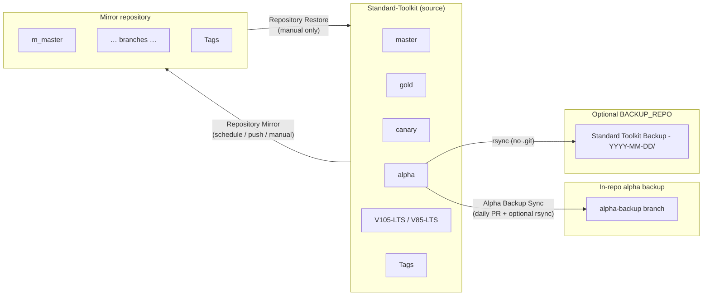
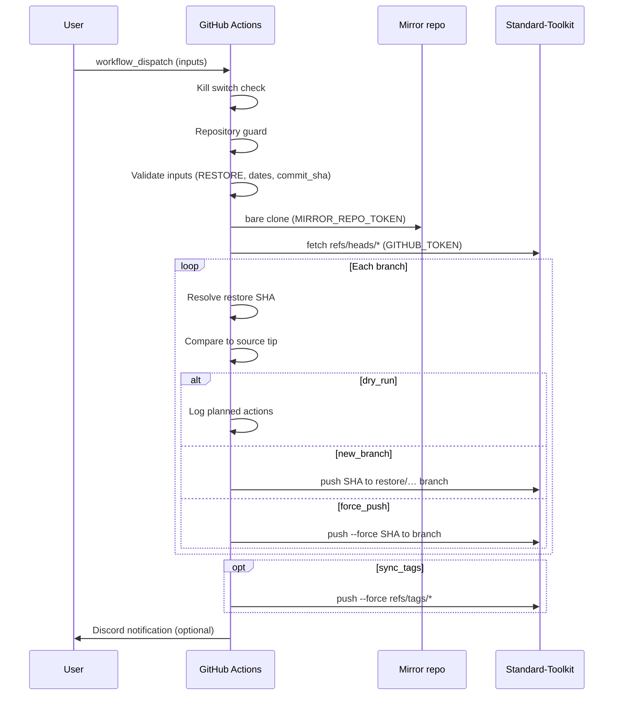

# Repository backup and restore

This document describes the automated backup infrastructure for **Krypton-Suite/Standard-Toolkit**, how the components relate to each other, and how to configure, operate, and recover from failures. It was introduced as part of [#3591](https://github.com/Krypton-Suite/Standard-Toolkit/issues/3591).

**Workflow-specific documentation:**

- [Repository Mirror](RepositoryMirror.md) — source → mirror
- [Repository Restore from Mirror](RepositoryRestoreFromMirrorWorkflow.md) — mirror → source (this workflow in depth)

**Quick reference (cheat sheet):** [.github/REPOSITORY_BACKUP.md](../../../../.github/REPOSITORY_BACKUP.md)

---

## Table of contents

1. [Overview](#overview)
2. [Architecture](#architecture)
3. [Backup mechanisms compared](#backup-mechanisms-compared)
4. [Repository Mirror (source → mirror)](#repository-mirror-source--mirror)
5. [Repository Restore from Mirror (mirror → source)](#repository-restore-from-mirror-mirror--source)
6. [Alpha to Alpha-Backup Sync](#alpha-to-alpha-backup-sync)
7. [Configuration reference](#configuration-reference)
8. [Initial setup](#initial-setup)
9. [Operational procedures](#operational-procedures)
10. [Disaster recovery playbooks](#disaster-recovery-playbooks)
11. [Point-in-time restore mechanics](#point-in-time-restore-mechanics)
12. [Security model](#security-model)
13. [Workflow internals](#workflow-internals)
14. [Limitations and non-goals](#limitations-and-non-goals)
15. [Troubleshooting](#troubleshooting)
16. [Maintenance and extension](#maintenance-and-extension)

---

## Overview

The Standard Toolkit repository uses **three complementary backup layers**:

| Layer | Workflow | Direction | Git history | Primary purpose |
|-------|----------|-----------|-------------|-----------------|
| **Mirror** | [repo-mirror.yml](../../../../.github/workflows/repo-mirror.yml) | Source → mirror repo | Full | Off-site Git replica of major branches and tags |
| **Restore** | [repo-restore-from-mirror.yml](../../../../.github/workflows/repo-restore-from-mirror.yml) | Mirror → source | Full | Manual disaster recovery and branch rollback |
| **Alpha sync** | [alpha-backup-sync.yml](../../../../.github/workflows/alpha-backup-sync.yml) | `alpha` → `alpha-backup` (+ optional file dump) | Full on branch; file dump has **no** `.git` | Daily alpha-line safety net |

None of these replace normal Git hygiene (feature branches, PR review, protected branches). They provide **recovery paths** when something goes wrong on the main repository.

---

## Architecture



**Data flow summary:**

- **Mirror** keeps a separate GitHub repository in sync with configured branches on the source. It uses bare clones and force-pushes refs so the mirror holds complete object history for those branches.
- **Restore** is the inverse: clone the mirror bare, resolve target commits, push back to the source (either to new `restore/…` branches or via force-push).
- **Alpha sync** creates merge commits on `alpha-backup` via automated PRs when `alpha` had activity in the last 24 hours. Optionally copies a **file snapshot** (no Git metadata) into a second repository under dated folders.

---

## Backup mechanisms compared

### When to use which mechanism

| Scenario | Use |
|----------|-----|
| Source repo corrupted; mirror is healthy | **Repository Restore** (`new_branch` or `force_push`) |
| Roll `alpha` back to how it was on a specific UTC date | **Repository Restore** with `restore_date` (history must exist on mirror) |
| Recover one known good commit on one branch | **Repository Restore** with `commit_sha` + single `branches` input |
| Compare alpha vs last known backup branch in-repo | **`alpha-backup`** branch (merge or reset locally) |
| Recover **files only** from a past day (no commits/merges) | **BACKUP_REPO** dated directory (manual copy-out) |
| Routine off-site replica | **Repository Mirror** (automatic) |

### What each mechanism cannot do

| Mechanism | Cannot |
|-----------|--------|
| Mirror | Restore by itself; it only copies **current** source state (plus retained history on mirror) |
| Restore | Recover objects never pushed to the mirror; restore whole-repo “snapshot at midnight” across all branches as one atomic unit |
| Alpha file backup | Restore Git history, tags, or branch relationships |
| GitHub UI | Arbitrary point-in-time full-repo restore without Git operations |

---

## Repository Mirror (source → mirror)

**Workflow file:** `.github/workflows/repo-mirror.yml`  
**Actions name:** Repository Mirror

### Triggers

| Trigger | When it runs |
|---------|----------------|
| `schedule` | Daily at **02:00 UTC** (uses workflow file on default branch `master`) |
| `push` | Pushes to configured major branches when this workflow file exists on that branch |
| `workflow_dispatch` | Manual run; supports **Dry run** input |

Configured push branches include: `master`, `gold`, `canary`, `alpha`, `alpha-backup`, `V105-LTS`, `V85-LTS`, `prerelease`.

### Behaviour

1. Bare-clone the **source** repository.
2. For each configured branch:
   - If branch exists on source → **force-push** to mirror.
   - If branch removed from source but exists on mirror → **delete** from mirror.
   - If branch missing on both → **fail** (typo guard for `MIRROR_BRANCHES`).
3. Unless `MIRROR_SYNC_TAGS=false`:
   - Force-push all tags from source to mirror.
   - **Prune** tags on mirror that no longer exist on source.

### Concurrency

- Group: `repo-mirror`
- `cancel-in-progress: false` — overlapping runs queue rather than cancel (avoids partial mirror state).

### Kill switch

Set repository variable `REPO_MIRROR_DISABLED=true` to skip the mirror job.

---

## Repository Restore from Mirror (mirror → source)

**Workflow file:** `.github/workflows/repo-restore-from-mirror.yml`  
**Actions name:** Repository Restore from Mirror  
**Detailed documentation:** [Repository Restore from Mirror Workflow](RepositoryRestoreFromMirrorWorkflow.md)

### Triggers

**Manual only** (`workflow_dispatch`). There is no schedule or push trigger.

### Workflow inputs

| Input | Type | Default | Description |
|-------|------|---------|-------------|
| `dry_run` | boolean | `true` | Preview only; no pushes to source |
| `restore_mode` | choice | `new_branch` | `new_branch` or `force_push` (ignored when `dry_run` is true) |
| `branches` | string | *(empty)* | Comma-separated list; empty uses `MIRROR_BRANCHES` or built-in defaults |
| `restore_date` | string | *(empty)* | UTC date/time for point-in-time restore |
| `commit_sha` | string | *(empty)* | Exact commit (single branch only; overrides `restore_date`) |
| `sync_tags` | boolean | `false` | Force-push all mirror tags to source |
| `force_push_confirmation` | string | *(empty)* | Must be exactly `RESTORE` when using `force_push` |
| `new_branch_prefix` | string | `restore/` | Prefix for branches created in `new_branch` mode |

### Restore modes

#### `new_branch` (recommended)

Creates a **new branch** on the source repository pointing at the resolved commit. Does not modify the original branch tip.

**Branch naming:**

| Condition | Example name |
|-----------|----------------|
| Current mirror tip, no date | `restore/alpha-tip` |
| `restore_date` set | `restore/alpha-2025-06-01` (spaces/colons in date sanitized to `-`) |
| `commit_sha` set | `restore/alpha-a1b2c3d` (7-char short SHA) |

Typical follow-up: open a PR from `restore/alpha-…` → `alpha`, review diff, merge.

#### `force_push` (destructive)

Overwrites the **existing branch tip** on the source with the resolved commit.

**Requirements:**

- `dry_run` must be `false`
- `force_push_confirmation` must be exactly `RESTORE`
- Branch protection may **reject** the push (e.g. `master` without bypass permissions)

Commits that were on the branch tip but remain in the object database may still be reachable via SHA until garbage-collected; treat force-push as **loss of branch history** from a workflow perspective.

### Resolution order (per branch)

For each configured branch on the mirror:

1. **`commit_sha`** (if set) — must exist in mirror and be an ancestor of the mirror branch.
2. Else **`restore_date`** — `git rev-list -1 --before="<date>" refs/heads/<branch>`.
3. Else **current mirror tip** — `git rev-parse refs/heads/<branch>`.

If source tip already equals the restore target SHA, the branch is reported as **unchanged** and skipped.

### Tag sync

When `sync_tags` is `true`, the workflow force-pushes `refs/tags/*` from the mirror clone to the source. Default is **off** because tag overwrites are high impact. Enable only when tag recovery is explicitly required.

### Concurrency

- Group: `repo-restore`
- `cancel-in-progress: false`

### Kill switch

Set repository variable `REPO_RESTORE_DISABLED=true`.

---

## Alpha to Alpha-Backup Sync

**Workflow file:** `.github/workflows/alpha-backup-sync.yml`  
**Actions name:** Alpha to Alpha-Backup Sync

### Triggers

| Trigger | When |
|---------|------|
| `schedule` | Daily at **00:00 UTC** |
| `workflow_dispatch` | Manual |

### Behaviour

1. Checkout `alpha` with full history (`fetch-depth: 0`).
2. If **no commits** on `alpha` in the last 24 hours → exit (no work).
3. Ensure `alpha-backup` branch exists (create from `alpha` if missing).
4. Open PR `alpha` → `alpha-backup` (or reuse existing open PR).
5. Attempt to enable **auto-merge** on the PR (requires repo setting *Allow auto-merge*).
6. Optionally push a **file snapshot** of `alpha` to `BACKUP_REPO` under `Standard Toolkit Backup - YYYY-MM-DD/` (no `.git` directory in the snapshot).

### Kill switch

`ALPHA_BACKUP_SYNC_DISABLED=true`

---

## Configuration reference

All variables and secrets are configured under **Repository Settings → Secrets and variables → Actions**.

### Shared mirror / restore settings

| Name | Type | Used by | Purpose |
|------|------|---------|---------|
| `MIRROR_REPO` | Variable | Mirror, Restore | Target mirror as `owner/repo` (full GitHub URLs normalized automatically) |
| `MIRROR_REPO_TOKEN` | Secret | Mirror, Restore | PAT for mirror access (mirror: **write**; restore: **read** sufficient) |
| `MIRROR_BRANCHES` | Variable | Mirror, Restore | Optional comma-separated branch list |
| `MIRROR_SYNC_TAGS` | Variable | Mirror only | Set to `false` to skip tag sync on mirror push |

**Default branches** (when `MIRROR_BRANCHES` and workflow `branches` input are empty):

`master`, `gold`, `canary`, `alpha`, `V105-LTS`, `V85-LTS`

### Mirror-only settings

| Name | Type | Purpose |
|------|------|---------|
| `REPO_MIRROR_DISABLED` | Variable | Kill switch (`true` = disabled) |
| `DISCORD_WEBHOOK_MIRROR` | Secret | Optional Discord notifications |

### Restore-only settings

| Name | Type | Purpose |
|------|------|---------|
| `REPO_RESTORE_DISABLED` | Variable | Kill switch (`true` = disabled) |
| `DISCORD_WEBHOOK_RESTORE` | Secret | Optional Discord notifications |

### Alpha backup settings

| Name | Type | Purpose |
|------|------|---------|
| `ALPHA_BACKUP_SYNC_DISABLED` | Variable | Kill switch |
| `BACKUP_REPO` | Variable | Optional second repo for dated file snapshots |
| `BACKUP_REPO_TOKEN` | Secret | PAT with push access to `BACKUP_REPO` |
| `BACKUP_DIR_PREFIX` | Variable | Default: `Standard Toolkit Backup` |
| `BACKUP_BRANCH` | Variable | Branch in backup repo; default: `main` |
| `DISCORD_WEBHOOK_ALPHA_BACKUP` | Secret | Optional Discord notifications |

### PAT permission matrix

| Token | Repository | Minimum scopes |
|-------|------------|----------------|
| `MIRROR_REPO_TOKEN` (mirror) | Mirror repo | `contents: write` (push branches/tags, delete refs) |
| `MIRROR_REPO_TOKEN` (restore) | Mirror repo | `contents: read` (clone/fetch) |
| *(implicit)* `GITHUB_TOKEN` | Source repo | Workflow `permissions: contents: write` for restore pushes |
| `BACKUP_REPO_TOKEN` | Backup repo | `contents: write` |

Use fine-grained PATs limited to the specific backup/mirror repositories where possible.

---

## Initial setup

### 1. Create the mirror repository

1. Create an empty private repository (e.g. `Krypton-Suite/Standard-Toolkit-Mirror`).
2. Do **not** initialize with README if you want a clean first mirror push (optional either way).

### 2. Create and store credentials

1. Create a PAT with access to the mirror repository.
2. Add secrets/variables on **Standard-Toolkit**:
   - `MIRROR_REPO` = `Krypton-Suite/Standard-Toolkit-Mirror`
   - `MIRROR_REPO_TOKEN` = PAT

### 3. Validate mirror (dry run)

1. **Actions → Repository Mirror → Run workflow**
2. Enable **Dry run**
3. Confirm log shows expected branches and mirror reachability.

### 4. First real mirror

1. Run Repository Mirror without dry run (or wait for schedule / push trigger).
2. Verify branches and tags on the mirror repository.

### 5. Optional: Discord and alpha file backup

Configure webhooks and `BACKUP_REPO` as needed.

### 6. Validate restore (dry run)

1. **Actions → Repository Restore from Mirror → Run workflow**
2. Leave **dry_run** enabled.
3. Set `branches` to one branch (e.g. `alpha`).
4. Confirm log shows mirror SHA, source SHA, and planned branch names.

---

## Operational procedures

### Routine health checks

| Check | Frequency | How |
|-------|-----------|-----|
| Mirror workflow last success | Weekly | Actions → Repository Mirror |
| Mirror repo branch tips vs source | After incidents | Compare SHAs on GitHub or `git ls-remote` |
| Alpha backup PR merged | After alpha activity | Open PRs `alpha` → `alpha-backup` |
| Restore dry run | After config changes | Manual restore with `dry_run=true` |

### Standard restore procedure (safe path)

1. Identify affected branch(es) and whether you need a **date**, **commit**, or **current mirror tip**.
2. Run **Repository Restore from Mirror** with:
   - `dry_run`: **true**
   - `branches`: affected branch(es)
   - `restore_date` or `commit_sha` if needed
3. Review workflow log:
   - `Restore SHAs` vs `Source SHAs`
   - Planned `restore/…` branch names
4. Re-run with:
   - `dry_run`: **false**
   - `restore_mode`: **new_branch**
5. Locally or on GitHub, compare `restore/…` with the live branch.
6. Open PR from `restore/…` → target branch; get review; merge.
7. Optionally run **Repository Mirror** manually to re-sync mirror after source is corrected.

### Force-push procedure (emergency only)

Use when the branch must be corrected **immediately** and reviewers agree force-push is acceptable.

1. Complete dry run steps above.
2. Confirm branch protection allows force-push (or temporarily adjust rules).
3. Run restore with:
   - `dry_run`: **false**
   - `restore_mode`: **force_push**
   - `force_push_confirmation`: **RESTORE**
4. Verify branch tip SHA on source.
5. Notify team; run mirror sync if needed.

---

## Disaster recovery playbooks

### Playbook A — Source branch accidentally force-pushed

**Symptoms:** Branch tip moved backward or to wrong commit; mirror not yet updated.

**Steps:**

1. Check mirror branch tip SHA (may still point at last good commit if mirror has not run since the bad push).
2. Run restore dry run with empty `restore_date` (mirror tip).
3. If mirror tip is good → `new_branch` restore → PR.
4. If mirror already synced the bad state → use `restore_date` or `commit_sha` from before the incident.

### Playbook B — Source repository wide corruption

**Symptoms:** Multiple branches wrong; local clones fine but GitHub state bad.

**Steps:**

1. Restore **one branch at a time** via `new_branch` mode.
2. Start with lowest-risk branches; leave `master` for last with extra review.
3. Avoid `sync_tags` until branch tips are verified.
4. After all branches corrected, run mirror from source to refresh off-site copy.

### Playbook C — Mirror is stale but source is fine

**Symptoms:** Mirror behind source; no source corruption.

**Action:** Run **Repository Mirror** (not restore). Restore is only for mirror → source.

### Playbook D — Need files from a specific day (alpha only)

**Symptoms:** Need source tree as of a date; Git history not required.

**Steps:**

1. Open `BACKUP_REPO` → branch `main` (or `BACKUP_BRANCH`).
2. Locate folder `Standard Toolkit Backup - YYYY-MM-DD`.
3. Copy files manually into a working branch.

**Note:** This does not preserve Git history. For commit-level recovery use mirror restore.

### Playbook E — `alpha-backup` branch is ahead/behind unexpectedly

**Symptoms:** Automated PR failed or was not merged.

**Steps:**

1. Check **Alpha to Alpha-Backup Sync** workflow runs.
2. Manually merge or create PR from `alpha` to `alpha-backup`.
3. For Git-level rollback, prefer mirror restore with `restore_date` if mirror history is authoritative.

---

## Point-in-time restore mechanics

### How `restore_date` works

The workflow runs (inside the bare mirror clone):

```bash
git rev-list -1 --before="<restore_date>" refs/heads/<branch>
```

Git interprets `--before` against commit **author/committer timestamps** on the branch’s reachable history. The result is the **latest commit on that branch** whose commit time is strictly before the given instant (or equal depending on Git version parsing — treat dates as UTC and prefer explicit times for precision).

**Examples:**

| Input | Meaning |
|-------|---------|
| `2025-06-01` | Latest commit on branch before end of that UTC calendar day (parsed by `date -u -d`) |
| `2025-06-01 14:30:00` | Latest commit before that UTC timestamp |

**Important:** There may be **no commit** exactly at your chosen wall-clock time. You get the nearest ancestor commit on that branch.

### How `commit_sha` works

- Must be a valid commit object in the mirror.
- Must be **reachable** from the specified mirror branch (`merge-base --is-ancestor`).
- Only allowed when exactly **one** branch is in scope (workflow input or implied single branch).

### History availability

Point-in-time restore only works if:

1. The commit existed on the branch when the mirror last received it, and
2. The commit is still reachable from the mirror branch (not orphaned by later mirror syncs that force-pushed away history).

The mirror retains objects for force-pushed-away commits until garbage collection on the mirror host; do not rely on orphaned SHAs indefinitely.

---

## Security model

### Repository guard

Both mirror and restore workflows **hard-code** an check that `GITHUB_REPOSITORY` equals `Krypton-Suite/Standard-Toolkit`. Forks or accidental workflow copies fail fast.

### Kill switches

Each workflow can be disabled independently without deleting workflow files:

| Variable | Workflow |
|----------|----------|
| `REPO_MIRROR_DISABLED` | Repository Mirror |
| `REPO_RESTORE_DISABLED` | Repository Restore |
| `ALPHA_BACKUP_SYNC_DISABLED` | Alpha Backup Sync |

### Least privilege

- Mirror PAT: write on mirror only.
- Restore uses the same PAT but only **reads** the mirror; writes use `GITHUB_TOKEN` on the source repo within workflow permissions.
- Store PATs as secrets; never commit tokens.

### Human confirmation

- Restore defaults to **dry run**.
- `force_push` requires typing **RESTORE**.
- Prefer `new_branch` + PR review over force-push for auditability.

### Branch protection interaction

Protected branches may block:

- Force-push restores
- Direct pushes to `restore/…` if rules are restrictive (uncommon)

Plan rule exceptions or use PR-based promotion from restore branches.

---

## Workflow internals

### Repository Restore — step sequence



### Credential helper

Mirror and restore workflows use a small shell credential helper so Git commands do not embed tokens in URLs in logs:

```bash
git_with_token "$TOKEN" clone --bare "$remote" mirror.git
```

### Job outputs (restore)

The restore step exposes outputs consumed by Discord notification:

| Output | Description |
|--------|-------------|
| `restored_branches` | Source branches successfully restored |
| `created_branches` | New `restore/…` refs created |
| `unchanged_branches` | Already matched mirror target |
| `failed_branches` | Push or validation failures |
| `missing_branches` | Branch absent on mirror |
| `restore_shas` / `source_shas` | `branch:sha` pairs for auditing |

---

## Limitations and non-goals

1. **No whole-repository time machine** — Branches are restored independently; there is no single “repo at 2025-06-01” snapshot unless every branch tip happened to match that instant.
2. **Mirror lag** — Scheduled mirror runs at 02:00 UTC; push-triggered runs reduce lag. Restore from mirror tip reflects last successful mirror, not necessarily latest source second.
3. **Alpha file backups are not Git backups** — Dated directories exclude `.git`.
4. **Deleted history** — Commits never mirrored, or garbage-collected on mirror, cannot be restored by these workflows.
5. **Restore does not delete** — Extra branches or tags on source that are absent on mirror are **not** removed by restore (unlike mirror’s prune behaviour). Tag sync force-pushes mirror tags but does not delete source-only tags unless overwritten by name.
6. **Not a replacement for GitHub Enterprise backup appliances** — This is org-managed Git mirroring via Actions.

### Possible future enhancements

- Dated **`git clone --mirror`** archives for true point-in-time full mirrors
- GitHub Environment protection on restore workflow (required reviewers)
- Separate read-only mirror PAT for restore vs write PAT for mirror

---

## Troubleshooting

| Symptom | Likely cause | Action |
|---------|--------------|--------|
| Mirror job skipped | `REPO_MIRROR_DISABLED=true` | Set to `false` or remove variable |
| Restore job skipped | `REPO_RESTORE_DISABLED=true` | Set to `false` or remove variable |
| `MIRROR_REPO and MIRROR_REPO_TOKEN must both be configured` | Missing variable/secret | Add both in repo settings |
| `Invalid repository` security error | Workflow ran on a fork | Only run on official repo |
| `Branch does not exist on the mirror` | Branch never mirrored or typo | Run mirror; check `MIRROR_BRANCHES` |
| `No commit found … at or before restore_date` | Date before branch existed | Pick earlier branch creation or use `commit_sha` |
| `commit_sha is not reachable from mirror branch` | SHA on wrong branch | Verify SHA on mirror branch history |
| `force_push mode requires typing RESTORE` | Missing confirmation | Re-run with exact string `RESTORE` |
| Force-push failed | Branch protection | Use `new_branch` + PR or adjust protection |
| Tag sync failed | Permission or tag conflict | Check token scopes; resolve tag name collisions |
| Mirror and source SHAs match but code “looks wrong” | Wrong branch or wrong mirror repo | Verify `MIRROR_REPO` points at intended mirror |
| Alpha backup folder empty / missing | No alpha commits in 24h or `BACKUP_REPO` unset | Expected; check workflow conditions |

### Useful local commands

```bash
# Compare branch tips
git ls-remote https://github.com/Krypton-Suite/Standard-Toolkit.git refs/heads/alpha
git ls-remote https://github.com/Krypton-Suite/Standard-Toolkit-Mirror.git refs/heads/alpha

# Find commit at date on local clone
git rev-list -1 --before="2025-06-01" origin/alpha
```

---

## Maintenance and extension

### Adding a new major branch to mirror/restore

1. Add branch name to push triggers in `repo-mirror.yml` (if push-triggered sync desired).
2. Add to `MIRROR_BRANCHES` repository variable **or** rely on workflow file default list update.
3. Run mirror dry run, then full mirror.
4. Run restore dry run for the new branch.

### Testing workflow changes

1. Use a **dedicated test mirror** repository variable override (on a fork or test org) before production.
2. Always run **dry run** first for restore changes.
3. Mirror workflow supports dry run via `workflow_dispatch`.

### Related documentation

- [Branch policy cheat sheet](../../../../.github/BRANCH_POLICY.md) — includes `alpha` → `alpha-backup` flow
- [Changelog entry](../../../Changelog/Changelog.md) — Build 2611 backup/restore notes
- Workflow header comments in each YAML file — operational quick reference

---

*Document version: aligns with `repo-restore-from-mirror.yml` and `repo-mirror.yml` as of [#3591](https://github.com/Krypton-Suite/Standard-Toolkit/issues/3591).*
