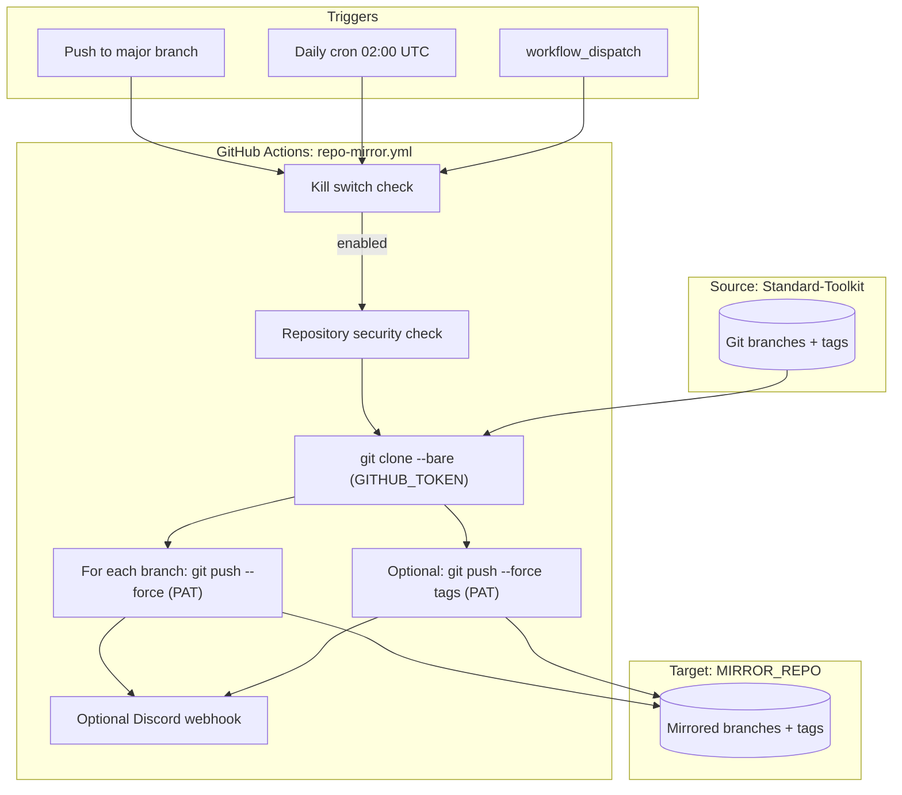

# Repository Mirror Workflow

## Quick Reference

- Workflow file: [`.github/workflows/repo-mirror.yml`](https://github.com/Krypton-Suite/Standard-Toolkit/tree/master/.github/workflows/repo-mirror.yml)
- Workflow name (Actions UI): **Repository Mirror**
- Triggers: `push` (major branches), `schedule` (`0 2 * * *`), `workflow_dispatch` (optional **Dry run** input)
- Runner: `ubuntu-latest`
- Permissions: `contents: read` (source via `${{ github.token }}`); mirror push uses `MIRROR_REPO_TOKEN` PAT via Git credential helper

Developer documentation for the **Repository Mirror** GitHub Actions workflow.

| Item | Value |
|------|-------|
| Workflow file | [`.github/workflows/repo-mirror.yml`](https://github.com/Krypton-Suite/Standard-Toolkit/tree/master/.github/workflows/repo-mirror.yml) |
| Workflow name (Actions UI) | **Repository Mirror** |
| Source repository | `Krypton-Suite/Standard-Toolkit` (hard-coded security check) |
| Runner | `ubuntu-latest` |

---

## Table of contents

1. [Purpose](#purpose)
2. [What is mirrored (and what is not)](#what-is-mirrored-and-what-is-not)
3. [How it differs from other backup workflows](#how-it-differs-from-other-backup-workflows)
4. [Architecture overview](#architecture-overview)
5. [Triggers and scheduling](#triggers-and-scheduling)
6. [Deployment requirements](#deployment-requirements)
7. [Configuration reference](#configuration-reference)
8. [Initial setup guide](#initial-setup-guide)
9. [Creating and rotating `MIRROR_REPO_TOKEN`](#creating-and-rotating-mirror_repo_token)
10. [Execution flow (step by step)](#execution-flow-step-by-step)
11. [Testing and dry run](#testing-and-dry-run)
12. [Branch and tag behaviour](#branch-and-tag-behaviour)
13. [Security model](#security-model)
14. [Kill switch](#kill-switch)
15. [Discord notifications](#discord-notifications)
16. [Concurrency and performance](#concurrency-and-performance)
17. [Operational procedures](#operational-procedures)
18. [Troubleshooting](#troubleshooting)
19. [Limitations and design decisions](#limitations-and-design-decisions)
20. [Maintaining and extending the workflow](#maintaining-and-extending-the-workflow)

---

## Purpose

The Repository Mirror workflow copies selected **Git branches** (and optionally **tags**) from `Krypton-Suite/Standard-Toolkit` to a **separate GitHub repository** that you configure.

Typical use cases:

- **Disaster recovery** — maintain a standby copy of major release lines outside the primary org or account.
- **Read-only downstream clone** — give partners or internal teams a repo that tracks `master`, LTS branches, and pre-release lines without granting write access to the source.
- **Geographic or org isolation** — keep an identical branch structure in another GitHub org for compliance or redundancy.

The mirror is a **Git ref sync**, not a full GitHub repository clone. Issues, pull requests, Actions secrets, wiki pages, and repository settings are **not** copied.

---

## What is mirrored (and what is not)

### Mirrored

| Git object | Default behaviour |
|------------|-------------------|
| Branch `master` | Yes |
| Branch `gold` | Yes |
| Branch `canary` | Yes |
| Branch `alpha` | Yes |
| Branch `V105-LTS` | Yes |
| Branch `V85-LTS` | Yes |
| All annotated and lightweight tags | Yes (unless disabled) |

Branches are configurable via `MIRROR_BRANCHES`. Tags are configurable via `MIRROR_SYNC_TAGS`.

### Not mirrored

- Pull requests, issues, discussions, projects
- GitHub Releases (metadata/UI — tag objects *are* pushed if tag sync is enabled)
- Repository variables, secrets, environments, branch protection rules
- Wiki, Pages, Packages (except what is referenced in Git history)
- Fork relationships, stars, watchers
- Other branches (e.g. feature branches, `alpha-backup`) unless added to `MIRROR_BRANCHES`
- Git LFS objects are pushed only if LFS is used in the source repo and the mirror accepts LFS pushes (standard `git push` behaviour)

---

## How it differs from other backup workflows

This repository also has [`alpha-backup-sync.yml`](https://github.com/Krypton-Suite/Standard-Toolkit/tree/master/.github/workflows/alpha-backup-sync.yml), which:

- Syncs only the `alpha` branch into an **`alpha-backup`** branch **within the same repo** (via PR).
- Optionally copies a **filesystem snapshot** of `alpha` into a **dated folder** in a backup repo (e.g. `Standard Toolkit Backup - 2026-05-30/`).

| Aspect | Repository Mirror | Alpha Backup Sync |
|--------|-------------------|-------------------|
| Scope | Six major branches (+ tags) | `alpha` only |
| Target layout | Same branch names on mirror | Dated directory *or* `alpha-backup` branch |
| Update mechanism | Direct `git push --force` | PR merge / folder copy |
| Trigger | Push to major branches, daily cron, manual | Daily cron, manual |

Use **Repository Mirror** when you need a **branch-faithful** copy of the main lines. Use **Alpha Backup Sync** when you need **point-in-time folder snapshots** or in-repo `alpha-backup` branch management.

**Recovery:** When the source repo needs to be rebuilt from the mirror, use [Repository Restore from Mirror](RepositoryRestoreFromMirrorWorkflow.md) (`repo-restore-from-mirror.yml`) — manual only, dry run by default. See also [Repository backup and restore](RepositoryBackupAndRestore.md).

---

## Architecture overview



**Authentication split:**

- **Read source:** `${{ github.token }}` exported as `SOURCE_REPO_TOKEN` (workflow permission `contents: read`).
- **Write mirror:** `MIRROR_REPO_TOKEN` (PAT stored as a repository secret).

Both tokens are supplied to Git through a temporary **credential helper** script. Remote URLs use plain `https://github.com/owner/repo.git` forms — tokens are not embedded in push URLs or remote names.

The workflow never checks out a working tree. It uses a **bare clone** of the source, then pushes refs directly to the mirror remote. This is efficient and avoids polluting the runner workspace with a full checkout.

---

## Triggers and scheduling

| Trigger | When it runs | Notes |
|---------|--------------|-------|
| `push` | Any push to `master`, `gold`, `canary`, `alpha`, `V105-LTS`, or `V85-LTS` | Runs **only if this workflow file exists on the branch that was pushed**; mirrors **all** configured branches on each run, not only the branch that was pushed |
| `schedule` | `0 2 * * *` — daily at **02:00 UTC** | Runs **only from the repository default branch** (`master`); see [Deployment requirements](#deployment-requirements) |
| `workflow_dispatch` | Manual run from Actions tab | Optional **Dry run** input validates config and lists refs without pushing; use before first production sync |

### Manual dispatch inputs

| Input | Type | Default | Effect |
|-------|------|---------|--------|
| `dry_run` | boolean | `false` | When `true`, clones source, checks mirror reachability (`git ls-remote`), and logs branches/tags that would be pushed — **no force pushes** |

Dry run is only available for manual runs; scheduled and push-triggered runs always perform a full mirror.

The push trigger branch list is defined in the workflow YAML. If you add a new “major” line (e.g. `V110-LTS`), you must update **both** the default branch array in the workflow script **and** the `push.branches` list unless you rely solely on `MIRROR_BRANCHES` and cron/manual triggers.

---

## Deployment requirements

GitHub Actions evaluates workflow definitions **per branch**. This affects when the mirror actually runs in production.

### Scheduled runs (`0 2 * * *`)

GitHub **only registers cron schedules from the default branch** (`master` in this repository).

| Scenario | Daily 02:00 UTC cron active? |
|----------|------------------------------|
| `repo-mirror.yml` merged to **`master`** | Yes |
| `repo-mirror.yml` exists only on **`alpha`** (or other non-default branches) | **No** — schedule is not registered |

**Action:** Merge (or cherry-pick) `.github/workflows/repo-mirror.yml` to **`master`** before relying on the daily safety-net sync.

This matches how [`nightly.yml`](NightlyWorkflow.md) behaves: the workflow file lives on `master`, while the job checks out another branch.

### Push-triggered runs

A push to `master`, `gold`, `canary`, `alpha`, `V105-LTS`, or `V85-LTS` triggers this workflow **only if that branch contains `repo-mirror.yml`**.

| Example | Mirror runs on push? |
|---------|----------------------|
| File merged to **`alpha` only**; push to **`alpha`** | Yes — mirrors all configured branches from source |
| File on **`alpha` only**; push to **`master`** | **No** — `master` does not have the workflow file |
| File on **`master`** and **`alpha`** | Push to either branch can trigger a run |

**Action:** Backport the workflow to every major branch where push-triggered mirroring is required, **or** depend on the **`master`** schedule + manual `workflow_dispatch` until backport is complete.

### Recommended rollout

1. Merge workflow to **`master`** (enables schedule + push on `master`).
2. Run manual **dry run**, then full sync from Actions.
3. Backport to `alpha`, `canary`, `gold`, `V105-LTS`, `V85-LTS` as needed for push-triggered sync on those lines.
4. Confirm **Actions → Repository Mirror** appears in the scheduled workflows list after the `master` merge.

---

## Configuration reference

All configuration is stored on **Standard-Toolkit** under **Settings → Secrets and variables → Actions**.

### Required

| Name | Type | Description |
|------|------|-------------|
| `MIRROR_REPO` | **Variable** | Target repository. Format: `owner/repo` (strictly validated after URL normalization). Full GitHub URLs are normalized automatically. Must not equal the source repository. Example: `Krypton-Suite/Standard-Toolkit-Mirror` |
| `MIRROR_REPO_TOKEN` | **Secret** | PAT with permission to push to the **target** repository |

If either is missing, the mirror step fails with an explicit error.

### Optional

| Name | Type | Default | Description |
|------|------|---------|-------------|
| `MIRROR_BRANCHES` | **Variable** | `master`, `gold`, `canary`, `alpha`, `V105-LTS`, `V85-LTS` | Comma-separated branch names. Whitespace around names is trimmed. |
| `MIRROR_SYNC_TAGS` | **Variable** | Tag sync **on** | Set to `false` (case-sensitive) to skip tag push. Any other value (including unset) enables tag sync. |
| `REPO_MIRROR_DISABLED` | **Variable** | Mirror **enabled** | Set to `true` to disable the workflow without deleting the YAML file. |
| `DISCORD_WEBHOOK_MIRROR` | **Secret** | No notifications | Discord incoming webhook URL for success/failure embeds. |

### Variable vs secret

- **Variables** are non-sensitive configuration (repo name, branch list, flags). They are visible to users with sufficient repository permissions.
- **Secrets** are encrypted (PAT, webhook URL). Never commit these to the repository.

---

## Initial setup guide

### 1. Create the target repository

1. On GitHub, create a new repository (e.g. `Standard-Toolkit-Mirror`).
2. **Do not** initialize with a README, `.gitignore`, or license if you want the first mirror push to define history cleanly. An empty repo is ideal.
3. Note the `owner/repo` identifier.

### 2. Configure Standard-Toolkit variables

**Settings → Secrets and variables → Actions → Variables → New repository variable**

| Name | Example value |
|------|---------------|
| `MIRROR_REPO` | `Krypton-Suite/Standard-Toolkit-Mirror` |

Optional:

| Name | Example value |
|------|---------------|
| `MIRROR_BRANCHES` | `master,alpha,V105-LTS` |
| `MIRROR_SYNC_TAGS` | `false` |

### 3. Create and store the PAT

See [Creating and rotating `MIRROR_REPO_TOKEN`](#creating-and-rotating-mirror_repo_token).

**Settings → Secrets and variables → Actions → Secrets → New repository secret**

| Name | Value |
|------|-------|
| `MIRROR_REPO_TOKEN` | The PAT string |

### 4. (Optional) Discord webhook

**Secrets → New repository secret**

| Name | Value |
|------|-------|
| `DISCORD_WEBHOOK_MIRROR` | `https://discord.com/api/webhooks/...` |

### 5. Verify with a dry run, then a full sync

1. Point `MIRROR_REPO` at a **dedicated test mirror** repository first.
2. **Actions → Repository Mirror → Run workflow**.
3. Enable **Dry run** → confirm the run succeeds and logs list the expected branches (and tag count).
4. Run again with **Dry run** disabled → confirm the target repo shows the expected branches.
5. Compare SHAs: on the source repo, note a branch tip commit; confirm the same commit appears on the mirror for that branch.
6. When satisfied, update `MIRROR_REPO` to the production mirror target (if different) and repeat steps 3–5.

---

## Creating and rotating `MIRROR_REPO_TOKEN`

### Fine-grained PAT (recommended)

1. GitHub profile **Settings → Developer settings → Personal access tokens → Fine-grained tokens → Generate new token**.
2. **Resource owner:** user or org that owns the mirror repo.
3. **Repository access:** **Only select repositories** → choose the mirror repo only.
4. **Permissions → Repository permissions:**
   - **Contents:** Read and write
5. Generate and copy the token immediately.

### Classic PAT (alternative)

1. **Developer settings → Personal access tokens → Tokens (classic) → Generate new token**.
2. Scope: **`repo`** (required for private target repos).
3. Generate and copy the token.

### Org SSO

If the mirror repository belongs to an organization with SAML SSO, open the token in GitHub and click **Configure SSO** → **Authorize** for that organization.

### Service account recommendation

Prefer a **machine user** or **GitHub App** installation over a personal account PAT so mirror access is not tied to an individual’s employment status. The workflow itself expects a classic PAT or fine-grained PAT stored as `MIRROR_REPO_TOKEN`; adapting to a GitHub App would require workflow changes.

### Rotation procedure

1. Generate a new PAT with the same permissions.
2. Update **Settings → Secrets → `MIRROR_REPO_TOKEN`** with the new value.
3. Run **Repository Mirror** manually and confirm success.
4. Revoke the old PAT.

---

## Execution flow (step by step)

### Job: `mirror`

**Concurrency:** group `repo-mirror`, `cancel-in-progress: false` — overlapping runs are queued, not cancelled mid-push.

#### Step 1 — Kill switch check

Reads `vars.REPO_MIRROR_DISABLED`. If exactly `true`, sets `enabled=false` and skips all subsequent steps (with a workflow warning annotation).

#### Step 2 — Security: verify repository

Fails the job if `GITHUB_REPOSITORY` is not `Krypton-Suite/Standard-Toolkit`. Prevents accidental execution if the workflow file is copied to a fork.

#### Step 3 — Mirror branches to target repository

1. Validates `MIRROR_REPO`, `MIRROR_REPO_TOKEN`, and `SOURCE_REPO_TOKEN` are non-empty.
2. Normalizes `MIRROR_REPO` from URL to `owner/repo` if needed, then validates strict `owner/repo` format.
3. Rejects `MIRROR_REPO` when it equals the source repository.
4. Builds branch list from `MIRROR_BRANCHES` or defaults; trims entries, rejects empty entries, validates each name with `git check-ref-format --branch`.
5. Installs a temporary Git credential helper; sets `GIT_CREDENTIAL_TOKEN` per operation.
6. `git clone --bare` source using `SOURCE_REPO_TOKEN` (`${{ github.token }}`).
7. Fetches mirror branch heads via `git ls-remote --heads`.
8. When **dry run** is enabled: runs `git ls-remote` against the mirror (reachability check) and logs planned changes without mutating the mirror.
9. For each configured branch:
   - **On source** → force-push to mirror (or **Would push** in dry run).
   - **Not on source, on mirror** → delete from mirror (branch removed from source; or **Would delete** in dry run).
   - **Not on source, not on mirror** → **fail** (`missing_branches` — typo or misconfiguration).
   - Push/delete failure → **failed** list.
10. If tag sync enabled: force-push all source tags, then **prune** mirror tags absent from source (or log **Would prune** in dry run).
11. Tag push/prune failures set `tags_failed` / `tags_prune_failed` after outputs are written.
12. Writes outputs including push/delete/prune/missing branch lists and tag status.
13. Exits with error on missing configured branches, branch failures, or tag push/prune failures.

#### Step 4 — Discord notification

Runs when kill switch passed and mirror step was not skipped (`always()` so failures are reported too). No-op if `DISCORD_WEBHOOK_MIRROR` is unset. Reports push/delete/prune/missing branches, tag status, and dry-run mode.

---

## Testing and dry run

Use **dry run** before relying on automated force pushes to a production mirror.

### Recommended test flow

1. Create an empty **test mirror** repository on GitHub.
2. Set `MIRROR_REPO` to the test repo and configure `MIRROR_REPO_TOKEN`.
3. **Actions → Repository Mirror → Run workflow** with **Dry run** enabled.
4. Review logs for:
   - `Mirror repository is reachable` (or a warning if `ls-remote` failed)
   - `Would push branch: …` for each configured branch on source
   - `Would delete branch from mirror …` when a configured branch was removed from source but still on mirror
   - `Would sync N tag(s)` / `Would prune tag …` when tag sync is enabled
5. Re-run with **Dry run** disabled to perform the first real sync.
6. Compare branch tips with `git ls-remote` (see [Operational procedures](#operational-procedures)).
7. Switch `MIRROR_REPO` to the production mirror when ready.

### Verification checklist (record in PR / run notes)

Before merging workflow changes, exercise a **test mirror** and note the workflow run URL for each scenario:

| Scenario | How to test | Expected result |
|----------|-------------|-----------------|
| Happy path | Dry run, then full sync against empty test mirror | Success; all configured branches pushed |
| Invalid `MIRROR_BRANCHES` | Set variable to `master,typo-branch` | **Fail** — missing branch / invalid name |
| Invalid branch name | Set `MIRROR_BRANCHES` to `master,bad branch` | **Fail** — `git check-ref-format` error |
| Bad target token | Revoke or wrong `MIRROR_REPO_TOKEN` on test repo | **Fail** — auth / ls-remote / push error |
| Branch removed from source | Remove a test branch from source only (mirror still has it) | Success; branch **deleted** on mirror |
| Tag removed from source | Delete a tag on source (mirror still has it) | Success; tag **pruned** on mirror |
| Discord on failure | Trigger a failure with webhook configured | Red embed with failed/missing details |

### What dry run does not do

- Does not verify that force push would succeed (branch protection is only hit on a real push).
- Does not modify the mirror repository.
- Is not available on push- or schedule-triggered runs.

---

## Branch and tag behaviour

### Default branches

```
master
gold
canary
alpha
V105-LTS
V85-LTS
```

These align with the project’s main release and pre-release lines tracked by other CI workflows (see [`build.yml`](https://github.com/Krypton-Suite/Standard-Toolkit/tree/master/.github/workflows/build.yml) push triggers).

### Custom branch list

Set `MIRROR_BRANCHES`:

```
master,gold,canary,alpha,V105-LTS,V85-LTS
```

Rules:

- Comma-separated; leading/trailing whitespace trimmed per entry (shell parameter trim, not `xargs`).
- Empty entries (e.g. `master,,gold`) **fail** the run.
- Each name validated with `git check-ref-format --branch` before any network I/O.
- Order does not affect outcome.

### Mirror equivalence (configured branches)

For each name in `MIRROR_BRANCHES` (or the default six):

| Source | Mirror | Action |
|--------|--------|--------|
| Branch exists | (any) | Force-push branch tip to mirror |
| Branch absent | Branch exists | **Delete** branch on mirror (removed from source) |
| Branch absent | Branch absent | **Fail** — likely typo in `MIRROR_BRANCHES` |

Branches on the mirror **outside** the configured list are not modified (legacy refs remain until manually removed or the list is expanded and then retracted).

### Force push

Every successful branch and tag push uses **`--force`**. The mirror branch tips are overwritten to match the source exactly.

Implications:

- The mirror is a **downstream replica**, not a collaboration repo. Do not commit directly to mirrored branches on the target; changes will be lost on the next sync.
- If someone force-pushes on the source, the mirror reflects that on the next run.
- Divergent history on the mirror is replaced — there is no merge.

### Tags

When `MIRROR_SYNC_TAGS` is not `false`:

- All tags on source are force-pushed to the mirror.
- Tags on the mirror that are **not** on source are **pruned** (`git push :refs/tags/<name>`).
- If the source has **no tags**, no tag push runs; existing mirror tags are still pruned.
- Tag push failures set `tags_failed=true`; prune failures set `tags_prune_failed=true`.
- Annotated-tag peel refs (`^{}`) are ignored when listing mirror tags.

**Scope:** only tags are fully reconciled. Configured branches are reconciled per the table above. Other mirror refs are untouched.

---

## Security model

| Concern | Mitigation |
|---------|------------|
| Unauthorized workflow on forks | Hard-coded repo name check |
| Over-broad PAT | Scope PAT to mirror repo only; Contents write only |
| Secret exposure in logs | GitHub masks secrets; tokens passed via credential helper, not embedded in remote URLs |
| Source repo write access | Workflow uses `contents: read` only; mirror PAT is not used for source |
| Misconfigured mirror target | Strict `owner/repo` validation; blocks mirroring to the source repo |
| Disabling in emergency | `REPO_MIRROR_DISABLED=true` kill switch |

Tokens exist only in step environment variables and the credential helper subprocess. Protect repository access and audit Actions logs accordingly.

---

## Kill switch

| Variable | Value | Effect |
|----------|-------|--------|
| `REPO_MIRROR_DISABLED` | `true` | Workflow exits after kill switch step; no clone, no push, no Discord |
| `REPO_MIRROR_DISABLED` | unset, `false`, or any other value | Normal operation |

Use the kill switch when:

- Rotating or debugging PAT issues without deleting configuration.
- Temporarily stopping pushes during mirror repo maintenance.
- Investigating unexpected force-push behaviour.

---

## Discord notifications

When `DISCORD_WEBHOOK_MIRROR` is configured, each completed mirror attempt sends one embed:

| Field | Content |
|-------|---------|
| Title | “Repository Mirror succeeded”, “Repository Mirror dry run succeeded”, or “Repository Mirror failed” |
| Target | Normalized `MIRROR_REPO` |
| Pushed / Would push | Branch updates on real / dry runs |
| Deleted / Would delete | Branches removed from source but still on mirror |
| Missing | Configured branches absent from both repos (failure) |
| Pruned tags / Would prune tags | Tags removed from mirror when absent from source |
| Tags | Sync status, or “Tags sync failed” when `tags_failed=true` |
| Mode | “dry run (no pushes)” when applicable |
| Link | Workflow run URL |

If the webhook secret is not set, the step logs a skip message and exits 0.

To create a webhook: Discord channel → **Edit Channel → Integrations → Webhooks → New Webhook → Copy Webhook URL**.

---

## Concurrency and performance

- **Bare clone** fetches full history for all refs (not `--depth 1`), so the first run and repos with large history may take several minutes.
- **Push-triggered runs** mirror all configured branches even when only one branch changed; this keeps every line consistent at the cost of extra push operations.
- **Concurrent pushes** to multiple branches may enqueue multiple workflow runs (`cancel-in-progress: false`). Runs execute serially per concurrency group, reducing race conditions on the mirror.

---

## Operational procedures

### Dry run (recommended before first sync)

**Actions → Repository Mirror → Run workflow** → enable **Dry run**

See [Testing and dry run](#testing-and-dry-run).

### Manual full sync

**Actions → Repository Mirror → Run workflow** (leave **Dry run** disabled)

### Confirm mirror is current

Compare branch tips:

```cmd
git ls-remote https://github.com/Krypton-Suite/Standard-Toolkit.git refs/heads/master
git ls-remote https://github.com/Krypton-Suite/Your-Mirror-Repo.git refs/heads/master
```

SHAs should match after a successful run.

### Temporarily disable mirroring

Set variable `REPO_MIRROR_DISABLED` = `true`.

### Change target repository

1. Update `MIRROR_REPO` variable.
2. Ensure `MIRROR_REPO_TOKEN` has push access to the new target.
3. Run workflow manually.

### Add a new major branch to mirror

1. Add branch name to `MIRROR_BRANCHES` **or** extend defaults in `repo-mirror.yml`.
2. Add branch to `on.push.branches` in `repo-mirror.yml` if push-triggered sync is desired.
3. Merge workflow change, then run manually or wait for next push/cron.

### Recover after mirror repo accident

If the mirror repo was corrupted or commits were made on mirror-only:

1. Fix or recreate empty mirror repo.
2. Run **Repository Mirror** manually — force push restores branch tips from source.

---

## Troubleshooting

| Symptom | Likely cause | Action |
|---------|--------------|--------|
| `MIRROR_REPO and MIRROR_REPO_TOKEN must both be configured` | Missing variable or secret | Set both on Standard-Toolkit |
| `MIRROR_REPO must be a strict owner/repo identifier` | Invalid `MIRROR_REPO` after normalization | Use `owner/repo` only (e.g. `Krypton-Suite/Standard-Toolkit-Mirror`) |
| `MIRROR_REPO must not be the source repository` | Mirror target equals source | Choose a different target repository |
| `SOURCE_REPO_TOKEN is not available` | Workflow token not passed to step | Should not occur on GitHub-hosted runners; re-run or check workflow permissions |
| `403` / authentication failed on push | Invalid or expired PAT; insufficient scope | Regenerate PAT with Contents write on mirror repo |
| `404` on push | Wrong `MIRROR_REPO`; PAT lacks repo access | Verify owner/repo spelling and PAT repository access |
| `Repository Mirror workflow is currently DISABLED` | Kill switch on | Set `REPO_MIRROR_DISABLED=false` or delete variable |
| `Security: Invalid repository` | Workflow ran on a fork | Expected; only runs on official repo |
| Branch listed under **Missing** | Typo in `MIRROR_BRANCHES` or branch never existed | Fix variable name; ensure branch exists on source |
| Branch listed under **Failed** | Network, auth, or branch protection on **mirror** | Check mirror repo branch protection (may block force push/delete); check PAT |
| `Tag push failed` / `Tag prune failed` | Tag push or prune rejected | Check mirror permissions; tag protection |
| Tags not appearing | `MIRROR_SYNC_TAGS=false` or no tags on source | Check variable; verify tags with `git ls-remote --tags` |
| Mirror out of date | Kill switch, failed run, missing push trigger, or workflow not on default branch / pushed branch | Merge workflow to **master** for schedule; backport for push triggers; run manually |
| Schedule never runs | `repo-mirror.yml` not on **default branch** (`master`) | Merge workflow to `master`; verify under Actions scheduled workflows |
| SSO authorization error | Org SAML not authorized for PAT | Authorize token for org on GitHub token settings page |

### Branch protection on the mirror

If the mirror repository has **branch protection** that forbids force pushes, branch sync will **fail**. Either:

- Disable force-push restrictions for the bot/PAT user on mirrored branches, or
- Exempt the PAT user from protection rules, or
- Use a mirror repo dedicated to automation without restrictive protection on synced branches.

### Inspecting a failed run

1. Open the workflow run in Actions.
2. Expand **Mirror branches to target repository**.
3. Look for `Pushing branch:` lines and Git error output immediately after failed pushes.

---

## Limitations and design decisions

1. **Force push only** — simplicity and exact replication for updates; no three-way merge.
2. **Configured branch scope** — only listed branches are reconciled; other mirror refs are left unchanged.
3. **GitHub metadata not copied** — mirror is for source code and ref history, not project management data.
4. **Single mirror target** — one `MIRROR_REPO` per workflow; multiple targets would require workflow duplication or matrix strategy changes.
5. **Hard-coded source repo** — intentional guard rail; forks cannot push to production mirror credentials.
6. **Tag push uses wildcard** — all source tags pushed together; prune is per-tag afterward.
7. **Push trigger mirrors all configured branches** — intentional consistency trade-off; see [Concurrency and performance](#concurrency-and-performance).
8. **Schedule requires `master`** — cron is registered only from the default branch; see [Deployment requirements](#deployment-requirements).

---

## Maintaining and extending the workflow

### Files to edit

| Change | Location |
|--------|----------|
| Default branch list | `repo-mirror.yml` — shell array ~line 97 and optionally `MIRROR_BRANCHES` docs |
| Push-triggered branches | `repo-mirror.yml` — `on.push.branches` |
| Cron schedule | `repo-mirror.yml` — `on.schedule` |
| Allowed source repo | `repo-mirror.yml` — Security verify step |
| Discord payload | `repo-mirror.yml` — Discord notification step |

### Suggested enhancements (not implemented)

- Matrix job per branch for parallel pushes and isolated failure reporting.
- GitHub App authentication instead of long-lived PAT.
- Environment approval gate before push (similar to `nightly.yml` `environment: production`).
- Post-push SHA verification step comparing source and mirror refs.
- Dry-run simulation of force-push/delete success against branch protection rules.
- Prune mirror branches outside the configured `MIRROR_BRANCHES` list.

When modifying the workflow, keep header comments in `repo-mirror.yml` in sync with this document.

---

## Related documentation

- [AGENTS.md](https://github.com/Krypton-Suite/Standard-Toolkit/tree/master/AGENTS.md) — repository guidelines and CI overview
- [`.github/workflows/alpha-backup-sync.yml`](https://github.com/Krypton-Suite/Standard-Toolkit/tree/master/.github/workflows/alpha-backup-sync.yml) — alpha-specific backup (different strategy)
- [`.github/workflows/build.yml`](https://github.com/Krypton-Suite/Standard-Toolkit/tree/master/.github/workflows/build.yml) — branch set used for CI on major lines
- [Alpha Backup Sync](../AlphaBackupSync.md) — dated snapshots and in-repo `alpha-backup`
- [Repository Restore from Mirror](RepositoryRestoreFromMirrorWorkflow.md) — mirror → source restore (`repo-restore-from-mirror.yml`)
- [Repository backup and restore](RepositoryBackupAndRestore.md) — umbrella guide (architecture, playbooks)
- [GitHub Workflow Index](../GitHubWorkflowIndex.md) — all workflow documentation
- [Kill Switches](../Build%20System/KillSwitches.md) — `REPO_MIRROR_DISABLED` and other kill switches

---

*Last updated to match `repo-mirror.yml` including mirror equivalence (branch/tag prune), missing-branch failure, and verification checklist (2026).*
