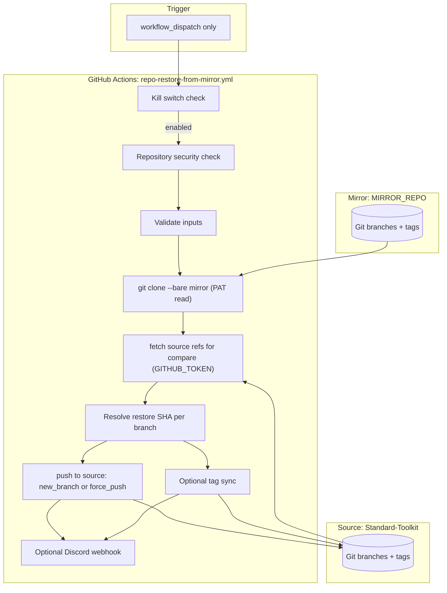

# Repository Restore from Mirror Workflow

## Quick Reference

- Workflow file: [`.github/workflows/repo-restore-from-mirror.yml`](https://github.com/Krypton-Suite/Standard-Toolkit/tree/master/.github/workflows/repo-restore-from-mirror.yml)
- Workflow name (Actions UI): **Repository Restore from Mirror**
- Triggers: **`workflow_dispatch` only** (manual)
- Runner: `ubuntu-latest`
- Permissions: `contents: write` (source pushes via `${{ github.token }}`); mirror read uses `MIRROR_REPO_TOKEN` PAT via Git credential helper

Developer documentation for the **Repository Restore from Mirror** GitHub Actions workflow.

| Item | Value |
|------|-------|
| Workflow file | [`.github/workflows/repo-restore-from-mirror.yml`](https://github.com/Krypton-Suite/Standard-Toolkit/tree/master/.github/workflows/repo-restore-from-mirror.yml) |
| Workflow name (Actions UI) | **Repository Restore from Mirror** |
| Source repository | `Krypton-Suite/Standard-Toolkit` (hard-coded security check) |
| Data source | Configured `MIRROR_REPO` (separate GitHub repository) |
| Runner | `ubuntu-latest` |
| Default mode | **Dry run** (`dry_run: true`) |

**Umbrella documentation** (all backup layers, playbooks, architecture): [Repository backup and restore](RepositoryBackupAndRestore.md)

---

## Table of contents

1. [Purpose](#purpose)
2. [What is restored (and what is not)](#what-is-restored-and-what-is-not)
3. [How it differs from other backup workflows](#how-it-differs-from-other-backup-workflows)
4. [Architecture overview](#architecture-overview)
5. [Triggers and manual dispatch inputs](#triggers-and-manual-dispatch-inputs)
6. [Deployment requirements](#deployment-requirements)
7. [Configuration reference](#configuration-reference)
8. [Initial setup and prerequisites](#initial-setup-and-prerequisites)
9. [PAT requirements for restore](#pat-requirements-for-restore)
10. [Execution flow (step by step)](#execution-flow-step-by-step)
11. [Restore modes](#restore-modes)
12. [Point-in-time restore](#point-in-time-restore)
13. [Testing and dry run](#testing-and-dry-run)
14. [Branch and tag behaviour](#branch-and-tag-behaviour)
15. [Security model](#security-model)
16. [Kill switch](#kill-switch)
17. [Discord notifications](#discord-notifications)
18. [Concurrency and performance](#concurrency-and-performance)
19. [Operational procedures](#operational-procedures)
20. [Troubleshooting](#troubleshooting)
21. [Limitations and design decisions](#limitations-and-design-decisions)
22. [Maintaining and extending the workflow](#maintaining-and-extending-the-workflow)

---

## Purpose

The Repository Restore from Mirror workflow copies selected **Git branch tips** (and optionally **tags**) from the configured **mirror repository** back into `Krypton-Suite/Standard-Toolkit`.

Typical use cases:

- **Disaster recovery** — source branch tips were corrupted, force-pushed incorrectly, or deleted; mirror still holds good history.
- **Branch rollback** — return a release line (e.g. `alpha`, `V105-LTS`) to a known-good commit without losing objects in the mirror.
- **Point-in-time recovery** — restore each branch to the latest commit at or before a UTC date, using full Git history retained on the mirror.
- **Safe preview** — create `restore/…` branches for PR review before promoting recovered state to live branches.

This workflow is the **inverse** of [Repository Mirror](RepositoryMirror.md) (source → mirror). It does **not** run automatically; every invocation is intentional and manual.

Introduced as part of [#3591](https://github.com/Krypton-Suite/Standard-Toolkit/issues/3591).

---

## What is restored (and what is not)

### Restored

| Git object | Default behaviour |
|------------|-------------------|
| Configured branch tips | Yes — via `new_branch` or `force_push` |
| Branch history up to target commit | Yes — objects already present on mirror are pushed by reference |
| Tags | Only when `sync_tags` input is `true` (off by default) |

Default branch set (when `branches` input and `MIRROR_BRANCHES` are empty):

```
master
gold
canary
alpha
V105-LTS
V85-LTS
```

### Not restored

- Pull requests, issues, GitHub Releases metadata, wiki, repository settings
- Branches **not** in the restore list (unchanged on source)
- Source-only tags when `sync_tags` is `false` (default)
- Source-only tags with names not present on mirror when `sync_tags` is `true` (mirror tags are force-pushed; source-only tag names are not deleted)
- File snapshots from [Alpha Backup Sync](../AlphaBackupSync.md) dated directories (those exclude `.git`)
- Commits never mirrored or garbage-collected on the mirror

---

## How it differs from other backup workflows

| Aspect | Repository Mirror | **Repository Restore** | Alpha Backup Sync |
|--------|-------------------|------------------------|-------------------|
| Direction | Source → mirror | **Mirror → source** | `alpha` → `alpha-backup` (+ optional file dump) |
| Trigger | Push, schedule, manual | **Manual only** | Schedule, manual |
| Git history | Full on mirror | Full from mirror | Full on `alpha-backup`; file dump has **no** `.git` |
| Default safety | Dry run on manual mirror only | **Dry run default on every run** | PR-based merge |
| Writes to source | No | **Yes** (`contents: write`) | Yes (PR merge) |

Use **Repository Restore** when the **mirror** is the authoritative recovery source. Use **Repository Mirror** to refresh the mirror after source is corrected. Use **Alpha Backup Sync** for in-repo `alpha-backup` or dated **file** snapshots.

See [Repository backup and restore](RepositoryBackupAndRestore.md) for disaster recovery playbooks.

---

## Architecture overview



**Authentication split:**

- **Read mirror:** `MIRROR_REPO_TOKEN` (PAT; read access sufficient).
- **Write source:** `${{ github.token }}` as `SOURCE_REPO_TOKEN` (workflow permission `contents: write`).

Both tokens use the same temporary **credential helper** pattern as [Repository Mirror](RepositoryMirror.md). Remote URLs are not token-embedded.

The workflow bare-clones the **mirror**, fetches source branch tips for comparison, then pushes selected commits to the source remote.

---

## Triggers and manual dispatch inputs

| Trigger | When it runs |
|---------|--------------|
| `workflow_dispatch` | **Only** — manual run from Actions tab |

There is **no** `schedule` or `push` trigger. Restore never runs unattended.

### Manual dispatch inputs

| Input | Type | Default | Description |
|-------|------|---------|-------------|
| `dry_run` | boolean | **`true`** | Preview SHAs and planned actions; **no pushes** |
| `restore_mode` | choice | `new_branch` | `new_branch` or `force_push` — **ignored when `dry_run` is true** |
| `branches` | string | *(empty)* | Comma-separated branch list; empty uses `MIRROR_BRANCHES` or workflow defaults |
| `restore_date` | string | *(empty)* | UTC date/time for point-in-time restore; empty = current mirror tips |
| `commit_sha` | string | *(empty)* | Exact commit (single branch only; overrides `restore_date`) |
| `sync_tags` | boolean | `false` | Force-push all mirror tags to source |
| `force_push_confirmation` | string | *(empty)* | Must be exactly **`RESTORE`** when `restore_mode` is `force_push` and `dry_run` is false |
| `new_branch_prefix` | string | `restore/` | Prefix for branches created in `new_branch` mode |

---

## Deployment requirements

### Workflow file location

Unlike scheduled mirror runs, restore **does not** depend on the default branch for registration — `workflow_dispatch` is available whenever the workflow file exists on the branch selected in the Actions UI (typically `master`).

**Recommendation:** Merge `repo-restore-from-mirror.yml` to **`master`** so maintainers can run it from the default branch without switching branches in the UI.

### Prerequisites

1. [Repository Mirror](RepositoryMirror.md) has successfully populated `MIRROR_REPO` at least once.
2. `MIRROR_REPO` and `MIRROR_REPO_TOKEN` are configured on Standard-Toolkit.
3. Mirror contains the branch(es) you intend to restore.

Running restore against an empty or stale mirror produces missing-branch errors or unchanged/no-op results.

---

## Configuration reference

Configuration is stored on **Standard-Toolkit** under **Settings → Secrets and variables → Actions**.

### Required (shared with Repository Mirror)

| Name | Type | Description |
|------|------|-------------|
| `MIRROR_REPO` | **Variable** | Mirror repository as `owner/repo` (URL normalized automatically) |
| `MIRROR_REPO_TOKEN` | **Secret** | PAT with **read** access to the mirror (Contents read is sufficient) |

### Optional

| Name | Type | Default | Description |
|------|------|---------|-------------|
| `MIRROR_BRANCHES` | **Variable** | Six default branches | Comma-separated list used when workflow `branches` input is empty |
| `REPO_RESTORE_DISABLED` | **Variable** | Restore **enabled** | Set to `true` to disable without deleting the YAML file |
| `DISCORD_WEBHOOK_RESTORE` | **Secret** | No notifications | Discord webhook for restore run summaries |

Per-run behaviour (dry run, mode, date, etc.) is controlled by **workflow dispatch inputs**, not repository variables.

---

## Initial setup and prerequisites

### 1. Confirm mirror is operational

Follow [Repository Mirror — Initial setup guide](RepositoryMirror.md#initial-setup-guide). Verify at least one successful mirror run against production or test mirror.

### 2. Verify configuration on Standard-Toolkit

| Setting | Required for restore |
|---------|---------------------|
| `MIRROR_REPO` | Yes |
| `MIRROR_REPO_TOKEN` | Yes (read on mirror) |

The same PAT used for mirror **write** also works for restore **read**. You may use a separate read-only PAT for least privilege.

### 3. First restore: always dry run

1. **Actions → Repository Restore from Mirror → Run workflow**
2. Leave **`dry_run`** enabled (default)
3. Set **`branches`** to one branch (e.g. `alpha`)
4. Review log output: `Restore SHAs` vs `Source SHAs`, planned `restore/…` branch names

### 4. Apply restore via `new_branch`

1. Re-run with `dry_run: false`, `restore_mode: new_branch`
2. Open a PR from the created `restore/…` branch to the live branch
3. Review diff; merge after approval
4. Optionally run **Repository Mirror** to re-sync mirror from corrected source

---

## PAT requirements for restore

### Fine-grained PAT (recommended for read-only restore)

1. **Repository access:** mirror repository only.
2. **Contents:** Read (write **not** required for restore).

### Classic PAT

Scope **`repo`** (or `public_repo` for public mirror) with access to the mirror repository.

### Rotation

When rotating `MIRROR_REPO_TOKEN`:

1. Update secret on Standard-Toolkit.
2. Run restore **dry run** to confirm mirror clone succeeds.
3. Mirror workflow continues to need **write** if the same token serves both workflows — prefer separate tokens if splitting read/write.

---

## Execution flow (step by step)

### Job: `restore`

**Concurrency:** group `repo-restore`, `cancel-in-progress: false`.

#### Step 1 — Kill switch check

Reads `vars.REPO_RESTORE_DISABLED`. If exactly `true`, skips all subsequent steps.

#### Step 2 — Security: verify repository

Fails if `GITHUB_REPOSITORY` is not `Krypton-Suite/Standard-Toolkit`.

#### Step 3 — Validate restore inputs

- **`force_push`:** requires `force_push_confirmation == RESTORE` when `dry_run` is false.
- **`commit_sha`:** must match `[0-9a-fA-F]{7,40}`; exactly **one** branch in scope.
- **`restore_date`:** validated with `date -u -d` when set.
- **`new_branch_prefix`:** non-empty, no spaces.

#### Step 4 — Restore branches from mirror repository

1. Validates `MIRROR_REPO`, `MIRROR_REPO_TOKEN`, `SOURCE_REPO_TOKEN`.
2. Normalizes and validates `MIRROR_REPO`; rejects mirror == source.
3. Builds branch list from input, `MIRROR_BRANCHES`, or defaults.
4. Bare-clones **mirror** with `MIRROR_REPO_TOKEN`.
5. Fetches source `refs/heads/*` into `refs/remotes/source/*` for comparison.
6. For each branch:
   - Fail if branch missing on mirror (`missing_branches`).
   - Resolve [restore SHA](#point-in-time-restore).
   - Compare to source tip; skip if equal (`unchanged_branches`).
   - **Dry run:** log planned `restore/…` or force-push.
   - **`new_branch`:** push `restore_sha` to `refs/heads/<prefix><branch>-<suffix>`.
   - **`force_push`:** push `--force` `restore_sha` to `refs/heads/<branch>`.
7. If `sync_tags`: force-push `refs/tags/*` from mirror to source (or log in dry run).
8. Write job outputs; fail on missing branches, push failures, or tag sync failure.

#### Step 5 — Discord notification

Runs when kill switch passed and restore step was not skipped. No-op if `DISCORD_WEBHOOK_RESTORE` unset.

---

## Restore modes

### `new_branch` (recommended)

Creates a **new branch** on the source; does not move the live branch tip.

| Suffix in branch name | When used |
|-----------------------|-----------|
| `-tip` | Current mirror tip, no `restore_date` |
| `-2025-06-01` (sanitized date) | `restore_date` set |
| `-a1b2c3d` | `commit_sha` set (7-char prefix) |

Example: `restore/alpha-2025-06-01` pointing at resolved commit.

**Follow-up:** open PR → review → merge to promote recovered state.

### `force_push` (destructive)

Overwrites the existing branch ref on the source with the resolved commit.

**Requirements:**

- `dry_run: false`
- `force_push_confirmation: RESTORE` (exact match, case-sensitive)

**Risks:**

- Branch protection may reject the push.
- Team members with local clones see history divergence.
- Commits only on the old tip may become unreachable from the branch (objects may remain in repo until GC).

---

## Point-in-time restore

### Resolution order (per branch)

1. **`commit_sha`** (if set) — must exist on mirror and be ancestor of mirror branch.
2. Else **`restore_date`** — `git rev-list -1 --before="<date>" refs/heads/<branch>`.
3. Else **mirror branch tip** — `git rev-parse refs/heads/<branch>`.

If both `restore_date` and `commit_sha` are set, **`commit_sha` wins** (notice logged).

### `restore_date` examples

| Input | Interpretation |
|-------|----------------|
| `2025-06-01` | Latest commit on branch before that UTC calendar date (via `date -u -d`) |
| `2025-06-01 14:30:00` | Latest commit strictly before that UTC timestamp |

There may be **no commit** at your exact wall-clock instant — Git returns the nearest ancestor on that branch.

### `commit_sha` constraints

- Allowed only when restoring **one** branch (explicit `branches` input with one name, or implied single branch when using `commit_sha` validation path).
- Commit must be reachable from the mirror branch: `git merge-base --is-ancestor`.

### History availability

Point-in-time restore requires the commit to still exist in the **mirror** clone. If the mirror synced a bad force-push from source, use an **older** `restore_date` or a known-good `commit_sha` still reachable on the mirror.

---

## Testing and dry run

### Recommended test flow

1. Ensure mirror is current ([Repository Mirror](RepositoryMirror.md) dry run or successful sync).
2. **Actions → Repository Restore from Mirror → Run workflow**
3. Leave **`dry_run`** enabled
4. Set **`branches`** to `alpha` (or another low-risk branch)
5. Review logs:
   - `Would create branch 'restore/…'` or `Would force-push branch '…'`
   - `Restore SHAs:` and `Source SHAs:` lines
   - `Unchanged branches:` if already in sync
6. Optionally set **`restore_date`** and re-run dry run to verify resolved SHAs.
7. Apply with `dry_run: false`, `restore_mode: new_branch`
8. Verify new branch on GitHub; open test PR

### Verification checklist

| Scenario | How to test | Expected result |
|----------|-------------|-----------------|
| Happy path dry run | Default inputs + one branch | Success; SHAs logged; no pushes |
| Already in sync | Mirror matches source | `unchanged_branches` listed |
| Point-in-time | `restore_date` in dry run | Resolved SHA at or before date |
| Exact commit | `commit_sha` + single branch | SHA validated as ancestor |
| Missing mirror branch | Invalid branch name | **Fail** — missing on mirror |
| Force push without confirm | `force_push`, empty confirmation | **Fail** before clone |
| Bad commit SHA | Invalid hex or wrong branch | **Fail** — validation error |
| Tag sync preview | `sync_tags: true`, dry run | `Would sync N tag(s)` |

### What dry run does not do

- Does not verify branch protection would allow a real force-push.
- Does not create branches or modify tags on source.

---

## Branch and tag behaviour

### Unchanged branches

When source tip SHA equals resolved restore SHA, the branch is listed under **unchanged** and no push occurs.

### Missing branches

If a configured branch does not exist on the mirror, the run **fails** after processing (all missing names reported).

### Tag sync (`sync_tags: true`)

- Force-pushes all tags from mirror bare clone to source: `git push --force source refs/tags/*:refs/tags/*`
- Does **not** delete source-only tags absent on mirror
- Default is **off** — enable only when tag recovery is explicitly required

---

## Security model

| Concern | Mitigation |
|---------|------------|
| Unauthorized execution on forks | Hard-coded repo name check |
| Accidental production overwrite | **Dry run default**; `force_push` requires typing `RESTORE` |
| Over-broad PAT | Mirror PAT needs read-only for restore; source writes use scoped `GITHUB_TOKEN` |
| Secret exposure | Credential helper; GitHub secret masking |
| Unattended restore | No schedule/push triggers |
| Emergency disable | `REPO_RESTORE_DISABLED=true` kill switch |

Consider GitHub **Environment protection rules** on a future `production-restore` environment if org policy requires approvers before destructive runs.

---

## Kill switch

| Variable | Value | Effect |
|----------|-------|--------|
| `REPO_RESTORE_DISABLED` | `true` | Workflow exits after kill switch; no clone, no push, no Discord |
| `REPO_RESTORE_DISABLED` | unset, `false`, or other | Normal operation |

Documented in [Kill Switches](../Build%20System/KillSwitches.md).

---

## Discord notifications

When `DISCORD_WEBHOOK_RESTORE` is configured, each completed run sends one embed:

| Field | Content |
|-------|---------|
| Title | Dry run OK, completed, or failed |
| Mirror | `MIRROR_REPO` |
| Target | Current tips, `restore_date`, or `commit_sha` |
| Mode | Dry run / `new_branch` / `force_push` |
| Branches | Restored / would restore / created / unchanged / failed / missing |
| SHAs | `restore_shas` output |
| Tags | Sync status or would-sync flag |
| Link | Workflow run URL |

---

## Concurrency and performance

- Bare clone of mirror fetches **full history** (not shallow) — large mirrors may take several minutes.
- Only configured branches are processed; tag sync pushes all tags in one wildcard operation when enabled.
- Concurrent manual runs queue (`cancel-in-progress: false`) to avoid overlapping pushes to the same refs.

---

## Operational procedures

### Standard safe restore

See [Repository backup and restore — Operational procedures](RepositoryBackupAndRestore.md#operational-procedures).

### Compare mirror vs source before restore

```cmd
git ls-remote https://github.com/Krypton-Suite/Standard-Toolkit-Mirror.git refs/heads/alpha
git ls-remote https://github.com/Krypton-Suite/Standard-Toolkit.git refs/heads/alpha
```

After dry run, compare logged `Restore SHAs` / `Source SHAs`.

### Promote `restore/…` branch via PR

1. Complete `new_branch` restore.
2. **Compare & pull request** from `restore/alpha-…` into `alpha`.
3. Review file and history diff.
4. Merge when approved.

### After source is corrected

Run **Repository Mirror** manually so off-site mirror matches corrected source.

### Temporarily disable restore

Set `REPO_RESTORE_DISABLED=true`.

---

## Troubleshooting

| Symptom | Likely cause | Action |
|---------|--------------|--------|
| Restore job skipped | `REPO_RESTORE_DISABLED=true` | Set to `false` or delete variable |
| `MIRROR_REPO and MIRROR_REPO_TOKEN must both be configured` | Missing config | Set on Standard-Toolkit |
| `force_push mode requires typing RESTORE` | Confirmation missing/wrong | Re-run with exact string `RESTORE` |
| `commit_sha may only be used when restoring a single branch` | Multiple branches with `commit_sha` | Set one branch in `branches` input |
| `Branch does not exist on the mirror` | Never mirrored or typo | Run mirror; fix branch name |
| `No commit found … at or before restore_date` | Date before branch existed | Use earlier branch creation or `commit_sha` |
| `commit_sha … is not reachable from mirror branch` | SHA on wrong branch | Verify SHA on mirror branch history |
| Force-push failed | Branch protection on **source** | Use `new_branch` + PR or adjust protection |
| `Branch already matches mirror restore target` | No drift | Expected; pick different date or skip |
| Tag sync failed | Permissions or tag conflict | Check `contents: write`; resolve tag collisions |
| Restored wrong content | Stale mirror | Run mirror from good source first, or use `restore_date` |

### Branch protection on the source

`new_branch` mode usually succeeds because it creates **new** refs. `force_push` may fail on protected branches (`master`, release lines). Prefer PR-based promotion.

---

## Limitations and design decisions

1. **Manual only** — no unattended restore to source.
2. **Dry run default** — reduces accidental overwrite risk.
3. **Mirror as source of truth** — cannot restore what the mirror never received.
4. **Per-branch restore** — no single atomic “whole repo at date X” snapshot.
5. **No source ref deletion** — restore adds/overwrites listed branches; does not prune extra source branches or tags (except tag overwrite by name when syncing).
6. **Shared `MIRROR_REPO` config** — same variable as mirror workflow; simplifies ops but couples configuration.
7. **`commit_sha` single-branch rule** — prevents ambiguous multi-branch pin to one object.
8. **Hard-coded source repo** — intentional guard rail for forks.

---

## Maintaining and extending the workflow

### Files to edit

| Change | Location |
|--------|----------|
| Default branch list | `repo-restore-from-mirror.yml` — shell array and docs |
| Allowed source repo | Security verify step |
| Input defaults | `on.workflow_dispatch.inputs` |
| Discord payload | Discord notification step |
| Validation rules | Validate restore inputs step |

### Suggested enhancements (not implemented)

- GitHub Environment with required reviewers for `force_push`
- Post-push SHA verification against expected restore SHA
- Optional PR auto-creation from `restore/…` branch
- Matrix strategy per branch for isolated failure reporting
- Separate read-only mirror PAT variable (`MIRROR_REPO_READ_TOKEN`)

When modifying the workflow, keep header comments in `repo-restore-from-mirror.yml` in sync with this document.

---

## Related documentation

- [Repository backup and restore](RepositoryBackupAndRestore.md) — architecture, playbooks, configuration tables
- [Repository Mirror](RepositoryMirror.md) — source → mirror sync
- [Alpha Backup Sync](../AlphaBackupSync.md) — `alpha-backup` and dated file snapshots
- [.github/REPOSITORY_BACKUP.md](https://github.com/Krypton-Suite/Standard-Toolkit/tree/master/.github/REPOSITORY_BACKUP.md) — cheat sheet
- [Kill Switches](../Build%20System/KillSwitches.md) — `REPO_RESTORE_DISABLED`
- [GitHub Workflow Index](../GitHubWorkflowIndex.md) — all workflow documentation

---

*Last updated to match `repo-restore-from-mirror.yml` as of [#3591](https://github.com/Krypton-Suite/Standard-Toolkit/issues/3591) (2026).*
