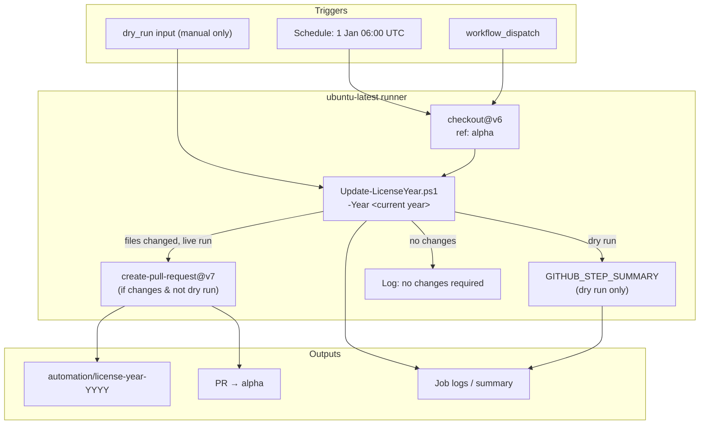

# License header year automation

Developer documentation for the automated license end-year update feature introduced to keep Krypton Suite source file headers aligned with the current calendar year.

---

## Table of contents

1. [Overview](#overview)
2. [Background: license headers in this repository](#background-license-headers-in-this-repository)
3. [Architecture](#architecture)
4. [Components](#components)
5. [Matching rules](#matching-rules)
6. [File scope](#file-scope)
7. [Update algorithm](#update-algorithm)
8. [Encoding and line endings](#encoding-and-line-endings)
9. [GitHub Actions workflow](#github-actions-workflow)
10. [Dry run mode](#dry-run-mode)
11. [Pull request behaviour](#pull-request-behaviour)
12. [Local development](#local-development)
13. [Maintaining headers in new and existing files](#maintaining-headers-in-new-and-existing-files)
14. [What this automation does not update](#what-this-automation-does-not-update)
15. [Operational runbook](#operational-runbook)
16. [Troubleshooting](#troubleshooting)
17. [Extending or modifying the automation](#extending-or-modifying-the-automation)
18. [Security and permissions](#security-and-permissions)
19. [FAQ](#faq)

---

## Overview

The Krypton Standard Toolkit repository carries BSD 3-Clause license headers on most source files. The **modifications** line records when ongoing Krypton Suite work began and the last year in which the file was maintained, using a range such as `2017 - 2026`.

Each January (and on demand), maintainers previously had to update thousands of file headers manually. The **Update License Year** automation:

1. Checks out the `alpha` branch.
2. Scans the repository for eligible files.
3. Updates the **end year** on lines containing `Modifications by Peter Wagner` when that year is behind the current calendar year.
4. Opens a pull request back into `alpha` for review and merge.

The automation is intentionally conservative: it only changes the end year, never the start year, and only on lines that match the Krypton modifications attribution pattern.

### Related files

| File | Purpose |
| --- | --- |
| `.github/workflows/update-license-year.yml` | GitHub Actions workflow definition |
| `.github/scripts/Update-LicenseYear.ps1` | PowerShell implementation |
| `.github/update-license-year-pr.md` | Short PR description template for the initial feature PR |

---

## Background: license headers in this repository

Krypton source files typically use a `#region BSD License` block at the top of the file. There are two historical attribution layers:

### 1. Original Component Factory attribution (unchanged)

Historical files retain the original Component Factory Pty Ltd notice, for example:

```text
© Component Factory Pty Ltd, 2006 - 2016, (Version 4.5.0.0) All rights reserved.
```

This range is **fixed** and must **not** be updated by the automation.

### 2. Krypton Suite modifications attribution (updated)

Ongoing Krypton Suite work is attributed on a separate line, for example:

```text
Modifications by Peter Wagner (aka Wagnerp), Simon Coghlan (aka Smurf-IV), Giduac & Ahmed Abdelhameed et al. 2017 - 2026. All rights reserved.
```

The automation targets **only** this line (and close variants). The start year (`2017`, `2021`, `2024`, `2026`, etc.) reflects when the file was first created or first received Krypton modifications. The end year should reflect the current maintenance period.

### Header variants in the wild

The repository has evolved over many years, so wording is not identical everywhere. All of the following are handled, provided the line contains `Modifications by Peter Wagner` and a four-digit year range:

| Variant | Example end-year format |
| --- | --- |
| Full multi-contributor block comment | `... et al. 2017 - 2026. All rights reserved.` |
| Shorter TestForm-style header | `... et al. 2024 - 2026. All rights reserved.` |
| YAML comment prefix | `# Modifications by ... 2025 - 2026. All rights reserved.` |
| `.editorconfig` escaped template | `... et al. 2026 - 2026. All rights reserved.` inside `file_header_template` |
| Embedded seed text in `.cs` string literals | `... 2017 - 2026. All rights reserved.` inside a `@"..."` block |

Separator spacing around the dash is preserved (` - ` vs `-`).

### Parallel header maintenance mechanisms

Headers are maintained through several complementary mechanisms:

| Mechanism | Location | Role |
| --- | --- | --- |
| Per-file `#region BSD License` blocks | `*.cs` and related source | Canonical in-file notice |
| `.licenseheader` project templates | e.g. `Krypton.Toolkit.licenseheader` | IDE tooling for new files |
| `.editorconfig` `file_header_template` | `Source/Current/.editorconfig`, `Source/Testing/.editorconfig` | Visual Studio / analyzer file-header insertion |
| Runtime interpolated strings | `GlobalStaticValues.cs`, `KryptonCustomPaletteBase.cs` | UI seed text using `DateTime.Now.Year` |

The automation updates static text in the first three categories. Runtime-interpolated strings are already dynamic and are out of scope.

---

## Architecture



### Design principles

1. **Branch from `alpha`, merge to `alpha`** — active development for the toolkit flows through `alpha`; the automation never commits directly to protected branches.
2. **Pull request, not direct push** — even scheduled runs produce a reviewable PR rather than silent commits.
3. **Idempotent updates** — re-running when headers are already current is a no-op.
4. **Minimal diff** — only the end year changes; contributor names, punctuation, and separator spacing are preserved.
5. **Safe matching** — unrelated copyright lines (Component Factory, third-party JDH Software, etc.) are excluded by the match predicate.

---

## Components

### `.github/workflows/update-license-year.yml`

GitHub Actions workflow named **Update License Year**.

**Triggers:**

| Trigger | `dry_run` | Behaviour |
| --- | --- | --- |
| `schedule` (`0 6 1 1 *`) | n/a (always live) | Updates files and opens PR if needed |
| `workflow_dispatch` | `false` (default) | Updates files and opens PR if needed |
| `workflow_dispatch` | `true` | Previews changes only; no writes, no PR |

**Permissions:**

- `contents: write` — required to push the automation branch and commit changes via `create-pull-request`.
- `pull-requests: write` — required to open the PR.

**Runner:** `ubuntu-latest` with PowerShell 7 (`pwsh`).

### `.github/scripts/Update-LicenseYear.ps1`

Standalone PowerShell 7 script usable locally or in CI.

**Parameters:**

| Parameter | Type | Default | Description |
| --- | --- | --- | --- |
| `-Year` | `int` | `(Get-Date).Year` | Target end year |
| `-DryRun` | `switch` | off | List affected files without writing |

**Exit output:** writes the count of affected files to stdout (captured by the workflow as `updated_files`).

**Repository root resolution:**

- Uses `$env:GITHUB_WORKSPACE` when running in Actions.
- Falls back to `(Get-Location).Path` for local runs.

---

## Matching rules

### Regular expression

```powershell
'(Modifications by Peter Wagner[^\r\n]*?)(\d{4})(\s*-\s*)(\d{4})'
```

| Capture group | Content | Example |
| --- | --- | --- |
| 1 | Prefix through start of year range | `Modifications by Peter Wagner ... et al. ` |
| 2 | Start year | `2017` |
| 3 | Separator (spaces + dash + spaces) | ` - ` |
| 4 | End year | `2025` |

### Replacement logic

For each match on a given line:

```
if endYear >= targetYear:
    leave unchanged
else:
    replace endYear with targetYear
```

### Examples

| Input range | Target year | Output range | Notes |
| --- | --- | --- | --- |
| `2025 - 2025` | 2026 | `2025 - 2026` | Common for files created in the prior year |
| `2017 - 2025` | 2026 | `2017 - 2026` | Bulk of legacy toolkit files |
| `2017 - 2026` | 2026 | `2017 - 2026` | Already current |
| `2026 - 2026` | 2027 | `2026 - 2027` | Next calendar year rollover |
| `2006 - 2016` | any | unchanged | No `Modifications by Peter Wagner` on line |
| `2013-2021` (JDH) | any | unchanged | Third-party header; different pattern |

### Multiple matches per file

If a file contains more than one matching line (for example, a header block **and** an embedded string literal with the same attribution), **all** matching lines in that file are updated in a single pass.

---

## File scope

### Included extensions

| Extension / name | Typical use |
| --- | --- |
| `.cs` | C# source, designers, global usings |
| `.licenseheader` | Project license header templates |
| `.yml`, `.yaml` | GitHub workflows, issue templates |
| `.md` | Documentation with header comments |
| `.editorconfig` | `file_header_template` year range |

### Excluded paths

Files under these directory segments are skipped:

- `bin/`
- `obj/`
- `Artefacts/`
- `.git/`

### Not scanned

The following are intentionally **not** in scope today:

| Pattern | Reason |
| --- | --- |
| `*.csproj`, `*.sln`, `*.resx` | No standard modifications header |
| `LICENSE` (repo root) | Uses `Copyright (c) YYYY - YYYY` without the modifications line |
| `Documents/License/License.md` | Same as above; update manually if required |
| Binary and generated artefacts | Excluded by path rules |

If new file types adopt the modifications header pattern, add their extension to the `$extensions` set in `Update-LicenseYear.ps1`.

---

## Update algorithm

High-level steps executed by `Update-LicenseYear.ps1`:

1. Resolve repository root.
2. Recursively enumerate all files under the root.
3. For each file:
   1. Skip if path matches an excluded segment.
   2. Skip if extension is not in the allow-list (unless the file is named `.editorconfig`).
   3. Read raw bytes from disk.
   4. Detect UTF-8 BOM presence and decode content accordingly.
   5. Apply regex replacement across the full file content.
   6. If content unchanged, continue to next file.
   7. If `-DryRun`, log `Would update: <relative-path>` and continue without writing.
   8. Otherwise, encode and write bytes back, preserving BOM state.
4. Emit summary and return the count of affected files.

The script processes the **entire repository tree** under the checkout root, including `Source/Current`, `Source/Testing`, `Scripts/`, `.github/`, and `Documents/` when matching files exist there.

---

## Encoding and line endings

The Krypton repository standard (see `AGENTS.md` and `Source/*/.editorconfig`) is **UTF-8 with BOM** and **CRLF** line endings for C# source.

The script is encoding-aware:

1. **BOM detection** — if the file begins with `EF BB BF`, it is treated as UTF-8 with BOM and the BOM is preserved on write.
2. **No BOM** — files without a BOM are written back without adding one.
3. **Line endings** — content is decoded and re-encoded as a single string; existing `\r\n` or `\n` sequences in the file are not normalised. The automation does not force CRLF conversion.

This avoids the common pitfall of Linux CI runners rewriting entire trees to LF or stripping BOMs from WinForms designer files.

---

## GitHub Actions workflow

### Step-by-step execution

#### 1. Checkout alpha

```yaml
uses: actions/checkout@v6
with:
  ref: alpha
  fetch-depth: 0
```

The workflow always works from `alpha`, regardless of which branch contains the workflow definition.

#### 2. Update license header end year

- Determines `$year` from `(Get-Date).Year` on the runner (UTC date on `ubuntu-latest`).
- Parses `dry_run` from `workflow_dispatch` inputs; scheduled runs always perform a live update.
- Invokes `Update-LicenseYear.ps1`.
- Records `year`, `dry_run`, and `updated_files` as step outputs.
- In dry-run mode, writes a markdown summary to `$GITHUB_STEP_SUMMARY`.

#### 3. Create pull request into alpha

Runs only when:

- `dry_run` is not `true`, **and**
- `updated_files` is not `0`.

Uses [`peter-evans/create-pull-request@v7`](https://github.com/peter-evans/create-pull-request) with:

| Setting | Value |
| --- | --- |
| `base` | `alpha` |
| `branch` | `automation/license-year-YYYY` |
| `delete-branch` | `true` (branch removed after merge) |

If a PR from the same branch already exists, the action updates it with new commits.

#### 4. No changes required

Logs an informational message when `updated_files` is `0`, distinguishing dry-run vs live wording.

---

## Dry run mode

Dry run is available **only** via manual `workflow_dispatch`. Scheduled January runs always apply changes.

### GitHub UI

1. Open **Actions → Update License Year**.
2. Click **Run workflow**.
3. Enable **Preview changes without modifying files or creating a PR**.
4. Run.

### What to expect

| Artifact | Content |
| --- | --- |
| Job log | One `Would update: <path>` line per affected file |
| Job summary | Target year and total file count |
| Repository | Unchanged — no branch, commit, or PR |

### When to use dry run

- After merging workflow changes, to validate matching rules before the first live run.
- Before 1 January, to estimate PR size for the upcoming annual update.
- After modifying the regex or extension list, to verify scope.

---

## Pull request behaviour

### Branch naming

```
automation/license-year-2026
```

The year suffix matches the target end year applied by the script.

### PR title and commit message

```
chore: update license header end year to 2026
Update license header end year to 2026
```

### PR body (automated)

The generated PR body includes:

- Target year
- Number of files updated
- Note that it was triggered by the Update License Year workflow

### Review guidance

Automated license PRs are mechanically simple but can be large. Recommended review approach:

1. Confirm the diff only touches year digits on `Modifications by Peter Wagner` lines.
2. Spot-check `.licenseheader` and `.editorconfig` templates — these affect **new** files created by IDE tooling.
3. Verify no unexpected paths appear (if they do, refine exclusions or the regex).
4. Merge into `alpha` before the next development sprint if the run was triggered on 1 January.

### Re-running after merge

Once all headers show the current end year, subsequent runs (dry or live) report zero changes and do not open a new PR.

---

## Local development

### Prerequisites

- [PowerShell 7+](https://learn.microsoft.com/powershell/scripting/install/installing-powershell) (`pwsh`)

### Preview changes (recommended)

From the repository root:

```powershell
pwsh -File .github/scripts/Update-LicenseYear.ps1 -Year 2026 -DryRun
```

### Apply changes locally

```powershell
pwsh -File .github/scripts/Update-LicenseYear.ps1 -Year 2026
```

Review with `git diff` before committing. Local application is useful when testing regex changes; production updates should normally flow through the GitHub workflow and PR process.

### Target a specific year

```powershell
pwsh -File .github/scripts/Update-LicenseYear.ps1 -Year 2027 -DryRun
```

Useful when validating next-year rollover logic before 31 December.

---

## Maintaining headers in new and existing files

### Adding a new C# file

1. Use the IDE file-header command (documented in `.editorconfig`):

   > Visual Studio: `Ctrl+.` on first line → **Add file header**, or **Fix all in Solution**.

2. Or copy the `#region BSD License` block from a sibling file in the same project.

3. Set the **start year** to the file creation year. The **end year** should be the current calendar year.

4. Ensure the modifications line includes `Modifications by Peter Wagner` so future automation picks it up.

### Updating project templates

When the annual PR merges, verify these templates were included:

- `Source/*/Krypton Components/*/*.licenseheader`
- `Source/Current/.editorconfig` → `file_header_template`
- `Source/Testing/.editorconfig` → `file_header_template`

If template files lag behind, new files created via IDE tooling may receive an outdated end year until the next automation run.

### Manual mid-year updates

Developers may set the end year to the current year when making substantial edits to a file. This is optional but keeps headers accurate between annual runs. The automation will skip files already at or beyond the target year.

---

## What this automation does not update

| Item | Why |
| --- | --- |
| Component Factory `2006 - 2016` lines | Different attribution; historically fixed |
| JDH Software `Copyright (C) 2013-2021` | Third-party code; different format |
| `GlobalStaticValues.DEFAULT_*_SEED_TEXT` | Uses `{DateTime.Now.Year}` at runtime |
| `KryptonCustomPaletteBase` export strings | Uses `{DateTime.Now.Year}` at runtime |
| Root `LICENSE` and `Documents/License/License.md` | `Copyright (c)` format without modifications line |
| `ViewLayoutMonths.cs` `DateTime.Now.Year` | Unrelated calendar UI logic |

If the root `LICENSE` or `License.md` copyright range must track the calendar year, that remains a **manual** maintainer task unless the regex scope is deliberately extended.

---

## Operational runbook

### Annual process (automatic)

| When | What happens |
| --- | --- |
| 1 Jan, 06:00 UTC | Scheduled workflow runs on `alpha` |
| After workflow completes | Review PR `automation/license-year-YYYY` |
| Within first week of year | Merge PR into `alpha` |

### Annual process (manual fallback)

If the scheduled run fails or is disabled:

1. Run **Update License Year** manually (`dry_run: false`).
2. Review and merge the resulting PR.

### Pre-year checklist (optional, December)

1. Run dry run on `alpha`.
2. Note file count in team channel.
3. Confirm `.editorconfig` `file_header_template` end year in active branches (automation fixes this in the PR).

### Post-merge checklist

- [ ] Automation PR merged into `alpha`
- [ ] Dry run reports `0` files would be updated
- [ ] New file header insertion in Visual Studio shows current end year

---

## Troubleshooting

### Workflow did not open a PR

| Symptom | Likely cause | Action |
| --- | --- | --- |
| Job succeeded, no PR | All headers already current | Expected; check log for `updated_files=0` |
| Job succeeded, no PR | Dry run was enabled | Re-run with dry run disabled |
| Step skipped | `updated_files == 0` | Run locally with `-DryRun` to confirm |

### PR contains unexpected files

| Symptom | Likely cause | Action |
| --- | --- | --- |
| Workflow YAML files changed | YAML headers use `# Modifications by...` | Expected if end year was behind |
| `.md` files changed | Header comment blocks in docs | Expected if matched |
| Build artefact paths | Should not occur | Report bug; verify `bin/`/`obj/` exclusions |

### File not updated but should have been

1. Confirm the line contains the exact substring `Modifications by Peter Wagner`.
2. Confirm the file extension is in the allow-list.
3. Confirm the end year is strictly less than the target year.
4. Confirm the file is not under an excluded path.

### File updated but should not have been

1. Check whether the line incorrectly contains `Modifications by Peter Wagner` in embedded documentation or sample text.
2. If a false positive is found, refine the regex or add a path exclusion and document the exception here.

### PowerShell errors on runner

The script requires PowerShell 7 (`#requires -Version 7.0`). `ubuntu-latest` GitHub-hosted runners include `pwsh`. Self-hosted runners must install PowerShell 7.

### `create-pull-request` permission errors

Ensure workflow permissions grant `contents: write` and `pull-requests: write`. Organisation policies that restrict `GITHUB_TOKEN` may block branch push; consult repository admin settings.

---

## Extending or modifying the automation

### Add a new file extension

Edit `Update-LicenseYear.ps1`:

```powershell
$extensions = [System.Collections.Generic.HashSet[string]]::new(
    [string[]]@('.cs', '.licenseheader', '.yml', '.yaml', '.md', '.your-ext'),
    [StringComparer]::OrdinalIgnoreCase
)
```

Run `-DryRun` and review scope before merging.

### Change the target branch

Update both `checkout.ref` and `create-pull-request.base` in `update-license-year.yml`. Branch naming and documentation should stay aligned.

### Change the schedule

Cron expression in `update-license-year.yml`:

```yaml
- cron: '0 6 1 1 *'   # minute hour day month weekday (UTC)
```

### Tighten the match predicate

To require `All rights reserved` after the year range, extend the regex cautiously and re-run dry run across the full tree — some embedded strings may use different trailing text.

### Add a kill switch

Other workflows in this repository (for example `alpha-backup-sync.yml`) use repository variables as kill switches. The same pattern can be added if maintainers want to disable scheduled runs without removing the workflow file.

---

## Security and permissions

| Topic | Detail |
| --- | --- |
| Token | Default `GITHUB_TOKEN` scoped to the repository |
| Branch access | Writes only to `automation/license-year-*` branches, not directly to `alpha` |
| Fork PRs | Workflow does not run on fork pull requests; it is schedule/dispatch only |
| Script injection | `Year` is derived from the runner clock, not user input; `dry_run` is a boolean GitHub input |
| Review | All changes pass through a normal pull request review process |

---

## FAQ

### Why `alpha` and not `master`?

Active toolkit development for the current major line flows through `alpha`. The automation targets the branch where day-to-day header drift occurs.

### Why only the end year?

The start year records when Krypton modifications to that file began. Changing it would misrepresent file history. The end year communicates ongoing maintenance.

### Will the January run commit directly to `alpha`?

No. It always opens a PR. Maintainers merge after review.

### Can I test the workflow before 1 January?

Yes. Use `workflow_dispatch` with **dry run** enabled, or run the PowerShell script locally with `-DryRun`.

### Does the script run on Windows agents?

The script is cross-platform. The workflow uses `ubuntu-latest` for consistency with other repository workflows.

### What if two maintainers run the live workflow simultaneously?

`create-pull-request` updates an existing open PR on the same branch name rather than creating duplicates.

### Should I update headers in my feature PR?

Optional for the end year if your PR merges before the annual automation PR. Required: include a correctly formatted header on **new** files, with an appropriate start year and a current end year.

---

## See also

- [BSD 3-Clause License](https://github.com/Krypton-Suite/Standard-Toolkit/blob/master/LICENSE)
- [Repository guidelines (`AGENTS.md`)](../AGENTSDeveloperGuide.md) — encoding, line endings, and header conventions
