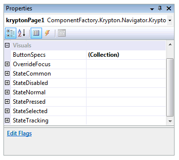
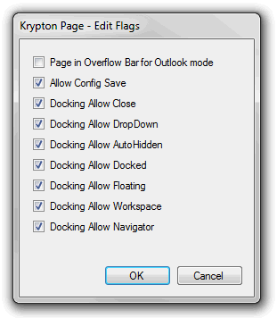

# Docking Flags

## Docking Flags

**Controlling User Actions**  
Each *KryptonPage* has a set of flags that are used to restrict page level user
actions within the docking system.

To view the page level flags you should select the page at design time so that
the page properties are displayed in the properties pane. At the bottom of the
properties pane you will see a verb called '*Edit Flags*' as shown in Figure 1.
On pressing the link you will be presented with a dialog box showing the full
set of page flags including those applicable to the docking system. Figure 2
shows an example of the dialog.

*Figure 1 - KryptonPage 'Edit Flags' verb*

  *Figure 2 - KryptonPage Flags Editing*

 

To access the flags using code you can use the *KryptonPage.Flags* property and
the helper methods *KryptonPage.ClearFlags*, *KryptonPage.SetFlags* and
*KryptonPage.AreFlagsSet.* 

 

**DockingAllowClose**  
This flag causes a close button to appear on the page header. When the flag is
cleared the header button is removed and the user prevented from closing the
flag. This flag also influences the docking context menu by disabling the hide
option when the flag is not defined. You can see the docking context menu three
different ways. You can right click the page tab, right click the page header
or left click the drop down button that appears on the page header. Note that
this flag only affects user interaction and you can still close the page
programmatically at any time.

**DockingAllowDropDown**  
Use this flag to determine if the drop down button appears on the docking
caption area. By default the flag is defined and so downward pointing arrow is
shown of the docked and floating windows so that a drop down menu can be
displayed. Clearing this flag prevents that drop down arrow button from showing.
It does not affect the ability to right click the header or right click the tabs
in order to show the same context menu as appears when pressing the drop down
button.

**DockingAllowDocked**  
When the user performs a drag and drop operation this flag is used to decide if
the page is allowed to be dropped into the docked state. Clear this flag if you
wish to prevent the user from dropping into a docked state. When the page is in
the auto hidden state and this flag is defined as true an extra unpin button is
placed on the page header so that he user can switch the page from auto hidden
to docked. The docking context menu has an option for changing the page to
docked and when this flag is cleared that menu option is disabled. Note that
this flag only affects user interaction and you can still programmatically make
the page docked.

  
**DockingAllowAutoHidden**  
When defined an extra pin button is placed onto the page header of a docked page
that allows the user to switch the page to auto hidden. Also affected is the
docking context menu that has an option for switching a page into the auto
hidden state. When this flag is cleared the menu option is disabled. Note that
this flag only affects user interaction and you can still programmatically make
the page auto hidden.

  
**DockingAllowFloating**  
Dragging a page will by default cause that page to become floating when this
flag is defined. Clear this flag to prevent a page becoming floating at the
start of the drag operation. The docking context menu has an option for changing
the state of a page to floating and when this flag is cleared that menu option
is disabled. Note that this flag only affects user interaction and you can still
programmatically make the page floating.

 

**DockingAllowWorkspace**  
This flag is only used when you have added a *KryptonDockableWorkspace* into the
docking hierarchy. In that scenario this flag allows a page to be dragged into
the workspace area. Clear this flag to prevent the user from dragging, or using
the docking context menu, to transfer a page into the workspace area. Note that
this flag only affects user interaction and you can still programmatically make
the page appear in the workspace.

 

**DockingAllowNavigator**  
This flag is only used when you have added a *KryptonDockableNavigator* into the
docking hierarchy. In that scenario this flag allows a page to be dragged into
the navigator control. Clear this flag to prevent the user from dragging, or
using the docking context menu, to transfer a page into the workspace area. Note
that this flag only affects user interaction and you can still programmatically
make the page appear in the navigator.
