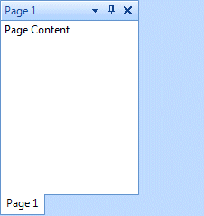
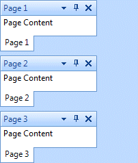

# Docking Hierarchy

## Docking Hierarchy
  
**Hierarchy of Docking Elements**  
The docking system is implemented as a tree of elements where specific
docking functionality is provided by particular elements. To achieve your
docking requirements you need to build up the hierarchy of elements to match the
functionality you require. To make this process as simple as possible a set of
helper methods starting with the word '*Manage*' are exposed by the docking
manager. You can see them being used in the [overview](Krypton%20Docking%20Overview.md) section. Understanding the different docking elements
and how to build them into a tree is a great way to get a full understanding of
the docking system. It will allow you to perform more complicated tasks such as
setting up complex arrangements of pages.

Every docking element has a *Name* property that is used to uniquely identify
the element within the parent collection of elements. Different elements can
have the same name as long as they are not sibling to each other. Each element
also has a read only property called *Path*. This returns a string that shows
the name of all the elements starting from the root and reaching the target
element. For example a path for a docked control would be something like
'*DockingManager,Control,Left,Docked'*. You can can use the
*KryptonDockingManager.ResolvePath* method that takes a path string and returns
an *IDockingElement* reference as a way to quickly get access to the docking
element of interest within the hierarchy. Although you will need to cast the
returned reference to the specific type of element you are accessing.

 

**KryptonDockingManager**  
The *KryptonDockingManager* component acts as the root of the docking hierarchy.
Not only does it act as the top element but it also has all the methods and
properties you need for standard interaction with the docking system. For more
advanced operations you can navigate around the hierarchy of docking elements
and then interact with those elements directly. Each element has a *Count*
property that indicates the number of children that element has. To get access
to a child just use an array indexer and it will return an element.

```cs
    Console.WriteLine("No Of Children:{0}", dockingManager.Count);  
    IDockingElement c = dockingManager[0];  
    IDockingElement f = dockingManager["Floating"];
```

As you can see above, the array accessor can take an integer or the name of the
element required. The return type is *IDockingElement* which is the base
interface provided by all docking element classes. You would then need to cast
the returned reference to the type you are expecting to be returned. So you
would have something like this...

```cs
    KryptonDockingControl c = (KryptonDockingControl)dockingManager[0];  
    KryptonDockingFloating f =
(KryptonDockingFloating)dockingManager["Floating"];
```

Using this approach you can navigate down the hierarchy to any element. You can
then interact with the element directly rather than using the general purpose
methods provided by the docking manager. The rest of this section will describe
all the different docking elements that are available and how they interrelated.

 

**KryptonDockingControl**  
This element adds docked and auto hidden docking capabilities to a provided
control. Typically the control provided will be a *KryptonPanel* but this is not
a requirement as you can add any control that derives from the *Control* base
class. The *KryptonDockingControl* element actually adds four child
*KryptonDockingEdge* elements to itself inside the constructor with each
*KryptonDockingEdge* instance responsible for one of the control edges. Each
*KryptonDockingEdge* element will itself add two children to themselves. The
children are *KryptonDockingEdgeDocked* for handling docked content and
*KryptonDockingEdgeAutoHidden *for managing auto hidden groups. So creating
a *KryptonDockingControl* instance actually results in the following tree of
elements...

**  KryptonDockingManager                 ** (Name=DockingManager)  
      **KryptonDockingControl               ** (Name=Control)  
          **KryptonDockingEdge**                 (Name=Left)  
              KryptonDockingEdgeDocked         (Name=Docked)  
              KryptonDockingEdgeAutoHidden     (Name=AutoHidden)           
          **KryptonDockingEdge**                 (Name=Right)  
              KryptonDockingEdgeDocked         (Name=Docked)  
              KryptonDockingEdgeAutoHidden     (Name=AutoHidden)   
          **KryptonDockingEdge**                 (Name=Top)  
              KryptonDockingEdgeDocked         (Name=Docked)  
              KryptonDockingEdgeAutoHidden     (Name=AutoHidden)   
          **KryptonDockingEdge**                 (Name=Bottom)  
              KryptonDockingEdgeDocked         (Name=Docked)  
              KryptonDockingEdgeAutoHidden          (Name=AutoHidden)     

The four children of the docking control have name property values of '*Left*',
'*Right*', '*Top*' and '*Bottom*' which relate the edge they manage. Then each
edge has children named '*Docked*' and '*AutoHidden*'. You can use those names
to navigate to the docking element of interest when you need to interact with
them directly instead of via the docking manager. The child collection of the
*KryptonDockingControl* is fixed and so you cannot add or remove, the four child
elements are constant. Also the *KryptonDockingEdge* is fixed so you cannot
change the two children that are always present. *KryptonDockingManager* is an
open collection and begins with no children but you can add and remove children
as required.

You can create an instance of the *KryptonDockingControl* and have it added to
the *KryptonDockingManager* using the following helper method...

```cs
    dockingManager.ManageControl("Control", kryptonPanel1);
```

Alternatively create and add the instance directly using the
following equivalent code...

```cs
    KryptonDockingControl dockingControl = new KryptonDockingControl("Control",
kryptonPanel1);  
    dockingManager.Add(dockingControl);
```

This is how you can navigate to the element that manages docked content on the
bottom edge...

```cs
    KryptonDockingControl control =
(KryptonDockingControl)dockingManager["Control"];  
    KryptonDockingEdge edge = (KryptonDockingEdge)control["Bottom"];  
    KryptonDockingEdgeDocked docked = (KryptonDockingEdgeDocked)edge["Docked"];
```
 

**KryptonDockingEdgeDocked**  
This element contains a set of child *KryptonDockingDockspace* elements each of
which represents a single docking capable workspace. The '*dockspace*' is the
name of a control derived from the *KryptonWorkspace* that is customized to work
as docked within a control. There are four helper methods on this element that
create and add new *KryptonDockingDockspace* instances...

```cs
    AppendDockspace()  
    AppendDockspace(string name)  
    InsertDockspace(int index)  
    InsertDockspace(int index, string name)
```

The methods that do not take a '*name*' parameter will instead generate a GUID
and use that as the element name. If you use the '*Append*' methods then the new
dockspace element is added to the end of the collection and will also be the
innermost dockspace for that edge. If you use the '*Insert*' methods to add a
new instance at the start of the child collection then it will be displayed as
the outermost dockspace for that edge. Adding a dockspace element does not
actually cause anything to be displayed as it does not contain any pages by
default. See the following section for details on how to add pages to the
dockspace.

 

**KryptonDockingDockspace**  
This element represents a docked workspace against a control edge. It will
create an actual control instance and add it to the appropriate owning control.
You can get access to this control reference by using the
*KryptonDockingDockspace.DockspaceControl*. The *DockspaceControl* is a control
derived from *KryptonWorkspace* and so if you want to perform complicated layout
tasks for pages inside the workspace you would need to use this reference to get
access to the control. Most developers will not need to do this and can instead
use the helper methods listed here for adding pages...

```cs
    Append(KryptonPage page)  
    Append(KryptonPage[] pages)  
    CellAppend(KryptonWorkspaceCell cell, KryptonPage page)  
    CellAppend(KryptonWorkspaceCell cell, KryptonPage[] pages)  
    CellInsert(KryptonWorkspaceCell cell, int index, KryptonPage page)  
    CellInsert(KryptonWorkspaceCell cell, int index, KryptonPage[] pages)
```

The first two methods can be used to add pages to the dockspace in all
circumstances. If the dockspace does not currently have any contents then it
will automatically add a new *KryptonWorkspaceCell* and then add the requested
pages into it. If the dockspace already has a visible workspace cell then it
will instead append the provided pages into that existing cell. If you already
have a reference to a workspace cell instance then the four '*Cell*' methods can
be used.

To add a page to the left edge of a control with a new dockspace you can use the
following docking manager helper method...

```cs
   dockingManager.AddDockspace("Control", DockingEdge.Left, new KryptonPage[] {
NewPage() })
```

The same action without the helper shows how to create a dockspace and add a
page to it...

```cs
    KryptonDockingControl control =
(KryptonDockingControl)dockingManager["Control"];  
    KryptonDockingEdge edge = (KryptonDockingEdge)control["Left"];  
    KryptonDockingEdgeDocked docked = (KryptonDockingEdgeDocked)edge["Docked"];  
    KryptonDockingDockspace dockspace = docked.AppendDockspace();  
    dockspace.Append(NewPage());
```


  
*Figure 1 - Adding a left docked page*

Both of the above approaches result in the Figure 1 docking layout. *Because the
KryptonDockingDockspace.DockspaceControl* is a control that derives from
*KryptonWorkspace* you can manipulate it to perform more complex and interesting
layouts. Here we change the above code by removing the last line and replacing
it with the following code in order to create three workspace cells in a
vertical stack...

```cs
    KryptonWorkspaceCell c1 = new KryptonWorkspaceCell();  
    KryptonWorkspaceCell c2 = new KryptonWorkspaceCell();  
    KryptonWorkspaceCell c3 = new KryptonWorkspaceCell();

    c1.Pages.Add(NewPage());  
    c2.Pages.Add(NewPage());  
    c3.Pages.Add(NewPage());

    dockspace.DockspaceControl.Root.Orientation = Orientation.Vertical;  
    dockspace.DockspaceControl.Root.Children.AddRange(new Component[] { c1, c2,
c3 });
```

The output will be as shown in Figure 2. If you need to create complex layouts
then you recommended to read the documentation [Workspace Layout](../Workspace/Workspace%20Layout.md) and then apply it to the dockspace control.



*Figure 2 - Stacked cells within a single dockspace*

 

  
**KryptonDockingEdgeAutoHidden**  
The *KryptonDockingEdgeAutoHidden* element is used to manage a set of child
*KryptonDockingAutoHiddenGroup* elements. Each child auto hidden group appears
as a set of tab headers on the edge of the control. When first created this
element contains no children and you would normally used the
*KryptonDockingManager.AddAutoHiddenGroup* helper method to have a new group
added. You can however navigate through the hierarchy to this element and then
use one of its two helper methods to directly manipulate the collection...

```cs
    AppendAutoHiddenGroup()  
    AppendAutoHiddenGroup(string name)
```

The first method does not take a '*name*' parameter and will instead generate a
GUID and use that as the element name. Adding an auto hidden group element does
not actually cause anything to be displayed as it does not contain any pages by
default. See the following section for details on how to add pages to the group.

 

**KryptonDockingAutoHiddenGroup**  
This element is very simple and only has two methods that are used to manipulate
the set of pages within the auto hidden group...

```cs
    Append(KryptonPage page)  
    Append(KryptonPage[] pages)  
```

 To add a couple of pages as an auto hidden group on the left edge of a control
you can use the following docking manager helper method...

```cs
   dockingManager.AddAutoHiddenGroup("Control", DockingEdge.Left, new
KryptonPage[] { NewPage(), NewPage() })

The same action without the helper shows how to create an auto hidden group and
add pages to it...

    KryptonDockingControl control =
(KryptonDockingControl)dockingManager["Control"];  
    KryptonDockingEdge edge = (KryptonDockingEdge)control["Left"];  
    KryptonDockingEdgeAutoHidden autoHidden =
(KryptonDockingEdgeAutoHidden)edge["AutoHidden"];  
    KryptonDockingAutoHiddenGroup group = autoHidden.AppendAutoHiddenGroup();  
    group.Append(NewPage());      
    group.Append(NewPage());
```

Both of the above approaches result in the Figure 3 docking layout.  
 


*Figure 3 - Adding a left auto hidden group*

 

The following hierarchy shows the result of adding the above group to the left
edge.

  **KryptonDockingManager**                     (Name=DockingManager)  
      **KryptonDockingControl**                   (Name=Control)  
          **KryptonDockingEdge**                    (Name=Left)  
              KryptonDockingEdgeAutoHidden        (Name=AutoHidden)           
                  KryptonDockingAutoHiddenGroup    
(Name=483CC32A643F4AB7483CC32A643F4AB7)

 

**KryptonDockingFloating**  
Use this element to manage a collection of floating windows. When first created
this element contains no children and you would normally used the
*KryptonDockingManager.AddFloatingWindow* helper method to have a new window
element added. You can however navigate through the hierarchy to this element
and then use one of its two helper methods to directly manipulate the
collection...  
 
```cs 
    AddFloatingWindow()  
    AddFloatingWindow(string name)
```

The first method does not take a '*name*' parameter and will instead generate a
*GUID* and use that as the element name. Adding a floating window element does
not actually cause anything to be displayed as it does not contain any pages by
default. See the following section for details on how to add pages to the
floating window.

 

**KryptonDockingFloatingWindow**  
This element creates a new top level window that you can access via the
*KryptonDockingFloatingWindow.FloatingWindow* property. Use this property to
modify the size, location or other window level properties of the floating
window. The element has a single child element which is a
*KryptonDockingFloatspace* that takes up the entire client area of the window
and is used to store and layout the actual docking pages. You can see below the
hierarchy of elements that results from adding a single floating window.

  **KryptonDockingManager**                 (Name=DockingManager)  
      **KryptonDockingFloating**               (Name=Floating)  
         
**KryptonDockingFloatingWindow**        (Name=483CC32A643F4AB7483CC32A643F4AB7)  
              KryptonDockingFloatspace           (Name=Floatspace)

 

**KryptonDockingFloatspace**  
This element is almost identical to the *KryptonDockingDockspace* element that
is described above. In this case it manages the control that is placed inside
the client area of floating window. You can get access to this control reference
by using the *KryptonDockingFloatspace.FloatspaceControl*. The
*FloatspaceControl* is a control derived from *KryptonWorkspace* and so if you
want to perform complicated layout tasks for pages inside the workspace you
would need to use this reference to get access to the control. Most developers
will not need to do this and can instead use the helper methods listed in the
*KryptonDockingDockspace* section above.

To add a new floating window with two pages you can use the following docking
manager helper method...

```cs
   dockingManager.AddFloatingWindow("Floating", new KryptonPage[] { NewPage(),
NewPage() })
```

The same action without the helper shows how to create a floating window and
add two pages to it...

```cs
    KryptonDockingFloating floating =
(KryptonDockingFloating)dockingManager["Floating"];  
    KryptonDockingFloatingWindow window = floating.AddFloatingWindow();  
    window.FloatspaceElement.Append(new KryptonPage[] { NewPage(), NewPage() })
```

The output will be as shown in Figure 4. 


*Figure 4 - Adding a floating window*

 

  
**KryptonDockingWorkspace**  
This element is different to the others in that it does not create any child
elements and is used as a wrapper to manage an existing
*KryptonDockableWorkspace* instance. A typical docking scenario will include a
control as the filler that takes up all the remaining space when the docked and
auto hidden pages have been positioned. In Visual Studio this is the control
that perform document editing. When you need to same capability in the *Krypton*
docking system you could add a *KryptonDockableWorkspace* control from the
toolbox and drop it onto the docking control, typically a *KryptonPanel*
instance. To make that control part of the docking hierarchy you need create an
instance of the *KryptonDockingWorkspace* and provide it with a reference to
*KryptonDockableWorkspace* that is needs to manage. This results in the user
being able to drag pages from the docking pages and drop them into the dockable
workspace and vice versa. Normally you would set this up using the following
helper method...

```cs
    dockingManager.ManageWorkspace("Workspace", kryptonDockableWorkspace1);
```

Alternatively you can create and add the element directly like this...

```cs
    KryptonDockingWorkspace dockingWorkspace = new
KryptonDockingWorkspace("Workspace", "Filler", kryptonDockableWorkspace1);  
   dockingManager.Add(dockingWorkspace);
```
 

  
**KryptonDockingNavigator**  
This element is used to manage an existing *KryptonDockableNavigator* instance.
A typical docking scenario will include a control as the filler that takes up
all the remaining space when the docked and auto hidden pages have been
positioned. Use this control instead of the above workspace variation when you
do not need to ability to have pages dragged to be side by side and instead want
a simpler traditional tab style control. To make that control part of the
docking hierarchy you need create an instance of the *KryptonDockingNavigator*
and provide it with a reference to *KryptonDockableNavigator* that is needs to
manage. This results in the user being able to drag pages from the docking pages
and drop them into the dockable navigator and vice versa. Normally you would
set this up using the following helper method...

```cs
    dockingManager.ManageNavigator("Navigator", kryptonDockableNavigator1);
```

Alternatively you can create and add the element directly like this...

```cs
    KryptonDockingNavigator dockingNavigator = new
KryptonDockingWorkspace("Navigator", "Filler", kryptonDockableNavigator1);  
   dockingManager.Add(dockingNavigator);
```
 
