# Content

## Content

Content always consists of two text values and one set of image details. All of these are optional so you can choose to provide none, one, two or all three properties as needed. They are grouped together, for example the *KryptonButton* provides a property called Values that contains the values as child properties. See Figure 1 for an example of the property window for a *KryptonButton*.

*Figure 1 – KryptonButton values property*

The exact name of the properties varies depending on the context in which the content is being used. The *KryptonButton* calls them *Text*, *ExtraText*, *Image*, *ImageStates* and *ImageTransparentColor* whereas the *KryptonHeader* uses the names *Header* and *Description* instead of *Text* and *ExtraText*. We will call them *ShortText*, *LongText*, *Image*, *ImageStates* and *ImageTransparentColor* for the duration of this section.

Any control that provides content values will also allow you to specify how the content is displayed for each of the control states. Figure 2 shows the set of properties available for controlling the display of the content values.

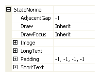

*Figure 2 – Content display settings*

**Content Properties**

*AdjacentGap* controls the pixel spacing between the different content values. Use this to change the distance between the *ShortText*, *LongText* and *Image*. Figure 3 shows a *KryptonLabel* with values of 1, 5 and 20 respectively.

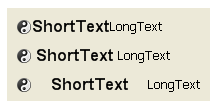

*Figure 3 – AdjacentGap property*

*Draw* is used to determine if any of the content should be displayed. When defined as *False* the content is ignored completely. *DrawFocus* indicates if a focus rectangle should be drawn around the edge of the content area. Figure 4 shows a *KryptonLabel* control with the *DrawFocus* defined as *False* and *True* respectively.

*Figure 4 – DrawFocus property*

*Padding* specifies how far to inset the content from the outside of the control. You can provide a value that is the same for all the sides or individual values for each of the edges. Figure 5 uses a *KryptonButton* control that is auto sized to demonstrate how padding values affect the size and drawing of the control.

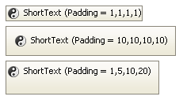

*Figure 5 – Padding property*

The remaining three properties are *Image*, *ShortText* and *LongText* that contain settings that affect just the corresponding parts of the content.

**Positioning** 

Each of the three content parts has a property for controlling the horizontal alignment and another for the vertical alignment. These are called *ImageH*, *ImageV* for the *Image* and *TextH*, *TextV* for the *ShortText* and *LongText*. All of them have the same possible set of values *Inherit*, *Near*, *Center* and *Far*.

Inherit is used to indicate that the value of the property should be determined by looking higher up the inheritance chain. On a left to right system the *Near*, *Center* and *Far* are interpreted as Left/Top, Middle and Right/Bottom. Right to left systems will interpret this in the reverse order of Right/Bottom, Middle and Left/Top.

Positioning is easiest to understand by using examples. In Figure 6 a sequence of images shows the *ShortText* positioned inside a fixed size *KryptonButton*. In each case the actual display text is the horizontal and vertical alignment values.

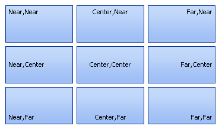

*Figure 6 – TextH, TextV positioning of ShortText only*

If you position more than one of the content elements in the same place then they simply concatenate together in the order of *Image*, *ShortText* and *LongText*. So if all three were positioned at (Far, Far) then you would get the situation shown in Figure 7. Note that the *Image* is positioned first and so takes the furthest position horizontally. Then the *ShortText* is added and finally the *LongText*. 
 

*Figure 7 – Far, Far positioning of all content*

You can achieve most affects you will need by using these settings. For example, if you would like to see the *LongText* at the bottom with the *ShortText* above and finally the *Image* at the top then you use the (Center,Top) for the *Image* then define (Center,Center) for the *ShortText* and finally (Center,Bottom) for the *LongText*. This would achieve the appearance of Figure 8.

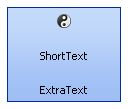

*Figure 8 – Content in centered for spread out vertically*

If you need to squeeze the content more closely together then you have two options. The preferred method is to auto size the control so that it automatically resizes to be just big enough to hold the content. You could also add a larger *Padding* value so that the spare space is reduced forcing the content closer together. Figure 9 shows the auto sizing approach followed by the *Padding* approach where it has been defined as 22 pixels of padding for each edge. The last picture in Figure 9 shows both the auto sizing and *Padding* applied to the same control.

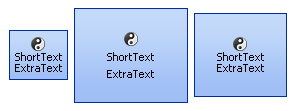

*Figure 9 – AutoSize, Padding and both*

**Image Properties**

As you can see from Figure 10 the Image property has five child properties of which the *ImageH* and *ImageV* have already been described above. The *Effect* property allows a color transition to be made at the time of drawing the actual image to the screen.

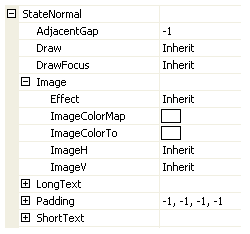

*Figure 10 – Image child properties*

The most commonly used enumeration values are the *Normal*, which just shows the image without any change, and Disabled which shows the image is a washed out appearance suitable for a disabled control. You can lighten or darken the image by using one of the *Light*, *LightLight*, *Dark* and *DarkDark* options. There are four options for performing gray scaling. *GrayScale* will convert all colors into black and white whilst *GrayScaleRed*, *GrayScaleGreen* and *GrayScaleBlue* convert all except the nominated color into gray scale. See figure 11 to see all the enumeration options applied.

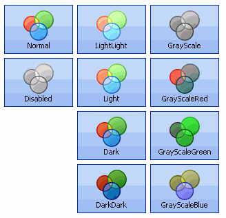

*Figure 11 – Image Effect enumeration*

When the image is being painted you can remap one of the image colors to an alternate. Use the *ImageColorMap* to specify the color you want to alter and use *ImageColorTo* to define the new output color. This is useful if you have just a single color image and want to alter the display color based on the tracking or pressed state. Figure 12 shows a black cross image in three colors. The left most image is the original Image without any color re mapping applied. In the second image the *ImageColorMap = Black* and *ImageColorTo = Red*. Last is the blue image which also has I*mageColorMap = Black* but *ImageColorTo = Blue*.

*Figure 12 - Original image, ColorTo = Red, ColorTo = Blue*

**ShortText & LongText Properties**

Figure 13 shows the full list of extra properties that are available for both the *ShortText* and *LongText*. The *TextV* and *TextH* properties have already been described above in the section about positioning.

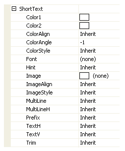

*Figure 13 – ShortText child properties*

The *ColorStyle* property determines how to make use of the *Color1*, *Color2*, *ColorAlign* and *ColorAngle* set properties. When *ColorStyle* is defined as *Solid* the text will be drawn using the *Color1* value and the other color properties are ignored as not relevant. Figure 14 shows some *KryptonLabel* instances with *Solid* defined.

*Figure 14 – ColorStyle = Solid*

All other *ColorStyle* values such as *Linear* and *Rounded* allow a gradient effect between two colors, where *Color1* is the starting color and *Color2* is the ending color. Now the *ColorAngle* property becomes important as it determines the direction in which the transition occurs. Figure 15 shows the same *Linear* style and same starting and ending colors but with different angles.

*Figure 15 – ColorStyle = Linear*

*ColorAlign* is used to decide how to calculate the starting and ending points for the gradient effect. By default it will always start at the top left of the control and ends at the bottom right of the control which gives an appearance as seen already in Figure 15. If instead you choose the *Form* level alignment then it will use the top left of the enclosing form and bottom right of the enclosing form as the total area of the gradient.  Figure 16 shows four label controls all with exactly the same *ColorAngle* of 45 degrees, *ColorAlign* of *Form* and *ColorStyle* of Sigma.

*Figure 16 – ColorStyle =Sigma, ColorAlign = Form, ColorAngle = 45*

*Font* and *Hint* are used to define the text font used when drawing and the quality of the font rendering. Figure 17 shows the *Font* modified between the first and second instances. The third instance is exactly the same as the second but with the *Hint* defined as *AntiAlias*.

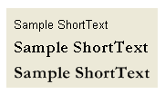

*Figure 17 – Font and Hint properties*

Rather than just use colors you can also draw an *Image* over the text. Note that the *Image* is always drawn after the color has been painted so that images that contain alpha channels will show through the defined color effect.

The *ImageAlign* property allows the image to be draw aligned against the *Form* and not just the control instance. Figure 18 shows the use of many *KryptonLabel* controls that are all assigned the same *Image*, *ImageAlign* and *ImageEffect*.

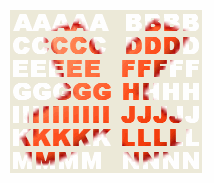

*Figure 18 – ImageAlign = Form, ImageEffect = Stretch*

The *ImageEffect* property describes how to draw the *Image* over the required area. Figure 18 shows the example where *Stretch* is used to ensure the *Image* exactly covers the entire area. *Tiling* options include *Tile*, *TileFlipX*, *TileFlipY* and *TileFlipXY* that repeat over and over again until the entire area is filled. Positioning options such as *TopLeft* and *BottomMiddle* allow the image to be placed relative to both the vertical and horizontal edges.

*Prefix* has three possible values that determine how to process the ampersand character inside the text string. None specifies that no pre-processing of ampersand characters take place so the output is the exact string provided. Hide will process ampersand characters but will not underline the output text. Show will process ampersand characters and place an underline under the next character. Figure 19 shows the each of the three options.

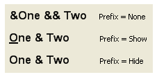

*Figure 19 – Prefix options*

Each *ShortText* and *LongText* can contain carriage returns and so span multiple lines of text. This is the default setting for *MultiLine* but if you prefer to have all the text always on a single line then just set the property to *False*. When text spans multiple lines then you can use the *MultiLineH* property to define how the lines are aligned. Figure 20 shows an example of text containing a carriage return being forced to show on a single line and then an example of the three alignment options.

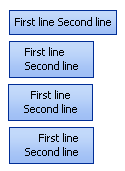

*Figure 20 – MultiLine and MultiLineH properties*

Finally the Trim property is used to specify how to handle text when there is not enough room to display it all. If you would like the text to disappear then use the *Hide* option. Alternatively you can use the *Character* or *Word* options to remove the excess characters or words that that will not fit. If you would like the user to be made aware that truncation has taken place then use one of the ellipses options *EllipsesCharacter*, *EllipsesWord* or *EllipsesPath*. Figure 21 shows the various options in action.

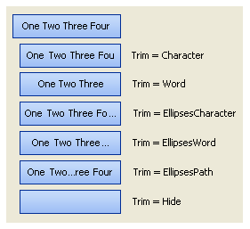

*Figure 21 - Trim options*

