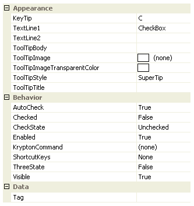

# Ribbon Group Item CheckBox

## Group Item CheckBox
You can add a check box to either the group triple or the group lines container. Use the *CheckState* property to define the checked state of the check box. Figure 1 shows the list of all properties exposed by the group check box item.

*Figure 1 - Group Item CheckBox Properties*

**KeyTip**

When *KeyTips* are displayed this property defines the *KeyTip* for the check button instance. You should ensure that all items inside a tab have unique *KeyTip* values so that the user can always select items using keyboard access.

**TextLine1**

**TextLine2**

When the check box is inside a container that displays it the full height of the group content area the *TextLine1* and *TextLine2* strings are shown on two separate lines underneath the check box image. In all other cases the *TextLine1* and *TextLine2* are concatenated together with a space between them for showing horizontally after the check box image.

**ToolTipBody**

**ToolTipImage**

**ToolTipImageTransparentColor**

**ToolTipStyle**

**ToolTipTitle**

When the user hovers the mouse over the check box instance you can use these properties to define the tool tip that will be displayed. Use *ToolTipTitle* and *ToolTipBody* to define the two text strings for display and *ToolTipImage* for the associated image. If you image contains a color that you would like to be treated as transparent then set the *ToolTipImageTransparentColor*. For example, many bitmaps use magenta as the color to become transparent. To control how the text and image are displayed in the tool tip you can use the *ToolTipStyle* property.

**AutoCheck**

When defined as *True* this property will allow the user to changed the check state by using the mouse to click the control instance.

**Checked**

A boolean property this indicates if the check box is currently checked or not. If you require a three state use of the check box then you should use the *CheckState* property as that allows an intermediate state to be defined. For regular use as either a checked or not checked state control then you can use this *Checked* property.

**CheckState**

Use this property to define one of the three possible display states of the check box. The available states are *Checked*, *Unchecked* or *Indeterminate*. The checked state will result in a tick appearing inside the check box, the unchecked state shows just an empty check box and the indeterminate state a square inside the check box.

**Enabled**

Used to define if the check box is enabled or disabled at runtime.

**KryptonCommand**

Attached command that is used as a source of state.

**ShortcutKeys**

Define this property if you would like your application to have a shortcut key combination that invokes the check box.

**ThreeState**

Should selecting the control rotate around the three possible states or should it rotate around just the checked/unchecked state.

**Visible**

Use this property to specify if the check box should be visible at runtime.

**Tag**

Associate application specific information with the object instance by using this property.

## Events

**Click**

Occurs when the check box has been pressed. 

**CheckedChanged**

Occurs when the *Checked* property changes value. 

**CheckStateChanged**

Occurs when the *CheckState* property changes value.  
