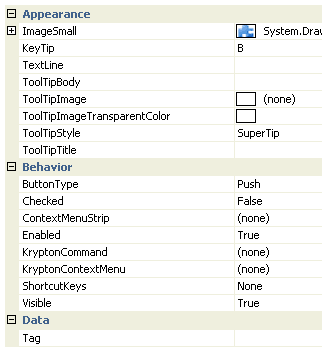

# Ribbon Group Item ClusterButton

## Group Item Cluster Button

You can only add a cluster button as a child of a cluster instance, they cannot be placed inside the group triple or group lines containers. Figure 1 shows the properties of the cluster button which are almost the same as those of the more general group button item.

*Figure 1 - Group Item Cluster Button Properties*

**ImageSmall**

The cluster button item must always have a valid image defined. If you assign *null* to the Image property then it will automatically revert to a default Krypton Toolkit logo image instead.

**KeyTip**

When *KeyTips* are displayed this property defines the *KeyTip* for the cluster button instance. You should ensure that all items inside a tab have unique *KeyTip* values so that the user can always select items using keyboard access.

**TextLine**

Assign the display text for the cluster button to the *TextLine* property.

**ToolTipBody**

**ToolTipImage**

**ToolTipImageTransparentColor**

**ToolTipStyle**

**ToolTipTitle**

When the user hovers the mouse over the button instance you can use these properties to define the tool tip that will be displayed. Use *ToolTipTitle* and *ToolTipBody* to define the two text strings for display and *ToolTipImage* for the associated image. If you image contains a color that you would like to be treated as transparent then set the *ToolTipImageTransparentColor*. For example, many bitmaps use magenta as the color to become transparent. To control how the text and image are displayed in the tool tip you can use the *ToolTipStyle* property.

**ButtonType**

Determines the appearance and operation of the button. Possible values include:-

* Push - A traditional push button
* Check - Toggles between checked and unchecked
* DropDown - Displays a context menu strip when pressed
* Split - Split between a traditional push button and a drop down area

**Checked**

This property is only used when the *ButtonType* is defined as *Checked*. It determines if the cluster button should be drawn with the checked appearance. The value will automatically be toggled between *True* and *False* when the user clicks the cluster button and *ButtonType* is *Checked*.

**ContextMenuStrip**

When the user clicks a button of type *DropDown* or the split portion of a *Split* button this property is used if defined and the *KryptonContextMenu* property is *null*. This property is provided as a parameter to the buttons *DropDown* event so that the developer can customize the context menu strip before it is displayed.

**Enabled**

Used to define if the button is enabled or disabled at runtime.

**KryptonCommand**

Attached command that is used as a source of state.

**KryptonContextMenu**

When the user clicks a button of type *DropDown* or the split portion of a *Split* button this property is used if defined, otherwise the *ContextMenuStrip* is used. This property is provided as a parameter to the buttons *DropDown* event so that the developer can customize the context menu before it is displayed.

**ShortcutKeys**

Define this property if you would like your application to have a shortcut key combination that invokes the cluster button. For example, cluster buttons used for cut/copy/paste would be defined with shortcut keys so the user can invoke those actions without moving focus away from the current control.

**Visible**

Use this property to specify if the cluster button should be visible at runtime.

**Tag**

Associate application specific information with the object instance by using this property.

## Events

**DropDown**

A cancelable event than allows you to customize the drop down context menu before it is displayed. 

**Click**

Occurs when the button has been pressed. 
