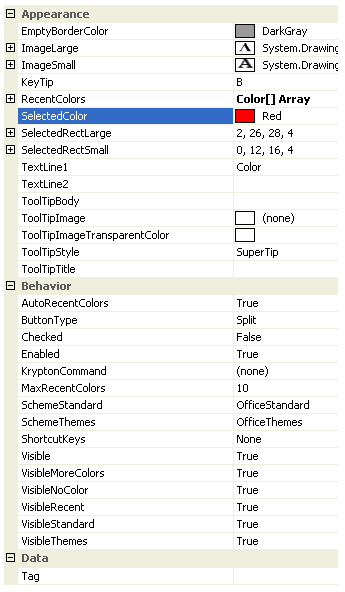

# Ribbon Group Item ColorButton

## Group Item Color Button

You can add a group color button to either the group triple or the group lines container. Use the *ButtonType* property to define the type of button operation you require. Figure 1 shows the list of all properties exposed by the group color button item.

*Figure 1 - Group Item Color Button Properties*

**EmptyBorderColor**

Color to draw the border of the selected rect when the selected color is *Color.Empty*.

**ImageLarge**

**ImageSmall**

If you need an image shown when the label is the full height of the group content area then use the *ImageLarge* property. All other cases use the *ImageSmall* if it has been specified.

**KeyTip**

When *KeyTips* are displayed this property defines the *KeyTip* for the button instance. You should ensure that all items inside a tab have unique *KeyTip* values so that the user can always select items using keyboard access.

**RecentColors**

Array of colors to show in the recent colors section of the context menu.

**SelectedColor**

The currently selected color which can be the *Color.Empty* value.

**SelectedRect**

The rectangle of the displayed image that should be drawn in the selected color. If the selected color is *Color.Empty* then the border of this rectangle is drawn in the *EmptyBorderColor* instead.

**TextLine1**

**TextLine2**

When the color button is inside a container that displays it the full height of the group content area the *TextLine1* and *TextLine2* strings are shown on two separate lines underneath the color button image. In all other cases the *TextLine1* and *TextLine2* are concatenated together with a space between them for showing horizontally after the color button image.

**ToolTipBody**

**ToolTipImage**

**ToolTipImageTransparentColor**

**ToolTipStyle**

**ToolTipTitle**

When the user hovers the mouse over the button instance you can use these properties to define the tool tip that will be displayed. Use *ToolTipTitle* and *ToolTipBody* to define the two text strings for display and *ToolTipImage* for the associated image. If you image contains a color that you would like to be treated as transparent then set the *ToolTipImageTransparentColor*. For example, many bitmaps use magenta as the color to become transparent. To control how the text and image are displayed in the tool tip you can use the *ToolTipStyle* property.

**AutoRecentColors**

Should the *RecentColors* array be automatically updated to include newly selected colors that are not contained in either the standard or theme sections.

**ButtonType**

Determines the appearance and operation of the button. Possible values include:-

* Push - A traditional push button
* Check - Toggles between checked and unchecked
* DropDown - Displays a context menu strip when pressed
* Split - Split between a traditional push button and a drop down area

**Checked**

This property is only used when the *ButtonType* is defined as *Checked*. It determines if the button should be drawn with the checked appearance. The value will automatically be toggled between True and False when the user clicks the button and *ButtonType* is *Checked*.

**Enabled**

Used to define if the button is enabled or disabled at runtime.

**KryptonCommand**

Attached command that is used as a source of state.

**MaxRecentColors**

Limit placed on the size of the *RecentColors* array.

**SchemeStandard**

**SchemeThemes**

Enumeration values indicating the predefined sets of colors to show in the standard and themed sections of the context menu.

**ShortcutKeys**

Define this property if you would like your application to have a shortcut key combination that invokes the button. For example, buttons used for cut/copy/paste would be defined with shortcut keys so the user can invoke those actions without moving focus away from the current control.

**Visible**

Use this property to specify if the button should be visible at runtime.

**VisibleMoreColors**

**VisibleNoColor**

**VisibleRecent**

**VisibleStandard**

**VisibleThemes**

Should the relevant section of the context menu be displayed.

**Tag**

Associate application specific information with the object instance by using this property. 

## Events

**DropDown**

A cancelable event than allows you to customize the drop down context menu before it is displayed. 

**Click**

Occurs when the button has been pressed. 

**MoreColors**

Occurs when the user selects the *MoreColors* menu option.

**SelectedColorChanged**

Occurs when the value of the *SelectedColor* property changes.

**TrackColor**

As the user tracks over different colors this event fires so you can provide instance feedback on the effect this would have if selected.
