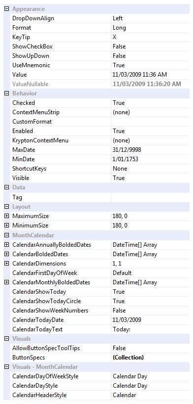

# Ribbon Group Item DateTimePicker

## Group Item DateTimePicker
Use this element to add a date time picker control to the ribbon. The set of available properties is shown in Figure 1.

*Figure 1 - Group Item DateTimePicker Properties*

**DropDownAlign**

Determines if the drop down month calendar appears aligned to the left or right edge of the date time picker.

**Format**

Offers predefined ways of formatting the text portion of the control.

**KeyTip**

Character used to select the control when the user presses *ALT* to gain keyboard access to the ribbon.

**ShowCheckBox**

Defaults to *False* and so does not show a check box in the control but when defined allows the user to decide if the value in the control is valid.

**ShowUpDown**

Defaults to *False* and so shows a drop down button but when defined as True will display up/down buttons for modifying contents.

**Value**

A *DateTime* property that represents the value inside the control.

**ValueNullable**

A object type property that returns *DBNull* when the *Checked* property is *False* but a valid *DateTime* when the *Checked* property is *True*.

**Checked**

When defined the value of the control is valid, otherwise the value is not valid and drawn disabled.

**CustomFormat**

If the *Format* property is defined as *Custom* then this property defines how the text is formatted.

**CustomNullText**

If the *Checked* property is *False* then this text is drawn in the text area unless the property is set to an empty string.

**Enabled**

Should the month calendar be displayed as enabled and allow interaction with the user. Note that if the *KryptonContextMenu* component has its own *Enabled* property defined as *False* then the item will be disabled regardless of the individual menu item *Enabled* state.

**MaxDate**

**MinDate**

Place limits on the displayed and selectable date range by using these two properties.

**Visible**

Define this as False if you do not want the element to be displayed.

**ShortcutKeys**

Define this property if you would like your application to have a shortcut key combination that invokes the date time picker.

**Tag**

Use the *Tag* to assign your application specific information with the component instance.

**MaximumSize**

**MinimumSize**

These two properties are very important and allow you to control the width of the date time picker. By default they have the same value giving a fixed width to the control, but you can alter the values so that they specify a valid range of widths. When the control is positioned it is asked for its preferred size which is then constrained by these two properties.

**CalendarAnnuallyBoldedDates**

**CalendarMonthlyBoldedDates**

**CalendarBoldedDates**

Use these collections to specify which dates should be displayed in a bold state.

**CalendarDimensions**

Determines the number of months shown as a grid.

**CalendarFirstDayOfWeek**

Specify which day of week is used as the first displayed column within the month.

**CalendarShowToday**

**CalendarShowTodayCircle**

Determines if today's date is displayed in the bottom caption of the control and if the day that represents today's date has a highlighted border (circle).

**CalendarShowWeekNumbers**

When defined this property will show week numbers in the row header of each displayed week of values.

**CalendarTodayDate**

Defaults to the current date when the control is created but can be set to define any date as the today date.

**CalendarTodayText**

Text used to caption the today's date in the bottom caption area.

**AllowButtonSpecTooltips**

By default the control will not show any tool tips when you hover the mouse over the user defined button specifications. If you set this boolean property to True then it will turn on tool tips for those button specs. Use the *ButtonSpec.TooltipText* property in order to define the string you would like to appear inside the displayed tool tip.

**ButtonSpecs**

Use this collection property to define any number of extra buttons that you would like to appear at the near or far edges of the control.

**CalendarDayOfWeekStyle**
  
**CalendarDayStyle**

**CalendarHeaderStyle**

Properties used to define the palette styles used to draw various elements of the control.

