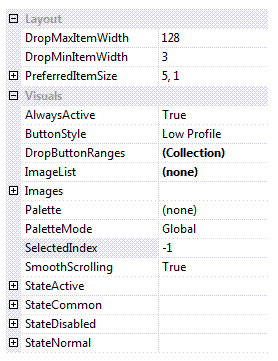
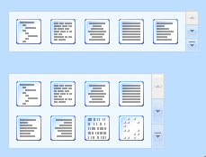

# KryptonGallery

## KryptonGallery

Use a the gallery control to present the user with a set of images that they can single select from. The user can use the up and down buttons on the side of the gallery to scroll additional rows of images into view. They can also press a drop down button to show a context menu containing the full list of images.

**Gallery Properties**

You can see in Figure 1 the gallery properties that extend the ones already present for a WinForms control.

*Figure 1 - Gallery specific properties.*

**DropMaxItemWidth**

**DropMinItemWidth**

By default when the drop down menu is shown for the gallery the number of items per horizontal line will match the current number of items showing in the gallery itself. So if the gallery is showing a width of 4 items then the drop down menu will show 4 items per line. However, if the gallery becomes very small it might only be showing one or two items and so showing a drop down menu with just one or two items per line would look inappropriate. Use these two properties to define min/max values for the drop down items per line to ensure the menu always has a reasonable appearance.

**PreferredItemSize**

If you have set the *AutoSize* property of the control to *True* then you need a way to define the preferred width. Use this property to define the number of images per line and how many lines you would like displayed in the client area of the control. You can see this in action by looking at figure 2. The top instance has the default of 5,1 and the second instance has been changed to 4,2.

*Figure 2 - Different PreferredItemSize values.*

**AlwaysActive**

This property is used to indicate if the control should always be in the active state. As a standalone control this default to being *True* but when used inside a ribbon control instance it is changed to be *False*. This is because you would expect the background to change when the mouse enters the client area inside the ribbon.

**ButtonStyle**

This style determines how the individual images are displayed. A default of *Low Profile* means that there is no obvious button drawing until you move the mouse over the image or until it becomes selected. But if you prefer another appearance then update the style to any of the other options.

**DropButtonRanges**

If this collection is empty then all the gallery images are shown in one large group within the drop down menu. In order to change the grouping you add entries to this collection that define a header title and the range of items it should contain. This allows you to split the display images into groups that are titled. 

**ImageList**

Reference to image list that contains all the display images.

**Images**

This compound property allows you to override the images used in the up/down/drop down buttons that appear on the right hand side of the control. Usually these are inherited from the appropriate palette so that they match the current global style.

**Palette**

Use this to override the drawing values with those of a specific *KryptonPalette* instance.

**PaletteMode**

Change this enumeration if you want to select a global palette that comes builtin with the *Krypton Toolkit*.

**SelectedIndex**

Index of the currently selected image for the gallery.

**SmoothScrolling**

Determines if scrolling occurs as a smooth animation or if instead an immediate jump is made to the destination.

**StateActive**

**StateCommon**

**StateDisabled**

**StateNormal**

All the state compound properties are used to override different elements of the gallery with custom values. 

## Events

**GalleryDropMenu**

Fired just before the drop down menu is displayed. You can cancel this event to prevent the drop down menu from appearing or instead customize the contents of the menu to add additional menu items. 

**TrackingImage**

As the user tracks over different images this event fires so you can provide instant feedback to the user about the change that would happen if the image were to be selected. When tracking leaves all the images then you get a value of -1 provided in the event data. 

**SelectedIndexChanged**

Occurs when the *SelectedIndex* property changes value.
