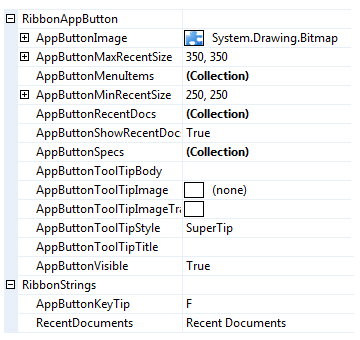

# Ribbon Application Button

## Ribbon Application Button

The application button is the large round button that appears at the top left of the ribbon control. You cannot prevent the display of the button and pressing it should always result in the display of a context menu. When the ribbon control is integrated into the custom chrome of the owning *Form* then the application button should be presented half in the *Form* caption area and half in the ribbon control itself. When the ribbon is not integrated then an extra header area is shown at the top of the ribbon control that allows the application button to be completely shown.

**Application Button Properties**

You can see in Figure 1 the ribbon properties relating to the application button.

*Figure 1 - Application Button Properties*

**AppButtonImage**

Use this property to define the image that is displayed in the center of the application button. You should always assign an *Image* of size 24 x 24 pixel as the ribbon will always stretch the provided image to be drawn in that fixed size. Note that this property cannot be assigned *null* and so if you cannot supply a value of your own it will default to the Krypton Toolkit logo seen in the sample applications.

**AppButtonMenuItems**

Defines the hierarchy of context menu items that are displayed on the left side of the application menu. Note that the first level of sub menus are displayed as a fixed size that overlap the recent documents area. Hence it is important to have a reasonably large recent documents area so that all the first level sub menus will be fully displayed. The exception to this rule is when the recent documents area is turned off via the *AppButtonShowRecentDocs* property, in which case the first level sub menus are shown sized according to content.

**AppButtonMinRecentSize**

The recent documents area of the application menu honors a minimum size as specified by this property. This ensures that when you only have a small number of entries you still reserve a reasonable amount of display space. It is also essential when you have large first sub menus defined. The first level of sub menus are always displayed as a fixed size that overlay the recent documents area. Therefore you would need to use this property to ensure that the sub menu always has enough size that the sub menu can be fully displayed.

**AppButtonMaxRecentSize**

Adding recent document entries that have large text values, such as a full path filename, it can quickly make the application menu very wide. Use this property to limit the width of the recent documents area so it does not become unmanageable.

**AppButtonRecentDocs**

Each entry in this collection will appear as an option inside the recent documents section of the application menu. 

**AppButtonShowRecentDocs**

The recent documents section of the application menu is optional. If you set this property to *False* then this section will not be displayed. This is a useful if your application does not support the concept of recent documents and also has no need to reuse the section or another purpose.

**AppButtonSpecs**

You can use this collection to define additional buttons that appear at the bottom of the application menu. Typically you would use this feature to add an *Exit* or *Options* button in the same manner as the *Office 2007* applications. They should be used when it does not make sense to add the same capability to the context menu portion of the application menu.

**AppButtonToolTipBody**

**AppButtonToolTipImage**

**AppButtonToolTipImageTransparentColor**

**AppButtonToolTipStyle**

**AppButtonToolTipTitle**

When the user hovers the mouse over the application button instance you can use these properties to define the tool tip that will be displayed. Use *AppButtonToolTipTitle* and *AppButtonToolTipBody* to define the two text strings for display and *AppButtonToolTipImage* for the associated image. If you image contains a color that you would like to be treated as transparent then set the *AppButtonToolTipImageTransparentColor*. For example, many bitmaps use magenta as the color to become transparent. To control how the text and image are displayed in the tool tip you can use the *AppButtonToolTipStyle* property.

**AppButtonVisible**

Determines if the application button is displayed with the ribbon.

**AppButtonKeyTip**

When the user enter *KeyTips* mode by using the *ALT* key or *F10* this property is used to decide on the *KeyTip* text to be used for the application button. By default the single letter *F* is used because the most likely use of the application button is to show a *File* context menu. This property is localizable so you can change the value on a per culture basis.

**RecentDocuments**

This property defines the string that is displayed as a title for the recent documents section of the application menu. You can change the title if you require to repurpose the use of that menu section. This property is localizable so you can change the value on a per culture basis.
