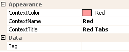

# Ribbon Contextual Tabs

To implement contextual tabs you need to understand the relationship between the ribbon *SelectedContext* property, the ribbon *RibbonContexts* collection and the ContextName property defined for each ribbon tab instance.

The *RibbonContexts* property on the ribbon control is a collection property of individual *KryptonRibbonContext* instances. Each *KryptonRibbonContext* instance defines one possible context. You should create as many instances as different contexts you need for the ribbon. For example, if your application has the ability to select pictures and charts then you would create two contexts. Your first context would have a title of Picture and the second a title of Chart.

If the user selected a chart and a picture at the same time then you can display both contexts at the same time by setting the appropriate values into the ribbon *SelectedContext* property. The *SelectedContext* property is a comma separated list of contexts your would like to display. So if you have two contexts defined with names of Picture and Chart the valid combinations for the *SelectedContext* property would be:-

* Picture
* Chart
* Picture,Chart
* Chart,Picture

The order of the context names is important. The ribbon will show the context groupings of tabs in the same order that they are defined in the *SelectedContext*. So with a value of 'Chart,Picture' the chart context tabs would be shown before the picture context tabs.

To associate a ribbon tab so it is displayed only in the context of a particular context you need to set the *KryptonRibbonTab.ContextName* property. The value should match the same name as in the *KryptonRibbonContext.ContextName* instance of interest.

## KryptonRibbonContext Properties

Figure 1 shows the properties available for a ribbon context instance.

*Figure 1 - Ribbon Context Properties*

**ContextColor**

When the context is being displayed this is the color used to draw the context indication area at the top of the ribbon control. If the ribbon control is integrated into the caption area of the form then this color will be seen in the caption area.

**ContextName**

The *ContextName* is used to associate the individual tabs with the context instance. To associate a tab with this context you should set the *KryptonRibbonTab.ContextName* to the same value as this property.

**ContextTitle**

This is the title text that is drawn over the *ContextColor* background color. You should use a short string to reduce the chances of it being truncated and a string that reflects the context usage, good examples would be *Picture*, *Table* and *Chart*.

**Tag**

Associate application specific information with the object instance by using this property.
