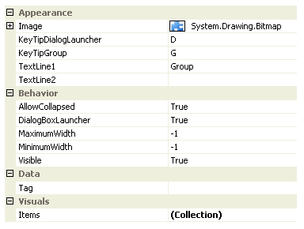

# Ribbon Groups

A ribbon tab can have any number of child ribbon group instances. They are positioned from left to right within the tab area and automatically sized according to the content they contain. Each group can be in either a normal or collapsed state. In normal state the group shows its content and has a title area at the bottom of the group area. When collapsed the group does not show any content and becomes a button that when pressed shows the content in a pop up window. The ribbon control will automatically determine which of the two states the group should be in when it auto calculates the sizing of groups based on the available space.

To view the properties for a group at design time you just need to left click the group title area in the ribbon control and then use the *Properties* window to view and modify them. Alternatively you can use the *Document Outline* window to select the group instance of interest and then use the *Properties* window.

## Ribbon Group Properties
You can see in Figure 1 the ribbon properties relating to an individual group.

*Figure 1 - Ribbon Group Properties*

**Image**

An image is only displayed when the group is in the collapsed state and presented as a button that can be pressed in show the content in a pop up window. You should always provide an image that is 16 x 16 pixel as the image will always be resized to draw at that size. It is not possible to provide a null image as a default image of the Krypton Toolkit logo will be shown if you do not provide an image yourself.

**KeyTipDialogLauncher**

This property is only applicable when the group is in the normal mode and the *DialogBoxLauncher* property is defined as *True*. In these circumstances you need to define the *KeyTip* that is displayed so the user can use the keyboard to select the dialog box launcher button. This is the button that appears in the bottom right of the group title area.

**KeyTipGroup**

In *KeyTips* mode when the group is collapsed a *KeyTip* is needed to cause the collapsed group to be selected and a pop up window shown with the contents of the group. If the group is not collapsed then this property is ignored because all parts of the group are already visible and accessible.

**TextLine1**

**TextLine2**

In normal mode *TextLine1* and *TextLine2* are concatenated together with a space between them as the title text of the group. In collapsed mode the *TextLine1* and *TextLine2* are shown as two separate lines of text underneath the Image.

**AllowCollapsed**

Use this property to inform the ribbon control if the group is allowed to become collapsed during the auto sizing of the groups. By default this property is True and so allows groups to become collapsed but you can define it as *False* if you application requires the group contents to always be shown.

**DialogBoxLauncher**

The dialog box launcher button is displayed at the bottom right of the group title area. It is intended to be used so the user can press it and have a modal dialog appear presenting extra options for the user. If you prefer to remove this button from the group then set this property to *False*.

**MaximumWidth**

**MinimumWidth**

These properties default to -1 and so are ignored in effect. When defined with positive values these are applied to the sizing of the group and can be used to enforce limits.

**Visible**

All groups are by default set to visible but you can hide them from display by setting this to *False*.

**Items**

Each group instance contains a collection of group container items that are displayed from left to right inside the group. Use this collection to add, remove and modify the group containers for the group. To manipulate the set of child containers at design time you are recommend to use the helper elements that appear on the ribbon control and not to use the collection editor. 

**Tag**

Associate application specific information with the object instance by using this property.
