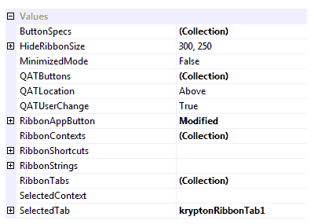
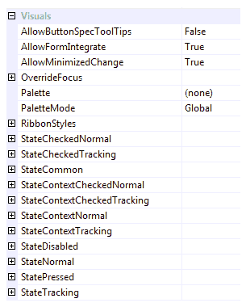

# Ribbon Overview

The *Ribbon* control is used to emulate the user interface found in many of the the Microsoft Office 2007/2010/2013/2016 and Microsoft 365 applications such as Word and Excel. Included are all the main features you would expect such as chrome integration, contextual tabs, full keyboard access and much more.

## Ribbon Values Properties
Figure 1 shows a list of the Values category properties related to the ribbon control. Following is a description of how to use each of the properties along with relevant links to more detailed explanations.

*Figure 1 - Ribbon Values Properties*

**ButtonSpecs**

You can use the ButtonSpecs collection to add extra buttons onto the tab bar of the ribbon. The tab bar is the area where tab headers and contextual tab headers appear. This is a common requirement as many applications will want to place a help button on the right side of the tab bar just like that present in *Word 2007* and *Excel 2007* or later. You can get more details about using this property at the following [link](ButtonSpecs.md).

**HideRibbonSize**

The ribbon control takes up quite a fair chunk of screen real estate and once the user resizes the owning window down to a particular size it makes more sense to hide the ribbon entirely. This property is used to determine at what height and width the ribbon will automatically hide itself. Once the owning window is resized bigger than this size then it will become visible again.

**MinimizedMode**

By default the ribbon is fully visible but you can toggle the control into a minimized mode in order to save space. The user can do this at runtime by double clicking one of the tab headers or using the *CTRL + F1* key combination. Use this property to toggle the mode using code or at design time.

**QATButtons**

**QATLocation**

**QATUserChange**

These three properties control the quick access toolbar that by default is placed at the top of the ribbon control adjacent to the application button. You would typically use the quick access toolbar for common actions that the user always needs access to whatever tab is currently selected. For more information about these properties using this [link](KryptonRibbonQuickAccessToolbar.md).

**RibbonAppButton**

The application button is the large round button that appears at the top left of the ribbon control. This button is always displayed and when possible integrated into the caption area of the owning *Form* instance. When using the ribbon you should not use a menu or toolbar strip and so this button acts as the equivalent of the *File* menu that would usually appear in a typical application. You can get more details about the application button and these properties at the following [link](KryptonRibbonApplicationButton.md).

**RibbonContexts**

If using contextual tabs in your application then you need to use this collection property to define each of the different contexts required. Once you have defined the contexts you should update the ContextName property of each relevant tab to associate it with the appropriate context definition. Finally update the *SelectedContext* property, described below, to define the currently displayed context. For more information use the following [link](KryptonRibbonContextualTabs.md).

**RibbonShortcuts**

This is a compound property that has a set of child properties for defining individual shortcuts. Update the child values in order to define which key combinations are used to enter keyboard mode and to switch to/from minimized modes.

**RibbonStrings**

All display strings used by the control are placed inside this compound property. This is important as it allows the developer to localize the text strings for different languages by changing the form level culture. Most of the strings inside this compound property related to the context menus that the ribbon shows.

**RibbonTabs**

This is the root property used to define individual tabs for the ribbon. As a collection property you can use it to add/remove and update tab instances. Each tab itself has a Groups property for defining the contents of the tab when it is selected. For more detail use the following [link](KryptonRibbonTabs.md).

**SelectedContext**

When using contextual tabs you use this property to define which contexts are currently displayed. The value is a comma separated list of context names where the contexts are displayed in the same order as they appear in the property. For mode information use the following [link](KryptonRibbonContextualTabs.md).

**SelectedTab**

Use this property to define which of the displayed tabs should be the currently selected tab. If you attempt to set a tab that is not possible to be displayed then it will throw an exception.

## Ribbon Visuals Properties
Figure 2 shows a list of the Visuals category properties related to the ribbon control. Following is a description of how to use each of the properties along with relevant links to more detailed explanations.

*Figure 2 - Ribbon Visuals Properties*

**AllowButtonSpecTooltips**

By default the Ribbon will not show any tool tips when you hover the mouse over the user defined button specifications that appear on the tabs line of the control. If you set this boolean property to *True* then it will turn on tool tips for those button specs. Use the ButtonSpec.TooltipText property in order to define the string you would like to appear inside the displayed tool tip.

**AllowMinimizedChange**

Determines if the user is allowed to change the minimized mode of the ribbon at runtime. They can do this using the keyboard combination *Ctrl+F1*, double clicking a page header or by using one of the appropriate context menu options. Set this property to False to prevent the user changing the mode. Note that this property does not prevent programmatic changing of the *MinimizedMode* property.

**RibbonStyles**

This compound property contains a list of the different styles that can be changed. For example you can change the background style from the default of *Panel - Client* if you prefer a different background that is appropriate for your application. Alternatively you could alter the display style of the group buttons, cluster buttons or various other ribbon elements.

**Ten States**

As with all the *Krypton* controls, each possible state of the control has a set of properties that can be used to customize the appearance. For the ribbon there are ten possible states that various elements can be in but not all the elements use all the states. The ten states are named *StateDisabled*, *StateNormal*, *StateTracking*, *StatePressed*, *StateCheckedNormal*, *StateCheckedTracking*, *StateContextCheckedNormal*, *StateContextCheckedTracking*, *StateContextNormal* and *StateContextTracking*.

**Common State**

To speed up the customization process an extra *StateCommon* property has been provided. The settings from this are used if no override has been defined for the state specific entry. Note that the specific state values always take precedence and so if you define a property in both the *StateNormal* and *StateCommon* sets then the *StateNormal* value will be used whenever the control is in the *Normal* state. Only if the *StateNormal* value is not overridden will it look in *StateCommon*.

**Override State**

There is an additional state related property called *OverrideFocus* is used to alter the appearance of the control when it has the focus. Notice that the property starts with the *Override* prefix instead of the usual *State*. This is because it does not relate to a specific control state such as *Normal* or *Tracking*. Instead it is applied to any of the other states and is used to override the appearance that would otherwise be shown.
