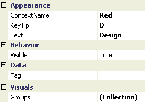

# Ribbon Tabs

The ribbon is similar to a *TabControl* in that it has a set of tabs that are represented via headers. Headers are shown at the top of the ribbon control and presented from left to right. The ordering of the headers matches the ordering of non-contextual tabs in the *RibbonTabs* collection.  Note that contextual tabs are always displayed at the end of the headers in related groupings and so contextual tabs do not honor the ordering of the instances inside the *RibbonTabs* collection. 

To view the properties for a tab at design time you just need to left click the tab header in the ribbon control and then use the *Properties* window to view and modify them. Alternatively you can use the *Document Outline* window to select the tab instance of interest and then use the Properties window.

**Ribbon Tab Properties**

You can see in Figure 1 the ribbon properties relating to an individual tab.

Figure 1 - Ribbon Tab Properties

 

**ContextName**

A non-contextual tab will leave this property empty because the tab does not belong to a context. If you want to associate this tab with a *RibbonContext* then you should set the same name in this property as is defined in the *RibbonContext.ContextName*. In that case the tab will only be displayed is the *SelectedContext* property of the ribbon control contains the *RibbonContext.ContextName*.

**KeyTip**

When entering *KeyTips* mode each visible tab will show a *KeyTip* pop up with the string defined in this property. You should provide a unique *KeyTip* value for each tab in the ribbon control to ensure that all the tabs can be accessed via the keyboard. If multiple tabs have the same *KeyTip* then pressing the *KeyTip* will action the first tab that matches.

**Text**

This is the display text for the tab and will appear in the header of the ribbon control when the tab is visible. The property is localizable so that you can define different values for different culture settings. A value must always be provided for this property, if you attempt to set an empty string it will default to *Tab* instead.

**Visible**

A default value of *True* ensures the tab is make visible. Note that a contextual tab will not be visible if the associated context is not selected regardless of the *Visible* property value.

**Groups**

Each tab instance contains a collection of groups that are displayed below the tab header when the tab is selected. Use this collection to add, remove and modify the displayed groups for the tab. To manipulate the set of child groups at design time you are recommend to use the helper elements that appear on the ribbon control and not to use the collection editor.

**Tag**

Associate application specific information with the object instance by using this property.
