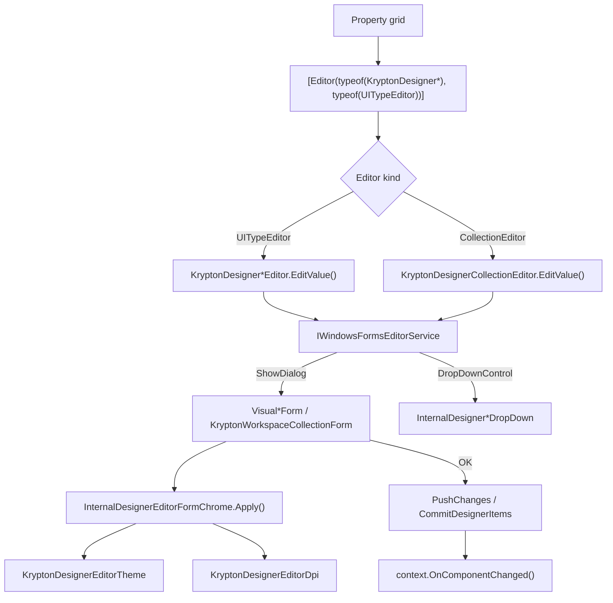

# Krypton Designer Editors

## Overview

Issue [#3849](https://github.com/Krypton-Suite/Standard-Toolkit/issues/3849) replaces native WinForms designer property and collection editors (`System.Windows.Forms.Design.*`, `System.ComponentModel.Design.*`) with **Krypton-themed modal dialogs** hosted on `KryptonForm`. The original driver was the workspace sequence collection editor, which previously used native `Button`, `TreeView`, and `PropertyGrid` controls and did not participate in Krypton palette integration at design time.

The V110 implementation delivers:

- **Themed editor UI** — `KryptonButton`, `KryptonTreeView`, `KryptonPropertyGrid`, `KryptonListBox`, and related controls inside `KryptonForm` chrome.
- **Palette inheritance** — editors resolve and apply the owning component's local palette (or the global manager palette) when opened from the property grid.
- **DPI-aware layout** — editor sizes are authored at 96 DPI and scaled at runtime via `KryptonDesignerEditorDpi`.
- **Public extension APIs** — `KryptonDesignerCollectionEditor`, `KryptonDesignerStandardCollectionEditor`, `KryptonDesignerEditorTheme`, `KryptonDesignerEditorDpi`, and related helpers for consumer components and third-party Krypton extensions.
- **Reusable dialog chrome** — shared content panel and footer button bar (`kpnlContent`, `kpnlButtonBar`) with optional local theme selector.

### Packages and assemblies

| Assembly | Role |
|----------|------|
| `Krypton.Toolkit` | Core editor infrastructure, most `KryptonDesigner*` editors, all `Visual*` editor forms under `Controls Visuals/Editors/` |
| `Krypton.Workspace` | `KryptonWorkspaceCollectionForm` + `KryptonWorkspaceCollectionEditor` for workspace sequence editing |
| `Krypton.Ribbon` / `Krypton.Navigator` | Assembly-specific collection editors that subclass toolkit bases |

All public APIs described here ship in **`Krypton.Toolkit`** unless noted otherwise. Target frameworks: `net472` through current `-windows` TFMs supported by the suite.

---

## Architecture

### End-to-end flow



### Collection editor lifecycle

1. Property grid invokes `KryptonDesignerCollectionEditor.EditValue(context, provider, value)`.
2. Editor calls abstract `CreateKryptonDesignerCollectionForm()` and receives a `VisualDesignerCollectionForm` subclass.
3. `form.InitializeEditValue(value)` extracts items via the editor's `GetItems` / `ExtractItems` bridge.
4. `OnEditValueChanged()` loads UI (tree, list, property grid, etc.).
5. User edits a working copy of items in the form.
6. OK triggers `CommitDesignerItems()` → `ApplyDesignerItems` / `SetItems` on the editor.
7. `EditValue` returns the updated collection instance.

`KryptonDesignerCollectionEditor` **intentionally does not** use the base `CollectionEditor.CreateCollectionForm()` path. Calling it throws `NotSupportedException` because the native `CollectionForm` cannot provide Krypton chrome.

### UITypeEditor lifecycle

**Modal editors** (`UITypeEditorEditStyle.Modal`):

- `IWindowsFormsEditorService.ShowDialog(form)` — multiline string, format string, image picker, check-button set.

**Drop-down editors** (`UITypeEditorEditStyle.DropDown`):

- `IWindowsFormsEditorService.DropDownControl(control)` — image index, masked text, data binding member pickers.

### Native bridge (gradual migration)

`KryptonDesignerNativeUITypeEditor` and `KryptonDesignerNativeCollectionEditor` forward to native WinForms editors via reflection (`KryptonDesignerNativeEditorBridge`). These are public escape hatches for properties that have not yet been migrated. No toolkit properties currently subclass them; new work should prefer fully Krypton-themed editors.

---

## Public API reference

### `VisualDesignerCollectionForm`

**Namespace:** `Krypton.Toolkit`  
**Base:** `KryptonForm`  
**Access:** `public abstract`

Krypton replacement for the designer `CollectionForm`. Collection editors should return a subclass from `CreateKryptonDesignerCollectionForm()`.

| Member | Description |
|--------|-------------|
| `protected VisualDesignerCollectionForm()` | Parameterless ctor for WinForms designer surface of the form itself. Sets `ControlBox = false`, `StartPosition = CenterScreen`. |
| `protected VisualDesignerCollectionForm(KryptonDesignerCollectionEditor editor)` | Runtime ctor; stores owning editor. |
| `protected KryptonDesignerCollectionEditor Editor` | Owning editor. Throws outside a design-time session. |
| `public ITypeDescriptorContext? Context` | Designer context from the editor. |
| `public object? EditValue { get; private set; }` | Collection instance being edited. |
| `public object[]? Items { get; protected set; }` | Root items displayed in the editor UI. |
| `public void InitializeEditValue(object? value)` | Loads `EditValue` and `Items` from the collection; calls `OnEditValueChanged()`. |
| `protected object CreateInstance(Type itemType)` | Creates a new collection item via the editor. |
| `protected void DestroyInstance(object instance)` | Destroys a collection item via the editor. |
| `protected new object? GetService(Type serviceType)` | Designer services (e.g. `IDesignerHost`). |
| `protected virtual void OnEditValueChanged()` | Hook after items are loaded; override to populate UI. |
| `protected void ApplyOwnerPalette(PaletteMode, KryptonCustomPaletteBase?)` | Sets form palette and recurses `ApplyPalette`. |
| `protected void ConfigureDesignerDpi()` | Calls `KryptonDesignerEditorDpi.Configure(this)` once. |
| `protected void ApplyOwnerPaletteFromContext()` | `KryptonDesignerEditorTheme.ApplyFromContext(this, Context)`. |
| `protected void CommitDesignerItems()` | Writes `Items` back through the editor. |
| `public static void ApplyPalette(ControlCollection, PaletteMode, KryptonCustomPaletteBase?)` | Recurses `VisualControlBase` descendants. **Skips** `KryptonPropertyGrid` so the inner WinForms grid is not recreated before layout completes. |

`OnLoad` calls `ConfigureDesignerDpi()`. `OnShown` calls `KryptonDesignerEditorDpi.ApplyOnShown(this)`.

---

### `KryptonDesignerCollectionEditor`

**Namespace:** `Krypton.Toolkit`  
**Base:** `System.ComponentModel.Design.CollectionEditor`  
**Access:** `public abstract`

| Member | Description |
|--------|-------------|
| `protected KryptonDesignerCollectionEditor(Type type)` | Passes collection item type to base `CollectionEditor`. |
| `protected abstract VisualDesignerCollectionForm CreateKryptonDesignerCollectionForm()` | Factory for the themed dialog. |
| `public override object? EditValue(...)` | Shows form via `IWindowsFormsEditorService`; returns updated value on OK. |
| `protected override CollectionForm CreateCollectionForm()` | Always throws `NotSupportedException`. |

Internal bridge methods (`ExtractItems`, `CreateDesignerInstance`, `DestroyDesignerInstance`, `GetDesignerService`, `ApplyDesignerItems`, `GetDesignerDisplayText`, `GetDesignerNewItemTypes`, `DesignerCollectionItemType`) expose `CollectionEditor` protected members to `VisualDesignerCollectionForm` without widening the public surface.

---

### `KryptonDesignerStandardCollectionEditor`

**Namespace:** `Krypton.Toolkit`  
**Base:** `KryptonDesignerCollectionEditor`  
**Access:** `public abstract`

Standard members-list + property-grid collection editor. Always hosts `VisualStandardCollectionForm`.

| Member | Description |
|--------|-------------|
| `protected KryptonDesignerStandardCollectionEditor(Type collectionType)` | Item type for the collection. |
| `protected override VisualDesignerCollectionForm CreateKryptonDesignerCollectionForm()` | Returns `new VisualStandardCollectionForm(this)`. |
| `internal virtual void OnDesignerItemRemoving(object? item)` | Pre-remove hook; override for specialized cleanup (e.g. `KryptonListView` columns). |

**Usage:**

```csharp
public sealed class MyItemCollectionEditor : KryptonDesignerStandardCollectionEditor
{
    public MyItemCollectionEditor() : base(typeof(MyItem)) { }
}

// On the property:
[Editor(typeof(MyItemCollectionEditor), typeof(UITypeEditor))]
public MyItemCollection Items { get; set; }
```

---

### `KryptonDesignerEditorTheme`

**Namespace:** `Krypton.Toolkit`  
**Access:** `public static`

Resolves and applies palettes for designer editor dialogs. **Theme selector changes affect only the open editor** — they do not modify the edited component or `KryptonManager.GlobalPaletteMode`.

| Method | Description |
|--------|-------------|
| `ResolveFromContext(context, out paletteMode, out customPalette)` | Owner local palette when set and not `Global`; else `KryptonManager.CurrentGlobalPaletteMode` / `CurrentGlobalPalette`. |
| `ApplyToForm(form, paletteMode, customPalette)` | Sets form palette, recurses via `VisualDesignerCollectionForm.ApplyPalette`, syncs footer theme combo. |
| `ApplyFromContext(form, context)` | Resolve + apply in one call. |
| `WireThemeSelector(combo, form, initialMode, initialCustom)` | Wires an existing `KryptonComboBox` (name `kcmbDesignerEditorTheme`) to restyle only the editor. |
| `CreateThemeSelector(form, initialMode, initialCustom)` | Creates and wires a new theme combo. |

**Owner palette resolution** (`TryGetOwnerPalette`):

| `context.Instance` type | Palette source |
|---------------------------|----------------|
| `VisualControlBase` | `PaletteMode` / `LocalCustomPalette` |
| `DataGridViewColumn` on `KryptonDataGridView` | Grid `PaletteMode` / `Palette` |
| `KryptonContextMenu` | Context menu `PaletteMode` / `LocalCustomPalette` |

---

### `KryptonDesignerEditorDpi`

**Namespace:** `Krypton.Toolkit`  
**Access:** `public static`

| Method | Description |
|--------|-------------|
| `Configure(Form form)` | `AutoScaleMode = Dpi`, baseline 96 DPI. |
| `ApplyOnShown(Form form)` | Invalidates DPI cache, refreshes `KryptonPropertyGrid` layout, `PerformLayout()`. |
| `GetDpiFactor(Form form)` | Scale factor relative to 96 DPI. |
| `Scale(Form form, int designPixels)` | Scales a single dimension authored at 96 DPI. |
| `Scale(Form form, Size designSize)` | Scales a `Size` authored at 96 DPI. |

**Convention:** author `ClientSize`, button sizes, padding, and spacing at **96 DPI**; call `KryptonDesignerEditorDpi.Scale(this, …)` in the runtime constructor.

---

### `KryptonDesignerEditorContentPanel`

**Namespace:** `Krypton.Toolkit`  
**Access:** `public static`

| Method | Description |
|--------|-------------|
| `Create(Form owner, Control content)` | Fill-docked `KryptonPanel` (`PanelClient`, name `kpnlDesignerEditorContent`) with DPI-scaled padding. |

Used when building editors imperatively. Migrated `Visual*` forms prefer declaring `kpnlContent` in `*.Designer.cs` and calling `InternalDesignerEditorFormChrome.Apply`.

---

### `KryptonDesignerNativeUITypeEditor` / `KryptonDesignerNativeCollectionEditor`

**Namespace:** `Krypton.Toolkit`  
**Access:** `public abstract`

Forward all `UITypeEditor` / `CollectionEditor` members to a native WinForms editor resolved by short type name from `System.Windows.Forms.Design`.

```csharp
public sealed class MyNativeEditor : KryptonDesignerNativeUITypeEditor
{
    protected override string NativeEditorTypeName => nameof(FormatStringEditor);
}
```

Prefer fully Krypton-themed editors for new work.

---

## Internal infrastructure (maintainer reference)

These types are `internal` but central to every migrated form.

| Type | Location | Role |
|------|----------|------|
| `InternalDesignerEditorFormChrome` | `View Base/Internal/Editors/` | `Apply(form, kpnlContent, kpnlButtonBar)` — theme selector visibility, DPI on footer, `AcceptButton` / `CancelButton`. |
| `InternalDesignerEditorButtonBarPanel` | `View Base/Internal/Editors/` | Footer: `KryptonBorderEdge`, theme combo (`kcmbDesignerEditorTheme`), OK/Cancel, `flpExtraButtons` host. |
| `KryptonDesignerEditorButtonBar` | `Designers/Controls Visuals/` | Factory for programmatic footer construction. |
| `KryptonDesignerPropertyGridSite` | `Designers/Editors/KryptonDesignerStandardCollectionEditor.cs` | `ISite` + `IServiceProvider` so `KryptonPropertyGrid` can access designer services. |
| `KryptonDesignerEditorPalette` | `Designers/Editors/KryptonDesignerMultilineStringEditor.cs` | `ApplyDesignerPalette` + injects theme combo into legacy multiline `kpnlButtons` panel when needed. |
| `DesignModeHelper` | `Utilities/DesignModeHelper.cs` | `IsInDesignMode` (`devenv` + design license); `IncludeDesignerEditorThemeSelector` (hidden in VS 2022). |

### Dialog chrome layout

```
KryptonForm
├── kpnlContent          (KryptonPanel, Dock=Fill, PanelClient, Padding≈9)
│   └── [editor-specific content]
└── kpnlButtonBar        (InternalDesignerEditorButtonBarPanel, Dock=Bottom)
    ├── kbEdge           (top separator, HeaderPrimary)
    ├── kcmbTheme        (name: kcmbDesignerEditorTheme; optional)
    ├── flpExtraButtons  (Move/Delete/Add toolbar buttons)
    ├── kbtnCancel
    └── kbtnOk
```

**Standard wiring** in `ConfigureDesignerChrome()`:

```csharp
private void ConfigureDesignerChrome()
{
    InternalDesignerEditorFormChrome.Apply(this, kpnlContent, kpnlButtonBar);
    kpnlButtonBar.OkButton.Values.Text = KryptonManager.Strings.GeneralStrings.OK;
    kpnlButtonBar.CancelButton.Values.Text = KryptonManager.Strings.GeneralStrings.Cancel;
    kpnlButtonBar.OkButton.Click += (_, _) => PushChanges(); // or CommitDesignerItems + OnComponentChanged
}
```

**Dual constructors:** every migrated form provides:

1. **Parameterless** — opens in the WinForms designer for layout work (`SetInheritedControlOverride()`, `InitializeComponent()`, `ConfigureDesignerChrome()`).
2. **Runtime** — accepts `ITypeDescriptorContext` or `KryptonDesignerCollectionEditor`; loads values, applies palette, sets scaled `ClientSize`.

### `DesignModeHelper` — design host detection

**Location:** `Krypton.Toolkit/Utilities/DesignModeHelper.cs` (internal)

`DesignModeHelper` runs once in its static constructor and caches two flags used by designer-editor chrome and other toolkit code.

#### `IsInDesignMode`

```csharp
IsInDesignMode = LicenseManager.UsageMode == LicenseUsageMode.Designtime
    && Process.GetCurrentProcess().ProcessName == "devenv";
```

True only when the process is Visual Studio (`devenv`) **and** the current app domain is in design-time license mode. This is **not** the same as `Control.DesignMode` on an individual control.

**Consumers:** `BlurManager` (skips blur effects inside the VS designer). Do not use this flag for theme-selector visibility — use `IncludeDesignerEditorThemeSelector` instead.

#### `IncludeDesignerEditorThemeSelector`

```csharp
IncludeDesignerEditorThemeSelector = !IsInDesignMode
    || !TryGetHostingVisualStudioMajorVersion(out var majorVersion)
    || majorVersion != 17;
```

The theme selector is **hidden** only when all of the following are true:

1. Running inside `devenv` at design time (`IsInDesignMode`), **and**
2. `devenv.exe` product version major can be read, **and**
3. That major version is **17** (Visual Studio 2022).

If version detection fails (`TryGetHostingVisualStudioMajorVersion` returns `false`), the selector **remains visible** (safe default).

| Host | `IsInDesignMode` | VS major | Theme selector |
|------|------------------|----------|----------------|
| TestForm / standalone app | `false` | — | Shown |
| VS 2022 designer | `true` | 17 | **Hidden** |
| VS 2026+ designer | `true` | 18+ | Shown |
| VS 2019 designer | `true` | 16 | Shown |
| `devenv` but version unreadable | `true` | — | Shown |

**Rationale:** VS 2022 footer space is constrained, and the editor already inherits the owner palette from `KryptonDesignerEditorTheme.ApplyFromContext`. The local combo is a preview convenience, not required for correct initial theming.

**Consumers:**

| Call site | Effect |
|-----------|--------|
| `InternalDesignerEditorFormChrome.Apply` | Sets `buttonBar.IncludeThemeSelector` before wiring |
| `KryptonDesignerEditorButtonBar.Create` | Default `includeThemeSelector` parameter |
| `KryptonDesignerMultilineStringEditor` | Skips injecting theme combo into legacy `kpnlButtons` panel |

Version detection reads `FileVersionInfo.GetVersionInfo(devenv.MainModule.FileName).ProductVersion` and parses the major segment before the first `.` (e.g. `17.11.35219.272` → `17`).

---

## Built-in editor forms

All toolkit forms live under `Source/Krypton Components/Krypton.Toolkit/Controls Visuals/Editors/`.

| Form | Base class | Edited property / collection | Opening editor(s) |
|------|------------|------------------------------|-------------------|
| `VisualStandardCollectionForm` | `VisualDesignerCollectionForm` | Generic `IList` / typed collections | All `KryptonDesignerStandardCollectionEditor` subclasses |
| `VisualTreeNodeCollectionForm` | `VisualDesignerCollectionForm` | `TreeNode` hierarchy | `KryptonDesignerTreeNodeCollectionEditor` |
| `VisualBreadCrumbItemsForm` | `VisualDesignerCollectionForm` | `KryptonBreadCrumbItem` children | `KryptonBreadCrumbItemsEditor` |
| `VisualContextMenuCollectionForm` | `VisualDesignerCollectionForm` | Context menu item collections | `KryptonContextMenuCollectionEditor`, `KryptonContextMenuItemCollectionEditor` |
| `VisualCheckButtonCollectionForm` | `KryptonForm` | `KryptonCheckSet.CheckButtons` membership | `KryptonCheckButtonCollectionEditor` |
| `VisualMultilineStringEditorForm` | `KryptonForm` | `string`, `string[]`, `StringCollection` | `KryptonDesignerMultilineStringEditor`, `KryptonDesignerStringArrayEditor`, `KryptonDesignerStringCollectionEditor`, `KryptonDesignerListControlStringCollectionEditor` |
| `VisualDesignerFormatStringEditorForm` | `KryptonForm` | `DataGridViewCellStyle.Format` / `NullValue`, `ListControl.FormatString` | `KryptonDesignerFormatStringEditor` |
| `VisualSelectResourceForm` | `KryptonForm` | `Image` properties | `KryptonDesignerImageEditor` |
| `KryptonWorkspaceCollectionForm` | `VisualDesignerCollectionForm` | `KryptonWorkspaceSequence.Children` | `KryptonWorkspaceCollectionEditor` (`Krypton.Workspace`) |

### Drop-down hosts (`View Base/Internal/Editors/`)

| Control | Editor | Purpose |
|---------|--------|---------|
| `InternalDesignerImageIndexDropDown` | `KryptonDesignerImageIndexEditor` | `ImageList` index/key picker |
| `InternalDesignerMaskedTextBoxTextEditorDropDown` | `KryptonDesignerMaskedTextBoxTextEditor` | Masked text preview/edit |
| `InternalDesignerDesignBindingPicker` | `KryptonDesignerDataMemberFieldEditor`, `KryptonDesignerDataSourceListEditor` | Data source / member tree |

### Form highlights

#### `VisualStandardCollectionForm`

- Two-column layout: members (`KryptonListBox`) + properties (`KryptonPropertyGrid`).
- Add/Remove buttons in the members pane footer (not a full-width second row).
- Column split 42% / 58%; members pane `MinimumSize` width 250px.
- Multi-type collections open an embedded type-picker sub-dialog via `KryptonDesignerEditorButtonBar.Create`.

#### `VisualTreeNodeCollectionForm`

- `KryptonTreeView` with Add Root, Add Child, Delete, Move Up/Down.
- Clones `TreeNode` hierarchy preserving designer `NextNode` counter via `IDictionaryService`.
- Copies `ImageList` / check-box settings from the design-time `KryptonTreeView`.

#### `VisualContextMenuCollectionForm`

- Hierarchical tree of all `KryptonContextMenu` item types (14 creatable types).
- Move/add/delete with typed icons; syncs container references on commit.

#### `VisualBreadCrumbItemsForm`

- Tree of `KryptonBreadCrumbItem` nodes; `CrumbProxy` limits property grid surface.
- Container sync on structural changes.

#### `VisualMultilineStringEditorForm`

- `KryptonRichTextBox` or multiline `KryptonTextBox` depending on edit mode.
- Cut/copy/paste/select-all context menus using `KryptonManager` strings.

#### `VisualDesignerFormatStringEditorForm`

Format-type presets:

| Combo index | Label | Preset |
|-------------|-------|--------|
| 0 | No formatting | *(empty)* |
| 1 | Numeric | `N2` |
| 2 | Decimal | `D0` |
| 3 | Currency | `C2` |
| 4 | Date | `d` |
| 5 | Time | `t` |
| 6 | Percent | `P2` |
| 7 | Custom | unchanged |

`GuessFormatTypeIndex` uses a heuristic for `d`/`D` ambiguity (format string alone does not reveal value type): lowercase `d` → Date; `D`, `D0`, `D2`, … → Decimal. Preview uses a fixed `double` sample — date/time presets may not render meaningfully in preview.

#### `VisualSelectResourceForm`

- Local file, project resource, and import paths.
- Image preview; writes selected `Image` back to the property.

#### `KryptonWorkspaceCollectionForm`

- `KryptonTreeView` of `KryptonWorkspacePage`, `KryptonWorkspaceCell`, and nested `KryptonWorkspaceSequence` nodes.
- Toolbar: move, add page/cell/sequence, delete.
- `PageProxy` / `CellProxy` / `SequenceProxy` reduce property grid surface.
- Suspends workspace layout during editing to avoid designer flicker.

---

## Built-in `KryptonDesigner*` editors

### Collection editors

| Class | Assembly | Item type | Form |
|-------|----------|-----------|------|
| `KryptonDesignerStandardCollectionEditor` | Toolkit | *(abstract)* | `VisualStandardCollectionForm` |
| `KryptonDesignerButtonSpecAnyCollectionEditor` | Toolkit | `ButtonSpecAny` | Standard |
| `KryptonDesignerButtonSpecHeaderGroupCollectionEditor` | Toolkit | `ButtonSpecHeaderGroup` | Standard |
| `KryptonDesignerButtonSpecNavigatorCollectionEditor` | Navigator | `ButtonSpecAny` | Standard |
| `KryptonDesignerButtonSpecAppMenuCollectionEditor` | Ribbon | app menu specs | Standard |
| `KryptonDesignerTreeNodeCollectionEditor` | Toolkit | `TreeNode` | `VisualTreeNodeCollectionForm` |
| `KryptonDesignerColumnHeaderCollectionEditor` | Toolkit | `ColumnHeader` | Standard |
| `KryptonDesignerListViewItemCollectionEditor` | Toolkit | `ListViewItem` | Standard |
| `KryptonDesignerListViewGroupCollectionEditor` | Toolkit | `ListViewGroup` | Standard |
| `KryptonDesignerStringListCollectionEditor` | Toolkit | `string` in `IList<string>` | Standard |
| `KryptonTaskDialogCommandLinkButtonsCollectionEditor` | Toolkit | `InternalKryptonCommandLinkButton` | Standard |
| `KryptonBreadCrumbItemsEditor` | Toolkit | `KryptonBreadCrumbItem` | `VisualBreadCrumbItemsForm` |
| `KryptonContextMenuCollectionEditor` | Toolkit | `KryptonContextMenuCollection` | `VisualContextMenuCollectionForm` |
| `KryptonContextMenuItemCollectionEditor` | Toolkit | `KryptonContextMenuItemCollection` | `VisualContextMenuCollectionForm` |
| `KryptonWorkspaceCollectionEditor` | Workspace | `KryptonWorkspaceCollection` | `KryptonWorkspaceCollectionForm` |

### UITypeEditors

| Class | Style | Form / control |
|-------|-------|----------------|
| `KryptonDesignerMultilineStringEditor` | Modal | `VisualMultilineStringEditorForm` |
| `KryptonDesignerStringArrayEditor` | Modal | same (lines mode) |
| `KryptonDesignerStringCollectionEditor` | Modal | same |
| `KryptonDesignerListControlStringCollectionEditor` | Modal | same |
| `KryptonDesignerFormatStringEditor` | Modal | `VisualDesignerFormatStringEditorForm` |
| `KryptonDesignerImageEditor` | Modal | `VisualSelectResourceForm` |
| `KryptonDesignerImageIndexEditor` | Drop-down | `InternalDesignerImageIndexDropDown` |
| `KryptonDesignerMaskedTextBoxTextEditor` | Drop-down | `InternalDesignerMaskedTextBoxTextEditorDropDown` |
| `KryptonDesignerDataMemberFieldEditor` | Drop-down | `InternalDesignerDesignBindingPicker` |
| `KryptonDesignerDataSourceListEditor` | Drop-down | same |
| `KryptonDesignerFolderNameEditor` | Modal | `KryptonFolderBrowserDialog` |
| `KryptonDesignerSelectedPathEditor` | Modal | same |
| `KryptonInitialDirectoryEditor` | Modal | same |
| `KryptonCheckButtonCollectionEditor` | Modal | `VisualCheckButtonCollectionForm` |

---

## Wiring status (V110 vs V120 LTS)

### Fully wired (Krypton editor active on toolkit properties)

- Workspace sequence `Children` (`Krypton.Workspace`)
- Context menu collections and nested item collections
- Breadcrumb `Items`
- `KryptonCheckSet.CheckButtons`
- String / `StringCollection` on combo box, list box, checked list box, data grid columns, task dialog combo, ribbon domain up-down
- Multiline / `Lines` on `KryptonRichTextBox` and ribbon rich text
- `KryptonDesignerImageEditor` across toolkit, ribbon, navigator image properties
- `ButtonSpec` collections on forms, headers, text boxes, month calendar, ribbon, navigator pages
- `KryptonFolderBrowserDialog.InitialDirectory` ( .NET 8+ TFM )

### Implemented API, not yet wired (`// ToDo V120 LTS:` in source)

Replace native `[Editor(@"System.Windows.Forms.Design.*")]` attributes:

| Native editor | Krypton replacement | Example properties |
|---------------|---------------------|-------------------|
| `MultilineStringEditor` | `KryptonDesignerMultilineStringEditor` | `KryptonTextBox.Text`, labels, headers, tooltips, commands |
| `StringArrayEditor` | `KryptonDesignerStringArrayEditor` | `KryptonTextBox.Lines` |
| `FormatStringEditor` | `KryptonDesignerFormatStringEditor` | `KryptonComboBox.FormatString`, `KryptonListBox` |
| `MaskedTextBoxTextEditor` | `KryptonDesignerMaskedTextBoxTextEditor` | `KryptonMaskedTextBox.Text` |
| `DataMemberFieldEditor` | `KryptonDesignerDataMemberFieldEditor` | `DisplayMember`, `ValueMember` |
| `TreeNodeCollectionEditor` | `KryptonDesignerTreeNodeCollectionEditor` | `KryptonTreeView.Nodes` |
| `ColumnHeaderCollectionEditor` etc. | `KryptonDesignerListView*CollectionEditor` | `KryptonListView` collections |
| `ImageIndexEditor` | `KryptonDesignerImageIndexEditor` | Tree view image indices |

Search the codebase for `ToDo V120 LTS` to find every call site.

### Legacy paths to retire (V120 LTS)

- `VisualMultilineStringEditorAlternateForm` — inline `KryptonTextBox` popup; align with `KryptonDesignerMultilineStringEditor`.
- `InternalKryptonStringCollectionEditor` — legacy `UserControl` host; consolidate with `VisualMultilineStringEditorForm`.
- `MultilineStringEditor1` — imperative inline popup on `KryptonTextBox`.

---

## Extending for consumer components

### Quick path: standard collection

```csharp
// 1. Editor
public sealed class WidgetCollectionEditor : KryptonDesignerStandardCollectionEditor
{
    public WidgetCollectionEditor() : base(typeof(Widget)) { }
}

// 2. Property
[Editor(typeof(WidgetCollectionEditor), typeof(UITypeEditor))]
public WidgetCollection Widgets { get; set; }
```

### Custom collection UI

```csharp
// Editor
public sealed class WidgetCollectionEditor : KryptonDesignerCollectionEditor
{
    public WidgetCollectionEditor() : base(typeof(Widget)) { }

    protected override VisualDesignerCollectionForm CreateKryptonDesignerCollectionForm() =>
        new WidgetCollectionForm(this);
}

// Form
internal partial class WidgetCollectionForm : VisualDesignerCollectionForm
{
    public WidgetCollectionForm() : base() { InitializeComponent(); ConfigureDesignerChrome(); }
    public WidgetCollectionForm(WidgetCollectionEditor editor) : base(editor) { /* ... */ }

    protected override void OnEditValueChanged() { /* populate UI from Items */ }

    private void OnOkClick(object? sender, EventArgs e)
    {
        // Update Items from UI
        CommitDesignerItems();
        Context?.OnComponentChanged();
    }
}
```

### Custom modal UITypeEditor

```csharp
public sealed class WidgetEditor : UITypeEditor
{
    public override UITypeEditorEditStyle GetEditStyle(ITypeDescriptorContext? context) =>
        UITypeEditorEditStyle.Modal;

    public override object? EditValue(ITypeDescriptorContext? context, IServiceProvider provider, object? value)
    {
        if (provider.GetService(typeof(IWindowsFormsEditorService)) is not IWindowsFormsEditorService svc)
        {
            return value;
        }

        using var form = new WidgetEditorForm(context);
        return svc.ShowDialog(form) == DialogResult.OK ? form.Result : value;
    }
}
```

### Custom form checklist

1. Inherit `KryptonForm` or `VisualDesignerCollectionForm`.
2. Split into `*.cs` + `*.Designer.cs`; declare `kpnlContent` and `kpnlButtonBar` in the designer file.
3. Call `InternalDesignerEditorFormChrome.Apply(this, kpnlContent, kpnlButtonBar)` from `ConfigureDesignerChrome()`.
4. Override `OnLoad` → `KryptonDesignerEditorDpi.Configure(this)` (or use collection base `OnLoad`).
5. Override `OnShown` → `KryptonDesignerEditorDpi.ApplyOnShown(this)`.
6. `KryptonDesignerEditorTheme.ApplyFromContext(this, context)` after loading initial values.
7. Scale sizes: `KryptonDesignerEditorDpi.Scale(this, new Size(…))`.
8. Wire OK to commit **before** `DialogResult.OK` is processed.
9. Provide a parameterless ctor for the WinForms designer surface.

---

## Edge cases and threading

| Topic | Behavior |
|-------|----------|
| **Threading** | All editors run on the UI thread inside `devenv` or the hosting designer; no background threading. |
| **TFM differences** | `KryptonInitialDirectoryEditor` is conditional on .NET 8+ for folder browser initial directory. Core editor APIs are `net472`-compatible. |
| **Property grid site** | Assign `KryptonPropertyGrid.Site = new KryptonDesignerPropertyGridSite(Context, selectedObject)` so type converters and designers resolve services. |
| **Palette on property grid** | `ApplyPalette` deliberately skips `KryptonPropertyGrid`; the grid inherits from the parent form palette. |
| **Binary compatibility** | Public editor base classes and static helpers are additive; existing native `[Editor]` attributes on toolkit controls are unchanged until V120 LTS wiring. |
| **High DPI** | Author at 96 DPI; call `ApplyOnShown` to refresh property grids after the form is displayed on the target monitor. |

---

## Validation

### Manual steps (Visual Studio)

1. Open a WinForms project referencing `Krypton.Toolkit` (and `Krypton.Workspace` for workspace tests).
2. Place a control with a migrated editor (e.g. `KryptonWorkspace`, `KryptonContextMenu`, `KryptonComboBox.Items`).
3. Open the property grid collection/string/image editor.
4. Confirm Krypton chrome, owner palette, and readable layout at 100% and 150% display scaling.
5. In VS 2022: confirm footer **theme selector is hidden**.
6. In VS 2026+ or TestForm: confirm theme selector is visible and restyles only the dialog.

### Build

```powershell
dotnet build ".\Source\Krypton Components\Krypton Toolkit Suite 2022 - VS2022.sln" -c Debug
```

---

## Key source locations

| Area | Path |
|------|------|
| Collection base + editor classes | `Krypton.Toolkit/Controls Visuals/Editors/VisualDesignerCollectionForm.cs` |
| Editor form implementations | `Krypton.Toolkit/Controls Visuals/Editors/Visual*.cs` |
| `KryptonDesigner*` editor classes | `Krypton.Toolkit/Designers/Editors/` |
| Theme / DPI / button bar helpers | `Krypton.Toolkit/Designers/Controls Visuals/` |
| Footer panel | `Krypton.Toolkit/View Base/Internal/Editors/InternalDesignerEditorButtonBarPanel.*` |
| Form chrome helper | `Krypton.Toolkit/View Base/Internal/Editors/InternalDesignerEditorFormChrome.cs` |
| Drop-down internals | `Krypton.Toolkit/View Base/Internal/Editors/InternalDesigner*.cs` |
| VS host detection | `Krypton.Toolkit/Utilities/DesignModeHelper.cs` |
| Workspace form | `Krypton.Workspace/Controls Visuals/Editors/KryptonWorkspaceCollectionForm.*` |
| Workspace editor | `Krypton.Workspace/Workspace/KryptonWorkspaceCollectionEditor.cs` |

---

## Related

- Parent tracking issue: [#3845](https://github.com/Krypton-Suite/Standard-Toolkit/issues/3845)
- Feature issue: [#3849](https://github.com/Krypton-Suite/Standard-Toolkit/issues/3849)
