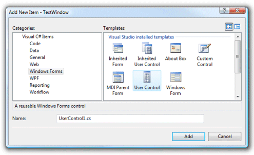
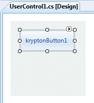
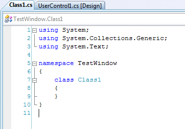

Docking Page Creation

**Best Practice**  
Once you have your docking system up and working your focus will shift to
creating the pages that will be displayed. This quick tutorial shows our
recommended best practice approach that makes it easy for you to design and then
use pages in the docking system. In fact the same approach could be used for
creating pages that are intended for use in the *KryptonNavigator* or
*KryptonWorkspace*.

 

**Step 1 - Create a User Control**  
We begin by creating a new user control. Right click your project entry in the
solution explorer and select '*Add*' followed by '*New Item...*' in order to
bring up the '*Add New Item*' dialog box that presents different items for
creation. Double click the '*User Control*' option as can be seen in Figure 1.
This will result in a new user control derived class being created and the
designer for the control should be opened by default.


  
*Figure 1 - Add New Item Dialog*

  
  
**Step 2 - Design your User Control**  
This is where you need to use the control designer to build the control content
that is appropriate for your application. That might be a entry form with many
input controls or maybe a charting or reporting control. To keep this
tutorial simple we add a single *KryptonButton* by dragging it from the Toolbox
and dropping it on the design surface. This results in the following simple
appearance as seen in Figure 2.



*Figure 2 - Designed UserControl*

 

  
**Step 3 - Create a Class**  
To make this user control usable in the docking system we need to add a new
class. Right click your project entry in the solution explorer and select
'*Add*' followed by '*New Item...*' in order to bring up the '*Add New Item*'
dialog box that presents different items for creation. This click double click
the '*Class*' option. This will result in a simple class outline being created
as can be seen in Figure 3.



*Figure 3 - New Class file*

 

**Step 4 - Add 'using' Statement**  
Place an additional 'using' statement at the top of the file so we can refer to
the *KryptonPage* class.

```cs
    using Krypton.Navigator;
```
 

**Step 5 - Inherit from 'KryptonPage'**
Replace the class definition line so that we create a public class that inherits
from the *KrytonPage*.

```cs
    public class Class1 : KryptonPage
```
 

**Step 6 - Create UserControl in Constructor**  
We need to add a constructor that creates an instance of the user control we
created earlier and then adds it to the set of child controls for the page. As
part of the process each set the *Dock* property of the user control to be
*DockStyle.Fill* so that the user control is automatically size to take up the
entire client area of the page. If you do not need this action then simply leave
out the line that sets this property. Our finished code is very compact and
looks like the following...

```cs
    using System;  
    using System.Collections.Generic;  
    using System.Text;  
    using Krypton.Navigator;

    namespace TestWindow  
    {  
        public class Class1 : KryptonPage  
        {  
            public Class1()  
            {  
                UserControl1 content = new UserControl1();  
                content.Dock = System.Windows.Forms.DockStyle.Fill;  
                Controls.Add(content);  
            }

        }  
    }
```
 

**Step 7 - Use the custom page**  
Using our custom page is now trivial. Here is an example of adding the page
docked against the left edge of a target control.  
  
```cs
    dockingManager.AddDockspace("Control", DockingEdge.Left, new KryptonPage[] {
new Class1() });
```
  
The advantage of this approach is that you can now modify the contents of the
page by double clicking the user control class and using the designer to drag
and drop controls as needed. In practice you would probably want to use more
appropriate names for the user control and page class rather than the defaults.
For example '*UserControlProperties*' in place of '*UserControl1'* and
'*PropertiesPage*' in place of '*Class1*' would be more readable if creating a
docking page for showing a set of property values.
