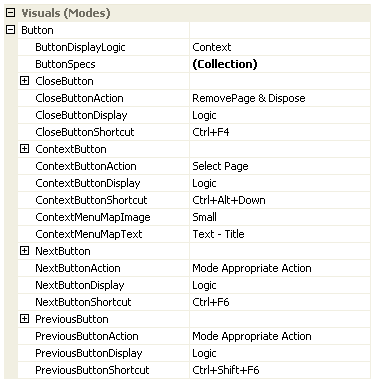
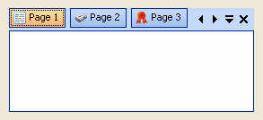
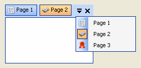
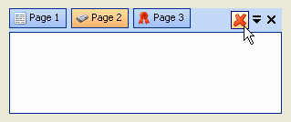

# Navigator Button Modes  
  
Applicable Modes:  

* Bar - Tab - Group
* Bar - Tab - Only
* Bar - RibbonTab - Group
* Bar - RibbonTab - Only
* Bar - CheckButton - Group - Outside
* Bar - CheckButton - Group - Inside
* Bar - CheckButton - Group - Only
* Bar - CheckButton - Only
* HeaderBar - CheckButton - Group
* HeaderBar - CheckButton - HeaderGroup
* HeaderBar - CheckButton - Only
* Stack - CheckButton - HeaderGroup
* Outlook - Full
* Outlook - Mini
* HeaderGroup
* HeaderGroup - Tab

 

**Button Mode Properties**  
The properties associated with buttons can be seen in Figure 1 as they appear in
the properties window.  

 
  
*Figure 1 - Button Mode Properties*  
  
There are four standard buttons exposed for use with the modes listed at the top
of the page. These buttons are called *Close*, *Context*, *Next* and *Previous,*
each of which has at least three associated properties displayed in Figure 1. So
for the *Close* button you can see the three properties listed as *CloseButton*,
*CloseButtonAction* and *CloseButtonDisplay*. The *Context* button has a couple
of additional properties that will be described after the standard set of three.  
  
  
**Button + ButtonAction + ButtonDisplay + ButtonShortcut**  
Each button has a property with the extension *Button, *for example
*CloseButton* and *NextButton*, that is an aggregate containing many values for
defining the appearance of the button. This set of values are not described in
detail here as the [ButtonSpec](../Overview/ButtonSpec.md) section contains a full description
of all the properties and how to use them to customize the appearance of the
button.

The second extension is *ButtonAction,* for example *CloseButtonAction*, and is
used to define the default action that should occur when that button is clicked
by the user. When any of the buttons is clicked an event is generated and this
property is passed to the event handler as the action to be taken. The event
handler can override the action or leave it as the default. Button events are
named by adding the word *Action* to the end, for example *NextAction*,
*CloseAction* and so forth. A full description of the [Action Events](Navigator Action%20Events.md) is contained in a separate section.  
  
The extension *ButttonDisplay*, for example *CloseButtonDisplay*, is used to
specify how to display and enable the button. All of the buttons have a default
value of *Logic.* The following list shows the available enumeration values.

-   *Hide*  
    This enumeration value will force the button to be hidden from the display.

-   *Show Disabled*  
    This value forces the button to always be displayed but disabled.

-   *Show Enabled*  
    Forces the button to be displayed always but enabled.

-   *Logic*  
    Here the visible and enabled state of the button are determined by runtime
    logic as specified by the *ButtonDisplayLogic* property. See the section
    below with the title of *ButtonDisplayLogic Property* for more details.

All except the *Logic* entry allow you to control the visible and enabled state
of the button at runtime. This is useful if you want to completely override the
operation of a button with your own customization. By altering this property you
control the state of the button and then by hooking into the buttons *Action*
event you can perform a custom action when the user presses it. More likely is
that you will leave this property with the default *Logic* value so that the
navigator control handles the runtime state changes for you.

Finally the extension *ButtonShortcut* is used to define the keyboard shortcut
that can be used to initiate the button action. For example the
*CloseButtonShortcut* property has default value of *Ctrl+F4*, so at runtime the
user does not need to use the mouse to click the close button but instead can
use the *Ctrl+F4* key combination as a shortcut for invoking the close action.
Note that the key combination will only be available if the button itself is
available for the navigator mode and the button is visible and enabled.  
  
  
**ButtonDisplayLogic Property**  
Any button that is defined with a *ButtonDisplay* property value of Logic will
use this property to determine the visible and enabled state of the button. The
possible values for the property are as follows.

-   *None*  
    The *Close* button is always shown but only enabled if a page is selected.
    The *Context*, *Next* and *Previous* buttons are never displayed.

-   *Next/Previous*  
    The *Close* button is always shown but only enabled if a page is selected.
    The *Context* button is never displayed. The Next and *Previous* buttons are
    always displayed but only enabled if the action they represent is possible.

-   *Context*  
    The *Close* button is always shown but only enabled if a page is selected.
    The *Context* button is always shown but only enabled if at least one page
    is visible. The *Next* and *Previous* buttons are never displayed.

-   *Context + Next/Previous*  
    Combines the *Next/Previous* and *Context* options. The *Context*, Next and
    Previous buttons are always displayed but only enabled if they can perform
    their actions. Figure 2 shows this enumeration value in operation.

*Figure 2 - ContextButton*

 

**ContextMenuMapImage + ContextMenuMapText**  
These two properties are used to describe how to map values from a *KryptonPage*
to the image and text of a context menu item. Figure 3 shows how the *Context*
button shows a context menu that presents a menu item per page that can be
selected. As a *KryptonPage* has three different text values and three different
images the navigator needs to know to pull the correct values from the page to
each menu item.

*Figure 3 - ContextButton*

The default value for the *ContextMenuMapImage* is *Small* and indicates that
the *ImageSmall* property of the *KryptonPage* will be used for the menu item
image. If you prefer to show the *ImageMedium* or *ImageLarge* from the page
then just assign the *Small* and *Large* values respectively instead. To prevent
any image from being shown then use the *None* value. You can also specify a
value of *LargeMediumSmall* that indicates that the *ImageLarge* property of the
page should be used unless it is null, in that case use the *ImageMedium*
property instead but if that is also null then use the *ImageSmall* page
property. Other variations exist so you can specify the list of preferences for
the image to use.  
  
Using *ContextMenuMapText* is much the same except it is working against the
*Text*, *TextTitle*, *TextDescription* and *TextTooltip* properties of the
*KryptonPage*. The default value is *TextTitle* indicating that the *Text*
property of the page is used unless it is empty in which case the *TextTitle*
property is used. Other variations exist so you can specify a preference for
which text properties to use.

**ButtonSpecs**  
This collection property allows you to add your own buttons to the display. See
the [ButtonSpec](../Overview/ButtonSpec.md) section for a full description of how to create
and configure a *ButtonSpec* for use. Figure 4 shows an example of a bar mode
that has a custom button added.

*Figure 4 - Custom button using ButtonSpecs*
