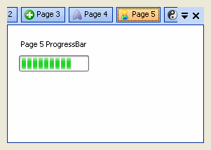
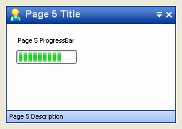
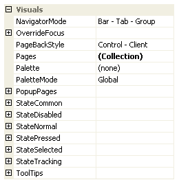
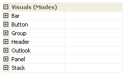
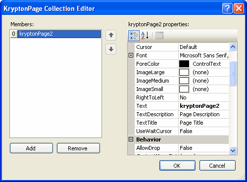
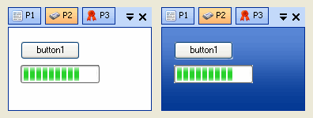

# Navigator Overview  
  
The *Navigator* control is designed to provide a variety of ways for the user to
navigate around a set of pages. Modes range from the very basic such as *Panel*,
which displays no mechanism for the user to switch pages, to the sophisticated
such as *Outlook - Full*, where the user can randomly switch to any page using a
pleasant user interface experience.  
  
  
**Modes of Operation**  
One of the big advantages this control provides is the use of a single mode
property to switch the entire user interface. This simplifies application
development because you only have to learn how a single control works, rather
than learning about several separate controls where each control provides the
equivalent of a single navigator mode. Another advantage is you do not need to
remove and add a different control to your form each time you want to alter the
user interface. Instead just change the mode and you switch from a traditional
TabControl style to a header group style. Figure 1 shows examples of two
different modes that are achieved by just altering the mode property.  
  

*Figure 1 - Two Example Modes*

See [Navigator Modes](Navigator%20Modes.md) for a detailed list of all the different
modes available.

 

**Navigator Properties**  
Properties that control the appearance and operation of the navigator are
concentrated in two different categories. Figure 2 shows the set of properties
in the *Visuals* category; these are explained here and in the [Popup Pages Properties](Navigator PopupPages.md) and [ToolTips Properties](Navigator ToolTips.md) sections.
Figure 3 shows the *Visuals (Modes)* category which contains mode specific
properties that are described in detail in the [Bar Modes](Navigator Bar%20Modes.md),
[Button Modes](Navigator%20Button%20Modes.md), [Group Modes](Navigator%20Group%20Modes.md), [Header Modes](Navigator%20Header%20Modes.md), [Outlook Modes](Navigator Outlook%20Modes.md), [Panel Modes](Navigator%20Panel%20Modes.md) and [Stack Modes](Navigator Stack%20Modes.md) sections.

  
*Figure 2 - Visuals*  

  
*Figure 3 - Visuals (Modes)*

  
**Navigator Events**  
Information about all the different events exposed by the navigator are found in
the [Selection Events](Navigator Selection%20Events.md), [Action Events](Navigator Action%20Events.md) and [Other Events](Navigator Other%20Events.md) sections. At a minimum you are recommended to read up on
the selection events as they are crucial in understanding how to correctly
handle selection changes and provide fine grained control over selection
activity.

  
**Pages Property**  
To add, remove and modify the collection of *KryptonPage* instances associated
with the control you just need click the property value button for the *Pages*
property. This will then display the collection editor as can be seen in Figure
4. Note that some changes such as removing pages or changing the ordering of
pages will not be reflected immediately in the navigator; not until you press
*OK* and leave the collection editor does the control get refreshed.

  
*Figure 4 - KryptonPage Collection Editor*

 

**PageBackStyle Property**  
The navigator allows you to use the *PageBackStyle* property to define the
appearance of the selected *KryptonPage* background. The default value of
*Control - Client* gives an appropriate appearance for most usages but you
change the value to any of the background styles. Figure 5 shows the default
style on the left and the *Header - Primary* style on the right.

*Figure 5 - PageBackStyle Styles*

**KryptonPage**  
Each *KryptonPage* has the ability to override the appearance of the navigator
when the page is selected and also, to a lesser extent, when not selected. This
is useful if you want a particular page to have a different color border or text
for its display. Read the [KryptonPage](Navigator%20KryptonPage.md) section for a detailed
description of how to achieve this.  
 

**Five States**  
As with all the *Krypton* controls, each possible state of the control has a set
of properties that can be used to customize the appearance. For the navigator
there are five states with corresponding property names of *StateDisabled*,
*StateNormal*, *StateTracking*, *StatePressed* and *StateSelected*. Unlike most
*Krypton* controls the contents of each state are not identical in all cases.
This is because different elements that make up the control are themselves
capable of achieving different states.

This is best explained with a couple of examples. Many of the navigator modes
used a *Group* element for showing the contents of the selected page. A *Group*
element is only capable of being in the *Disabled* or *Normal* states and so you
will only find properties for customizing the *Group* appearance inside the
*StateDisabled* and *StateNormal* properties. But the *CheckButton* items that
appear for some of the bar modes make use of all states as they need to
represent the three states of *Tracking*, *Pressed* and *Selected* modes.  
  
  
**Common State**  
To speed up the customization process an extra *StateCommon* property has been
provided. The settings from this are used if no override has been defined for
the state specific entry. Note that the specific state values always take
precedence and so if you define a property in both the *StateNormal* and
*StateCommon* sets then the *StateNormal* value will be used whenever the
control is in the *Normal* state. Only if the *StateNormal* value is not
overridden will it look in *StateCommon*.  
  
  
**Override States**  
There is an additional state related property called *OverrideFocus* is used to
alter the appearance of the control when it has the focus. Notice that the
property starts with the *Override* prefix instead of the usual *State*. This is
because it does not relate to a specific control state such as *Normal* or
*Tracking*. Instead it is applied to any of the other states and is used to
override the appearance that would otherwise be shown.  
  
  
**Mnemonics**  
In order to use mnemonics for the quick selection of different pages you need to
add the '&' character into the *KryptonPage.Text* property in front of the
character that will act as the mnemonic. This will then be displayed as an
underlined character by the navigator. By default the *UseMnemonic* property of
the navigator is defined as *True* and so the navigator will search visible
pages for a matching mnemonic as you use the keyboard.
