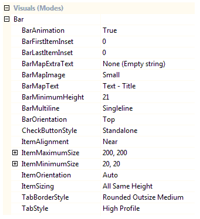
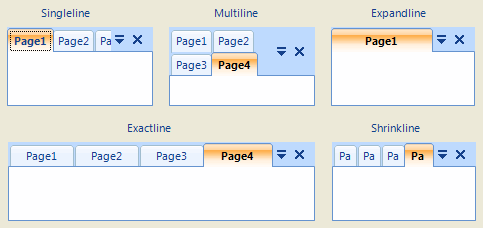
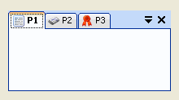
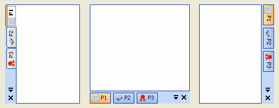
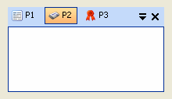
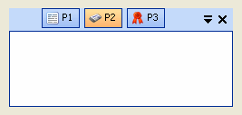
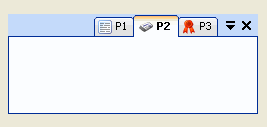
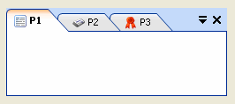
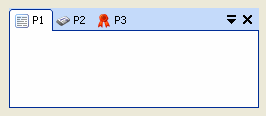

# Navigator Bar Modes  
  
Applicable Modes:  
* Bar - Tab - Group
* Bar - Tab - Only
* Bar - RibbonTab - Group
* Bar - RibbonTab - Only
* Bar - CheckButton - Group - Outside
* Bar - CheckButton - Group - Inside
* Bar - CheckButton - Group - Only
* Bar - CheckButton - Only
  
  
**Bar Mode Properties**  
The set of properties associated with *Bar* and *HeaderBar* modes can be seen
below as they appear in the properties window.

  
*Figure 1 - Button Mode Properties*

**BarAnimation**  
When the user selects a page that is not fully visible on the bar the page can
be scrolled into view using a short animation effect. This is turned on by
default and gives a smooth movement to the bar that makes it easier to see how
the bar is organized. If you prefer to turn off this feature then set the
*BarAnimation* property to *False* and the transition will be instant instead of
animated.

**BarFirstItemInset + BarLastItemInset**  
The inset distance from the near edge of the bar to the first item is controlled
using the BarFirstItemInset property. It defaults to a value of 0 which places
the first edge against the control edge. Figure 2 shows two pictures, the left
is with the default value of 0 and the right hand picture with a value of 10.
Use this property when you need to add the extra spacing gap to improve the look
of your application. BarLastItemInset is likewise used to set the inset distance
on the far edge and allows you to specify a minimum distance between the last
tab and the buttons/control edge.  

  

*Figure 2 - BarFirstItemInset = 0 & 10*

  
**BarMapExtraText + BarMapText + BarMapImage**  
Each visible *KrytonPage* is represented by a single bar header item, but the
*KryptonPage* has three different text properties and three image properties.
The mapping properties are used to describe how to map the bar item contents
from the values stored in each *KrytonPage* instance.  
  
*BarMapImage *is used to recover an image from the page. To prevent any image
from being shown assign the *None* value. To show the *ImageSmall* form the page
assign *Small* to the *MapImage*. More complex mappings are possible, for
example a value of *LargeMediumSmall* indicates that the *ImageLarge* property
of the page should be used unless it is null, in that case use the *ImageMedium*
property instead but if that is also null then use the *ImageSmall* page
property.  
  
Use *BarMapText* to map from the *Text*, *TextTitle*, *TextDescription* and
*TextTooltip* properties of the page to the main bar item text. The default
value is *TextTitle* indicating that the *Text* property of the page is used
unless it is empty in which case the *TextTitle* property is used. Other
variations exist so you can specify a preference for what text is shown.
*BarMapExtraText* works in the same way but maps to the secondary bar item
text and defaults to *None*.

  
**BarMinimumHeight**  
The height of the bar area is calculated by discovering the height of the
tallest item on the bar. This could be an individual tab header or one of the
action buttons. If there are no items on the bar then the size would become zero
height and in order to prevent this from happening you can set the
*BarMinimumHeight* property to the smallest height you require.

**BarMultiline**  
Five possible enumeration values determine how items are positioned on lines.
The default *Singleline* places all items on a single line that extends beyond
the visible area if needed. You can use the *Next/Prev* scroll buttons in order
to bring items out of view back into the displayed area. The *Multiline* option
will ensure all items are visible by creating as many lines as are required. Use
*Exactline* when you need the items to exactly match the line area size, it will
expand or shrink the individual items to enforce this. *Shrinkline* will place
all items on a single line but also shrink the size of the items if necessary to
ensure they are all visible. Finally *Expandline* will only expand the size of
items if they do not fill up the entire line display area. Figure 3 shows all
five options for the same set of items.

*Figure 3 - All possible BarMultiline settings*  
  
  
**BarOrientation**  
By default the bar is positioned at the top of the navigator control as can be
seen in Figure 4. You can alter the orientation to any of the three other values
*Left*, *Right* and *Bottom*. Figure 5 shows the orientation changed to each of
the other options for a range of different *Bar* modes.  
  

*Figure 4 - BarOrientation = Top*  
  
  

*Figure 5 - BarOrientation = Left, Bottom and Right*

 

**CheckButtonStyle**  
When showing the page headers as *CheckButton* items this property is used to
specify the button style that should be used for the appearance of each item.
The default is the *Standalone* button style but you can change this to any of
the other styles such as *LowProfile*, as can be seen in Figure 6.

*Figure 6 - CheckButtonStyle = LowProfile*

 

**ItemAlignment**  
By default the alignment of items on the bar is to the *Near* side. On a
standard western machine this equates to the left hand side of the control. You
can see in Figure 7 and 8 the alternative property values of *Center* and *Far*.
The navigator does honor the *RightToLeft* setting and so when defined the
*Near* and *Far* values will produce the opposite arrangement.  
  

*Figure 7 - ItemAlignment = Center*  
  

*Figure 8 - ItemAlignment = Far*

 

**ItemMaximumSize + ItemMinimumSize**  
Use these two properties to prevent strange looking items under two scenarios.
If a header item does not find any text or image to show for a page then
it would become sized extremely small, just a few pixels in width and height. To
prevent very small items from being created you should use the *ItemMinimumSize*
to set a lower limit on header items. The opposite case is where the text and/or
image for a page are very large and would create an extremely large header item.
Use the *ItemMaximumSize* to set an upper limit on header items.

 

**ItemOrientation**  
In most cases you will want the orientation of header items to automatically
reflect the orientation of the bar itself. So if the bar is at the top then you
would want the header items to be orientated as seen in Figure 3. If the bar is
placed on the left side then you would want the headers items orientation to
show vertical text as seen in Figure 4. This is the purpose of the default
*Auto* property value. You can change the property to fix the header
orientation. Figure 9 shows the the bar at the top but with the item orientation
defined as *FixedLeft*, *FixedBottom* and *FixedRight.*

*Figure 9 - ItemOrientation = FixedLeft + FixedBottom + FixedRight*

 

**ItemSizing**  
Each bar item is sizing according to the width and height needed to display the
contents of that item. The calculated size then has an upper and lower limit
applied using the *ItemMaximumSize* and *ItemMinimumSize* properties. The
*ItemSizing* property specifies the algorithm to apply across all the bar header
items.

-   *Individual Sizing*  
    Every bar item is left to be whatever size it needs.

-   *All Same Height*  
    Once the size of every item has been calculated all of them are set to the
    same height as the tallest item.

-   *All Same Width*  
    Once the size of every item has been calculated all of them are set to the
    same width as the widest item.

-   *All Same Width + Height*  
    Combines the *All Same Width* and *All Same Height* options.

**TabBorderStyle**  
Showing the page headers as *Tab* items this property is used to specify the
shape of the tab header. The default is the *Rounded Outsize Medium * style but
you can change this to any of the other styles such as *OneNote*, as can be seen
in Figure 10.  

  
  
*Figure 10 - TabBorderStyle = OneNote*  
  
  
  
**TabStyle**  
When showing the page headers as *Tab* header items this property is used to
specify the tab style that should be used for the appearance of each item. The
default is the *High Profile* style but you can change this to any of the other
styles such as *Low Profile,* as can be seen in Figure 11.  
  
  

*Figure 11 - TabStyle = Low Profile*
