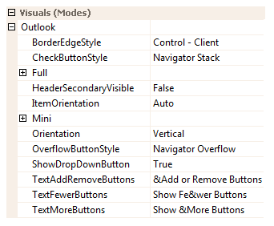
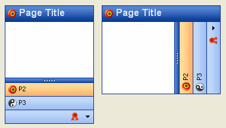
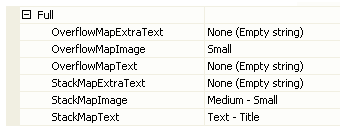
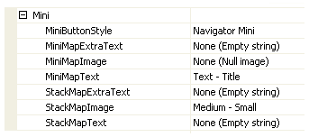

# Navigator Outlook Modes  
  
Applicable Modes:  
* Outlook - Full
* Outlook - Mini

 

**Outlook Mode Properties**  
The set of properties associated with the *Outlook* modes can be seen in Figure
1 as they appear in the properties window.  
  

*Figure 1 - Outlook Mode Properties*  
  
  
**BorderEdgeStyle**  
A border edge is drawn between each of the stack items in order to provide a
consistent looking border around all elements of the control. If you are
altering the associated *CheckButtonStyle* then you will likely also want to
alter this property so that the border edge drawing is consistent with the
updated check button style.  
  
  
**CheckButtonStyle**  
By default this property has a value of *Navigator Stack* that is defined
specifically for use with the stack modes of the navigator control. You can
however change to any of the other button styles such as *Standalone*,
*LowProfile*, *Custom1* etc. It is recommended that you use one of the custom
styles if you need to alter how you display the stack items and use the *Palette
Designer* application to setup the properties of the custom style.

**HeaderSecondaryVisible**  
Other modes determine the visibility of the secondary header using the
*KryptonNavigator.Headers.HeaderVisibleSecondary*. But when in the *Outlook*
mode this property is used instead. This is because you will almost certainly
want the header visibility to differ between the *Outlook* and other modes. If
however you do want to use the same visibility for all modes then just set this
property to be *Inherit*.

**ItemOrientation**  
In most cases you will want the orientation of stack content to automatically
reflect a sensible default related to the orientation of the stack itself. So if
the stack is vertical you would want the stack content drawn horizontally and
when the stack is horizontal the stack content would be drawn vertically. This
is the purpose of the default *Auto* property value. You can change this
property to fix the content orientation to a constant setting.

  
**Orientation**  
You can alter the default *Vertical* orientation to *Horizontal* and you can see
the change in figure 2. Notice that although the stacking items and the overflow
bar are repositioned the primary header is not moved.  
  

*Figure 2, Orientation = Vertical and Horizontal*

  
**OverflowButtonStyle**  
By default this property has a value of *Navigator Overflow* that is defined
specifically for use in the overflow bar at the bottom of the outlook modes. The
pages that are on the overflow bar as well as the drop down button are drawn
using this style.  
  
  
**ShowDropDownButton**  
If you want to prevent the drop down button from appearing on the overflow bar
then you just set this property to be *False*.  
  
  
**TextAddRemoveButtons + TextFewerButtons + TextMoreButtons**  
When you click the drop down button on the overflow bar you will see the menu as
shown in figure 3. You can use these the three text properties in alter the text
that is displayed for each of the three menu items. This does not change the
functionality of the menu items but it allows you to localize the displayed
string because the three properties are marked with the *Localizable* attribute.

  
*Figure 3, Drop down button menu*  
  
To customize the contents of the drop down menu you should hook into the
*KryptonNavigator.OutlookDropDown* event. The event provides a reference to the
*ContextMenuStrip* that is about to be displayed, this allows you to
add/remove/modify the menu items as you pleas.

 

**Outlook Full - Mode Properties**  
The set of properties that are specific to the *Outlook Full* mode are contained
below the *Full* property that is listed in Figure 1 above. Figure 2 shows the
child properties where the *Full* property is expanded inside the properties
window.

*Figure 2 - Outlook Full - Mode Properties*  
  
  
**OverflowMapExtraText + OverflowMapImage + OverflowText**  
The overflow mapping properties are used to map between KryptonPage values and
entries on the overflow bar.  
  
*OverflowMapImage* is used to recover an image from the page. To prevent any
image from being shown assign the *None* value. To show the *ImageSmall* form
the page assign *Small* to the *MapImage*. More complex mappings are possible,
for example a value of *LargeMediumSmall* indicates that the *ImageLarge*
property of the page should be used unless it is null, in that case use the
*ImageMedium* property instead but if that is also null then use the
*ImageSmall* page property.  
  
Use *OverflowMapText* to map from the *Text*, *TextTitle, TextDescription* and
*TextTooltip* properties of the page to the main overflow item text. The default
value is *TextTitle* indicating that the *Text* property of the page is used
unless it is empty in which case the *TextTitle* property is used. Other
variations exist so you can specify a preference for what text is shown.
Stack*MapExtraText* works in the same way but maps to the secondary overflow
text and defaults to *None*.  
  
  
**StackMapExtraText + StackMapImage + StackMapText**  
The stack mapping properties are used to map between KryptonPage values and the
stack item contents.  
  
*StackMapImage *is used to recover an image from the page. To prevent any image
from being shown assign the *None* value. To show the *ImageSmall* form the page
assign *Small* to the *MapImage*. More complex mappings are possible, for
example a value of *LargeMediumSmall* indicates that the *ImageLarge* property
of the page should be used unless it is null, in that case use the *ImageMedium*
property instead but if that is also null then use the *ImageSmall* page
property.  
  
Use *StackMapText* to map from the *Text*, *TextTitle*, *TextDescription* and
*TextTooltip* properties of the page to the main stack item text. The default
value is *TextTitle* indicating that the *Text* property of the page is used
unless it is empty in which case the *TextTitle* property is used. Other
variations exist so you can specify a preference for what text is shown.
*StackMapExtraText* works in the same way but maps to the secondary stack item
text and defaults to *None*.  
  
  
**Outlook Mini - Mode Properties**  
The set of properties that are specific to the *Outlook Mini* mode are contained
below the *Mini* property that is listed in Figure 1 above. Figure 2 shows the
child properties where the *Mini* property is expanded inside the properties
window.  

  
*Figure 3 - Outlook Mini - Mode Properties*

  
**MiniButtonStyle**  
In *Outlook Mini* mode you will see that the client area of the layout does not
show the contents of the selected KryptonPage. Instead the area is filled with a
button that has the name of the page. When clicking that button it will then
show a pop up window with the contents of the associated KryptonPage. This
property is used to define the button style that is applied to the drawing of
that client area button.

  
**MiniMapExtraText + MiniMapImage + MiniMapText**  
The mini mapping properties are used to map between KryptonPage values and the
mini button used in the client area of the control.  
  
*MiniMapImage *is used to recover an image from the page. To prevent any image
from being shown assign the *None* value. To show the *ImageSmall* form the page
assign *Small* to the *MapImage*. More complex mappings are possible, for
example a value of *LargeMediumSmall* indicates that the *ImageLarge* property
of the page should be used unless it is null, in that case use the *ImageMedium*
property instead but if that is also null then use the *ImageSmall* page
property.  
  
Use *MiniMapText* to map from the *Text*, *TextTitle* and *TextDescription*
properties of the page to the main stack item text. The default value is
*TextTitle* indicating that the *Text* property of the page is used unless it is
empty in which case the *TextTitle* property is used. Other variations exist so
you can specify a preference for what text is shown. *MiniMapExtraText* works in
the same way but maps to the secondary stack item text and defaults to *None*.

  
**StackMapExtraText + StackMapImage + StackMapText**  
The stack mapping properties are used to map between KryptonPage values and the
stack item contents. See the above description of the properties.
