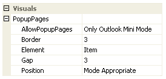
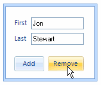
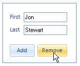

# Navigator PopupPages Properties  
  
Applicable Modes:  
* Bar - Tab - Only
* Bar - RibbonTab - Only
* Bar - CheckButton - Group - Only
* Bar - CheckButton - Only
* HeaderBar - CheckButton - Only
* Outlook - Mini

 

**PopupPages Properties**  
The set of properties associated with the display of pop up pages can be seen in
Figure 1 as they appear in the properties window.  

*Figure 1 - PopupPages Properties*  
  
  
Pop up page functionality is only available in the modes as listed at the top of
this document. These are modes that do not show the contents of the selected
page in the layout of the actual navigator control. Commonly these types of mode
are called 'TabStrips'. Because the content of the selected page is not
displayed in the main part of the control these modes allow the page to be
displayed in a separate pop up window when the appropriate button or header is
pressed.

  
**AllowPopupPages**  
Use this enumeration property to decide when pop up pages will be used. The
default value of *Only Outlook Mini Mode* only allows the use of pop up pages in
the *Outlook - Mini* mode. Other possible values include *Only Compatible Modes*
that only allows the use of pop up pages in 'TabStrip' style modes and the
*Never* value that prevents pop up pages from appearing at any time.

  
**Border**  
This is the pixel border width to use around the displayed pop up page. Figure 2
shows a pop up page with the default value of 3, where you can see the thick
blue border around the page contents. Figure 3 shows a value of 0 which turns
off the use of the blue border area entirely. This border area is displayed
using the *Navigator.Panel.PanelBackStyle* defined style.

  
*Figure 2 - Border width of 3*

  
*Figure 3 - Border width of 0*

**Element**  
When the pop up page is displayed it uses the algorithm specified in the
*Position* property to auto calculate the location, and in some cases size, of
the pop up window. All the calculations are relative to a display element. You
can use this property to define which element is used in the calculations. There
are two enumeration values possible for this property, *Item* and *Navigator*.
You would use *Item* when you want the pop up window to appear relative to the
selected page display item. Alternatively use *Navigator* when you want the pop
up to be relative to the whole navigator control instance regardless of the
exact location of the page item.

  
**Gap**  
Use this property to define the pixel gap between the display *Element* and the
nearest edge of the pop up window. If you want the pop up window to be shown
directly against the *Element* then use a value of 0. The default value is 3 and
provides a small spacing gap between the *Element* and the pop up window.

  
**Position**  
This enumeration property is used to define how the pop up window is sized and
positioned relative to the *Element,* taking into account the *Gap* value. The
default value is called *Mode Appropriate* and uses an appropriate *Position*
value that depends on the current mode and relevant mode settings. For example,
in the *BarTabOnly* mode where the *BarOrientation* is *Top* it will show the
pop up below the tab header and aligned to the near edge of the item. In the
same mode but with a *BarOrientation* of *Right* it will show the pop up to the
near side and aligned to the top of the header.

 

## DismissPopups Method
If you have a button inside a *KryptonPage* and then that page is shown as a pop
up then you may want a way to dismiss the pop up when that button is pressed.
This is the purpose of the *DismissPopups* method. When the button is pressed
you should call this method to ensure that if the *KryptonPage* is displayed
inside a pop up then that pop up is dismissed.
