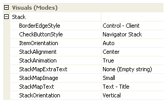
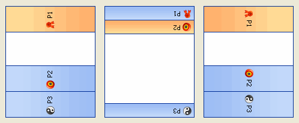
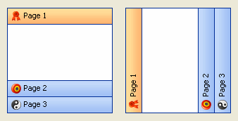

# Navigator Stack Modes  
  
Applicable Modes:  
* Stack - CheckButton - Group
* Stack - CheckButton - HeaderGroup

 

**Stack Mode Properties**  
The set of properties associated with *Stack* modes can be seen in Figure 1 as
they appear in the properties window.

*Figure 1 - Stack Mode Properties*  
  
  
**BorderEdgeStyle**  
A border edge is drawn between each of the stack items in order to provide a
consistent looking border around all elements of the control. If you are
altering the associated *CheckButtonStyle* then you will likely also want to
alter this property so that the border edge drawing is consistent with the
updated check button style.  
  
  
**CheckButtonStyle**  
By default this property has a value of *Navigator Stack* which is defined
specifically for use with the stack modes of the navigator control. You can
however change to any of the button styles such as *Standalone*, *LowProfile*,
*Custom1* etc. It is recommended that you use one of the custom styles if you
need to alter how you display the stack items and the *Palette Designer*
application to setup the properties of the custom style.  
  
  
**ItemOrientation**  
In most cases you will want the orientation of stack content to automatically
reflect a sensible default related to the orientation of the stack itself. So if
the stack is vertical you would want the stack content drawn horizontally and
when stack is horizontal the stack content would be drawn vertically. This is
the purpose of the default *Auto* property value. You can change this property
to a constant setting so the content orientation is fixed in both stack
orientations. Figure 2 shows the the item orientation defined as *FixedLeft*,
*FixedBottom* and *FixedRight.*  
  

*Figure 2 - ItemOrientation = FixedLeft + FixedBottom + FixedRight*  
  
  
**StackAlignment**  
Use this property to define the positioning of the stack items relative to the
client area. So a value of *Near* will place all the stack items at the top of
the client area and the contents of the selected page at the bottom. Using the
*Far* setting will place all the stack items at the bottom of the client area
and the selected page contents at the top. The default setting of *Center* will
the stack items before the selected page at the top and the stack items after
the selected page at the bottom. You can see each of the three settings in
figure 3.  
  

*Figure 3, StackAlignment = Near, Center and Far*  
  
  
**StackAnimation**  
When the user selects a page that is not fully visible the page can be scrolled
into view using a short animation effect. This is turned on by default and gives
a smooth movement to the scrolling that makes it easier to see how the stack
items are organized. If you prefer to turn off this feature then set the
Stack*Animation* property to *False* and the transition will be instant instead
of animated.  
  
  
**StackMapExtraText + StackMapImage + StackMapText**  
Each visible *KrytonPage* is represented by a single stack item, but the
*KryptonPage* has three different text properties and three image properties.
The mapping properties are used to describe how to map the stack item contents
from the values stored in each *KrytonPage* instance.  
  
*StackMapImage *is used to recover an image from the page. To prevent any image
from being shown assign the *None* value. To show the *ImageSmall* form the page
assign *Small* to the *MapImage*. More complex mappings are possible, for
example a value of *LargeMediumSmall* indicates that the *ImageLarge* property
of the page should be used unless it is null, in that case use the *ImageMedium*
property instead but if that is also null then use the *ImageSmall* page
property.  
  
Use *StackMapText* to map from the *Text*, *TextTitle*, *TextDescription* and
*TextTooltip* properties of the page to the main stack item text. The default
value is *TextTitle* indicating that the *Text* property of the page is used
unless it is empty in which case the *TextTitle* property is used. Other
variations exist so you can specify a preference for what text is shown.
Stack*MapExtraText* works in the same way but maps to the secondary stack item
text and defaults to *None*.  
  
  
**StackOrientation**  
You have two orientation options, the default of *Vertical* and the alternative
of *Horizontal*. You can see both of these options presented Figure 4. Note that
when used with on a *Form* that has the *RightToLeftLayout* and *RightToLeft*
settings defined as *True* it will reverse the ordering of the *Horizontal*
orientation stack items.  

  
  
*Figure 4, StackOrientation = Vertical and Horizontal*
