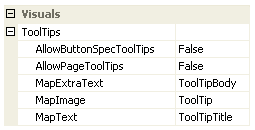

# Navigator Tooltips Properties  
  
Applicable Modes:  
* Bar - Tab - Group
* Bar - Tab - Only
* Bar - RibbonTab - Group
* Bar - RibbonTab - Only
* Bar - CheckButton - Group - Outside
* Bar - CheckButton - Group - Inside
* Bar - CheckButton - Group - Only
* Bar - CheckButton - Only
* HeaderBar - CheckButton - Group
* HeaderBar - CheckButton - HeaderGroup
* HeaderBar - CheckButton - Only
* Stack - CheckButton - Group
* Stack - CheckButton - HeaderGroup
* Outlook - Full
* Outlook - Mini
* HeaderGroup
* HeaderGroup - Tab
 

**Tooltips Properties**  
The set of properties associated with the showing of tool tips can be seen in
Figure 1 as they appear in the properties window.  

  
*Figure 1 - Tooltips Properties*  
  
  
**AllowButtonSpecTooltips**  
A simple boolean property that determines if tooltips are displayed when the
mouse hovers over a button specification. This allows the the pre-defined button
specifications such as the *Close/Context/Next/Previous* buttons as well as user
defined specification via the *Button.ButtonSpecs* collection property.

  
**AllowPageTooltips**  
Determines if tooltips are displayed when the mouse hovers over a *KryptonPage*
header item. A header item can be a check button, tab header, tab ribbon header,
stack item or overflow item depending on the how the mode displays pages. Note
that the default value for this property is *False* and so by default no
tooltips will be displayed.

 

**MapExtraText + MapText + MapImage**  
The mapping properties are used to describe how to map the *KryptonPage* values
to the tool tip display values.  
  
*MapImage *is used to recover an image from the page. To prevent any image from
being shown assign the *None* value. To show the *ImageSmall* form the page
assign *Small* to the *MapImage*. More complex mappings are possible, for
example a value of *LargeMediumSmall* indicates that the *ImageLarge* property
of the page should be used unless it is null, in that case use the *ImageMedium*
property instead but if that is also null then use the *ImageSmall* page
property. The default is *ToolTip* indicating the *ToolTipImage* property is
used.  
  
Use *MapText* to map from the *Text*, *TextTitle, TextDescription, ToolTipTitle*
and *ToolTipBody* properties of the page to the main bar item text. The default
value is *ToolTipTitle. MapExtraText* defaults to the other tool tip text
property *ToolTipBody*.
