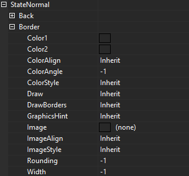
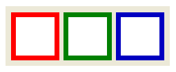
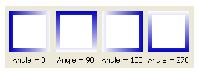
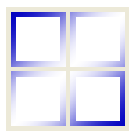
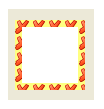
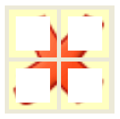
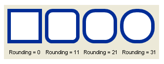

## Border

The majority of *Krypton* controls allow a border to be drawn and so provide a
set of properties that allow customization of the border appearance. Each
control will provide the same set of properties for this task and so once you
are familiar with how they operate you can use this knowledge when dealing with
any of the controls. Figure 1 shows the standard set of properties from the
*KryptonGroup* control.

 

*Figure 1 –Border display properties*

### Color Properties

The *ColorStyle* property determines how to make use of the *Color1*, *Color2*,
*ColorAlign* and *ColorAngle* set properties. When *ColorStyle* is defined as
*Solid* the border will be drawn using the *Color1* value and the other color
properties are ignored as not relevant. Figure 2 shows some *KryptonGroup*
instances with *Solid* defined and with a border *Width* of 7 pixels.

 

*Figure 2 – ColorStyle = Solid, Width = 7*

All other *ColorStyle* values such as *Linear* and *Rounded* allow a gradient
effect between two colors, where *Color1* is the starting color and *Color2* is
the ending color. Now the *ColorAngle* property becomes important as it
determines the direction in which the transition occurs. Figure 3 shows the same
*Linear* style and same starting and ending colors but with different angles.

 

*Figure 3 – ColorStyle = Linear*

*ColorAlign* is used to decide how to calculate the starting and ending points
for the gradient effect. By default it will always start at the top left of the
control and ends at the bottom right of the control which gives appearance as
seen already in figure 3. If instead you choose the *Form* level alignment then
it will use the top left of the enclosing form and bottom right of the enclosing
form as the total area of the gradient. Figure 4 shows four controls all with
exactly the same *ColorAngle* of 45 degrees, *ColorAlign* of *Form* and
*ColorStyle* of *Sigma*.

 

*Figure 4 – ColorStyle =Sigma, ColorAlign = Form, ColorAngle = 45*

### Draw & DrawBorders Properties
  
Use the *DrawBorders* to specify the combination of four borders that should be
allocated space. In the properties window you can use the drop down control that
appears when pressing the property edit button to alter the setup. You
can specify no border edges, just one border edge, two border edges, three
border edges or all four. See figure 5 for just four examples of different
border drawing settings.  
  
   

*Figure 5 – DrawBorders with a variety of options*  
  
As you expect, the *Draw* property is used to indicate if the border edges
specified in *DrawBorders* should be drawn. It is important to note that if you
use *False,* and so prevent drawing of the border edges, it will still allocate
space for the borders and clip the background that is drawn underneath the
border. You can see this in figure 6 where the same controls as figure 5 are
used but with the *Draw* property set to *False*. If you no border space to be
allocated on any edge and no borders to be drawn then you should set the
*DrawBorders* property to none.  

  
*Figure 6 – Draw = False*

### Image Properties

The image is always drawn after the color has been drawn. This ensures that any
alpha channel in the image will show through with the correct back color.
Providing an *Image* is optional and the related *ImageAlign* and *ImageEffect*
are only used when an *Image* has been specified. Figure 7 shows a
*KryptonGroup* with an *Image* of a red cross with an alpha channel so that the
*Color1* value of *Yellow* shows through the transparent areas.

 

*Figure 7 – Color1 = Yellow, Image contains alpha channel*

The *ImageAlign* property allows the image to be draw aligned against the *Form*
and not just the control instance. Figure 8 shows the use of four *KryptonPanel*
controls that are all assigned the same *Image*, *ImageAlign* and *ImageEffect*.

 

*Figure 8 – ImageAlign = Form, ImageEffect = Stretch*

The *ImageEffect* property describes how to draw the *Image* over the required
area. Figure 6 shows the example where *Stretch* is used to ensure the *Image*
exactly covers the entire area. Tiling options include *Tile*, *TileFlipX*,
*TileFlipY* and *TileFlipXY* that repeat over and over again until the entire
area is filled. Positioning options such as *TopLeft* and *BottomMiddle* allow
the image to be placed relative to both the vertical and horizontal edges.

### Width and Rounding

*Width* is used to determine the pixel width of the border. A value of -1 is
used to indicate that the value should be inherited from the next highest level
of settings. *Rounding* is used to decide how rounded the four corners of the
border will be. Again a value of -1 will cause inheritance from the next highest
level of settings. Figure 9 shows some examples of different *Rounding* values.

*Figure 9 – Rounding property*
