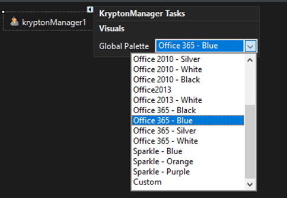
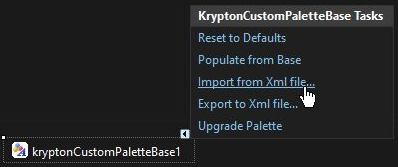
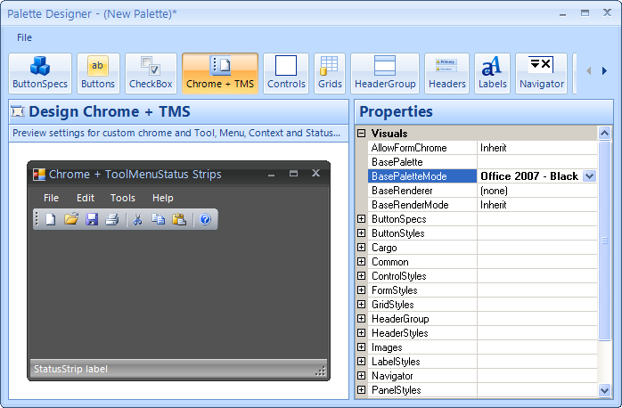
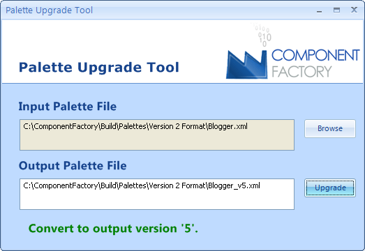

## Palettes

Using palettes allows you to quickly alter the look and feel of your
application. By altering the global palette setting you can cause all the
*Krypton* controls to update to the new appearance in one action. Alternatively
you can modify the palette to be used on a per toolkit control basis in order to
use different palettes for different controls. There are three sources of
palettes available to you as a toolkit developer.

### Built in palettes  
The *Krypton Toolkit* comes with built in palettes that are embedded in the
library itself. For example the *Office 2007 - Blue* and *Professional - Office
2003* palettes are provided out of the box. You can use the *KryptonManager*
component to alter the global palette to one of the built in choices. Figure 1
shows the global palette being altered to a built in palette.



*Figure 1 - KryptonManager smart tag*

### Import a palette definition  
Your second option is to add a *KryptonCustomPaletteBase* component to the application and
then import palette settings from a palette definition file. Palette definition
files are just XML documents that store all the settings and images needed to
recreate a palette. All you need to do is drop a new *KryptonCustomPaletteBase* along with a *KryptonManager*, 
and then in your application's code, apply the following code:

C# Method:

```cs
    /// <summary>
    /// Apply a theme with a custom palette definition.
    /// </summary>
    private void ApplyCustomTheme()
    {
        try
        {
            // Ask the user for a valid palette definition file
            kryptonPalette1.Import();

            // Set the krypton manager's GlobalPalette to kryptonPalette1
            kryptonManager1.GlobalPalette = kryptonPalette1;

            // Finally, set the krypton manager's GlobalPaletteMode to custom
            kryptonManager1.GlobalPaletteMode = PaletteModeManager.Custom;
        }
        catch (Exception exc)
        {
            // TODO: Handle the exception
        }
    }
```

VisualBasic Function:

```vb
    ''' <summary>
    ''' Apply a theme with a custom palette definition.
    ''' </summary>
    Private Function ApplyCustomTheme()
        Try
            ' Ask the user for a valid palette definition file
            kryptonPalette1.Import()

            ' Set the krypton manager's GlobalPalette to kryptonPalette1
            kryptonManager1.GlobalPalette = kryptonPalette1

            ' Finally, set the krypton manager's GlobalPaletteMode to custom
            kryptonManager1.GlobalPaletteMode = PaletteModeManager.Custom
        Catch exc As Exception
            ' TODO: Handle the exception
        End Try
    End Function
 ```
 
The smart tag contains options to *Export* and *Import* palette definitions.
Figure 2 shows the smart tag for the *KryptonCustomPaletteBase*.



*Figure 2 - KryptonCustomPaletteBase smart tag*  


Now you need to alter the *KryptonManager* property called *GlobalPalette* so
that the *KryptonCustomPaletteBase* component is used instead of one of the built in
options. Figure 3 shows the property being altered at design time. 
  


   *Figure 3 - KryptonManager GlobalPalette property*

Note that exporting a palette will only save values that are not the default. So
if you have only changed a few values from the default then the exported XML
file will be very small and compact. When importing a palette the only values
that will be changed in the palette are those than are read in from the XML
file. If you have a new instance of a *KryptonCustomPaletteBase* component then all the
values will be defaulted and importing a palette will achieve the expected
changes.  
  
If you expect that some of the palette values are not defaulted and might not be
changed by the incoming XML file then you should perform a *Reset to Defaults*
before the import; figure 2 shows the reset task on the smart tag. This resets
all palette properties back to the default values they would have when the
component was first created.  

### Populate from base  
Another option available from the palette smart is called *Populate from base*.
This option will update all the values in the palette with the values that are
available from the base palette. So if the base palette is the built in
*Professional - Red* then the values will consist of the red gradient colors the
base exposes. Note that all styles prefixed *Custom* will not be imported as
these styles are always local to a particular palette.  

### Creating a palette definition
  
You can create a new palette definition instead of importing an existing
definition. You could do this by altering the properties of the *KryptonCustomPaletteBase*
using the properties window at design time. This is however quite difficult as
you cannot see the changes taking effect immediately unless you have every type
of control on your form at the same time. Instead you should use the *Palette
Designer* utility that can be started from the *Krypton Explorer* program. There
should be a link to the explorer application placed on your desktop during the
install process.

Use the *Palette Designer* to modify the palette properties and see the changes
immediately. Once you are finished you can save the settings to a palette
definition file. Then just use the smart tag on the *KryptonCustomPaletteBase* to access
the *Import* option and select the file just saved from the *Palette Designer*.
Figure 4 shows the Palette Designer.



*Figure 4 - Palette Designer*  
  
### Upgrading Palette Definitions  
When moving from one version of *Krypton* to another there are sometimes changes
made to the palette XML format. When this happens you can use the *Palette
Upgrade Tool* to convert palette XML files to the latest file format. This
utility can be started from the *Krypton Explorer* program, a shortcut for which
should be on your desktop after installation. Figure 5 shows the tool in action.  
  


*Figure 5 - Palette Upgrade Tool*  
  
You can make use of the tool to upgrade *Krypton Palette* component instances.
Before installing a new version of *Krypton* you can use the *Export* option on
the palette in order to create a palette definition file. Then perform a *Reset*
on the palette component so it is defaulted for all its values. Once the new
version of *Krypton* has been installed you use the *Palette Upgrade Tool* to
update the XML file and then *Import* it into the palette component. This is
easier than trying to fix the compile time. Alternatively, you can use the built-in `ImportWithUpgrade()` function, which will write a upgraded palette version to memory, before you save it to an `XML` file. Please note that in version 100, it is now possible to do a bulk upgrade using the *Krypton Palette Bulk Upgrade Tool*.