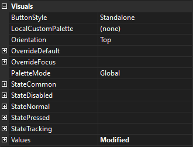
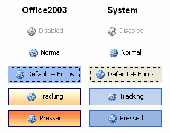
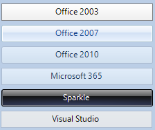
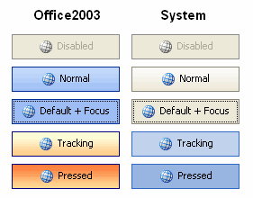
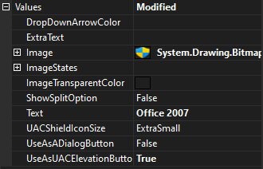
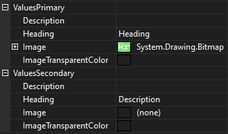

## Control Structure
All of the Krypton controls follow the same basic structure in the organization of properties and how features are exposed. Once you understand the standard organization you can quickly find and customize the control feature of interest. Figure 1 shows the set of properties exposed by the `KryptonButton` control that will be used as the example for the rest of this section.

 
*Figure 1 – KryptonButton standard properties*

Notice that the entire standard set of properties are grouped together under the category name of Visuals. If you ensure your properties window in Visual Studio is organized by category then it becomes very easy to find this group.

Not all Krypton properties are exposed by this category, only the standard set. For example the `KryptonSplitContainer` has a `SplitterWidth` property that is placed in the Layout category. This maintains consistency with the property of the same name that is also in the Layout category for the Windows Forms `SplitContainer` control.

### Styles 

Each type of control has multiple styles that are used to determine how the control will be displayed. This style value is exposed as an enumeration property and in the case of our `KryptonButton` example it is called `ButtonStyle`. The different styles can be thought of as the different variations available for that control.

In the case of the `KryptonButton` the Standalone style is used for a standard button that is appropriate for most situations. The `LowProfile` style is instead intended for use in scenarios where the button should blend into the background of the container until the user interacts with it by giving it focus for moving the mouse over it. *Figure 2* shows an example of the button using each of these two styles.  

*Figure 2 – ButtonStyle examples*

The first column shows the Standalone and `LowProfile` styles when the button is passive. You can see that the second button style has a transparent background in order to be less intrusive. In the second column you can see that when the user moves the mouse over the buttons they both then become highlighted in the same way.

A third button style of `ButtonSpec` is used for buttons when they are placed inside of other Krypton controls and the fourth style of Form is for caption buttons that are used by the `KryptonForm`. There are also extra custom styles that can be defined by using the `KryptonPalette` component. These extra styles always start with the word `Custom` and end with a number. In the case of button styles there are three with the names `Custom1, Custom2 and Custom3`. Styles for different controls have a differing number of custom entries available.
### Palette 

When any of the Krypton controls is drawn the details are sourced from a palette that contains all the default values for all of the different controls. This allows you to quickly switch the appearance of the controls by switching to using a different palette. Note that the palette is used to recover the values to use when they have not been customized at the per control level. See details of the State and Override properties for more details about customizing an individual control.

Each control has two properties called Palette and `PaletteMode` that define which palette to use. `PaletteMode` determines how to find the palette. The default value is called Global and means that the control will use the single global palette. Most applications want all of the Krypton controls to have a consistent look and feel. In order to support this scenario there is a global palette setting. If you change the global palette then all the controls with a `PaletteMode` of Global will automatically start using this new value.

To change the global palette you need to add an instance of the `KryptonManager` component to your application and then modify the `GlobalPaletteMode` and `GlobalPalette` properties. You can do this at design time by just dragging the `KryptonManager` component from the Toolbox and dropping it on your Form. Then select the new component and search in the properties window for the `GlobalPaletteMode` and `GlobalPalette` properties.

Instead of using the Global value you might prefer to specify one of the built-in palettes for use with the control instance. In this case you just need to select one of the entries such as Professional - System and the control will then be fixed to using that built-in palette.

You are not limited to using just built-in palettes. If you use a `KryptonPalette` component in your application then you can create your own custom palette with whatever settings you like. Just drag and drop the `KryptonPalette` from the Toolbox onto your Form and then use the properties window to setup the custom values. In order to modify your control to use the custom palette you need to use the Palette property of the Krypton control. Once assigned, which can be done at design time using the properties window, the `PaletteMode` value will automatically change to Custom. *Figure 3* shows six `KryptonButton` instances where the first one is using built-in palettes of Professional - Office 2003, the second using Office 2007 - Blue, the third using Office 2010 - Blue, the fourth `KryptonButton` using Microsoft 365 - Blue, the fifth using the Sparkle render and the final using the Visual Studio style.

*Figure 3 – KryptonButton with different palettes*

### Renderer 

All control drawing is performed by a renderer. Unlike the palette you cannot alter the renderer used on a per control basis but instead can only alter it at the global level. To change the global renderer you need to add an instance of the `KryptonManager` component to your application and then modify the `GlobalRenderMode` and `GlobalRenderer` properties. You can do this at design time by just dragging the `KryptonManager` component from the Toolbox and dropping it on your Form. Then select the new component and use the properties window to change the settings.

### State 

Each control has a number of properties that begin with the word State, such as `StateDisabled` and `StateNormal`. These are the properties you use to customize the appearance of the control based on the state of the control.

Each control has the two states Disabled and Normal. Some controls have additional states, for example the `KryptonButton` also has Tracking and Pressed states which have matching customization properties of `StateTracking` and `StatePressed`. To work out when each state is applied you should refer to the help documentation for the particular control.

The `KryptonButton` uses the states in the following way. If the control is disabled because the Enabled property is defined as False then it uses the `StateDisabled` values. When the control is enabled but the user is not interacting with it then it uses `StateNormal`. Once the mouse moves over the control area it uses `StateTracking` and if the user presses the mouse down whilst hovering over the control is uses `StatePressed`. By altering the appropriate state values you can easily achieve the look required for your application. Figure 4 shows an example of the appearance for each of the states for the `KryptonButton`.

*Figure 4 – KryptonButton states*

 
Having the ability to alter each state is great for customization but can lead to slow development if you need to alter the same property for each of the states. For example, changing the border width is something you will probably want to be consistent across all the states.

Changing the border width for `StateDisabled, StateNormal, StateTracking and StatePressed` is tedious and prone to errors. This is where the extra `StateCommon` property comes into play. This extra property acts as a common base that all the other states use if they have not been given a value. In our example you just set the border width of `StateCommon` and all the states will inherit this value, unless you specifically set a value for one of the specific states.

### Override 

Some controls such as the `KryptonButton` need to alter the appearance of a state because of an external factor. For example, a button is capable of having the focus because the user can select it using the keyboard. In this case we need to give the user feedback so they can see it has the focus.

Properties that are applied to the current state based on an external factor such as the focus begin with the word Override. The `KryptonButton` has two such properties called `OverrideFocus` and `OverrideDefault`. In addition to focus the button can also be marked as the default button on the owning Form. The user needs feedback on this state because pressing the Enter key will cause the default button to be pressed.

The Override properties differ from State properties in that they do not inherit values from `StateCommon` and are applied to whatever the current state happens to be. Figure 5 shows two examples of the `KryptonButton` control. The top instance is the button in the normal state, the bottom instance shows the button also in normal state but with both the `OverrideFocus` and `OverrideDefault` applied.

*Figure 5 – Overrides applied to the normal state*

### Values 

Many of the Krypton controls display information to the user. For example the `KryptonButton, KryptonLabel and KryptonHeader` controls all have the ability to show some text and/or an image as part of the appearance. This display content is always stored in a property called Values. Content always consists of two text values and an image that are grouped together.  See Figure 1 for an example of the Values property for a `KryptonButton`.

*Figure 6 – KryptonButton values property*

The exact name of the three properties varies depending on the context in which the content is being used. The `KryptonButton` calls them Text, `ExtraText, Image and ImageStates` whereas the `KryptonHeader` uses the names `Header, Description and Image`. Some controls have more than one content property. The `KryptonHeaderGroup` control has two value properties that contain content values, one of the primary header and another for the secondary header. *Figure 7* shows the value properties for a `KryptonHeaderGroup`.

*Figure 7 – Value properties for KryptonHeaderGroup* KryptonHeaderGroup

### Background, Border and Content

Each `Krypton` control has a number of possible states that can each be customized in appearance. Rather than have a completely different set of customization properties for each control there are instead three standard sets that help to improve consistency. The standard sets of values are for the background, border and content.

Not every control will have all three sets as only the relevant ones are provided. So the `KryptonPanel` only has the background set as it does not have a border capability and does not display any content. The `KryptonLabel` has only content properties and so the background and border are not provided. All three are provided for the `KryptonButton` because it does have a background, a border and content values.

Some controls will have extra values in addition to those in the three standard sets as they have extra requirements that are control specific. But once you are familiar with how the three standard sets are used to customize all aspects of the control you will find it easy to deal with any of the Krypton controls. Each of the three sets of properties are explained in detail in the following section of the documentation.
