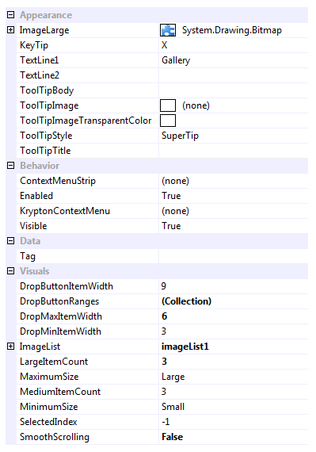

# Ribbon Group Item Gallery

## Group Item Gallery
Use a gallery instance to present the user with a set of images that they can single select from. The user can use the up and down buttons on the side of the gallery to scroll additional rows of images into view. They can also press a drop down button to show a context menu containing the full list of images. If space is constrained then the gallery is replaced with a large button, pressing the large button causes the gallery drop down menu to be shown. Figure 1 shows the list of all properties exposed by the group gallery item.

*Figure 1 - Group Item Gallery Properties*

**ImageLarge**

This property must always have a valid image defined. If you assign null to the properties then it will automatically revert to a default Krypton Toolkit logo image instead. Once the gallery is in the small setting it replaces the gallery appearance with a button appearance and this image is used in the button appearance.

**KeyTip**

When *KeyTips* are displayed this property defines the *KeyTip* for the gallery instance. You should ensure that all items inside a tab have unique *KeyTip* values so that the user can always select items using keyboard access.

**TextLine1**

**TextLine2**

When showing as a button the *TextLine1* and *TextLine2* strings are shown on two separate lines underneath the *ImageLarge*.

**ToolTipBody**

**ToolTipImage**

**ToolTipImageTransparentColor**

**ToolTipStyle**

**ToolTipTitle**

When the user hovers the mouse over the button appearance you can use these properties to define the tool tip that will be displayed. Use *ToolTipTitle* and *ToolTipBody* to define the two text strings for display and *ToolTipImage* for the associated image. If you image contains a color that you would like to be treated as transparent then set the *ToolTipImageTransparentColor*. For example, many bitmaps use magenta as the color to become transparent. To control how the text and image are displayed in the tool tip you can use the *ToolTipStyle* property.

**ContextMenuStrip**

When the user right clicks the gallery this property is used if defined and the *KryptonContextMenu* property is *null*.

**Enabled**

Used to define if the gallery is enabled or disabled at runtime.

**KryptonContextMenu**

When the user right clicks the gallery this context menu is used. If not defined then the *ContextMenuStrip* is used instead.

**Visible**

Use this property to specify if the gallery should be visible at runtime. 

**DropButtonItemWidth**

When the gallery is displayed as a button and the user presses the button it shows a drop down context menu with all the gallery images available for selection. Use this setting to define the number of items per horizontal line in that drop down menu. Note this property only applies when the gallery has been reduce to show as a button.

**DropButtonRanges**

If this collection is empty then all the gallery images are shown in one large group within the drop down menu. In order to change the grouping you add entries to this collection that define a header title and the range of items it should contain. This allows you to split the display images into groups that are titled.  

**DropMaxItemWidth**

**DropMinItemWidth**

By default when the drop down menu is shown for the gallery the number of items per horizontal line will match the current number of items showing in the gallery itself. So if the gallery is showing a width of 4 items then the drop down menu will show items with 4 per line. Use these two properties to define min/max values for the drop down items per line.

**ImageList**

Reference to image list that contains all the display images.

**LargeItemCount**

**MediumImageCount**

The large item count defines the maximum number of items to show in the gallery. This therefore limits the maximum width of the gallery to that needed to show the large item count number of items. As space becomes constrained it will reduce the width of the gallery by until the number of showing items matches the medium item count. Any attempt to reduce the gallery size will then remove the gallery and replace it with a button appearance instead.

**MaximumSize**

**MinimumSize**

Use these two properties to define the maximum and minimum group sizes allowed. Possible values are large, medium and small. The ribbon will always try to show the gallery at the largest possible size allowed by the available size. If the gallery is reduced to the small setting then the gallery is replaced with a button instead.

**SelectedIndex**

Index of the currently selected image for the gallery. 

**SmoothScrolling**

Determines if scrolling occurs as a smooth animation or if instead an immediate jump is made to the destination. 

## Events

**GalleryDropDown**

A cancelable event than allows you to customize the drop down context menu before it is displayed. 

**TrackImage**

As the user tracks over different images this event fires so you can provide instance feedback on the effect this would have if selected. 

**SelectedIndexChanged**

Occurs when the *SelectedIndex* property changes. 

**ImageListChanged**

Fired when the value of the *ImageList* property changes. 
