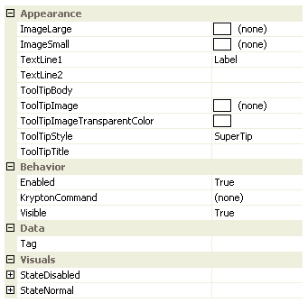

# Ribbon Group Item Label

## Group Item Label

The label item can be added to a group triple or a group lines container. Use this item when you need to present static information or to label another item that is adjacent. Figure 1 shows the list of all properties exposed by the item label instance.

*Figure 1 - Group Item Label Properties*

**ImageLarge**

**ImageSmall**

By default the label item does not show any images. If you need an image shown when the label is the full height of the group content area then use the *ImageLarge* property. All other cases use the *ImageSmall* if it has been specified.

**TextLine1**

**TextLine2**

When the label is inside a container that displays it the full height of the group content area the *TextLine1* and *TextLine2* strings are shown on two separate lines underneath the *ImageLarge*. In all other cases the *TextLine1* and *TextLine2* are concatenated together with a space between them for showing horizontally after the *ImageSmall*.

**ToolTipBody**

**ToolTipImage**

**ToolTipImageTransparentColor**

**ToolTipStyle**

**ToolTipTitle**

When the user hovers the mouse over the label instance you can use these properties to define the tool tip that will be displayed. Use *ToolTipTitle* and *ToolTipBody* to define the two text strings for display and *ToolTipImage* for the associated image. If you image contains a color that you would like to be treated as transparent then set the *ToolTipImageTransparentColor*. For example, many bitmaps use magenta as the color to become transparent. To control how the text and image are displayed in the tool tip you can use the *ToolTipStyle* property.

**Enabled**

Used to define if the label is enabled or disabled at runtime.

**KryptonCommand**

Attached command that is used as a source of state.

**Visible**

Use this property to specify if the label should be visible at runtime.

**StateDisabled**

**StateNormal**

You can modify the colors used for drawing the label text by using these properties. All other types of item and container cannot be customized on a per instance basis. However, the label has the extra customization ability because it allows state information to be related to the user more effectively. For example, you might set text color to green when your application is working correctly and then change the text to red when a problem occurs.

**Tag**

Associate application specific information with the object instance by using this property.
