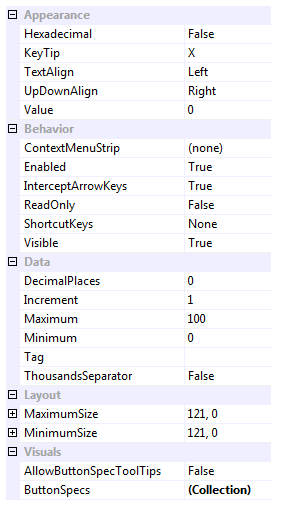

# Ribbon Group Item NumericUpDown

## Group Item NumericUpDown
Use this element to add a numeric up down control to the ribbon. The set of available properties is shown in Figure 1.

*Figure 1 - Group Item NumericUpDown Properties*

**Hexadecimal**

Determines if the numeric is display in hex (base 16) format or in the usual decimal (base 10) format.

**KeyTip**

When *KeyTips* are displayed this property defines the *KeyTip* for the custom control instance. You should ensure that all items inside a tab have unique *KeyTip* values so that the user can always select items using keyboard access.

**TextAlign**

Defines the alignment of the numeric value which can be either left, centered or the right.

**UpDownAlign**

Should the up-down spin buttons be placed to the right or left of the edit box.

**Value**

The current decimal value as entered by the user into the edit box.

**ContextMenuStrip**

Reference to menu strip associated with the control instance.

**Enabled**

Used to define if the text box is enabled or disabled at runtime.

**InterceptArrowKeys**

*True* if you want the numeric control to use the up and down arrow keys to modify the edit value.

**ReadOnly**

Should the value be presented as read only for the user.

**ShortcutKeys**

Define this property if you would like your application to have a shortcut key combination that sets focus to the numeric.

**Visible**

Use this property to specify if the text box should be visible at runtime. 

**DecimalPlaces**

How many digits should be displayed after the decimal place.

**Increment**

The decimal value to add or subtract when the user presses the spin buttons or up and down arrow keys.

**Maximum**

The upper limit allowed for the value of the numeric.

**Minimum**

The lower limit allowed for the value of the numeric.

**Tag**

Associate application specific information with the object instance by using this property.

**ThousandsSeparator**

When defined the culture specific thousands separator will be shown between each group of three digits.

**MaximumSize**

**MinimumSize**

These two properties are very important and allow you to control the width of the combo box. By default they have the same value giving a fixed width to the control, but you can alter the values so that they specify a valid range of widths. When the control is positioned it is asked for its preferred size which is then constrained by these two properties.

**AllowButtonSpecTooltips**

By default the text box will not show any tool tips when you hover the mouse over the user defined button specifications. If you set this boolean property to *True* then it will turn on tool tips for those button specs. Use the *ButtonSpec.TooltipText* property in order to define the string you would like to appear inside the displayed tool tip.

**ButtonSpecs**

You can add extra buttons to the text box by modifying the *ButtonSpecs* collection. Each *ButtonSpec* entry in the collection describes a single button for display. You can use the *ButtonSpec* to control all aspects of the displayed button including visibility, edge, image, text and more. At design time use the collection editor for the *ButtonSpecs* property in order to modify the collection and modify individual *ButtonSpec* instances.  

**Hidden Property**

In order to gain access to the underlying *KryptonNumericUpDown* instance you can use the hidden property called *NumericUpDown*. This is not displayed at design time and not persisted but can be accessed via code at runtime. This is useful if you need to access a property that is not exposed via this ribbon element.
