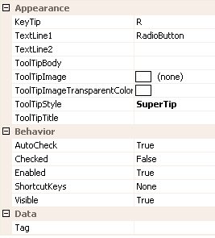

# Ribbon Group Item RadioButton

## Group Item RadioButton
You can add a radio button to either the group triple or the group lines container. Use the Checked property to define the checked state of the radio button. Figure 1 shows the list of all properties exposed by the group radio button item.

*Figure 1 - Group Item RadioButton Properties*

**KeyTip**

When *KeyTips* are displayed this property defines the *KeyTip* for the radio button instance. You should ensure that all items inside a tab have unique *KeyTip* values so that the user can always select items using keyboard access.

**TextLine1**

**TextLine2**

When the radio button is inside a container that displays it the full height of the group content area the *TextLine1* and *TextLine2* strings are shown on two separate lines underneath the radio button image. In all other cases the *TextLine1* and *TextLine2* are concatenated together with a space between them for showing horizontally after the radio button image.

**ToolTipBody**

**ToolTipImage**

**ToolTipImageTransparentColor**

**ToolTipStyle**

**ToolTipTitle**

When the user hovers the mouse over the radio button instance you can use these properties to define the tool tip that will be displayed. Use *ToolTipTitle* and *ToolTipBody* to define the two text strings for display and *ToolTipImage* for the associated image. If you image contains a color that you would like to be treated as transparent then set the *ToolTipImageTransparentColor*. For example, many bitmaps use magenta as the color to become transparent. To control how the text and image are displayed in the tool tip you can use the *ToolTipStyle* property.

**AutoCheck**

When defined as *True* this property will ensure that the radio but is automatically reset to false when any other radio button inside the same ribbon group becomes checked. This allows a group of radio button instances to act as a group where only a single radio button is checked at any time. It also allows the user to alter the checked state by clicking the control.

**Checked**

A boolean property this indicates if the radio button is currently checked or not.

**Enabled**

Used to define if the radio button is enabled or disabled at runtime.

**ShortcutKeys**

Define this property if you would like your application to have a shortcut key combination that invokes the radio button.

**Visible**

Use this property to specify if the radio button should be visible at runtime.

**Tag**

Associate application specific information with the object instance by using this property.

## Events

**Click**

Occurs when the radio button has been pressed. 

**CheckedChanged**

Occurs when the *Checked* property changes value. 
