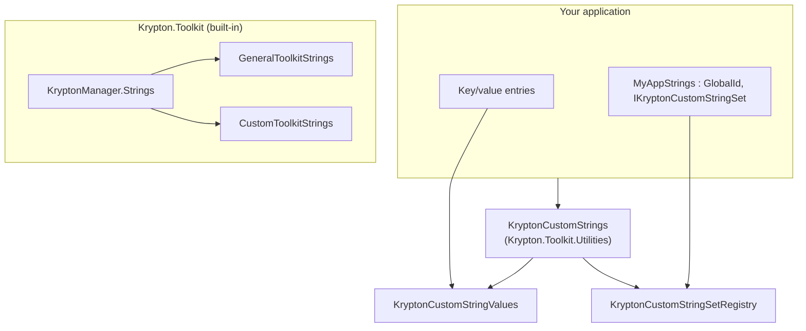

# Custom Strings

**Feature:** [#3757 — Make the `KryptonManager` strings more flexible to use](https://github.com/Krypton-Suite/Standard-Toolkit/issues/3757)  
**Assembly:** `Krypton.Toolkit.Utilities`  
**Namespace:** `Krypton.Toolkit.Utilities`  
**Availability:** Krypton Standard Toolkit **V110** (Build 2611+)

---

## Table of Contents

1. [Overview](#overview)
2. [Why a separate Utilities API](#why-a-separate-utilities-api)
3. [Architecture](#architecture)
4. [Choosing an approach](#choosing-an-approach)
5. [Key/value custom strings](#keyvalue-custom-strings)
6. [Strongly-typed string sets](#strongly-typed-string-sets)
7. [API reference](#api-reference)
8. [Localisation](#localisation)
9. [Best practices](#best-practices)
10. [Complete examples](#complete-examples)
11. [TestForm sample](#testform-sample)
12. [Distinction from built-in `CustomStrings`](#distinction-from-built-in-customstrings)
13. [Troubleshooting](#troubleshooting)

---

## Overview

`KryptonCustomStrings` lets application developers store and localise **their own** UI text without modifying toolkit source or adding properties to `KryptonManager.Strings`.

The feature lives in **`Krypton.Toolkit.Utilities`** (not core `Krypton.Toolkit`) and provides:

| Mechanism | Type | Best for |
|-----------|------|----------|
| **Key/value store** | `KryptonCustomStringValues` via `KryptonCustomStrings.Values` | Dynamic keys, `.resx` bulk import |
| **Registered string sets** | Classes implementing `IKryptonCustomStringSet` | Strongly-typed properties, larger apps |

**Entry point:**

```csharp
using Krypton.Toolkit.Utilities;

KryptonCustomStrings.Set("SaveDraft", "S&ave Draft");
KryptonCustomStrings.RegisterStringSet("MyApp", myAppStrings);
```

---

## Why a separate Utilities API

Built-in toolkit strings remain on `KryptonManager.Strings` (`GeneralStrings`, `MessageBoxStrings`, etc.).

Custom application strings are intentionally placed in **Utilities** because:

- They are an **optional extension** — apps reference `Krypton.Toolkit.Utilities` when needed.
- Avoids a circular dependency (`Utilities` already references `Krypton.Toolkit`; core toolkit must not reference Utilities).
- Keeps core `Krypton.Toolkit` focused on built-in controls and palette strings.

---

## Architecture



---

## Choosing an approach

### Use key/value (`KryptonCustomStrings.Values`) when:

- Keys are ad-hoc or loaded from external sources
- You want minimal boilerplate
- Bulk import from `.resx` is sufficient

### Use strongly-typed sets when:

- You want IntelliSense (`strings.SaveDraft`)
- You mirror the toolkit string-class pattern (`Reset`, `IsDefault`, `[Localizable]`)
- You have a fixed vocabulary of application strings

---

## Key/value custom strings

### Basic usage

```csharp
using Krypton.Toolkit.Utilities;

// Indexer on Values
KryptonCustomStrings.Values["SaveDraft"] = "S&ave Draft";

// Explicit methods
KryptonCustomStrings.Set("DiscardChanges", "&Discard");
string save = KryptonCustomStrings.Get("SaveDraft", "Save Draft");

// Direct access to the values object
KryptonCustomStrings.Values.TryGetValue("SaveDraft", out string value);
KryptonCustomStrings.Values.Remove("SaveDraft");
KryptonCustomStrings.ResetValues();
```

### Key rules

| Rule | Detail |
|------|--------|
| Key comparison | Ordinal, case-sensitive |
| Null/empty keys | Ignored for `Set`; get returns `string.Empty` |
| Missing key | Returns `string.Empty` |
| Default state | `Values.IsDefault` is `true` when empty |

---

## Strongly-typed string sets

### Define a string set

```csharp
using Krypton.Toolkit;
using Krypton.Toolkit.Utilities;

[TypeConverter(typeof(ExpandableObjectConverter))]
public class MyAppStrings : GlobalId, IKryptonCustomStringSet
{
    private const string DEFAULT_SAVE_DRAFT = "S&ave Draft";

    public MyAppStrings() => Reset();

    [Browsable(false)]
    public bool IsDefault => SaveDraft == DEFAULT_SAVE_DRAFT;

    public void Reset() => SaveDraft = DEFAULT_SAVE_DRAFT;

    [Localizable(true)]
    [DefaultValue(DEFAULT_SAVE_DRAFT)]
    public string SaveDraft { get; set; }
}
```

### Register and use

```csharp
private static readonly MyAppStrings AppStrings = new MyAppStrings();

static void Main()
{
    KryptonCustomStrings.RegisterStringSet("MyApp", AppStrings);
    Application.Run(new MainForm());
}

// Anywhere in the app
MyAppStrings? strings = KryptonCustomStrings.GetStringSet<MyAppStrings>("MyApp");
kbtnSave.Text = strings?.SaveDraft ?? "Save";
```

---

## Designer component

Drop **`KryptonCustomStringsManager`** on a form (from the toolbox when `Krypton.Toolkit.Utilities` is referenced). It exposes the same global store as `KryptonCustomStrings.Values`:

| Property | Description |
|----------|-------------|
| `CustomStrings` | Expand in the property grid → **Entries** to add key/value pairs |
| Designer verb | **Reset Custom Strings** (context menu on the component) |

Runtime access is unchanged — both the component and `KryptonCustomStrings` read/write the same static `Values` instance:

```csharp
// Designer sets entries on kryptonCustomStringsManager1.CustomStrings
kbtnSave.Text = KryptonCustomStrings.Get("SaveDraft");
```

Localise the component via form `.resx` files the same way as `KryptonManager.ToolkitStrings`.

### `KryptonCustomStringsManager`

| Member | Description |
|--------|-------------|
| `CustomStrings` | Designer-serialisable access to `KryptonCustomStrings.Values` |

---

## API reference

### `KryptonCustomStrings` (static)

| Member | Description |
|--------|-------------|
| `Values` | `KryptonCustomStringValues` key/value store |
| `Get(key, defaultValue = "")` | Get with fallback |
| `Set(key, value)` | Set or add |
| `ResetValues()` | Clear all key/value entries |
| `RegisterStringSet(name, stringSet)` | Register typed set |
| `GetStringSet<T>(name)` | Get typed set |
| `TryGetStringSet(name, out stringSet)` | Try get |
| `ContainsStringSet(name)` | Whether registered |
| `UnregisterStringSet(name)` | Remove registration |
| `ResetStringSets()` | Reset all registered typed sets |

### `KryptonCustomStringValues`

| Member | Description |
|--------|-------------|
| `this[string key]` | Get/set |
| `Set`, `TryGetValue`, `Remove`, `Clear`, `Reset` | Collection operations |
| `Entries` | `List<KryptonCustomStringEntry>` for serialisation |
| `IsDefault` | `true` when empty |

### `IKryptonCustomStringSet`

| Member | Description |
|--------|-------------|
| `IsDefault` | All values at defaults |
| `Reset()` | Restore defaults |

### `KryptonCustomStringSetRegistry`

Low-level registry (also used internally by `KryptonCustomStrings`): `Register`, `Get<T>`, `TryGet`, `Contains`, `Unregister`, `ResetAll`.

---

## Localisation

Load from `.resx` at startup or on culture change:

```csharp
private static void LoadCustomStrings(CultureInfo culture)
{
    var resources = new ComponentResourceManager(typeof(MyStringResources));
    foreach (DictionaryEntry entry in resources.GetResourceSet(culture, true, true)!)
    {
        if (entry.Key is string key && entry.Value is string value)
        {
            KryptonCustomStrings.Set(key, value);
        }
    }

    MyAppStrings? strings = KryptonCustomStrings.GetStringSet<MyAppStrings>("MyApp");
    strings?.Reset();
    // reload typed properties from resources...
}
```

Built-in toolkit strings continue to localise through `KryptonManager.ToolkitStrings` independently.

---

## Best practices

1. Reference **`Krypton.Toolkit.Utilities`** in projects that use custom strings.
2. Do **not** confuse `KryptonCustomStrings` with `KryptonManager.Strings.CustomStrings` — the latter is toolkit-owned (`CustomToolkitStrings`: Apply, Cut, On/Off, …).
3. Register typed sets once at startup; retain the instance in a static field.
4. Use stable registration names (`"MyApp"`, `"MyApp.Reporting"`).
5. Register and modify key/value strings on the **UI thread**.

---

## Complete examples

### Key/value binding

```csharp
KryptonCustomStrings.Set("SaveDraft", "S&ave Draft");
kbtnSaveDraft.Text = KryptonCustomStrings.Get("SaveDraft");
```

### Typed set

```csharp
KryptonCustomStrings.RegisterStringSet("MyApp", new MyAppStrings());
var strings = KryptonCustomStrings.GetStringSet<MyAppStrings>("MyApp");
```

---

## TestForm sample

**Start Screen → Custom Strings** (`ApplicationStringsTest`):

- Phase 1: `KryptonCustomStrings.Values` / `Get` / `Set`
- Phase 2: `DemoAppStrings` + `RegisterStringSet`

Sources: `TestForm/ApplicationStringsTest.cs`, `TestForm/DemoAppStrings.cs`

---

## Distinction from built-in `CustomStrings`

| API | Assembly | Purpose |
|-----|----------|---------|
| `KryptonManager.Strings.CustomStrings` | `Krypton.Toolkit` | Toolkit Apply/Cut/Copy/On/Off, … |
| `KryptonCustomStrings` | `Krypton.Toolkit.Utilities` | **Your** application strings (#3757) |

---

## Troubleshooting

### Type not found

Add a project reference to `Krypton.Toolkit.Utilities`.

### `GetStringSet<T>` returns null

Name not registered, wrong type, or registration happened after the get call.

### `RegisterStringSet` throws

The instance must implement `IKryptonCustomStringSet` and derive from `GlobalId`.

---

For further details see [GitHub issue #3757](https://github.com/Krypton-Suite/Standard-Toolkit/issues/3757).
