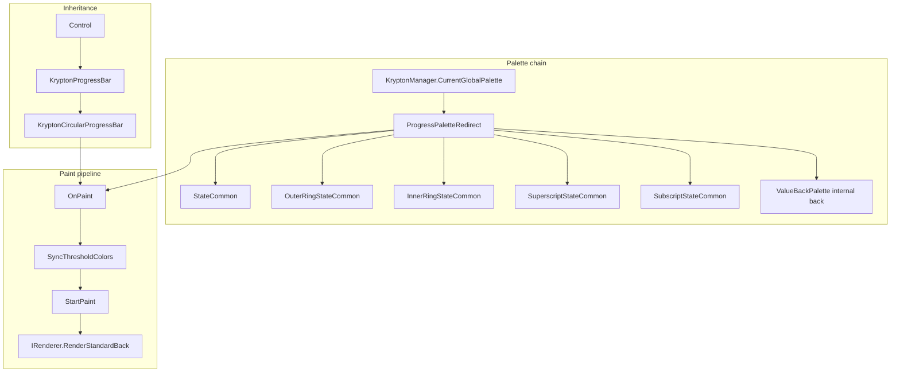

# KryptonCircularProgressBar — Developer Documentation

`KryptonCircularProgressBar` is a WinForms control in **Krypton.Toolkit.Utilities** that renders a circular (donut-style) progress indicator with full Krypton palette integration, animated value transitions, optional marquee mode, centre text with superscript/subscript labels, and tri-state threshold colouring inherited from `KryptonProgressBar`.

| Item | Detail |
|------|--------|
| **Namespace** | `Krypton.Toolkit.Utilities` |
| **Assembly** | `Krypton.Toolkit.Utilities` |
| **Base class** | `Krypton.Toolkit.KryptonProgressBar` |
| **Source** | `Components/Krypton Circular Progress Bar/ControlsToolkit/KryptonKryptonCircularProgressBar.cs` |
| **Toolbox** | Yes (`KryptonCircularProgressBar.bmp`) |
| **Default binding** | `Value` |
| **TFMs** | All targets supported by `Krypton.Toolkit.Utilities` (including `net472`) |

---

## Table of contents

1. [Overview](#overview)
2. [Getting started](#getting-started)
3. [Architecture](#architecture)
4. [Visual structure and paint order](#visual-structure-and-paint-order)
5. [Features](#features)
6. [Palette integration](#palette-integration)
7. [Animation](#animation)
8. [Tri-state thresholds](#tri-state-thresholds)
9. [API reference — circular-specific members](#api-reference--circular-specific-members)
10. [API reference — inherited from KryptonProgressBar](#api-reference--inherited-from-kryptonprogressbar)
11. [Protected extensibility](#protected-extensibility)
12. [Code examples](#code-examples)
13. [Designer and property grid](#designer-and-property-grid)
14. [TestForm demo](#testform-demo)
15. [Related types](#related-types)
16. [Limitations and differences from KryptonProgressBar](#limitations-and-differences-from-kryptonprogressbar)
17. [Troubleshooting](#troubleshooting)

---

## Overview

The control draws concentric circular layers:

- An optional **outer ring** (decorative track/chrome)
- A **progress arc** (filled pie wedge whose sweep is proportional to `Value`)
- An optional **inner ring**
- **Centre text** with optional **superscript** and **subscript** companions

Unlike the earlier `ColorTable`-based approach, all coloured surfaces (except punched “holes”) are rendered through the active Krypton **`IRenderer`** using `RenderStandardBack.DrawBack`, so theme colours, gradients, glass styles, and back images from the palette system apply consistently.

The control participates in **global palette changes** automatically because it shares the parent progress bar’s `PaletteRedirect` instance.

---

## Getting started

### Reference the assembly

Add a project reference to `Krypton.Toolkit.Utilities` (which transitively references `Krypton.Toolkit`).

### Minimal example

```csharp
using Krypton.Toolkit.Utilities;

var progress = new KryptonCircularProgressBar
{
    Location = new Point(20, 20),
    Size = new Size(200, 200),
    Value = 65,
    Text = "65",
    SuperscriptText = "%",
    SubscriptText = "CPU"
};

form.Controls.Add(progress);
```

### Theme awareness

Colours follow `KryptonManager.CurrentGlobalPalette` by default. Change the application theme (for example via `KryptonThemeComboBox` or `KryptonManager.GlobalPaletteMode`) and the control repaints with the new palette.

To override the progress arc colour:

```csharp
progress.StateCommon.Back.Color1 = Color.DodgerBlue;
progress.ValueBackColorStyle = PaletteColorStyle.GlassNormalFull;
```

---

## Architecture



### Key design points

| Topic | Behaviour |
|-------|-----------|
| **Paint entry** | `OnPaint` is fully overridden; the linear `KryptonProgressBar` renderer path is **not** used for the circular geometry. |
| **Palette redirect** | Ring and text palette objects are constructed with `ProgressPaletteRedirect` from the base class, so overrides and global palette changes stay in sync. |
| **Value fill** | The progress arc uses the base class **value back** palette (`ValueBackPalette` / `_stateBackValue`), the same object that drives the filled segment on `KryptonProgressBar`. |
| **Centre text** | Uses `StateNormal` / `StateDisabled` **content** short-text colours from the inherited `PaletteTriple`. |
| **Transparency** | Default `BackColor` is `Transparent`. “Hole” regions sample the parent surface via a cached `TextureBrush` when alpha &lt; 255. |
| **Animation** | Runtime uses the embedded **WinFormAnimation** library (`WinFormAnimation.Animator`). The animator is not created in `DesignMode`. |

---

## Visual structure and paint order

Paint proceeds from outside to inside. Each ring is drawn as a filled ellipse; when `*Width >= 0`, an inner ellipse is punched with the background brush to form a donut segment.

```
    ┌─────────────────────────────────────┐
    │  Outer ring  (OuterRingState*)      │
    │  ┌───────────────────────────────┐  │
    │  │ Progress arc (ValueBackPalette)│  │
    │  │  ┌─────────────────────────┐  │  │
    │  │  │ Inner ring (InnerRing*) │  │  │
    │  │  │  ┌───────────────────┐  │  │  │
    │  │  │  │ Centre text       │  │  │  │
    │  │  │  │ + super/subscript │  │  │  │
    │  │  │  └───────────────────┘  │  │  │
    │  │  └─────────────────────────┘  │  │
    │  └───────────────────────────────┘  │
    └─────────────────────────────────────┘
```

### Default layout metrics (constructor)

| Property | Default | Role |
|----------|---------|------|
| `Size` | `320 × 320` | Control bounds |
| `OuterMargin` | `-25` | Inset/outset before progress region (negative expands outward) |
| `OuterWidth` | `26` | Thickness of outer ring; `0` skips outer ring body |
| `ProgressWidth` | `25` | Thickness of progress arc band |
| `InnerMargin` | `2` | Gap between progress band and inner ring |
| `InnerWidth` | `-1` | Inner ring thickness; negative values affect layout offset |
| `StartAngle` | `270` | Progress arc origin (degrees, GDI+ convention: 0 = 3 o'clock, clockwise) |
| `TextMargin` | `8, 8, 0, 0` | Padding around centre text layout |
| `Font` | 72pt Bold (Segoe UI family) | Centre value font |
| `SecondaryFont` | 50% of centre font, Regular | Superscript/subscript font |

### Ring visibility rules

A ring is drawn only when:

1. Its `*Width` property is **not** `0`, and  
2. The resolved `IPaletteBack.GetBackDraw(state)` is not `InheritBool.False`, and  
3. `GetBackColor1(state)` is not `Color.Empty` and has **alpha &gt; 0**.

---

## Features

| Feature | Description |
|---------|-------------|
| **Palette-driven rendering** | Outer ring, inner ring, progress arc, and text colours come from Krypton palette state objects. |
| **Animated value changes** | Continuous styles animate `Value` transitions over `AnimationSpeed` ms. |
| **Marquee mode** | `ProgressBarStyle.Marquee` rotates the arc start angle continuously. |
| **Tri-state colours** | Reuses `TriStateValues` from `KryptonProgressBar` to change progress (and optionally text) colours by threshold. |
| **Centre labels** | Large centre `Text`, plus `SuperscriptText` / `SubscriptText` with independent palette content. |
| **RTL support** | `RightToLeft` flows into `StringFormat` for text drawing. |
| **Double buffering** | `OptimizedDoubleBuffer` and `AllPaintingInWmPaint` reduce flicker. |
| **Designer support** | Expandable **Visuals** nodes for all palette state objects. |
| **Data binding** | `Value` is bindable (`[Bindable(true)]`, default binding property). |
| **Taskbar progress** | Inherited `UseTaskbarProgress` / `TaskbarProgressState` still update when `Value` changes (linear taskbar bar, not circular). |

---

## Palette integration

### Palette state map

| UI region | Palette objects | Default back/content style (in constructor) |
|---------|-----------------|-----------------------------------------------|
| **Progress arc** | `StateCommon.Back` → `ValueBackPalette`; `ValueBackColorStyle`; `StateNormal` / `StateDisabled` for renderer state | `StateCommon.Back.Color1 = Green` (base default); `ValueBackColorStyle = GlassNormalFull` |
| **Centre text** | `StateNormal.Content.ShortText` / `StateDisabled.Content.ShortText` | Inherited from `ButtonStandalone` content chain |
| **Outer ring** | `OuterRingStateCommon`, `OuterRingStateNormal`, `OuterRingStateDisabled` | `PaletteBackStyle.ButtonStandalone` |
| **Inner ring** | `InnerRingStateCommon`, `InnerRingStateNormal`, `InnerRingStateDisabled` | `PaletteBackStyle.PanelAlternate` |
| **Superscript** | `SuperscriptStateCommon`, `SuperscriptStateNormal`, `SuperscriptStateDisabled` | `PaletteContentStyle.LabelNormalPanel` (text via `Content.ShortText`) |
| **Subscript** | `SubscriptStateCommon`, `SubscriptStateNormal`, `SubscriptStateDisabled` | `PaletteContentStyle.LabelNormalPanel` |

### Typical customisation

```csharp
// Progress arc — solid override
circular.StateCommon.Back.Color1 = Color.MediumSeaGreen;
circular.ValueBackColorStyle = PaletteColorStyle.GlassNormalFull;

// Outer / inner rings
circular.OuterRingStateCommon.Back.Color1 = Color.DimGray;
circular.InnerRingStateCommon.Back.Color2 = Color.LightGray;
circular.InnerRingStateCommon.Back.ColorStyle = PaletteColorStyle.Linear;

// Centre and annotation text
circular.StateNormal.Content.ShortText.Color1 = Color.White;
circular.SuperscriptStateCommon.Content.ShortText.Color1 = Color.Silver;
circular.SubscriptStateCommon.Content.ShortText.Color1 = Color.Silver;
```

### Theme change behaviour

On each paint, `SyncThresholdColors()` runs (from the base class) so tri-state overrides are applied before drawing. Palette state objects raise `NeedPaint` via `OnCircularNeedPaint`, which calls `Invalidate()`.

When the global palette changes, the base `KryptonProgressBar` handler updates `ProgressPaletteRedirect.Target`; all ring and text palette inherit chains pick up new colours on the next paint.

---

## Animation

### Continuous styles (`Continuous`, `Blocks`)

When `Style != Marquee` and not in the designer:

1. `InitializeContinues` compares the current `Value` to `_lastValue`.
2. If `AnimationSpeed <= 0`, the displayed value jumps immediately.
3. Otherwise `WinFormAnimation.Animator` interpolates from the current animated value to the target `Value` over `AnimationSpeed` milliseconds using `AnimationFunction` / `CustomAnimationFunction`.
4. Each animation frame sets `_animatedValue` and calls `Invalidate()`.

The painted sweep angle uses `_animatedValue ?? Value`:

```
sweepAngle = (animatedValue - Minimum) / (Maximum - Minimum) * 360°
```

### Marquee style

When `Style == Marquee`:

1. `InitializeMarquee` drives `_animatedStartAngle` from `0` to `359` over `MarqueeAnimationSpeed` ms, repeating.
2. The progress arc uses the animated start angle instead of `StartAngle`.
3. Sweep is still based on the current value ratio (often left at a fixed value for a spinning segment effect).

### AnimationFunction

| Property | Type | Default | Description |
|----------|------|---------|-------------|
| `AnimationFunction` | `WinFormAnimation.KnownAnimationFunctions` | `Linear` | Named easing curve for value/marquee paths. |
| `CustomAnimationFunction` | `WinFormAnimation.AnimationFunctions.Function` | — | Hidden; set programmatically for custom easing. Assigning non-null sets `AnimationFunction` to `None`. |
| `AnimationSpeed` | `int` | `500` | Duration (ms) for **value** transitions. `0` disables value animation. |

#### Known easing functions

`Linear`, `QuadraticEaseIn`, `QuadraticEaseOut`, `QuadraticEaseInOut`, `CubicEaseIn`, `CubicEaseOut`, `CubicEaseInOut`, `QuarticEaseIn`, `QuarticEaseOut`, `QuarticEaseInOut`, `QuinticEaseIn`, `QuinticEaseOut`, `QuinticEaseInOut`, `SinusoidalEaseIn`, `SinusoidalEaseOut`, `SinusoidalEaseInOut`, `CircularEaseIn`, `CircularEaseOut`, `CircularEaseInOut`, `ExponentialEaseIn`, `ExponentialEaseOut`, `ExponentialEaseInOut`, `None`.

---

## Tri-state thresholds

`KryptonCircularProgressBar` inherits [`ProgressBarTriStateValues`](https://github.com/Krypton-Suite/Standard-Toolkit/blob/master/Source/Krypton%20Components/Krypton.Toolkit/Values/ProgressBarTriStateValues.cs) via `TriStateValues`.

| Property | Purpose |
|----------|---------|
| `UseTriStateColors` | Enables threshold-based progress (and optional text) colours. |
| `AutoCalculateThresholdValues` | Sets low/high thresholds to one-third and two-thirds of the range. |
| `LowThreshold` / `HighThreshold` | Manual thresholds (disabled when auto-calculate is on). |
| `LowThresholdValues` / `MediumThresholdValues` / `HighThresholdValues` | Per-region `Back` and `Content` overrides. |
| `UseOppositeTextColors` | Derives readable text colour from the active region back colour. |
| `CommonBaseValues` + `AssignFromCommonBaseValuesTo*` | Copy a template to one or all regions. |

When enabled, the base class `UpdateThresholdColor()` mutates `ValueBackPalette` (and optionally `StateNormal.Content`) before each paint — the circular control reads those colours through the same value-back path as the linear progress bar.

**Example — traffic-light progress:**

```csharp
var cpb = new KryptonCircularProgressBar { Value = 80 };

cpb.TriStateValues.UseTriStateColors = true;
cpb.TriStateValues.AutoCalculateThresholdValues = true;
cpb.TriStateValues.LowThresholdValues.StateCommon.Back.Color1 = Color.IndianRed;
cpb.TriStateValues.MediumThresholdValues.StateCommon.Back.Color1 = Color.Goldenrod;
cpb.TriStateValues.HighThresholdValues.StateCommon.Back.Color1 = Color.MediumSeaGreen;
```

---

## API reference — circular-specific members

### Behaviour

| Member | Type | Default | Description |
|--------|------|---------|-------------|
| `AnimationFunction` | `KnownAnimationFunctions` | `Linear` | Easing for animated value/marquee paths. |
| `AnimationSpeed` | `int` | `500` | Value transition duration (ms). `0` = instant. |
| `CustomAnimationFunction` | `AnimationFunctions.Function` | hidden | Custom easing delegate (code-only). |

### Layout

| Member | Type | Default | Description |
|--------|------|---------|-------------|
| `OuterMargin` | `int` | `-25` | Radial offset applied before the progress region. |
| `OuterWidth` | `int` | `26` | Outer ring thickness; `0` = skip. |
| `ProgressWidth` | `int` | `25` | Progress arc band thickness. |
| `InnerMargin` | `int` | `2` | Spacing before inner ring. |
| `InnerWidth` | `int` | `-1` | Inner ring thickness; `0` = skip. |
| `StartAngle` | `int` | `270` | Progress arc start (degrees). |
| `TextMargin` | `Padding` | `8, 8, 0, 0` | Centre text layout padding. |
| `SuperscriptMargin` | `Padding` | `10, 35, 0, 0` | Superscript offset. |
| `SubscriptMargin` | `Padding` | `10, -35, 0, 0` | Subscript offset. |

### Appearance

| Member | Type | Default | Description |
|--------|------|---------|-------------|
| `Font` | `Font` | 72pt Bold | Centre text (overridden visible in designer). |
| `SecondaryFont` | `Font` | 50% centre size | Superscript/subscript font. |
| `Text` | `string` | `"0"` | Centre display string (inherits `KryptonProgressBar` / `Values.Text`). |
| `SuperscriptText` | `string` | `""` | Text drawn above/right of centre value. |
| `SubscriptText` | `string` | `""` | Text drawn below/right of centre value. |

### Visuals — outer ring (`PaletteDouble` / `PaletteDoubleRedirect`)

| Member | Description |
|--------|-------------|
| `OuterRingStateCommon` | Base back/border styles and overrides (`ButtonStandalone` defaults). |
| `OuterRingStateNormal` | Normal-state overrides. |
| `OuterRingStateDisabled` | Disabled-state overrides. |

### Visuals — inner ring

| Member | Description |
|--------|-------------|
| `InnerRingStateCommon` | Base (`PanelAlternate` defaults). |
| `InnerRingStateNormal` | Normal overrides. |
| `InnerRingStateDisabled` | Disabled overrides. |

### Visuals — superscript / subscript (`PaletteTriple` / `PaletteTripleRedirect`)

| Member | Description |
|--------|-------------|
| `SuperscriptStateCommon` | Base content (`LabelNormalPanel`). |
| `SuperscriptStateNormal` | Normal overrides. |
| `SuperscriptStateDisabled` | Disabled overrides. |
| `SubscriptStateCommon` | Base content. |
| `SubscriptStateNormal` | Normal overrides. |
| `SubscriptStateDisabled` | Disabled overrides. |

### Methods

| Method | Description |
|--------|-------------|
| `Increment(int step)` | **Shadows** base `Increment`; sets `Value = Value + step` without marquee guard. Prefer base behaviour awareness (see [Limitations](#limitations-and-differences-from-kryptonprogressbar)). |

---

## API reference — inherited from KryptonProgressBar

These members are defined on the base class and are relevant to the circular control:

### Value and range

| Member | Default | Notes |
|--------|---------|-------|
| `Value` | `0` | Bindable; triggers tri-state update and optional `UseValueAsText`. |
| `Minimum` | `0` | |
| `Maximum` | `100` | |
| `Step` | `10` | Used by `PerformStep()` / `Increment`. |
| `Increment(int)` | base | Throws in `Marquee` style (base implementation). |
| `PerformStep()` | | Advances by `Step`. |

### Progress style

| Member | Default | Circular usage |
|--------|---------|----------------|
| `Style` | `Continuous` | `Marquee` enables rotating arc; `Blocks` has no block rendering on circular path. |
| `MarqueeAnimationSpeed` | `100` (base ctor); circular ctor sets `2000` | Marquee rotation period (ms). |

### Visuals (inherited)

| Member | Description |
|--------|-------------|
| `StateCommon` | Common back/border/content; **`StateCommon.Back.Color1`** drives default progress arc colour. |
| `StateNormal` | Normal overrides; **centre text** uses `Content.ShortText`. |
| `StateDisabled` | Disabled overrides. |
| `ValueBackColorStyle` | `PaletteColorStyle` for the progress arc (`GlassNormalFull` default). |
| `TriStateValues` | Threshold colour configuration. |
| `UseValueAsText` | Sets `Text` to `"{Value}%"` when value changes. |
| `Values` | `LabelValues` storage for text metadata. |

### Taskbar (inherited)

| Member | Description |
|--------|-------------|
| `UseTaskbarProgress` | Mirrors value to the parent form’s taskbar button. |
| `TaskbarProgressState` | `Normal`, `Error`, `Paused`, etc. |

### Inherited but not used in circular paint

The following exist on the base class but **do not affect** circular rendering today:

| Member | Reason |
|--------|--------|
| `Orientation` | Linear layout only. |
| `BlockCount` | No block-style drawing on the arc. |
| `ShowTextShadow` / `TextShadowColor` | Not implemented in `StartPaint`. |
| `ShowTextBackdrop` / `TextBackdropColor` | Not implemented in `StartPaint`. |

---

## Protected extensibility

Override these members in a derived class to customise behaviour:

| Member | Purpose |
|--------|---------|
| `InitializeContinues(bool firstTime)` | Value animation setup. |
| `InitializeMarquee(bool firstTime)` | Marquee rotation setup. |
| `StartPaint(PaintEventArgs e)` | Core drawing (rings, arc, text). |
| `RecreateBackgroundBrush()` | Transparent / parent-sampled hole brush. |
| `ParentOnInvalidated` / `ParentOnResize` | Parent surface change hooks. |

Base class protected helpers (usable from derived types in other assemblies):

| Member | Purpose |
|--------|---------|
| `ProgressPaletteRedirect` | Shared `PaletteRedirect` instance. |
| `ResolvedPalette` | Active `PaletteBase`. |
| `ValueBackPalette` | `IPaletteBack` for the progress arc. |
| `GetProgressBarPaletteState()` | `(IPaletteTriple, PaletteState)` for enabled/disabled. |
| `SyncThresholdColors()` | Applies tri-state colours to value/text palettes. |

---

## Code examples

### CPU-style indicator

```csharp
var cpu = new KryptonCircularProgressBar
{
    Size = new Size(200, 200),
    Value = 42,
    Text = "42",
    SuperscriptText = "%",
    SubscriptText = "CPU",
    AnimationSpeed = 300,
    AnimationFunction = WinFormAnimation.KnownAnimationFunctions.CubicEaseOut
};
```

### Marquee “busy” indicator

```csharp
var busy = new KryptonCircularProgressBar
{
    Size = new Size(120, 120),
    Style = ProgressBarStyle.Marquee,
    MarqueeAnimationSpeed = 1500,
    Value = 25,          // controls arc length
    Text = string.Empty  // hide centre text
};
```

### Bind to a view model

```csharp
progress.DataBindings.Add(nameof(KryptonCircularProgressBar.Value), viewModel, nameof(viewModel.Progress), true, DataSourceUpdateMode.OnPropertyChanged);
```

### Glass progress with theme-friendly rings

```csharp
progress.ValueBackColorStyle = PaletteColorStyle.GlassNormalFull;
progress.StateCommon.Back.Color1 = Color.Empty; // inherit from theme
progress.OuterRingStateCommon.Back.ColorStyle = PaletteColorStyle.OneNote;
progress.InnerRingStateCommon.Back.ColorStyle = PaletteColorStyle.PanelClient;
```

---

## Designer and property grid

1. Drop **KryptonCircularProgressBar** from the toolbox onto a `KryptonForm` or standard `Form`.
2. Set `Size` — the control is square by default (`320×320`); keep width and height equal for a true circle.
3. Expand **Visuals** in the Properties window:
   - `StateCommon` / `StateNormal` / `StateDisabled` — progress + centre text
   - `OuterRingState*` / `InnerRingState*` — ring colours and styles
   - `SuperscriptState*` / `SubscriptState*` — annotation text
   - `TriStateValues` — threshold colours
4. Use **Behaviour** for `Value`, `Minimum`, `Maximum`, `Style`, and animation properties.

`SecondaryFont`, margin properties, and `CustomAnimationFunction` are hidden from the designer (`DesignerSerializationVisibility.Hidden` or non-browsable).

---

## TestForm demo

A comprehensive interactive demo ships with the toolkit:

| Item | Location |
|------|----------|
| Form | `Source/Krypton Components/TestForm/CircularProgressBarTest.cs` |
| Start screen | **Circular Progress Bar** entry in `StartScreen` |

Run:

```powershell
dotnet run --project ".\Source\Krypton Components\TestForm\TestForm.csproj" -c Debug
```

The demo includes:

- Main, marquee, and disabled samples
- Value track bar, simulation timer, tri-state preset
- Theme combo, colour pickers, property grid
- Animation and style controls

---

## Related types

### `ValueChangedEventArgs`

**Namespace:** `Krypton.Toolkit.Utilities`  
**File:** `General/ValueChangedEventArgs.cs`

| Property | Description |
|----------|-------------|
| `ProgressValue` | Integer progress value. |
| `ProgressColor` | Associated colour snapshot. |

This type is provided for event payloads; the control does not currently expose a public `ValueChanged` event using it. Use data binding or poll `Value` after updates until such an event is added.

### WinFormAnimation (embedded)

Located under `Krypton.Toolkit.Utilities/Utilities/WinFormAnimatiion/`. The circular progress bar uses:

- `Animator` — path player
- `Path` — start/end/duration/function
- `KnownAnimationFunctions` / `AnimationFunctions`
- `SafeInvoker<T>` — marshals animation frames to the UI thread

> **Note:** Do not add `global using WinFormAnimation` to `Globals.cs`; it conflicts with `System.IO.Path` across the Utilities project. Qualify types as `WinFormAnimation.Path` where needed.

---

## Limitations and differences from KryptonProgressBar

| Topic | Detail |
|-------|--------|
| **Geometry** | Circular only; `Orientation` and `BlockCount` are ignored for painting. |
| **Text effects** | No text shadow or backdrop on the circular path (base properties exist but are unused). |
| **`Increment`** | Circular declares `new void Increment(int)` that does not throw for `Marquee`; base `Increment` / `PerformStep` still throw when `Style == Marquee`. |
| **Fallback paint** | If `ResolvedPalette` is null, `base.OnPaint` runs (linear bar fallback — unlikely at runtime). |
| **Designer animator** | Animation is disabled in `DesignMode`; the designer shows a static frame. |
| **Negative widths** | `OuterWidth + OuterMargin < 0` triggers compensating layout offset logic — test visually when using negative combinations. |
| **Equal min/max** | If `Maximum == Minimum`, sweep angle is `0` (no arc). |

---

## Troubleshooting

| Symptom | Likely cause | Action |
|---------|--------------|--------|
| Control appears square but clipped | Non-square `Size` | Use equal width and height. |
| Progress arc not visible | `Value == Minimum` or transparent `StateCommon.Back.Color1` | Increase `Value`; set a visible `StateCommon.Back.Color1` or tri-state colour. |
| Rings missing | `*Width == 0` or `GetBackDraw(False)` or transparent colour | Check width and palette back draw/colour. |
| No animation | `DesignMode`, `AnimationSpeed == 0`, or `Style == Marquee` with different path | Run at runtime; set `AnimationSpeed > 0`. |
| Theme change does not update | Palette not hooked | Ensure `KryptonManager` global palette is used; avoid replacing palette redirect target manually. |
| Holes look wrong on transparent background | Parent not painted before sample | Parent must be visible; control calls `InvokePaint` on parent when building `TextureBrush`. |
| Tri-state not applied | `UseTriStateColors == false` | Enable via `TriStateValues`. |

---

## Version history (documentation)

| Date | Notes |
|------|-------|
| 2026 | Initial palette-integrated implementation; deep `IRenderer` drawing; tri-state via base class; TestForm `CircularProgressBarTest` demo. |

For toolkit-wide changes, see `Documents/Changelog/Changelog.md`.
