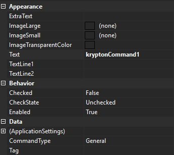

# KryptonCommand

Use the *KryptonCommand* component to simplify the management of application
actions.

For example, you could use a *KryptonCommand* instance to manage the state
of your applications *Print* action. Your application might have three separate
places where feedback is provided to the user about the availability of the
*Print* capability. Instead of updating all three controls each time the *Print*
state changes you only need to update the single command. The three attached
controls will then be updated automatically. Just assign the command instance to
the *KryptonCommand* property of any compatible control and the control will
automatically keep itself in sync with the command state.

The command also exposes an event called *Execute* that you should hook into for
notification of when the command needs to be executed. When the user presses a
button that is attached to a command the button will cause the *Execute* event
to be fired. So management of your *Print* action could not be easier. Just
attach the command to your *KryptonButton*, *KryptonCheckButton*, *ButtonSpec*,
*KryptonRibbon* element etc and those controls will automatically show the
correct command state for you. Then when the user presses the *KryptonButton*,
*ButtonSpec* etc the *Execute* event will fire so you can process the *Print*
request.

## KryptonCommand properties

Figure 1 shows the list of properties exposed by the *KryptonCommand* component.



Figure 1 - KryptonCommand properties

## ExtraText

This is the supplementary text used by attached controls for display.

## ImageLarge and ImageSmall

Most attached controls will use the *ImageSmall* property value but the
*KryptonRibbon* elements sometimes require a large image, in which case the
ImageLarge property will be used instead.

## ImageTransparentColor

Transparent colour applied when drawing `ImageSmall` / `ImageLarge`.

## CommandType

`CommandType` selects a built-in button-spec role. When set to anything other than `General`, the command automatically configures default text and palette images for that role and can synchronize an assigned `ButtonSpec`.

```csharp
var helpCommand = new KryptonCommand
{
    CommandType = KryptonCommandType.HelpCommand
};
// Text and ImageSmall are populated from the active palette's button-spec images
```

### KryptonCommandType values

| Value | Typical use |
| --- | --- |
| `General` | Default — no automatic button-spec mapping |
| `HelpCommand` | Help button spec |
| `IntegratedToolBarCopyCommand` | Integrated toolbar Copy |
| `IntegratedToolBarCutCommand` | Integrated toolbar Cut |
| `IntegratedToolBarNewCommand` | Integrated toolbar New |
| `IntegratedToolBarOpenCommand` | Integrated toolbar Open |
| `IntegratedToolBarPageSetupCommand` | Integrated toolbar Page Setup |
| `IntegratedToolBarPasteCommand` | Integrated toolbar Paste |
| `IntegratedToolBarPrintCommand` | Integrated toolbar Print |
| `IntegratedToolBarPrintPreviewCommand` | Integrated toolbar Print Preview |
| `IntegratedToolBarQuickPrintCommand` | Integrated toolbar Quick Print |
| `IntegratedToolBarRedoCommand` | Integrated toolbar Redo |
| `IntegratedToolBarSaveAllCommand` | Integrated toolbar Save All |
| `IntegratedToolBarSaveAsCommand` | Integrated toolbar Save As |
| `IntegratedToolBarSaveCommand` | Integrated toolbar Save |
| `IntegratedToolBarUndoCommand` | Integrated toolbar Undo |

### AssignedButtonSpec

When `CommandType` is not `General`, assign a `ButtonSpecAny` to `AssignedButtonSpec` to keep its `Type`, images, and `KryptonCommand` link synchronized with the command:

```csharp
helpCommand.AssignedButtonSpec = myHeaderHelpButtonSpec;
```

Palette changes trigger automatic image refresh for non-`General` command types.

Implements [#1133](https://github.com/Krypton-Suite/Standard-Toolkit/issues/1133). Prefer `CommandType` over obsolete per-button toolbar command component types on [KryptonIntegratedToolBarManager](KryptonIntegratedToolBarManager.md).

## Text

This is the main text used by attached controls for display.

## TextLine1 and TextLine2

These two text values are for use by *KryptonRibbon* elements that require two
display strings. When a *KryptonRibbon* button is displayed inside a group in
large format it draws the two lines of text as provided by these properties.

## Checked and CheckState

Some attached controls can provide checked state feedback. So if you attached a
*KryptonCheckButton* to this command it will be able to display correctly the
*Checked* property value which is a boolean type. But it will not display the
*CheckState* value because the *KryptonCheckButton* has no way to indicate an
indeterminate state. If you attach a *KryptonCheckBox* then the CheckState
property would be used. If the attached control cannot provide checked
information, such as a *KryptonButton*, then these properties would be ignored
by that attached control.

## Enabled

Determines if the command should be enabled or disabled for use. When disabled,
any attached controls will show themselves as disabled in order to prevent the
command from being executed.

## Tag

Use the *Tag* to assign your application specific information with the component
instance.
