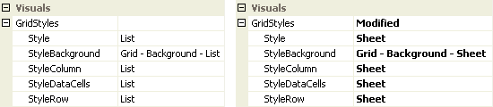
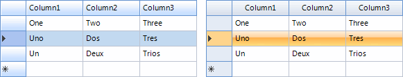
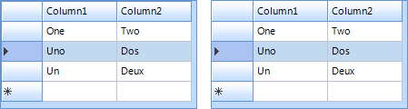
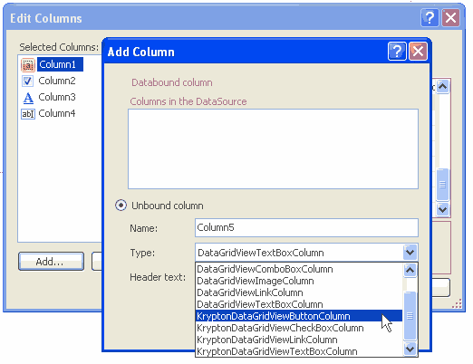

# KryptonDataGridView

## Overview

`KryptonDataGridView` extends the standard Windows Forms `DataGridView` with full Krypton palette rendering for backgrounds, borders, headers, data cells, tooltips, and outer corner rounding. Data binding, editing, sorting, and column types follow the base `DataGridView` behavior; appearance is driven by palette state properties instead of `DefaultCellStyle` colors in most scenarios.

**Namespace:** `Krypton.Toolkit`  
**Assembly:** `Krypton.Toolkit`  
**Default event:** `CellContentClick`  
**Designer:** `System.Windows.Forms.Design.DataGridViewDesigner`  
**Inheritance:** `Object` → `MarshalByRefObject` → `Component` → `Control` → `DataGridView` → `KryptonDataGridView`

For general grid behavior (binding, sorting, selection modes), see [Microsoft DataGridView documentation](https://learn.microsoft.com/dotnet/desktop/winforms/controls/datagridview-control-windows-forms).

## Key features

### Palette integration

- `PaletteMode`, `Palette`, and `Renderer` integration with global theme changes
- `StateCommon`, `StateNormal`, `StateDisabled`, `StateTracking`, `StatePressed`, `StateSelected`
- `GridStyles` for *List*, *Sheet*, *Custom1*–*Custom3*, and *Mixed* element styles
- [External corner rounding](#external-corner-rounding) via `StateNormal.Border` / `StateDisabled.Border`

### Data and columns

- Full `DataGridView` data binding (`DataSource`, `DataMember`, complex binding)
- `AutoGenerateKryptonColumns` converts generated columns to Krypton column types
- Krypton column types for text, masked text, combo, numeric, domain, date/time, check box, button, link, image, progress, rating, and icon cells

### Behavior

- `HideOuterBorders` for use inside `KryptonGroup` or with native outer rounding
- `KryptonContextMenu` and themed `ContextMenuStrip` support
- Krypton tooltips with optional shadow (`ToolTipShadow`)
- `HighlightSearch` for in-grid search highlighting
- `EditingControlButtonSpecClick` when edit controls expose `ButtonSpec`s
- `DoubleBuffered` exposed in the designer (default `true`)

---

## Class hierarchy

```text
System.Object
└── System.MarshalByRefObject
    └── System.ComponentModel.Component
        └── System.Windows.Forms.Control
            └── System.Windows.Forms.DataGridView
                └── Krypton.Toolkit.KryptonDataGridView
```

---

## Constructor

### KryptonDataGridView()

```csharp
public KryptonDataGridView()
```

Initializes palette states, view manager, double buffering, DPI-adjusted default column header height, corner-rounding region, and cell-style sync with the active palette.

---

## Properties

### Palette and rendering

#### PaletteMode

```csharp
[Category("Visuals")]
[DefaultValue(PaletteMode.Global)]
public PaletteMode PaletteMode { get; set; }
```

Palette source for drawing. `PaletteMode.Custom` requires `Palette` to be assigned. Changing this raises `PaletteChanged` and relayouts the control.

#### Palette

```csharp
[Category("Visuals")]
[DefaultValue(null)]
public PaletteBase? Palette { get; set; }
```

Custom palette instance. When set, `PaletteMode` becomes `Custom`. `ResetPalette()` restores global mode.

#### Renderer

```csharp
[Browsable(false)]
public IRenderer? Renderer { get; }
```

Active renderer resolved from the current palette (read-only).

---

### Visual states

| Property | Type | Description |
|----------|------|-------------|
| `StateCommon` | `PaletteDataGridViewRedirect` | Shared defaults overridden by state-specific entries |
| `StateNormal` | `PaletteDataGridViewAll` | Normal appearance; includes `Background`, `Border`, `DataCell`, `HeaderColumn`, `HeaderRow` |
| `StateDisabled` | `PaletteDataGridViewAll` | Disabled appearance (same structure as `StateNormal`) |
| `StateTracking` | `PaletteDataGridViewHeaders` | Header hover |
| `StatePressed` | `PaletteDataGridViewHeaders` | Header pressed |
| `StateSelected` | `PaletteDataGridViewCells` | Selected data cells and headers |

`PaletteDataGridViewAll` exposes:

- `Background` — grid background fill
- `Border` — outer grid border (designer-visible; use for corner rounding)
- `DataCell`, `HeaderColumn`, `HeaderRow` — per-element back, border, content

`PaletteBorder` on `StateNormal` is hidden from the designer; use `Border` instead.

---

### GridStyles

#### GridStyles

```csharp
[Category("Visuals")]
[DesignerSerializationVisibility(DesignerSerializationVisibility.Content)]
public DataGridViewStyles GridStyles { get; }
```

Compound property controlling grid element styles.

| Member | Type | Default | Description |
|--------|------|---------|-------------|
| `Style` | `DataGridViewStyle` | `List` | Overall style; sets column, row, data cell, and background together |
| `StyleColumn` | `GridStyle` | `List` | Column header style |
| `StyleRow` | `GridStyle` | `List` | Row header style |
| `StyleDataCells` | `GridStyle` | `List` | Data cell style |
| `StyleBackground` | `PaletteBackStyle` | `GridBackgroundList` | Background palette style |

`DataGridViewStyle` values: `List`, `Sheet`, `Custom1`, `Custom2`, `Custom3`, `Mixed`.  
`GridStyle` values: `List`, `Sheet`, `Custom1`, `Custom2`, `Custom3`.

When individual element styles differ, `Style` becomes `Mixed`.

---

### Behavior

#### HideOuterBorders

```csharp
[Category("Visuals")]
[DefaultValue(false)]
public bool HideOuterBorders { get; set; }
```

When `true`, suppresses drawing of cell borders on the outer edge of the grid. Use with a parent `KryptonGroup` border, or rely on automatic suppression when [corner rounding](#external-corner-rounding) is enabled.

#### AutoGenerateKryptonColumns

```csharp
[Category("Behavior")]
[DefaultValue(true)]
public bool AutoGenerateKryptonColumns { get; set; }
```

When `true` and `AutoGenerateColumns` is enabled, WinForms column types created from a data source are replaced with Krypton column types when `ColumnCount` is set.

#### DoubleBuffered

```csharp
[Category("Behavior")]
[DefaultValue(true)]
public new bool DoubleBuffered { get; set; }
```

Reduces flicker during scroll and repaint (visible in the designer).

#### ShowCellToolTips

```csharp
public new bool ShowCellToolTips { get; set; }
```

Enables Krypton-themed cell tooltips when cells define tooltip text.

#### ToolTipShadow

```csharp
[Category("ToolTip")]
[DefaultValue(true)]
public bool ToolTipShadow { get; set; }
```

Draws a shadow on cell tooltips.

#### KryptonContextMenu

```csharp
[Category("Behavior")]
[DefaultValue(null)]
public virtual KryptonContextMenu? KryptonContextMenu { get; set; }
```

Context menu shown on right-click (preferred over WinForms `ContextMenuStrip` for full theming).

#### ContextMenuStrip

```csharp
public override ContextMenuStrip? ContextMenuStrip { get; set; }
```

Standard context menu; opening hooks apply the Krypton renderer automatically.

---

### Advanced / non-browsable

| Property | Description |
|----------|-------------|
| `CellOver` | Internal mouse-over cell coordinates |
| `ColumnCount` | Hidden; triggers Krypton column conversion when auto-generating |

---

### Hidden WinForms appearance properties

The following are hidden from the designer because palette state drives appearance. Setting them has little or no effect on Krypton drawing:

`BackgroundColor`, `CellBorderStyle`, `ColumnHeadersBorderStyle`, `ColumnHeadersDefaultCellStyle`, `DefaultCellStyle`, `EnableHeadersVisualStyles`, `GridColor`, `RowHeadersBorderStyle`, `RowHeadersDefaultCellStyle`

Use `StateCommon` / `StateNormal` and `GridStyles` instead.

---

## Methods

#### PerformNeedPaint

```csharp
public void PerformNeedPaint(bool needLayout)
```

Requests repaint; optionally layout when palette or state changes require it.

#### GetCellTriple

```csharp
public virtual PaletteState GetCellTriple(
    DataGridViewElementStates state,
    int rowIndex,
    int columnIndex,
    out IPaletteBack paletteBack,
    out IPaletteBorder paletteBorder,
    out IPaletteContent paletteContent)
```

Resolves back, border, and content palettes for a cell based on enabled state, selection, and header tracking/pressed state. Used by custom drawing and column/cell implementations.

#### HighlightSearch

```csharp
public void HighlightSearch(string s)
public void HighlightSearch(string s, List<int> columnsIndex)
```

Highlights matching text in the grid. Empty `columnsIndex` searches all columns.

#### ResetPaletteMode / ResetPalette

Restore default global palette mode.

#### GetViewManager / GetResolvedPalette

Internal/advanced access to view manager and resolved palette instance.

---

## Events

#### PaletteChanged

```csharp
public event EventHandler? PaletteChanged;
```

Raised when `Palette` or `PaletteMode` changes.

#### EditingControlButtonSpecClick

```csharp
public event EventHandler<DataGridViewButtonSpecClickEventArgs>? EditingControlButtonSpecClick;
```

Raised when a `ButtonSpec` on an in-cell editing control is clicked.

---

## Grid styles

Select the control at design time and open **Visuals** → **GridStyles**.



Figure 1 — `Style` = List and `Style` = Sheet



Figure 2 — Grid appearance for List and Sheet styles

Changing **Style** updates column headers, row headers, data cells, and background together. To mix styles, set **StyleColumn**, **StyleRow**, or **StyleDataCells** individually; **Style** then shows **Mixed**.

---

## External corner rounding

`KryptonDataGridView` can draw a themed outer border with rounded corners. The control clips its client area, paints the outer border from the palette, rounds outer corner cells, and accounts for visible scroll bars when locating corners.

**Designer:** *Visuals* → *StateNormal* → *Border* → *Rounding* (and *StateDisabled* → *Border* for disabled state).

| `Rounding` | Effect |
|------------|--------|
| `> 0` | Enable corner rounding with the specified radius |
| `-1` | Inherit from the active palette (default) |
| `0` | Force flat corners |

```csharp
kryptonDataGridView1.StateNormal.Border.Rounding = 5f;
kryptonDataGridView1.StateDisabled.Border.Rounding = 5f;
```

Other `Border` properties (`Color1`, `Width`, `Draw`, etc.) apply to the outer chrome when rounding is enabled. Outer-edge cell borders are suppressed automatically when rounding is active.

See [HideOuterBorders](#hideouterborders) when using a `KryptonGroup` wrapper instead.

---

## HideOuterBorders

Unlike the standard `DataGridView`, this control does not use the WinForms control border. By default no outer border is drawn unless [corner rounding](#external-corner-rounding) is enabled.

Placing the grid in a [KryptonGroup](KryptonGroup.md) with *Dock* = *Fill* still provides group chrome. Set *HideOuterBorders* to *True* to avoid double borders where cell edges meet the group border.



Figure 3 — `HideOuterBorders` = False and True

---

## Visual states reference

| Grid element | Normal | Disabled | Selected | Tracking | Pressed |
|--------------|--------|----------|----------|----------|---------|
| Data cells | Yes | Yes | Yes | — | — |
| Header column | Yes | Yes | Yes | Yes | Yes |
| Header row | Yes | Yes | Yes | Yes | Yes |
| Background | Yes | Yes | — | — | — |
| Whole-grid `Border` | Yes (`StateNormal` / `StateDisabled`) | Yes | — | — | — |

*StateCommon* supplies defaults when a state-specific override is not set. State-specific values always win over *StateCommon*.

---

## Overriding cell styles

Per-column and per-cell `DefaultCellStyle` / `CellStyle` (*Font*, *BackColor*, *ForeColor*, selection colors) work as on `DataGridView`. `KryptonDataGridView` applies palette colors when those style properties are **not** explicitly set on the cell.

```csharp
kryptonDataGridView1.Rows[0].Cells[0].Style.ForeColor = Color.Red;
```

Configure column defaults via the **Columns** collection in the designer.

---

## Column types

Prefer Krypton column types so cells render with palette-consistent editors and chrome:

| Column type | Purpose |
|-------------|---------|
| `KryptonDataGridViewTextBoxColumn` | Text |
| `KryptonDataGridViewMaskedTextBoxColumn` | Masked input |
| `KryptonDataGridViewComboBoxColumn` | Drop-down list |
| `KryptonDataGridViewNumericUpDownColumn` | Numeric up/down |
| `KryptonDataGridViewDomainUpDownColumn` | Domain up/down |
| `KryptonDataGridViewDateTimePickerColumn` | Date/time |
| `KryptonDataGridViewCheckBoxColumn` | Check box |
| `KryptonDataGridViewButtonColumn` | Button |
| `KryptonDataGridViewLinkColumn` | Link |
| `KryptonDataGridViewImageColumn` | Image |
| `KryptonDataGridViewProgressColumn` | Progress bar cell |
| `KryptonDataGridViewRatingColumn` | Star rating cell |
| `KryptonDataGridViewIconColumn` | Icon / indicator cell |



Figure 4 — Krypton-specific columns in the column type picker

---

## Usage examples

### Corner rounding and grid lines

```csharp
// Rounded outer border
kdgv.StateNormal.Border.Rounding = 8f;
kdgv.StateDisabled.Border.Rounding = 8f;

// Toggle inner grid lines via StateCommon
kdgv.StateCommon.DataCell.Border.DrawBorders = PaletteDrawBorders.All;
kdgv.HideOuterBorders = false;
```

### Themed context menu

```csharp
kdgv.KryptonContextMenu = kryptonContextMenu1;
```

### Search highlight

```csharp
kdgv.HighlightSearch("invoice", new List<int> { 0, 2 });
```

---

## Best practices

- Use **Krypton** column types for new columns; enable `AutoGenerateKryptonColumns` for bound grids.
- Customize appearance via **GridStyles** and **State###** properties, not hidden WinForms color properties.
- Set both `StateNormal.Border.Rounding` and `StateDisabled.Border.Rounding` for consistent enabled/disabled chrome.
- Use `KryptonContextMenu` for fully themed right-click menus.
- Validate layout in `TestForm` → **DataGridView** demo (corner rounding, grid lines, binding).

---

## See also

- [KryptonGroup](KryptonGroup.md) — container border alternative
- [ButtonSpec](ButtonSpec.md) — cell editing button specifications
- [Controls index](../Controls.md)
- [DataGridView (Microsoft)](https://learn.microsoft.com/dotnet/desktop/winforms/controls/datagridview-control-windows-forms)
- `Source/Krypton Components/TestForm/DataGridViewDemo.cs` — interactive demo
