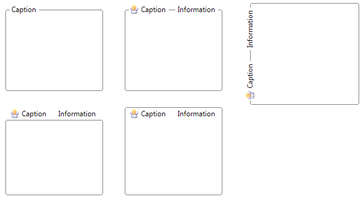

# KryptonGroupBox

## Overview

`KryptonGroupBox` displays a framed area with an optional caption for grouping related controls. It combines border, background, and caption rendering with an inner `KryptonGroupBoxPanel` for child controls.

**Namespace:** `Krypton.Toolkit`  
**Assembly:** `Krypton.Toolkit`  
**Default property:** `ValuesPrimary` (caption values)  
**Inheritance:** `VisualControlContainment` → `KryptonGroupBox`

## Key features

- Caption with overlap, edge, orientation, and visibility
- `CaptionValues` for heading text and images
- `GroupBackStyle` / `GroupBorderStyle` / `CaptionStyle`
- Inner `Panel` for child controls
- Auto-size with `GrowAndShrink` default
- Optional themed scroll bars

## Constructor

```csharp
public KryptonGroupBox()
```

## Properties

### Panel

```csharp
public KryptonGroupBoxPanel Panel { get; }
```

Inner surface for child controls.

### Values

```csharp
public CaptionValues Values { get; }
```

Caption text, image, and related content. `Text` on the control maps to caption heading.

### CaptionOverlap

```csharp
[DefaultValue(0.5)]
public double CaptionOverlap { get; set; }
```

**Default:** `0.5` (50%) — border draws through the caption vertically.  
`1.0` places the caption outside the border; `0.0` places it fully inside.

### GroupBackStyle / GroupBorderStyle

```csharp
[DefaultValue(PaletteBackStyle.ControlGroupBox)]
public PaletteBackStyle GroupBackStyle { get; set; }

[DefaultValue(PaletteBorderStyle.ControlGroupBox)]
public PaletteBorderStyle GroupBorderStyle { get; set; }
```

### CaptionStyle

```csharp
[DefaultValue(LabelStyle.GroupBoxCaption)]
public LabelStyle CaptionStyle { get; set; }
```

Palette label style for the caption.

### CaptionEdge / CaptionOrientation / CaptionVisible

```csharp
public VisualOrientation CaptionEdge { get; set; }
public ButtonOrientation CaptionOrientation { get; set; }
public bool CaptionVisible { get; set; }
```

Position and visibility of the caption.

### StateCommon / StateDisabled / StateNormal

```csharp
public PaletteGroupBoxRedirect StateCommon { get; }
public PaletteGroupBox? StateDisabled { get; }
public PaletteGroupBox? StateNormal { get; }
```

Back, border, and content overrides for the frame and caption.

### AutoSize / AutoSizeMode

```csharp
[DefaultValue(AutoSizeMode.GrowAndShrink)]
public AutoSizeMode AutoSizeMode { get; set; }
```

### UseKryptonScrollbars

Themed scroll bars on the inner panel when content overflows.

## Visual states

*Normal* and *Disabled* only. Customize via `StateNormal` and `StateDisabled`; defaults come from `StateCommon`.

## Examples of appearance



Figure 1 — `GroupBackStyle` and `GroupBorderStyle` = `ControlGroupBox` (default)

## Usage example

```csharp
kryptonGroupBox1.Values.Heading = "Connection";
kryptonGroupBox1.CaptionOverlap = 1.0; // caption above border
kryptonGroupBox1.Panel.Padding = new Padding(8);
```

## Best practices

- Use `Values.Heading` (or `Text`) for the caption; child controls go on `Panel`.
- Adjust `CaptionOverlap` when the default 50% overlap does not match your layout.

## See also

- [KryptonGroup](KryptonGroup.md)
- [CaptionValues](CaptionValues.md)
- [Controls index](../Controls.md)
