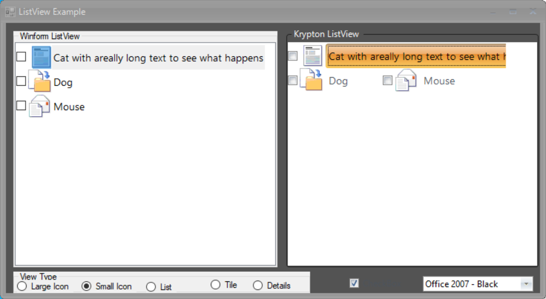

# KryptonListView

Use the *KryptonListView* when you need to present the user a list of items to select from. The *KryptonListView* component offers similar functionality to the standard WinForms *ListView* although it is recommended to use the [KryptonCheckedListBox](KryptonCheckedListBox.md) or [KryptonListBox](KryptonListBox.md) if you want to present items as a list and a [KryptonDataGridView](KryptonDataGridView.md) if you need a *Details* view. The *KryptonListView* supports the *LargeIcons*, *SmallIcons* and *Tiles* (with and without checkboxes) views.

**Appearance**

