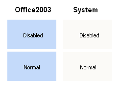
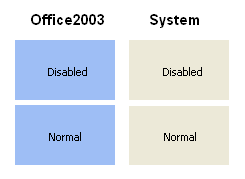

# KryptonPanel

## Overview

`KryptonPanel` is a container control that provides a themed background for hosting child controls. Use it for large client-area sections; use [KryptonGroup](KryptonGroup.md) when you also need a border, or [KryptonGroupBox](KryptonGroupBox.md) for a captioned frame.

**Namespace:** `Krypton.Toolkit`  
**Assembly:** `Krypton.Toolkit`  
**Inheritance:** `Object` → `MarshalByRefObject` → `Component` → `Control` → `ScrollableControl` → `Panel` → `KryptonPanel`

## Key features

- Palette-driven background via `PanelBackStyle` and `StateCommon` / `StateNormal` / `StateDisabled`
- Optional Krypton-themed scroll bars (`UseKryptonScrollbars`)
- No border or content rendering (background only)
- Designer child hosting on the panel surface

## Class hierarchy

```text
System.Windows.Forms.Panel
└── Krypton.Toolkit.KryptonPanel
```

## Constructors

```csharp
public KryptonPanel()
public KryptonPanel(PaletteDoubleRedirect stateCommon,
    PaletteBack stateDisabled, PaletteBack stateNormal)
```

The parameterised constructor is for internal/designer use.

## Properties

### PanelBackStyle

```csharp
public PaletteBackStyle PanelBackStyle { get; set; }
```

**Default:** `PaletteBackStyle.PanelClient`  
Top-level background style. `PanelAlternate` makes the panel stand out from the client area.

### StateCommon / StateDisabled / StateNormal

```csharp
public PaletteBack StateCommon { get; }
public PaletteBack StateDisabled { get; }
public PaletteBack StateNormal { get; }
```

Background overrides per state. Only background is customizable (no border or content).

### UseKryptonScrollbars

```csharp
[DefaultValue(false)]
public bool UseKryptonScrollbars { get; set; }
```

When `true`, themed scroll bars are used when content overflows.

### ScrollbarManager

```csharp
public KryptonScrollbarManager? ScrollbarManager { get; }
```

Access to scroll bar manager when `UseKryptonScrollbars` is enabled.

## Methods

### SetFixedState

```csharp
public virtual void SetFixedState(PaletteState state)
```

Forces a palette state for rendering (advanced).

## Visual states

Only *Normal* and *Disabled* apply. The panel does not show enabled/disabled chrome by default for all `PanelBackStyle` values; override `StateDisabled` when you need a dimmed appearance.

*StateCommon* provides defaults; *StateNormal* / *StateDisabled* override them.

## Examples of appearance



Figure 1 — `PanelBackStyle` = `PanelClient`



Figure 2 — `PanelBackStyle` = `PanelAlternate`

## Usage example

```csharp
kryptonPanel1.PanelBackStyle = PaletteBackStyle.PanelAlternate;
kryptonPanel1.UseKryptonScrollbars = true;
kryptonPanel1.Dock = DockStyle.Fill;
```

## Best practices

- Use `KryptonPanel` for broad layout regions; use `KryptonGroup` for bordered groupings.
- Set `UseKryptonScrollbars` when auto-scroll is enabled and scroll bars should match the theme.

## See also

- [KryptonGroup](KryptonGroup.md)
- [KryptonGroupBox](KryptonGroupBox.md)
- [Controls index](../Controls.md)
