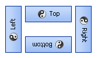

# Development documentation images

Screenshot and diagram assets for topics under `Documents/Development/`.

## Location and linking

| Source folder | Relative path to images |
| --- | --- |
| `Controls/` | `../Images/<file>` |
| `Components/` | `../Images/<file>` |
| `Forms/` | `../Images/<file>` |
| `Utilities/` | `../Images/<file>` |

Example from `Controls/KryptonButton.md`:

```markdown

```

## Conventions

- Prefer PNG for UI screenshots; BMP/GIF/JPG where historically used
- Use descriptive filenames (`KryptonComboBox1.png`, `HeaderButtons3.png`)
- Keep alt text in the markdown image tag concise but specific
- External URLs (for example animated demos hosted on GitHub) are acceptable when local capture is impractical

## Coverage

This folder contains assets referenced by control, component, and form developer guides. When adding a new illustrated topic, place images here and reference them with the relative paths above.

See also [Controls/DOCUMENTATION_STANDARD.md](../Controls/DOCUMENTATION_STANDARD.md).
