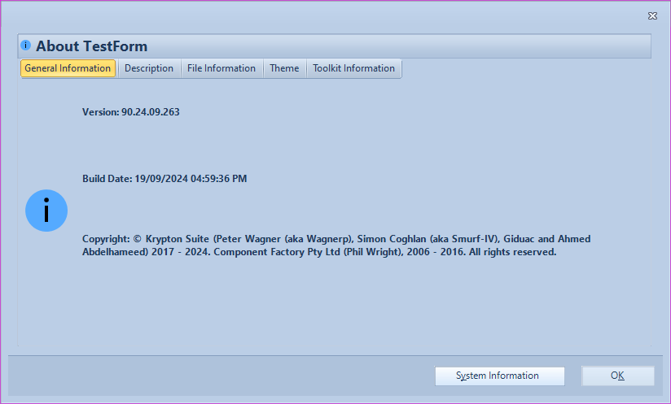
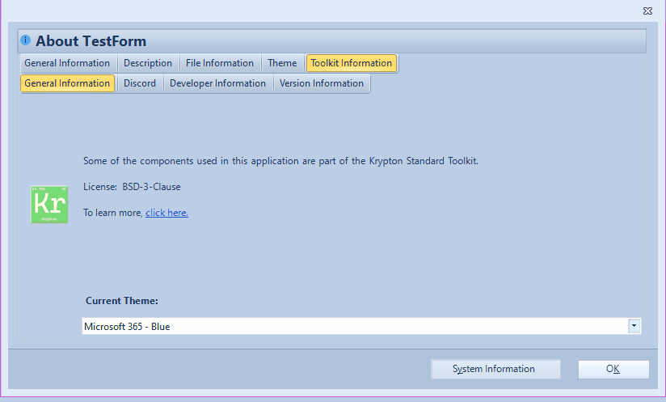

# KryptonAboutBox

The *KryptonAboutBox* provides access to a *Krypton* style dialog that allows the user to view details of the running application. It is a replica of the *AboutBox* dialog, that is provided as part of the *Microsoft.VisualBasic* assembly and is typically used by *VB.NET* developers. By providing a *Krypton* version of this dialog it ensures that your whole application has a consistent look and feel that extends to even the input boxes that appear.

## Appearance

The displayed *KryptonAboutBox* derives from the *KryptonForm* base class and so has the same appearance as other *Krypton* style forms. In order to show the *KryptonAboutBox*, you need to call one of the static methods it exposes called *Show*. You can also specify whether you want to allow the user to see the details of their system, which will launch *MSInfo32*, and to allow the user to see details of the Krypton Toolkit. See Figure 1 for an example of the about box in operation.

*Figure 1 - A simple KryptonAboutBox*

*Figure 2 - The KryptonAboutBox displaying details about the toolkit*