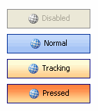

# KryptonButton

 

Use the *KryptonButton* control when you need button functionality combined with
the styling features of the *Krypton Toolkit*. This control allows the user to
initiate an action by pressing the button in order to generate a *Click* event.
Place code in the *Click* event handler to perform the required action. The
content of the control is contained in the *Values* property. You can define
*Text*, *ExtraText* and *Image* details within the *Values* property.

 

**Appearance**

Use the *ButtonStyle* property to define the top level styling required for the
appearance of the *KryptonButton* control. The default value of *Standalone*
gives a solid appearance that should be appropriate for use in most
circumstances. Alternatively you can use the *LowProfile* setting for situations
where you need a transparent border and background. See figures 2 and 3 below
for examples of the visual difference. A third button style *ButtonSpec* is used
by default for button specifications that are placed inside *KryptonHeader* and
*KryptonHeaderGroup* controls. Buttons that appear on the caption area of a
*KryptonForm* use the *Form* style. There are also custom styles that can be
defined via a *KryptonPalette* for situations where you need to
create variations on the styles already provided. Custom styles are named simply
*Custom1*, *Custom2* and *Custom3*.

 

You can use the *Orientation* property to rotate the control. The default
setting of *Top* shows the content in a left to right and top to bottom
arrangement. Specify *Bottom* to have the control displayed upside down, *Left*
to show the content rotated 90 degrees left and *Right* for 90 degrees rotated
right. See figure 1 for examples.

*Figure 1 – Orientation Property*

 

 

**Four States**

The button can be in one of four possible states, *Disabled*, *Normal*,
*Tracking* and *Pressed*. If the control has been disabled because the *Enabled*
property is defined as *False* then the button will be in the *Disabled* state.

 

When enabled the button will be in the *Normal* state until the user moves the
mouse over the button at which point it enters the *Tracking* state. If the user
presses the left mouse button whilst over the control then it enters the
*Pressed* state.

 

In order to customize the appearance of the control in each of the four states
you can use the properties *StateDisabled*, *StateNormal*, *StateTracking* and
*StatePressed*. Each of these properties allows you to modify the background,
border and content characteristics.

 

**Common State** 

To speed up the customization process an extra *StateCommon* property has been
provided. The settings from this are used if no override has been defined for
the state specific entry. Note that the specific state values always take
precedence and so if you define the border width in *StateNormal* and
*StateCommon* then the *StateNormal* value will be used whenever the control is
in the *Normal* state. Only if the *StateNormal* value is not overridden will it
look in *StateCommon*.

 

Imagine the following scenario; you would like to define the border of the
button to be 3 pixels wide with a rounding of 2 pixels and always red. Without
the *StateCommon* property you would need to update the same three border
settings in each of *StateDisabled*, *StateNormal*, *StateTracking* and
*StatePressed* properties. Instead you can define the three border settings in
just *StateCommon* and know they will be used whichever of the four appearance
states the button happens to be using.

 

**State Overrides** 

There are two additional properties called *OverrideDefault* and *OverrideFocus*
that are involved in altering the appearance of the control. Notice that these
start with the *Override* prefix instead of the usual *State*. This is because
they do not relate to a specific control state such as *Normal* or *Tracking*.
Instead they can be applied to any of the four possible states and are used to
override the appearance that would otherwise be shown.

 

**Focus Override** 

If the control currently has the focus then the *OverrideFocus* settings are
applied. This can occur when the control is in *Normal*, *Tracking* or *Pressed*
states. By default the override only alters the appearance so that a focus
rectangle is drawn around the content so that the user can see that the control
currently has the focus.

 

**Default Button Override** 

Each *Form* has the concept of a default button that is clicked when the user
presses the *Enter* key. The *KryptonButton* also supports the default button
mechanism and *OverrideDefault* settings are applied to the appearance whenever
the control has been designated as the default.

 

**Examples of Appearance** 

Figure 2 shows the appearance when the default *ButtonStyle* of *Standalone* is
used. You can see that all the different states are drawn as solid controls. The
third button down shows how the default button and focus overrides have affected
the appearance of the *Normal* state above it.

*Figure 2 – ButtonStyle = Standalone*

 

 

Figure 3 shows exactly the same states but this time the *ButtonStyle* is
*LowProfile*. This time the background is transparent in the *Disabled* and
*Normal* states. This button style is intended for use when you need to overlay
a button onto a background and you want the button to be low profile and only
light up when the user is interacting with it.

*Figure 3 – ButtonStyle = LowProfile*
