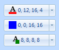
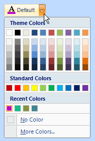
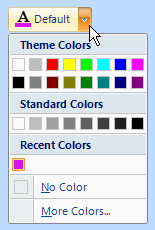
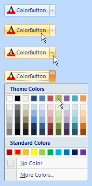

## KryptonColorButton

 

This button allows the user to select a color value. It provides feedback by
drawing the currently selected color as part of the image portion of the button
contents and when pressed displays a context menu that allows the user to pick a
new color value. It generates the *SelectedColorChanged* event whenever the user
picks a new color. The *TrackColor* is fired when the context menu is being
displayed and the user tracks over different color options, allowing the
application to provide instant feedback during the color selection process. Hook
into the *MoreColors* event if you need to provide your own custom dialog for
selecting extra colors that are not displayed in the context menu.

 

The implementation actually provides all the functionality of the
[KryptonDropButton](KryptonDropButton.md) but with the extra events and properties
needed to provide color selection capabilities. It is therefore recommended you
read the documentation for the drop button. Note that the *KryptonContextMenu*
property is not present on this control because it is managed by the color
button and not provided by the developer. You can customize the contents of the
displayed context menu by intercepting the *DropDown* event and then modifying
the provided context menu before returning.

 

**Appearance**

Define the current color by using the *SelectedColor* property. This color will
then be displayed in a rectangle that overlays the image portion of the button
contents. The first three images of figure 1 show the display with *Red*,
*Green* and *Blue* as the respective selected color. If the *Empty* value is
selected then instead of drawing as a solid block only the border around the
block is drawn in the *EmptyBorderColor* setting. This can be seen as the bottom
image in figure 1. This makes sense because drawing the *Empty* color would
result in nothing being drawn and so to ensure some feedback is presented to the
user only the border of the rectangle is drawn. Change *EmptyBorderColor* if the
default dark gray is not appropriate as the empty border.

 

By default the color block is drawn at the bottom of the image area. You can use
the *SelectedRect* property to change this setting to something that matches the
image you have decided to show. Figure 2 shows the default setting at the
top following by two custom rectangles.

 

**Important: **If you don't provide an image for the content then you will not
get the selected color displayed!  

*Figure 1 – SelectedColor and EmptyBorderColor Properties*

*Figure 2 – SelectedRect Property*

 

**Behaviour**

Figure 3 shows the context menu used with the default settings applied. This
section describes how to use the various behavior properties to modify the
contents and operation of the color button and the context menu. The five areas
of the context menu, from top to bottom, are *Themes*, *Standard*, *Recent*,
*NoColor* and *MoreColors*. Each of these areas can be turned off by using the
associated visible property. So define *VisibleThemes* to be *False* in order to
remove the display of the theme colors section at the top of the context menu.
Remove the *No Color* option by setting *VisibleNoColor* to *False,* something
you might want to do if your application needs to ensure a drawable color is
always defined.

*Figure 3 – Displayed Context Menu*

 

In order to change the set of colors shown within the *Themes* and *Standard*
areas you can modify the *SchemeThemes* and *SchemeStandard* properties, figure
4 shows these defined as *Basic16* and *Mono8* respectively. To alter the title
strings above the color blocks you expand the *Strings* compound property at
design time and then alter the appropriate properties as required.

*Figure 4 – Modified SchemeThemes and SchemeStandard*

The purpose of the *Recent* section of the menu is two fold. First of all it
provides a place for displaying the selected color if that color is not present
in the two scheme areas above. This can happen if the user selects the *More
Colors* option and uses it to find an unusual color. It also provides a memory
of recent selections (that are not part of the schemes areas) so the user can
pick a color that was recently used. Use the *MaxRecentColors* property to
define the maximum number of color entries in this area. Any additional recent
colors above this number are discarded. If you do not want the contents of the
recent colors area automatically updated as selection changes occur then set the
*AutoRecentColors* property to *False*.

 

**Customizing the Context Menu**

To alter the contents of the drop down context menu you need to hook into the
*DropDown* event. This event provides a reference to the *KryptonContextMenu*
instance that is about to be shown. Update this instance by adding your own
context menu entries as required. Note that the next time this event is called
the changes will still be present. You should remove the display of standard
items by setting the appropriate visible property to false rather than removing
it from the actual context menu instance.

 

**Four States**

The button can be in one of four possible states, *Disabled*, *Normal*,
*Tracking* and *Pressed*. If the control has been disabled because the *Enabled*
property is defined as *False* then the button will be in the *Disabled* state.

 

When enabled the button will be in the *Normal* state until the user moves the
mouse over the button at which point it enters the *Tracking* state. If the user
presses the left mouse button whilst over the control then it enters the
*Pressed* state. Note that if you have defined the drop down to be a *Splitter*
then the two portions of the button can be in different states. For example,
whilst the mouse is pressed over the drop arrow area that area will be shown in
the *Pressed* state but the remainder will be drawn in the *Tracking* state.

 

In order to customize the appearance of the control in each of the four states
you can use the properties *StateDisabled*, *StateNormal*, *StateTracking* and
*StatePressed*. Each of these properties allows you to modify the background,
border and content characteristics.

 

**Common State** 

To speed up the customization process an extra *StateCommon* property has been
provided. The settings from this are used if no override has been defined for
the state specific entry. Note that the specific state values always take
precedence and so if you define the border width in *StateNormal* and
*StateCommon* then the *StateNormal* value will be used whenever the control is
in the *Normal* state. Only if the *StateNormal* value is not overridden will it
look in *StateCommon*.

 

Imagine the following scenario; you would like to define the border of the
button to be 3 pixels wide with a rounding of 2 pixels and always red. Without
the *StateCommon* property you would need to update the same three border
settings in each of *StateDisabled*, *StateNormal*, *StateTracking* and
*StatePressed* properties. Instead you can define the three border settings in
just *StateCommon* and know they will be used whichever of the four appearance
states the button happens to be using.

 

**State Overrides** 

There are two additional properties called *OverrideDefault* and *OverrideFocus*
that are involved in altering the appearance of the control. Notice that these
start with the *Override* prefix instead of the usual *State*. This is because
they do not relate to a specific control state such as *Normal* or *Tracking*.
Instead they can be applied to any of the four possible states and are used to
override the appearance that would otherwise be shown.

 

**Focus Override** 

If the control currently has the focus then the *OverrideFocus* settings are
applied. This can occur when the control is in *Normal*, *Tracking* or *Pressed*
states. By default the override only alters the appearance so that a focus
rectangle is drawn around the content so that the user can see that the control
currently has the focus.

 

**Default Button Override** 

Each *Form* has the concept of a default button that is clicked when the user
presses the *Enter* key. The *KryptonButton* also supports the default button
mechanism and *OverrideDefault* settings are applied to the appearance whenever
the control has been designated as the default.

 

**Examples of Appearance** 

Figure 5 shows the appearance of different states. The top example shows the
color button without any mouse interaction. The second and third images show the
mouse tracking over the two areas of the control and the last image shows the
context menu displayed when the drop arrow is pressed.

*Figure 5 – DropDown Appearance*